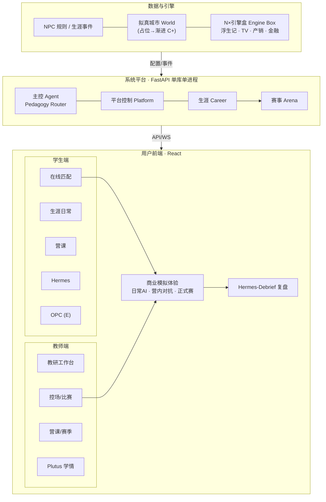

# 商识唯智 · 项目全景

> **仓库定位**：面向 K12～大学的商业模拟教育平台。模块化单体后端 + React 双前端 + 赛事引擎匣子。
> **第一入口**：本文件 → 按任务进入 `01`～`04`。
> **最后更新**：2026-06-11

---

## 产品架构共识（结构图定稿）

> **来源**：2026-06 主理人结构图 + 对齐讨论（Q1～Q5）。  
> **性质**：产品/架构**共识表**；实现细节以 [`01-PRODUCT.md`](./01-PRODUCT.md)、[`02-ARCHITECTURE.md`](./02-ARCHITECTURE.md)、[`03-ENGINEERING.md`](./03-ENGINEERING.md) 为准；新增 API/`match_kind` 须同步术语表 [`00-TERMINOLOGY.md`](./00-TERMINOLOGY.md)。

### 三列总览

> **可视化展示**（推荐对外演示）：
> - **交互版**：在 Cursor 中打开 [BizSim 产品技术架构 Canvas](file:///C:/Users/MECHREVO/.cursor/projects/d-1XFAwork-businessmatch-v1/canvases/bizsim-product-architecture.canvas.tsx)（可并排全屏；含状态色、赛事三档、Game Shell、Phase 门控）。
> - **静态版（PPT/打印）**：[`docs/bizsim-product-architecture-2026-06.png`](./docs/bizsim-product-architecture-2026-06.png)



```text
┌─ 数据与引擎 ────────────────────────────────────────────────┐
│ NPC 规则 / 生涯事件  ↔  拟真城市(World，占位→渐进)  ↔  N×引擎盒 │
└────────────────────────────┬──────────────────────────────────┘
                             │ 配置 / 状态 / 域事件
┌─ 系统平台 ─────────────────┴──────────────────────────────────┐
│ 主控 Agent（总编排） ↔ 平台控制 ↔ 生涯(Career) → 赛事管理(Arena) │
└────────────────────────────┬──────────────────────────────────┘
                             │ REST / WebSocket / 事件
┌─ 用户前端 ─────────────────┴──────────────────────────────────┐
│ 学生端：生涯日常 · 营课 · OPC(远期) · Hermes · 在线匹配          │
│ 教师端：教研 · 课程/体验营 · 管理/教学/比赛 · 学情与复盘助手      │
│ 共用：商业模拟体验 → 赛后 AI 复盘(Hermes-Debrief)               │
└─────────────────────────────────────────────────────────────────┘
```

### 共识对照表

| 结构图模块 | 统一术语 | 主理人定稿理解 | 工程现状 / Phase |
|------------|----------|----------------|------------------|
| **商业模拟器 · N 个赛事单元** | Engine Box / `games/<engine>/` | 同仓多引擎（浮生记、TechVenture、产销、金融…）；开发可独立，**生产单 API + 单库** | ✅ 两引擎已跑；见 `03-ENGINEERING` §引擎规范 |
| **NPC 基础规则 / 生涯事件** | Rival、NPC 状态机、Career 事件 | 练习 Bot 与局内 NPC 走**规则层**；生涯事件入账 `xp_events` 等 | 🟡 Phase A/B |
| **拟真城市** | World Simulation | **先占位**，不对 Phase A 抢进度；通过对局 geo 包、营课、World 域**逐项目**逼近终局构想 | 🔴 无 World 域表；浮生记 `yangtze_6` 为对局内 geo 子集 |
| **主控 Agent** | Pedagogy Router + Workers | **唯一 AI 编排中枢**：对话、复盘、NPC、城市叙事均经其路由分派（Hermes / Tyche / Rival…） | 🔴 LangGraph Phase B～C；A 阶段事件+规则占位 |
| **平台控制** | Platform / FastAPI 单体 | 认证、路由、域边界、事件总线；**禁止**第二套 API/库 | ✅ |
| **生涯系统** | Career Hub | 五域产出汇入长期档案（XP、资源、家园、赛季） | 🟡 后端有表，前端部分 mock |
| **赛事管理** | Arena + `match_kind` | 建场、房间、生命周期、结算 → Career | ✅ 练习/正式；**营内对抗**待产品化 |
| **学生 · 生涯日常** | Career + Quest + Credenti 等 | 非对局的主线成长（五域中的日常部分） | 🟡 |
| **学生 · 参与营课** | Teaching Group + 赛季 | 营团码入营 → 里程碑 → 营内活动 | ✅ 体验营 P1 |
| **学生 · OPC** | OPC（终局 A） | 图上保留入口，**开发排 Phase E** | 🟡 演示 CRUD |
| **学生 · AI 教练** | **Hermes** | 对外统一教练品牌；路径、答疑、周计划 | 🔴 Phase B～C |
| **学生 · 在线匹配** | **Matchmaking** | **真人随机匹配**进同一局；空位由 **AI 选手填补**（Q1=B） | 🔴 未实现；属 Phase B1 |
| **教师端**（原组织者端） | Teacher Client / `organizer-frontend` | 代码路径暂不变；**产品称谓统一为「教师端」** | ✅ `:5174` |
| **教师 · 教研** | Teaching Studio | **进教师端**：选题库、教案、练习题准备等，服务营课组织 | 🔴 构想为主，inspire 有素材 |
| **教师 · 课程/体验营** | Camp + Season | 建营团、开季、里程碑、活动序列 | ✅ P1 |
| **教师 · 管理/教学/比赛** | Arena 控场 | 推进回合、大屏、评委、营内赛发起 | ✅ |
| **教师 · AI 助手** | **Plutus**（学情向） | **学生看板 + 复盘信息整合**给教师；非与学生 Hermes 同人格 | 🔴 Phase B 起 |
| **商业模拟体验 · 日常 AI** | Solo Practice + Rival | 学生**个人**一键练习，AI 对手，低权重 XP，**不属于营团** | ✅ `match_kind=practice` |
| **商业模拟体验 · 练习赛** | **营内对抗赛** Group Scrimmage | **营团内**由学生或教师发起；**真人 + AI 填位**；非正式赛、非个人日常（Q2） | 🔴 待定义 API/`match_kind`；Phase B1 |
| **商业模拟体验 · 正式赛** | Official Match | 组织者控场，`official_t2/t1`，高权重 XP | ✅ |
| **AI 复盘** | Hermes-Debrief | 赛后结构化复盘；学生端展示，**摘要同步教师 Plutus 看板** | 🔴 Phase B |

### 赛事三档（商业模拟体验）

| 档位 | 中文名（建议） | 英文标识（建议） | 谁发起 | 参与者 | 与 `match_kind` 关系 |
|------|----------------|------------------|--------|--------|----------------------|
| **日常 AI** | 个人练习 | `practice` + `scope=solo` | 学生 | 真人 vs AI Bot | 现有练习流 |
| **练习赛** | **营内对抗赛** | `group_scrimmage`（待登记术语表） | 学生或教师（营团内） | 真人匹配 + **AI 填空缺** | **新产品档**：非 official，有营团上下文 |
| **正式赛** | 正式赛 | `official_t2` / `official_t1` | 教师/主办方 | 真人（可 NPC 补位） | 现有正式流 |

　　**在线匹配（Q1）** 主要服务 **营内对抗赛**：学生在营团内进入匹配队列 → 匹配真人 → 未满员则 **Rival/AI Opponent 填位** → 进入对局运行时。个人「日常 AI」可不走匹配队列，保持一键开练。

### 主控 Agent 与教师 AI

| 角色 | 名称 | 职责 | 关系 |
|------|------|------|------|
| **总编排** | 主控 Agent / Pedagogy Router | 订阅平台事件，路由到各 Worker | 学生 Hermes、Tyche、Rival 等均为其下游 |
| **学生教练** | Hermes | 复盘、路径、答疑、周计划 | 对用户只露出一个教练品牌 |
| **教师助手** | Plutus | **学情看板**：各生 XP/提交/五维 + **Hermes-Debrief 复盘摘要** | Q3：整合展示，不另做「教师版 Hermes 聊天」为 P0 |

### 教师端能力版图（Q4）

　　产品称谓：**教师端**（仓库目录仍为 `organizer-frontend`，逐步改 UI 文案与文档）。

| 板块 | 用途 | Phase |
|------|------|-------|
| **营团 / 赛季** | 邀请码、里程碑、活动序列 | A ✅ |
| **比赛控场** | 正式赛、营内赛发起与控场 | A ✅ / 营内对抗 B1 🔴 |
| **教研工作台** | 选题库、教案、练习题准备 → 发布到营课 | C 🔴 |
| **学情与复盘** | Plutus 看板 + 班级 Hermes-Debrief 摘要 | B3 🔴 |

### 对局前端技术路线（Q5 选定）

　　目标：**进入比赛 = 跳转到一款网页游戏**（全屏、无平台导航条、独立视觉世界）。平台壳与对局运行时分离。

| 层级 | 技术 | 说明 |
|------|------|------|
| **平台壳** | React + Tailwind + 成熟 UI 底座 + `game-ui` | 生涯、教师端、大厅、**匹配队列** |
| **对局入口** | 统一 **Game Shell** 全屏路由（如 `/games/.../play`） | 所有赛制同一「进游戏」体验 |
| **对局运行时 A** | **Phaser 3** + React HUD  overlay | **有地图/空间/实时移动**的引擎（浮生记 RTS、未来产销沙盘等） |
| **对局运行时 B** | **React 全屏 + game-ui**（无 Phaser） | **面板/策略型**引擎（TechVenture、金融投研等） |

　　**选型原则**：不是全站二选一，而是 **`game-config` 声明 `runtime: phaser \| react-game`**，Game Shell 按引擎加载对应运行时。  
　　**为何不用纯 Phaser**：策略三栏、表格决策类用 React 更快、更易接 Hermes 复盘面板。  
　　**为何不用纯 React**：地图、商队、tick 可视化需要 Canvas 游戏循环与精灵，Phaser 更贴「网页游戏」手感。

```text
平台页(React) --点击「进入比赛」--> Game Shell(全屏)
                                      ├─ runtime=phaser   → Phaser Scene + React HUD
                                      └─ runtime=react-game → React 沉浸布局 + game-ui
```

### 与 Phase 门控（摘要）

| 能力 | Phase |
|------|-------|
| 营内对抗 + 在线匹配 + AI 填位 | **B1**（需 ADR/术语登记） |
| Hermes-Debrief 规则模板 / Quest / 家园 | B2～B3 |
| 教师端教研工作台 | C |
| 拟真城市跨局 World | C+ |
| OPC 主路径 | E |

### 维护说明

- 结构图或共识变更：先改**本节**，再同步 `01-PRODUCT`、`02-ARCHITECTURE`、`00-TERMINOLOGY`（新增 `group_scrimmage`、`Matchmaking` 等）。  
- 「组织者端」对外文档统一称 **教师端**；代码路径迁移非必须，避免大规模 rename 抢 Phase A 进度。

---

## 目录

| 编号 | 文档 | 定位 |
|------|------|------|
| **00** | 本文 | 仓库地图、快速开始、inspire 外链 |
| **00** | [统一术语表](./00-TERMINOLOGY.md) | 全项目唯一术语权威源 |
| **01** | [产品架构与赛事体系](./01-PRODUCT.md) | 五域、赛制、双端、赛季 |
| **02** | [技术架构与智能体编排](./02-ARCHITECTURE.md) | 技术栈、域分包、Worker 列表 |
| **03** | [工程实现与开发规范](./03-ENGINEERING.md) | AI_DEFAULT、API/路由全表、引擎规范 |
| **04** | [实施路线与里程碑](./04-ROADMAP.md) | Phase A～F、验收标准 |
| **11** | [引擎技术规范](./docs/engine-spec.md) | Phaser/React 运行时、美术管线、引擎全栈手册 |

> **ADR**：[docs/decisions/](./docs/decisions/README.md) · **代码**：[webapp/](./webapp/)

---

## 快速开始

```powershell
# 一键启动（Windows）
cd webapp
.\启动.ps1          # 后端:8000 + 学生端:5173 + 教师端:5174

# 数据库初始化（首次或 schema 变更）
cd webapp/backend
.\venv\Scripts\python -m app.db.init_db
```

**测试账户**：`student`/`student123`，`admin`/`admin123`

---

## 仓库目录树

```text
businessmatch-v1/
├── 00-PROJECT.md              ★ 本文
├── 00-TERMINOLOGY.md          ★ 术语表
├── 01-PRODUCT.md              ★ 产品架构
├── 02-ARCHITECTURE.md         ★ 技术架构
├── 03-ENGINEERING.md          ★ 工程详表
├── 04-ROADMAP.md              ★ 路线图
├── docs/engine-spec.md        ★ 引擎全栈手册
├── docs/
│   └── bizsim-product-architecture-2026-06.png  产品架构静态图
├── CLAUDE.md                  ★ Claude Code 上下文（AI 编程入口）
├── agent.md                   ★ 其他 AI 工具入口（备份）
├── docs/decisions/            ADR（架构决策记录）
├── webapp/
│   ├── backend/               FastAPI + SQLite
│   ├── frontend/              学生端 (:5173)
│   └── organizer-frontend/    教师端 (:5174，原组织者端)
├── inspire/                   构想库（非编程契约）
│   ├── archive/               历史文档归档
│   └── OPC/                   OPC 一人公司规格（Phase E）
└── art-assets/                美术资源
```

---

## 按任务导航

| 我要… | 读什么 |
|-------|--------|
| **写代码、改 API** | `03-ENGINEERING.md` §AI_DEFAULT → 域 DESIGN.md / ARCHITECTURE.md |
| **懂产品、赛制、双端** | `01-PRODUCT.md` · 本文 §产品架构共识 |
| **懂技术栈、域边界** | `02-ARCHITECTURE.md` |
| **排期、Phase 门控** | `04-ROADMAP.md` |
| **查术语** | `00-TERMINOLOGY.md` |
| **启动本地环境** | `webapp/README.md` |
| **对外项目说明** | `docs/商识唯智-对外项目说明.md` |

---

## inspire 专题索引

> inspire/ 为构想库，非编程契约。仅本文维护外链入口。

| 专题 | 文档 |
|------|------|
| OPC 一人公司 | `inspire/OPC/00-规格库索引.md` |
| 拟真城市详设 | `inspire/75-拟真城市世界观设计.md` |
| POP 行为涌现与区域市场 | `inspire/POP行为涌现与区域市场/README.md` |
| AI 六支柱框架 | `inspire/81-商识唯智AI赋能六支柱全景.md` |
| 商赛美术 | `inspire/76-商赛美术资源嵌入与技术选型建议.md` |
| 构想库导航 | `inspire/50-目录导航.md` |

---

*商识唯智 · 项目全景 v2.0*
