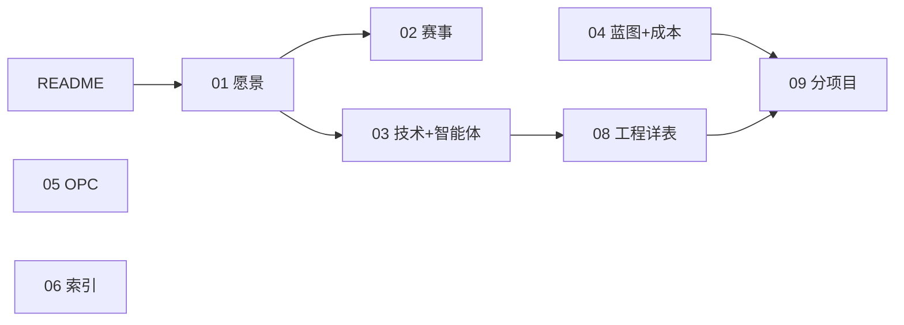

# 商业模拟教育平台 · 项目全景与目录结构

> **入口**：[README.md](./README.md) · **按角色索引**：[06-文档索引与延伸阅读.md](./06-文档索引与延伸阅读.md)  
> **最后更新**：2026-05-22

---

## 一、根目录文档（00～09）

| 编号 | 文档 | 定位 |
|------|------|------|
| **00** | 本文 | 仓库地图 |
| **01** | 平台愿景与产品架构 | 产品总纲、发展主线、可持续运营 |
| **02** | 赛事体系与双端产品 | Arena、十赛制、CyberCore |
| **03** | 技术架构与实现现状 | 技术栈、智能体编排架构、AI 编程方法论 |
| **04** | 实施路线与蓝图 | 有序阶段蓝图（无硬性日期）、工程规模与成本估算 |
| **05** | OPC一人公司-阅读合集 | OPC 可读总纲（Phase E） |
| **06** | 文档索引与延伸阅读 | 按角色选读 |
| **08** | 工程现状与webapp实现详表 | 路由/API/Bug/百分比唯一真相源 |
| **09** | 分项目开发与集成流程 | 竖切与协作、AI 编程上下文注入 |

> **07-教学内容生成规范** 已迁至 [inspire/07-教学内容生成规范.md](./inspire/07-教学内容生成规范.md)，属内容生产参考，不直接约束 AI 编程。

**代码**：`webapp/` · **OPC 规格库**：`OPC/`（读 `05-` 再下钻）

---

## 二、顶层目录树

```
businessmatch-v1/
├── README.md
├── 00～09（不含07）              ★ 权威文档 — AI 编程的上下文锚点
├── .cursor/rules/                ★ Cursor 规则（含推送前文档对齐）
├── webapp/                       ★ 可运行应用（唯一代码产出）
│   ├── backend/
│   │   ├── app/api/              路由：auth, competitions, trading, trading_ws, practice, techventure, techventure_admin, organizer, opc, wiki, courses
│   │   ├── app/domains/          域分包：arena · career · cybercore
│   │   ├── app/games/trading/    浮生记引擎：engine + market + ai_trader + practice_flow + inventory + rts_*
│   │   ├── app/games/techventure/ TechVenture 引擎：v6_engine + config + settle + ai_team + practice_flow
│   │   └── content/game-configs/ 赛制包：trading-v1（回合）· trading-v2-rts（即时）· techventure-v1（队伍策略）
│   ├── frontend/                 学生端（:5173）
│   └── organizer-frontend/       组织者端（:5174）
├── OPC/            OPC 规格库
├── inspire/                      灵感与内容资产库（见 [50-目录导航](./inspire/50-目录导航.md)）
│   ├── a商赛主题与真题库/        赛制主题、真题、学段推荐
│   ├── b商赛界面展示/            十赛制 UI 规格与声明式框架
│   ├── c知识卡片库/              概念卡 YAML、图谱映射
│   ├── d商业模拟教育平台/        工程规划长文（01～06）
│   ├── e课程设计/                K12～高职课程单元（原 college）
│   ├── f早期调研/                竞品/性格/伦理参考（原 reference）
│   ├── 07-教学内容生成规范.md    内容生产手册
│   ├── 11-、12-                  平台/赛事历史长文
│   └── 50-72-*.md                专题灵感
```

---

## 三、文档搭配关系



| 任务 | 文档链 |
|------|--------|
| 懂产品 | 01 → 02 |
| 懂实现 | 03 → 08 → webapp/README |
| 开干开发 | 04 → 09 |
| 智能体设计 | 03 §八 |
| OPC | 05 |
| 写内容 | [inspire/07](./inspire/07-教学内容生成规范.md) |
| 成本核算 | 04 §四 |

---

## 四、文档与推送纪律

　　本仓库以**根目录 `00～09` + `README`** 为产品与工程权威真相。文档体系为 **AI 辅助编程而设计**——根目录 00～09 是每次 AI 编程会话的上下文锚点，AI 不得偏离文档定义的域边界、路由归属、表归属。

　　每次**大型更新**后、向 GitHub 推送前，须先完成说明文档与代码的对齐（API、目录树、Phase 进展、`08-` 变更记录等），再执行 `git push`。自动化约束见 [`.cursor/rules/docs-align-before-push.mdc`](./.cursor/rules/docs-align-before-push.mdc)；流程说明见 [`09-`](./09-分项目开发与集成流程.md) §9.2。

---

## 五、webapp 代码（摘要）

　　当前规模：**约 90 Python 文件 · 约 75 TS/TSX 文件 · 约 22,000 行源码**。

- **API**：`/api/v1` — auth, wiki, courses, opc, organizer, competitions, trading, **trading WebSocket**, **practice**, **techventure**, **techventure_admin**
- **后端域包**：`domains/{arena,career,cybercore}` · `games/trading`（含 `rts_*` 模块与 `rts_scheduler`）· `games/techventure`（v6 引擎） · 赛制 YAML：`trading-v1`（回合制）、**`trading-v2-rts`（浮生记即时）**、**`techventure-v1`（队伍策略赛）**
- **浮生记 RTS**：tick **仅** `rts_scheduler` 推进；`GET /state` 只读；`WS /trading/events/{id}/ws?token=` 推送 tick/finished
- **回合制**：供需定价（`market.py`）、AI 交易员（`ai_trader.py`）、练习自动推进（`practice_flow.py`）
- **TechVenture**：4 轮三城四路线 BQI 策略赛；通用 `ArenaTeam` 队伍模型；学生 + 组织者 + 大屏 + 评委四端 React
- **主路由**：`/career` `/games` `/wiki` `/courses` `/opc/*`；组织者控场 `organizer-frontend`（:5174）
- **百分比与状态唯一真相源**：见 [08-](./08-工程现状与webapp实现详表.md) §三

---

> 根目录 `07-` 已迁至 `inspire/07-`；内容资产统一在 `inspire/a～f/`；历史长文见 `inspire/11-`、`12-`、`d商业模拟教育平台/`、`f早期调研/`。
