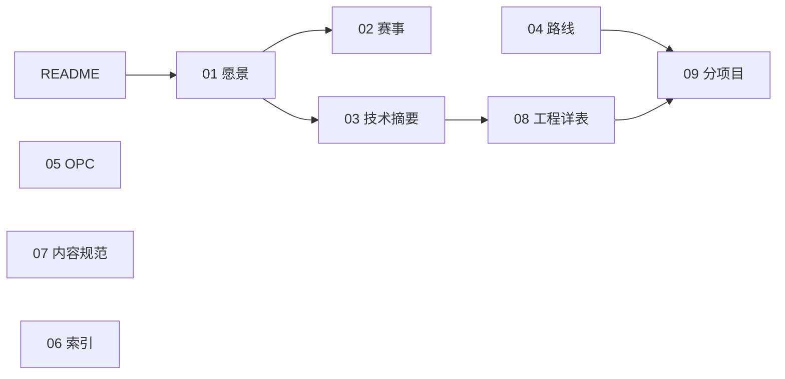

# 商业模拟教育平台 · 项目全景与目录结构

> **入口**：[README.md](./README.md) · **按角色索引**：[06-文档索引与延伸阅读.md](./06-文档索引与延伸阅读.md)  
> **最后更新**：2026-05-20

---

## 一、根目录文档（00～09）

| 编号 | 文档 | 定位 |
|------|------|------|
| **00** | 本文 | 仓库地图 |
| **01** | 平台愿景与产品架构 | 产品总纲 |
| **02** | 赛事体系与双端产品 | Arena、十赛制 |
| **03** | 技术架构与实现现状 | 技术栈、对齐摘要 |
| **04** | 实施路线与里程碑 | 路线与 P0 |
| **05** | OPC一人公司-阅读合集 | OPC 可读总纲 |
| **06** | 文档索引与延伸阅读 | 按角色选读 |
| **07** | 教学内容生成规范 | 教研生产（原 13） |
| **08** | 工程现状与webapp实现详表 | 路由/API/Bug（原 webapp/00） |
| **09** | 分项目开发与集成流程 | 竖切与协作（原 webapp/01） |

**代码**：`webapp/` · **OPC 规格库**：`OPC/`（读 `05-` 再下钻）

---

## 二、顶层目录树

```
businessmatch-v1/
├── README.md
├── 00～09、07-*.md              ★ 权威文档
├── .cursor/rules/                ★ Cursor 规则（含推送前文档对齐）
├── webapp/                       ★ 可运行应用
├── OPC/            OPC 规格库
├── inspire/
│   ├── college/                  ★ K12～高职课程单元（原根目录 college/）
│   ├── archive/                  历史长文（11、12、商业模拟教育平台）
│   ├── reference/                参考（14～16 竞品/性格/伦理）
│   └── 50-72-*.md                专题灵感
├── 知识卡片库/ · 商赛主题与真题库/ · 商赛界面展示/
```

---

## 三、文档搭配关系



| 任务 | 文档链 |
|------|--------|
| 懂产品 | 01 → 02 |
| 懂实现 | 03 → 08 → webapp/README |
| 开干开发 | 04 → 09 |
| OPC | 05 |
| 写内容 | 07 |

---

## 四、文档与推送纪律

　　本仓库依赖根目录 **`00～09` + `README`** 约束产品与工程真相。每次**大型更新**后、向 GitHub 推送前，须先完成说明文档与代码的对齐（API、目录树、Phase 进展、`08-` 变更记录等），再执行 `git push`。自动化约束见 [`.cursor/rules/docs-align-before-push.mdc`](./.cursor/rules/docs-align-before-push.mdc)；流程说明见 [`09-`](./09-分项目开发与集成流程.md) §9.2。

---

## 五、webapp 代码（摘要）

- **API**：`/api/v1` — auth, wiki, courses, opc, organizer, competitions, trading, **practice**  
- **后端域包**（2026-05）：`backend/app/domains/{arena,career,cybercore}` · `backend/app/games/trading` · 赛制 YAML 在 `backend/content/game-configs/`  
- **主路由**：`/career` `/games` `/wiki` `/courses` `/opc/*`；组织者控场见 `organizer-frontend`（:5174）  
- **详表**：见 [08-](./08-工程现状与webapp实现详表.md)

---

> 历史编号 `11-`～`16-`、根目录占位文件已删除；全文在 `inspire/archive` 与 `inspire/reference`。
