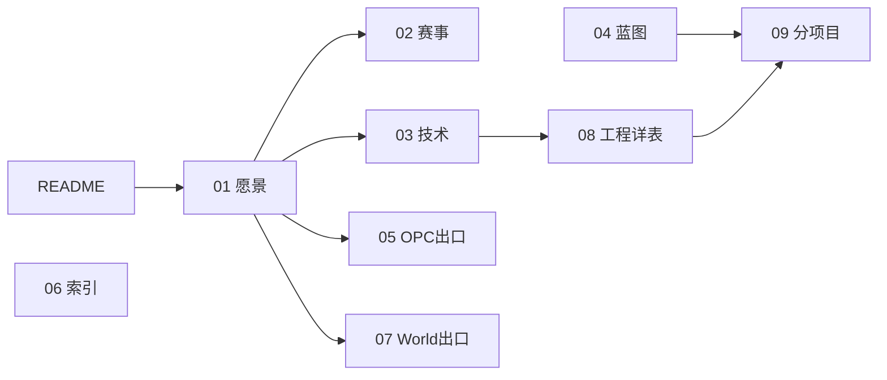

# 商业模拟教育平台 · 项目全景与目录结构

> **入口**：[README.md](./README.md) · **按角色索引**：[06-文档索引与延伸阅读.md](./06-文档索引与延伸阅读.md)  
> **最后更新**：2026-05-22

---

## 一、根目录文档（00～09）

| 编号 | 文档 | 定位 |
|------|------|------|
| **00** | 本文 | 仓库地图 |
| **01** | 平台愿景与产品架构 | 产品总纲、发展主线、可持续运营 |
| **02** | 赛事体系与双端产品 | Arena、十赛制、CyberCore |
| **03** | 技术架构与实现现状 | 技术栈、智能体编排架构、AI 编程方法论 |
| **04** | 实施路线与蓝图 | 有序阶段蓝图（无硬性日期）、工程规模与成本估算 |
| **05** | OPC一人公司-阅读合集 | **终局出口 A**：真实/半真实首项目（Phase E） |
| **06** | 文档索引与延伸阅读 | 按角色选读 |
| **07** | 拟真城市与区域模拟-阅读合集 | **终局出口 B**：共享城市世界 · POP · 政策推演（Phase B～F 渐进） |
| **08** | 工程现状与webapp实现详表 | 路由/API/Bug/百分比唯一真相源 |
| **09** | 分项目开发与集成流程 | 竖切与协作、AI 编程上下文注入 |

> **教研内容生产**（非根目录编号）：[inspire/07-教学内容生成规范.md](./inspire/07-教学内容生成规范.md)  
> **拟真城市产品详设附录**：[inspire/75-拟真城市世界观设计.md](./inspire/75-拟真城市世界观设计.md)

**代码**：`webapp/` · **OPC 规格库**：`OPC/`（读 `05-` 再下钻）

### 推荐阅读顺序（自然路径）

| 阶段 | 文档链 |
|------|--------|
| 入门 | `00` → `01` → `06`（索引） |
| 产品与赛制 | `01` → `02` → `04` |
| 双终局出口 | `05` OPC ∥ `07` 拟真城市（并列，按需选读） |
| 开发落地 | `03` → `08` → `09` |

---

## 二、顶层目录树

```
businessmatch-v1/
├── README.md
├── 00～09                          ★ 权威文档 — AI 编程的上下文锚点
├── .cursor/rules/                  ★ Cursor 规则（含推送前文档对齐）
├── webapp/                         ★ 可运行应用（唯一代码产出）
│   ├── backend/
│   │   ├── app/api/                路由：auth, competitions, trading, trading_ws, practice, techventure, techventure_admin, organizer, opc, wiki, courses
│   │   ├── app/domains/            域分包：arena · career · cybercore（world 规划 Phase B+）
│   │   ├── app/games/trading/      浮生记引擎
│   │   ├── app/games/techventure/  TechVenture 引擎
│   │   └── content/
│   │       ├── game-configs/       赛制包：trading-v1 · trading-v2-rts · techventure-v1
│   │       └── world/cities/       拟真城市母本占位（见 07-、inspire/75-）
│   ├── frontend/                   学生端（:5173）
│   └── organizer-frontend/         组织者端（:5174）
├── OPC/                            OPC 规格库（配合 05-）
├── inspire/                        灵感与内容资产库（见 inspire/50-）
│   ├── a～f/                       商赛主题、界面、卡片、课程、调研
│   ├── 07-教学内容生成规范.md      内容生产（与根目录 07- 不同编号空间）
│   ├── 75-拟真城市世界观设计.md    07- 的产品详设附录
│   └── 50-72-*.md                  专题灵感
```

---

## 三、文档搭配关系



| 任务 | 文档链 |
|------|--------|
| 懂产品 | 01 → 02 |
| 懂实现 | 03 → 08 → webapp/README |
| 开干开发 | 04 → 09 |
| 智能体设计 | 03 §八 |
| OPC 终局 | 05 |
| 拟真城市终局 | 07 → inspire/75- |
| 写内容 | inspire/07-教学内容生成规范 |
| 成本核算 | 04 §四 |

---

## 四、文档与推送纪律

　　本仓库以**根目录 `00～09` + `README`** 为产品与工程权威真相。文档体系为 **AI 辅助编程而设计**——根目录 00～09 是每次 AI 编程会话的上下文锚点，AI 不得偏离文档定义的域边界、路由归属、表归属。

　　每次**大型更新**后、向 GitHub 推送前，须先完成说明文档与代码的对齐（API、目录树、Phase 进展、`08-` 变更记录等），再执行 `git push`。自动化约束见 [`.cursor/rules/docs-align-before-push.mdc`](./.cursor/rules/docs-align-before-push.mdc)；流程说明见 [`09-`](./09-分项目开发与集成流程.md)。

---

## 五、webapp 代码（摘要）

　　当前规模：**约 90 Python 文件 · 约 75 TS/TSX 文件 · 约 22,000 行源码**。

- **API**：`/api/v1` — auth, wiki, courses, opc, organizer, competitions, trading, trading_ws, practice, techventure, techventure_admin
- **后端域包**：`domains/{arena,career,cybercore}` · `games/trading` · `games/techventure`
- **赛制 YAML**：`trading-v1` · `trading-v2-rts` · `techventure-v1`
- **World**：`content/world/cities/` 占位；运行时 **Phase B+**
- **百分比唯一真相源**：[08-](./08-工程现状与webapp实现详表.md) §三

---

> 内容资产统一在 `inspire/a～f/`；历史长文见 `inspire/11-`、`12-`、`d商业模拟教育平台/`、`f早期调研/`。
