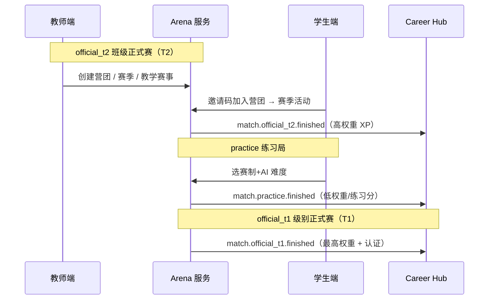
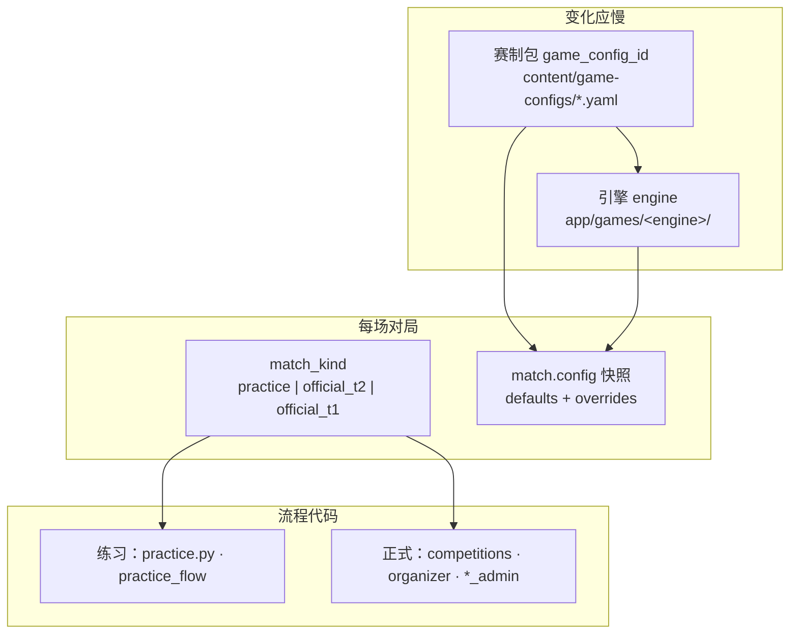
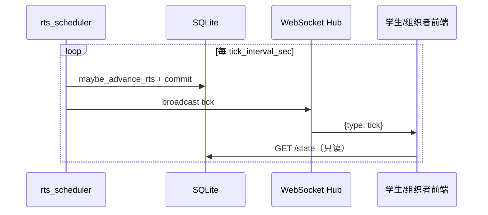

# 赛事体系、双端与赛季模式

> **文档定位**：赛制架构、双端产品（教师端/学生端）、赛季模式、Arena 三模式（练习/T2/T1）的**当前权威摘要**；细节与 16 赛制扩展见归档。
>
> **历史全文**：[inspire/archive/12-赛事体系架构与性格适配（已归档）](./inspire/archive/12-赛事体系架构与性格适配（已归档·见根目录02）.md)
> **UI/契约**：[inspire/b商赛界面展示/00-解耦声明式商业模拟框架总览.md](./inspire/b商赛界面展示/00-解耦声明式商业模拟框架总览.md)  
> **最后更新**：2026-05-29

---

## 一、体系目标

　　商业模拟赛事从「单一竞技工具」进化为**覆盖多元性格与能力取向**的商业素养生态——不只培养「会赢的人」，也帮助不同特质的学生发现商业价值。

---

## 二、双端产品

> **定位**：平台面向两类核心用户——**教师**（课程实施者）与**学生**（学习者）。双端不是"管理后台 vs 参赛界面"，而是"教学导演台 vs 学习体验舱"。

### 2.1 教师端（Course Terminal）

教师端从"赛事组织者"升级为**课程实施端**。

| 能力 | 说明 | 模式 |
|------|------|------|
| **开设营团** | 创建班级/夏令营/社团，生成邀请码 | 自主 |
| **创建赛季** | 定义一次课程的主线赛季（时间、主题、里程碑） | 自主 / AOTU |
| **编排活动** | 理论课 → 练习赛 → 复盘 → 产出，按节奏解锁 | 自主 / AOTU |
| **受控商赛** | 调用现有赛制，可控时长、难度、规则简化 | 自主 |
| **AI 助教** | Athena 辅助备课、课堂提示、复盘摘要、批改脚手架 | 始终 |
| **AOTU 自动辅助** | 为无经济学基础教师自动生成授课节奏与活动建议 | AOTU |
| **班级正式赛（T2）** | 赛季收官：组织班级内正式赛，决出排名 | 自主 |

- **自主模式**：教师完全控制授课节奏、活动选择与难度调整。
- **AOTU 模式（Auto-Teaching Unit）**：系统根据教学目标自动生成建议节奏、推荐活动、预填提示与标注，教师可一键采纳或微调。适合无经济学背景的教师。

### 2.2 学生端（Student Terminal）

| 能力 | 说明 |
|------|------|
| **注册与加入** | 手机号/邮箱注册 → 输入教师邀请码加入营团 |
| **赛季模式** | 参与教师开设的课程赛季，按节奏完成活动 |
| **日常模式** | 无赛季时的平淡体验：练习赛、Quest、图谱、家园 |
| **T2 班级赛** | 赛季收官时参与教师主持的正式赛 |
| **T1 正式赛** | 由具备资质的主办单位组织的级别赛事（需报名审核） |

---

## 三、三维坐标模型（选型用）

| 轴 | 两端 | 用途 |
|----|------|------|
| **竞争—合作** | 零和排名 ↔ 共创目标 | 匹配合作型 / 竞争型人格 |
| **分析—直觉** | 数据推演 ↔ 叙事/审美 | 匹配理性 / 创意型 |
| **短期—长期** | 4～8 回合 ↔ 多阶段延迟反馈 | 匹配短跑 / 马拉松型 |

　　现有 **10 种平台内置赛制** 在三维空间中的分布与素养矩阵见 [inspire/b商赛界面展示/70-界面说明总索引.md](./inspire/b商赛界面展示/70-界面说明总索引.md)。

---

## 四、十种内置赛制（速查）

| # | 赛制 | 学段 | 核心能力 | 优先级 | webapp 状态 |
|---|------|------|----------|--------|-------------|
| 01 | 回合制策略商赛 | 高中+ | 资源分配、战略预判 | **当前** | ✅ `trading-v1` |
| 02 | 实时经营挑战（浮生记 RTS） | 初中+ | 多线程、应急 | **当前** | ✅ `trading-v2-rts` + WS |
| 03 | 拍卖交易大厅 | 高中+ | 价格发现、风控 | 蓝图 | — |
| 04 | 产业链角色扮演 | 高中+ | 谈判、协作竞争 | 蓝图 | — |
| 05 | 案例推演决策 | 大学+ | 伦理、长期思维 | 蓝图 | — |
| 06 | 投资人对决 | 大学+ | 路演、估值 | 蓝图 | — |
| 07 | 创业生存战 | 高中+ | 成本、危机决策 | 蓝图 | — |
| 08 | 宏观经济沙盘 | 大学+ | 系统思维、政策 | 蓝图 | — |
| 09 | ESG 可持续经营 | 大学+ | 利益相关者平衡 | 蓝图 | — |
| 10 | 跨国贸易博弈 | 大学+ | 汇率、跨文化 | 蓝图 | — |

　　主题与真题：[inspire/a商赛主题与真题库/90-目录索引.md](./inspire/a商赛主题与真题库/90-目录索引.md)。外部竞品档案：[inspire/f早期调研/14-商赛类型与赛制资料库.md](./inspire/f早期调研/14-商赛类型与赛制资料库.md)。

---

## 五、诊断摘要：十大盲区（原 12 文档）

　　完整论述见归档；开发时需有意识弥补：

1. 竞争性偏见 — 合作型人格排斥  
2. 分析型霸权 — 直觉/艺术型边缘化  
3. 外向假设 — 内向者参与壁垒  
4. 单一时间偏好 — 长期主义者挫败  
5. 胜者通吃 — 失败者学习价值不足  
6. （其余见归档 §一）

**产品对策（已采纳方向）**：

- 新增/强化**合作向、叙事向、长期向**赛制与评价维度  
- **成长叙事**与排名同屏（五维雷达变化）  
- **Persona 匹配**推荐赛制（理论见 [`inspire/f早期调研/15-`](./inspire/f早期调研/15-性格分类框架-理论综述.md)）  
- OPC 解锁**不唯商赛排名**（见 [05-OPC](./05-OPC一人公司-阅读合集.md)）

---

## 六、赛季模式（Season）

> **定位**：一次课程 = 一个**主线赛季**。赛季是教师端编排教学活动的容器，也是学生端体验"主线剧情"的时段。

### 6.0 赛季生命周期

| 阶段 | 教师端动作 | 学生端体验 | 产出 |
|------|-----------|-----------|------|
| **创建** | 开设营团 → 创建赛季（主题、周期、里程碑） | — | `season_id` + 邀请码 |
| **招募** | 分发邀请码 | 注册 → 加入营团 | 营团成员列表 |
| **开季** | 发布赛季公告、解锁首个里程碑 | 收到推送，进入赛季主页 | 赛季进度条 |
| **授课** | 按里程碑推送活动（理论→练习→复盘） | 完成活动、参与练习赛 | XP + 物资 + 学识点 |
| **冲刺** | 组织 T2 班级正式赛 | 参与班级赛 | honor + 赛季分 |
| **收官** | 发布全班复盘、作业评价、赛季排名 | 查看个人赛季档案 | 赛季结算 → 生涯汇入 |

### 6.1 赛季 vs 日常模式

| 维度 | 赛季模式 | 日常模式 |
|------|----------|----------|
| **触发** | 教师创建赛季 | 学生自主登录 |
| **节奏** | 教师编排，按里程碑推进 | 学生自主，无强制节奏 |
| **内容** | 受控商赛 + 理论课 + 复盘 + 产出 | 自由练习 + Quest + 图谱 + 家园 |
| **社交** | 班级内协作/竞争 | 个人进度为主 |
| **XP 权重** | 赛季活动高权重 | 日常活动低权重 |
| **类比** | 手游"主线剧情更新" | 手游"长草期" |

- **赛季是主线**：有明确目标、有教师引导、有里程碑验收。
- **日常是养成**：无压力积累、自由探索、等待下一次赛季。

### 6.2 赛季与生涯模式的关系

赛季结束时，学生在赛季中获得的所有 XP、荣誉、物资、学识点通过 `SettlementBundle` 汇入 Career Hub，推动生涯等级、家园槽位与 NPC 章节解锁。

赛季结束后进入**日常模式**，学生可继续自由练习与探索，直到下一次教师开设新赛季。

---

## 七、Arena 模式（练习 · T2 · T1）（工程必对齐）

| 字段/概念 | practice | official_t2 | official_t1 |
|-----------|----------|-------------|-------------|
| `match_kind` | `practice` | `official_t2` | `official_t1` |
| 组织者 | AI / 自主 | 教师 | 主办单位（资质审核） |
| 对手 | AI Bot / Demia / Rival | 真人（可 NPC 补位） | 真人 |
| 入口 | 学生端「模拟练习」 | 教师端赛季 → 邀请码加入 | 平台报名 + 资质审核 |
| 排行榜 | 练习榜（可选） | 班级赛季榜 | 赛事总榜 |
| 权重 | 低 | 高 | 最高 |
| webapp 现状 | ✅ v1 回合制 + v2 RTS + AI | ✅ 回合制 + 教师控场 + ~10 人试点 | 🟡 规划 |

> **工程现状（Phase A）**：数据库与 API 仍使用 `match_kind` = `practice` \| `official`（见 `MatchKind` 枚举）。上表 `official_t2` / `official_t1` 为**产品分轨规划**，落地见 [ADR-009](./docs/decisions/009-赛季模式与教师端双端演进.md) 与 Phase B。

### 5.0 引擎 · 配置 ID · 场次类型 · 流程（开发必读）

　　完成一款赛事后，**核心是引擎**；在此基础上用 **不同 `game_config_id`** 区分练习规则包、不同地区/赛季的正式赛规则包；用 **`match_kind`** 区分练习与商赛的办赛流程；**不要**为每种练习或每个国家复制一套 Python 结算内核。

| 层 | 字段/路径 | 回答的问题 | 示例 |
|----|-----------|------------|------|
| **① 引擎** | YAML 内 `engine:` → `app/games/<engine>/` | 怎么结算、有哪些运行时表 | `techventure` → `v6_engine.py`；`trading` → 回合/RTS |
| **② 配置 ID** | `game_config_id` → `{id}.yaml` | 这一场**按什么规则玩**（轮数、城市、经济常数、奖励档） | `techventure-v1`（现状）；将来 `techventure-practice`、`techventure-official-us` |
| **③ 场次类型** | `match_kind` | 这一场**按什么流程办**（谁建场、XP 权重、是否要房间码） | `practice` / `official_t2` / `official_t1` |
| **④ 流程** | API + 前端路由 | 练习一键开局 vs 组织端控场 | `/practice/...` vs `/techventure/admin/...` |

**正交组合**（两维相乘，不是二选一）：

| 交付名（排期/PR 用） | `match_kind` | `game_config_id`（示例） |
|----------------------|--------------|---------------------------|
| 创想大赢家 · 日常练习 | `practice` | `techventure-practice`（规划）或 `techventure-v1` + overrides |
| 创想大赢家 · T2 班级赛 | `official_t2` | `techventure-v1` 或 `techventure-official-cn` |
| 创想大赢家 · T1 正式赛 | `official_t1` | `techventure-official-us`（规划：城市/客群不同，**同一引擎**） |
| 浮生记 RTS · 练习 | `practice` | `trading-v2-rts` |
| 浮生记 · T2 班级赛 | `official_t2` | `trading-v2-rts` 或独立 `trading-official-*` |

**配置 ID 命名建议**（`content/game-configs/<id>.yaml` 的 `id` 字段）：

- 格式：`<引擎简写>-<模式或地区>`，如 `techventure-practice`、`techventure-official-us`
- `meta.name` 写中文展示名：「创想大赢家 · 美国正式赛」
- 规则差异（回合数、城市、事件池、`practice_ai_count`）写在 YAML，**禁止**为美国赛再 fork 一套 `v6_engine`
- 可选：单文件内 `practice:` / `official:` 子段 + 加载时按 `match_kind` 选取（文件少、耦合高）；中长期更推荐**独立 YAML**

**`match.config`**：建场时 `merged_match_config(overrides)` 写入场次 JSON，局内读快照，避免赛中改 YAML 影响已开场次。

**开发自检口诀**：先标交付名（`<赛制> · 练习` / `<赛制> · 正式赛`）→ 再选文件（`practice_*` 或 `admin/official_*`）→ 规则变更加 YAML 或新 `game_config_id`，不改引擎除非机制性变更。

　　工程细则：[`webapp/backend/app/domains/arena/ARCHITECTURE.md`](./webapp/backend/app/domains/arena/ARCHITECTURE.md)（分轨、PR 自检、禁止在共享 API 堆 `if practice`）。

### 5.1 教师端课程流程（赛季生命周期）

　　教师端以**赛季**为容器组织一次完整课程。赛季内的所有活动（理论课、练习赛、复盘、T2 正式赛）均通过教师端编排，学生端按里程碑推进。

| 阶段 | 教师端 | 学生端 |
|------|--------|--------|
| 1 开设营团 | 创建营团 → 设置主题/学段 → 生成 **邀请码** | — |
| 2 学生加入 | 查看成员列表、分组 | 注册账号 → 输入邀请码 → 加入营团 |
| 3 创建赛季 | 定义赛季周期、里程碑、活动序列 | 收到赛季开启推送 |
| 4 编排活动 | 按里程碑推送：理论课 → 练习赛 → 复盘 → 产出 | 按节奏完成活动 |
| 5 教学赛事 | 创建受控商赛（可选简化规则、缩短时长） | 参与课堂练习/教学赛事 |
| 6 赛季收官 | 组织 T2 班级正式赛 → 发布排名 → 赛季结算 | 参与 T2 赛 → 查看赛季档案 |
| 7 经验汇入 | 赛季结算 → XP/荣誉/物资汇入 Career Hub | 生涯等级/家园/NPC 解锁 |

**工程约束**：

- `season.status` 状态机：`draft` → `recruiting` → `ongoing` → `final` → `closed`；只有 `ongoing` 才能创建活动。
- 营团与赛季分离：一个营团可包含多个赛季；学生加入营团后自动获得当前进行中的赛季。
- 邀请码：6 位字母数字，营团级唯一，可重置。
- 教学赛事（`match_kind=official_t2`）必须绑定到赛季里程碑；禁止脱离赛季创建 T2 赛。
- AOTU 模式生成的活动序列须经教师确认后才写入 `season.milestones`。

### 5.2 练习 vs 正式赛代码分轨（演进，非立即双库）

　　练习目标：**薄、稳、少变**（`practice.py`、`practice_flow`、可选 `*-practice` 配置）。正式商赛目标：**厚、严、常改**（教师端、`*_admin`、鉴权与控场）。二者共用 §5.0 的引擎与表结构，但**不是**两个独立 App/数据库。

| 现在就要做 | 可以等业务分叉再做 |
|------------|-------------------|
| PR/需求标题标明「练习」或「正式赛」 | 拆 `techventure-practice.yaml` / `techventure-official-*.yaml` |
| 共享 `api/techventure.py` 不长 `match_kind` 分支 | 地区赛（美/欧）独立配置 ID |
| 正式赛逻辑进 `*_admin` / `official_flow` | 练习专用精简局内页 |

　　详见 `arena/ARCHITECTURE.md` §Practice 与 Official 分轨。

### 5.3 学生注册与营团加入

　　学生注册和加入营团是赛季模式的前置条件。

#### 注册流程

| 步骤 | 动作 | 说明 |
|------|------|------|
| 1 | 打开平台 | 访问 webapp 首页 |
| 2 | 选择身份 | 「我是学生」/「我是教师」 |
| 3 | 填写信息 | 手机号/邮箱 + 验证码 + 昵称 |
| 4 | 完成注册 | `POST /auth/register` → 创建 `users` 记录 |

#### 加入营团

| 步骤 | 动作 | 说明 |
|------|------|------|
| 1 | 获取邀请码 | 教师分发 6 位邀请码（营团级唯一） |
| 2 | 输入邀请码 | 学生端「加入营团」页输入 |
| 3 | 确认加入 | `POST /groups/{id}/join` → 写入 `group_memberships` |
| 4 | 进入赛季 | 自动加入营团当前进行中的赛季（如有） |

#### 关键约束

- 一个学生可加入**多个营团**（如同时参加数学商赛社和经济学夏令营）。
- 一个营团可包含**多个赛季**（如春季学期赛、暑期夏令营赛）。
- 邀请码可重置，旧码失效后已加入学生不受影响。
- 教师可查看营团成员的学习档案和赛季进度。

---

## 八、性格适配（摘要）

| 机制 | 说明 |
|------|------|
| **Persona 画像** | MBTI / 行为数据 → 推荐赛制与角色 |
| **赛季编排** | 多赛制轮换，非全年单一排名 |
| **5D 评估** | 财务/市场/战略/协作/伦理，非单一总分 |
| **理论详述** | [inspire/f早期调研/15-性格分类框架-理论综述.md](./inspire/f早期调研/15-性格分类框架-理论综述.md) |

---

## 九、CyberCore（声明式赛制）

　　目标：**规则即配置**，一种赛制 = `game-configs/*.yaml` + 结算内核调用，禁止为每种赛制复制 `trading.py`。

| 文档 | 内容 |
|------|------|
| [inspire/b商赛界面展示/00-解耦声明式商业模拟框架总览.md](./inspire/b商赛界面展示/00-解耦声明式商业模拟框架总览.md) | 框架总览 |
| [inspire/b商赛界面展示/00-框架配置Schema与接口契约.md](./inspire/b商赛界面展示/00-框架配置Schema与接口契约.md) | Schema + API |
| [inspire/72-十种商赛形式的原理与商业知识论述.md](./inspire/72-十种商赛形式的原理与商业知识论述.md) | 经济学/博弈论论述 |
| [inspire/76-商赛美术资源嵌入与技术选型建议.md](./inspire/76-商赛美术资源嵌入与技术选型建议.md) | 主题包、manifest、对局运行时层（Phase A+ 规划） |
| [inspire/55-平台体验与交互设计.md](./inspire/55-平台体验与交互设计.md) | 决策舱、大屏信息架构 |
| `09-分项目开发与集成流程.md` | 第一份 YAML 落地步骤 |
| `webapp/backend/content/game-configs/trading-v1.yaml` | 回合制六城倒卖（`pricing.mode: market`） |
| `webapp/backend/content/game-configs/trading-v2-rts.yaml` | **浮生记 RTS**（5s tick、ask/bid、体积仓储、车辆） |
| `webapp/backend/app/domains/arena/ARCHITECTURE.md` | Arena / Cybercore / Game 分层规范 |

---

### 浮生记 RTS v2（即时物流商战）

　　与表内「02 实时经营挑战」理念对齐；工程上为 **独立赛制包** `trading-v2-rts`（`config.mode: rts`），与回合制 `trading-v1` **并存**，由 `game_config_id` 选型。

| 维度 | 说明 |
|------|------|
| **时间模型** | 默认 5s 一 tick；组织者可选 8/10/12 分钟（96/120/144 tick） |
| **市场** | 城内 pool 定价，同城 **ask 买 / bid 卖** 必有价差 |
| **物流** | 体积仓储（基础上限 99）、小货车/大卡车、在途不可交易 |
| **练习 AI** | `chaotic`（混乱试探）与 `advanced`（跨城套利）两档 |
| **推进架构** | **调度器单写者**：`rts_scheduler` 唯一调用 `maybe_advance_rts`；HTTP `/state` **只读** |
| **实时推送** | WebSocket `GET→WS /api/v1/trading/events/{id}/ws?token=JWT`；tick/finished 后广播，前端刷新状态 |
| **商品** | 10 品（含能源、家用车等），六城产销结构见 YAML |

---

## 十、与 webapp 的对应

| 能力 | 状态 |
|------|------|
| 交易赛（回合制）T2 + 练习 | ✅ `trading-v1` + `competitions` / `practice` |
| **浮生记 RTS v2** 练习 + 教师开赛 | ✅ `trading-v2-rts` + `TradingRTSView` + 调度器 + WS |
| 教师控场 | ✅ `organizer-frontend`（:5174）；RTS 无「推进回合」按钮 |
| 邀请码加入 | ✅ `competitions` |
| 教师端等待区 + 创想大赢家组队 | ✅ `TechVentureControl` 报名态 · `POST .../admin/.../start` |
| `match_kind` + XP 权重分流 | ✅ 字段 + `xp_events` + YAML `rewards` |
| 日常练习入口 | ✅ `/games` → `POST /practice/trading/start`（默认 v2 RTS） |
| 十赛制配置化 | 🟡 已落地 `trading-v1`、`trading-v2-rts`；其余赛制待增包 |

　　百分比对齐度与详细缺口见 [08-](./08-工程现状与webapp实现详表.md) §三。

---

---

## 十一、拟真城市与跨赛制共享（中期规划）

　　全部内置赛制共享**真实中国城市**本体（人口 POP、产业、消费、地理交通、政策情景），降低跨赛制学习成本并对接真实教学与研究。各赛制读取同一 `city_id` 的不同**商业切面**——而非各自维护孤立的城市参数表。

| 赛制 | 城市切面 |
|------|----------|
| trading-v1 / v2-rts | 品类偏好 · 产销物流 |
| techventure-v1 | 客群结构 · 品牌份额 |
| 宏观/ESG（蓝图） | 政策传导 · 利益相关者 |

　　Phase A 仅完成规划与 `content/world/cities/` 占位；运行时 World 域自 Phase B 起逐步落地。详见 [07-拟真城市与区域模拟-阅读合集](./07-拟真城市与区域模拟-阅读合集.md) · [inspire/75-](./inspire/75-拟真城市世界观设计.md) · [04-](./04-实施路线与里程碑.md)。

---

> **开发排期**：见 [04-](./04-实施路线与里程碑.md) · 工程拆分见 [09-](./09-分项目开发与集成流程.md)
