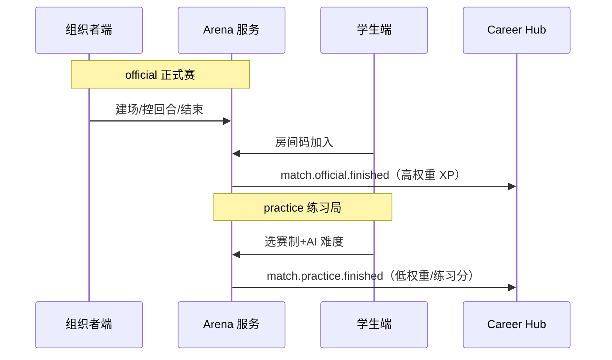

# 赛事体系与双端产品

> **文档定位**：赛制架构、性格适配、Arena 双模式（练习/正式）的**当前权威摘要**；细节与 16 赛制扩展见归档。
>
> **历史全文**：[inspire/archive/12-赛事体系架构与性格适配.md](./inspire/archive/12-赛事体系架构与性格适配.md)  
> **UI/契约**：[商赛界面展示/00-解耦声明式商业模拟框架总览.md](./商赛界面展示/00-解耦声明式商业模拟框架总览.md)  
> **最后更新**：2026-05-19

---

## 一、体系目标

　　商业模拟赛事从「单一竞技工具」进化为**覆盖多元性格与能力取向**的商业素养生态——不只培养「会赢的人」，也帮助不同特质的学生发现商业价值。

---

## 二、三维坐标模型（选型用）

| 轴 | 两端 | 用途 |
|----|------|------|
| **竞争—合作** | 零和排名 ↔ 共创目标 | 匹配合作型 / 竞争型人格 |
| **分析—直觉** | 数据推演 ↔ 叙事/审美 | 匹配理性 / 创意型 |
| **短期—长期** | 4～8 回合 ↔ 多阶段延迟反馈 | 匹配短跑 / 马拉松型 |

　　现有 **10 种平台内置赛制** 在三维空间中的分布与素养矩阵见 [商赛界面展示/70-界面说明总索引.md](./商赛界面展示/70-界面说明总索引.md)。

---

## 三、十种内置赛制（速查）

| # | 赛制 | 学段 | 核心能力 |
|---|------|------|----------|
| 01 | 回合制策略商赛 | 高中+ | 资源分配、战略预判 |
| 02 | 实时经营挑战 | 初中+ | 多线程、应急 |
| 03 | 拍卖交易大厅 | 高中+ | 价格发现、风控 |
| 04 | 产业链角色扮演 | 高中+ | 谈判、协作竞争 |
| 05 | 案例推演决策 | 大学+ | 伦理、长期思维 |
| 06 | 投资人对决 | 大学+ | 路演、估值 |
| 07 | 创业生存战 | 高中+ | 成本、危机决策 |
| 08 | 宏观经济沙盘 | 大学+ | 系统思维、政策 |
| 09 | ESG 可持续经营 | 大学+ | 利益相关者平衡 |
| 10 | 跨国贸易博弈 | 大学+ | 汇率、跨文化 |

　　主题与真题：[商赛主题与真题库/90-目录索引.md](./商赛主题与真题库/90-目录索引.md)。外部竞品档案：[inspire/reference/14-商赛类型与赛制资料库.md](./inspire/reference/14-商赛类型与赛制资料库.md)。

---

## 四、诊断摘要：十大盲区（原 12 文档）

　　完整论述见归档；开发时需有意识弥补：

1. 竞争性偏见 — 合作型人格排斥  
2. 分析型霸权 — 直觉/艺术型边缘化  
3. 外向假设 — 内向者参与壁垒  
4. 单一时间偏好 — 长期主义者挫败  
5. 胜者通吃 — 失败者学习价值不足  
6. （其余见归档 §一）

**产品对策（已采纳方向）**：

- 新增/强化**合作向、叙事向、长期向**赛制与评价维度  
- **成长叙事**与排名同屏（五维雷达变化）  
- **Persona 匹配**推荐赛制（理论见 `inspire/reference/15-`）  
- OPC 解锁**不唯商赛排名**（见 [05-OPC](./05-OPC一人公司-阅读合集.md)）

---

## 五、Arena 双模式（工程必对齐）

| 字段/概念 | practice | official |
|-----------|----------|----------|
| `match_kind` | `practice` | `official` |
| 对手 | AI Bot / Demia / Rival | 真人（可 NPC 补位） |
| 入口 | 学生端「模拟练习」 | 组织者建场 + 学生房间码 |
| 排行榜 | 练习榜（可选） | 赛季主榜 |
| webapp 现状 | 🔴 未独立 | 🟡 交易赛已通，组织者未拆端 |

---

## 六、性格适配（摘要）

| 机制 | 说明 |
|------|------|
| **Persona 画像** | MBTI / 行为数据 → 推荐赛制与角色 |
| **赛季编排** | 多赛制轮换，非全年单一排名 |
| **5D 评估** | 财务/市场/战略/协作/伦理，非单一总分 |
| **理论详述** | [inspire/reference/15-性格分类框架-理论综述.md](./inspire/reference/15-性格分类框架-理论综述.md) |

---

## 七、CyberCore（声明式赛制）

　　目标：**规则即配置**，一种赛制 = `game-configs/*.yaml` + 结算内核调用，禁止为每种赛制复制 `trading.py`。

| 文档 | 内容 |
|------|------|
| `商赛界面展示/00-解耦声明式商业模拟框架总览.md` | 框架总览 |
| `商赛界面展示/00-框架配置Schema与接口契约.md` | Schema + API |
| `inspire/72-十种商赛形式的原理与商业知识论述.md` | 经济学/博弈论论述 |
| `09-分项目开发与集成流程.md` | 第一份 YAML 落地步骤 |

---

## 八、与 webapp 的对应

| 能力 | 状态 |
|------|------|
| 交易赛（倒卖）全链路 | ✅ `trading.py` + `/games` |
| 组织者创建比赛 | 🟡 `/organizer/events/create` |
| 房间码加入 | ✅ `competitions` |
| 练习 vs 官方事件分流 | 🔴 待 `match_kind` + 事件名 |
| 十赛制配置化 | 🔴 规划中 |

---

> **开发排期**：见 [04-](./04-实施路线与里程碑.md) · 工程拆分见 [09-](./09-分项目开发与集成流程.md)
