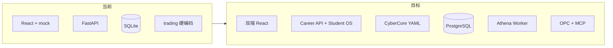

# 技术架构与实现现状

> **文档定位**：**当前权威**的技术栈、系统边界、智能体编排架构、AI 编程方法论、`webapp` 实现度摘要；工程详表见 [`08-工程现状与webapp实现详表.md`](./08-工程现状与webapp实现详表.md)。
>
> **历史规划**：[inspire/d商业模拟教育平台/02-技术栈与项目结构.md](./inspire/d商业模拟教育平台/02-技术栈与项目结构.md)  
> **最后更新**：2026-05-22

---

## 一、目标技术栈

### 1.1 当前（webapp MVP）

| 层 | 技术 |
|----|------|
| 前端 | React 19、TypeScript、Vite 8、Tailwind、Zustand、React Router 7 |
| 后端 | Python 3.13、FastAPI、SQLAlchemy 2、SQLite |
| 认证 | JWT（python-jose）、bcrypt |
| 部署 | Docker Compose、Nginx（前端静态） |

### 1.2 规模化目标

| 层 | 技术 |
|----|------|
| 数据库 | **PostgreSQL**（单库多租户 `organization_id`） |
| 缓存/队列 | Redis（会话、任务队列、限流） |
| 迁移 | Alembic |
| 赛制 | **CyberCore** YAML + 结算 Worker |
| AI | 事件驱动 Athena Debrief；OPC LangGraph + MCP |
| 架构形态 | **模块化单体**（一个 FastAPI，按域分包） |

　　数据治理详述见 [inspire/d商业模拟教育平台/06-规模化技术栈与数据治理.md](./inspire/d商业模拟教育平台/06-规模化技术栈与数据治理.md)。

---

## 二、推荐仓库边界（与 04、09 一致）

```
webapp/
├── backend/
│   ├── app/domains/      # ★ arena · career · cybercore
│   ├── app/games/        # ★ 赛制运行时（trading · techventure）
│   ├── content/game-configs/   # trading-v1（回合）· trading-v2-rts（即时）· techventure-v1（队伍策略）
│   └── app/api/          # practice · trading_ws（WebSocket）
├── frontend/             # 学生端 → 未来 apps/web-student
├── organizer-frontend/   # 组织者端（:5174）
packages/                 # ★ 渐进：api-types, cybercore-engine, game-config-schema
contracts/                # OpenAPI、域事件、表归属约定（待建）
```

| 原则 | 说明 |
|------|------|
| **一个库** | 禁止组织者/学生各建 SQLite |
| **一个 API 进程** | 禁止为组织者单独起第二套后端 |
| **竖切交付** | 每 2～3 周：建赛→加入→打完→生涯入账 |

---

## 三、后端域分包（目标 vs 现状）

| 域包 | 代码路径 | 职责 | 现状 |
|------|----------|------|------|
| `identity` | `models/user.py` + `api/auth.py` | 用户、JWT | ✅ |
| `arena` | `domains/arena/` + `api/competitions.py`, `trading.py`, `organizer.py`, `practice.py` | 场次、`match_kind`、房间码、交易对局 | ✅ 域模型已落地；`trading_competition.py` 仅 re-export |
| `cybercore` | `domains/cybercore/` + `content/game-configs/` | 加载赛制 YAML | ✅ `trading-v1`、`trading-v2-rts`、`techventure-v1` |
| `games/trading` | `engine.py` + `rts_*.py` | 回合制结算 + RTS tick/定价/物流/AI | ✅ RTS：调度器单写 tick + WS 广播 |
| `games/techventure` | `v6_engine.py` + `config.py` + `settle.py` + `ai_team.py` | 4 轮三城四路线 BQI 策略赛 | ✅ v6 引擎翻译 + 四端 React |
| `career` | `domains/career/` | `xp_events` 幂等账本、赛后发放 | 🟡 正式赛结束已 `settle_match_rewards`；无独立 `/career/*` |
| `academy` | `api/courses.py` | 课程 | 硬编码列表 |
| `atlas` | `api/wiki.py` | Wiki、图谱 | ✅ |
| `opc` | `api/opc.py` | 一人公司 CRUD | ✅ |

**已挂载路由**（`main.py`）：`/api/v1` → auth, wiki, courses, opc, organizer, competitions, trading, **trading WebSocket**, **practice**, **techventure**, **techventure_admin**。

**浮生记 RTS 实时层**：

| 组件 | 路径 | 职责 |
|------|------|------|
| 调度器 | `games/trading/rts_scheduler.py` | 唯一推进 `maybe_advance_rts`；lifespan 恢复进行中场次 |
| WS 枢纽 | `games/trading/rts_ws.py` | 按 `event_id` 房间广播 `tick` / `finished` |
| WS 路由 | `api/trading_ws.py` | `WS /trading/events/{id}/ws?token=`；参赛者或本场组织者可订阅 |
| HTTP | `api/trading.py`、`trading_rts_handlers.py` | `/state`、`/actions` **不推进** tick，只读写 |

**域架构说明**：[`webapp/backend/app/domains/arena/ARCHITECTURE.md`](./webapp/backend/app/domains/arena/ARCHITECTURE.md)

---

## 四、前端结构（学生端）

| 模块 | 路径前缀 | 说明 |
|------|----------|------|
| 生涯 | `/career` | 中枢、开局、复盘 |
| 商赛 | `/games` | 大厅、lobby、play |
| 五域 | `/wiki`, `/courses`, `/quests`, `/achievements` | 部分 mock |
| OPC | `/opc/*` | 公司、员工、任务 UI |

　　完整路由表：[08-](./08-工程现状与webapp实现详表.md) §2.6。

---

## 五、实现度对齐表（规划 vs webapp）

　　**唯一权威百分比来源为 [08-](./08-工程现状与webapp实现详表.md) §三**，此处为摘要引用：

| 组件 | 对齐度 | 缺口摘要 |
|------|--------|----------|
| Career Hub | 🟡 45% | 已有 `xp_events` + 正式赛入账；缺 `/career/*` API；前端仍 mock |
| Atlas | 🟡 50% | Wiki/图谱有；掌握度驱动解锁弱 |
| Academy | 🟡 40% | UI 有；进度未回写生涯 |
| Quest | 🟡 35% | 前端页；无 streak 服务 |
| Arena | 🟡 78% | official + practice + v1 回合 + v2 RTS + WS；正式赛控场规则待完善 |
| Credenti | 🔴 20% | mock |
| Athena | 🟡 25% | 模板/mock |
| Demia/Rival | 🔴 15% | 演示 |
| OPC | 🟡 45% | CRUD+UI；无 LangGraph/MCP 生产 |
| Identity | 🟡 40% | 单库 SQLite；无多租户 |

---

## 六、架构演进（当前 → 目标）



| 迁移项 | 参考 |
|--------|------|
| SQLite → PG | `04-` Phase B、`09-` §5 |
| trading → CyberCore | `inspire/b商赛界面展示/00-*`、`09-` |
| mock → Career API | [inspire/d商业模拟教育平台/03-生涯模式与激励闭环.md](./inspire/d商业模拟教育平台/03-生涯模式与激励闭环.md) |
| 赛制内联城市 → World 母本 | [07-拟真城市与区域模拟-阅读合集](./07-拟真城市与区域模拟-阅读合集.md) · `content/world/cities/` |
| 三套 AI 运行时收敛 | [05-OPC](./05-OPC一人公司-阅读合集.md) §六 Pedagogy OS |

---

## 七、已知工程问题（摘要）

　　完整清单见 [08-](./08-工程现状与webapp实现详表.md) §2.10。

| 优先级 | 问题 |
|--------|------|
| P0 | Career 页未读 `xp_events`；`contracts/` 未建 |
| P0（已缓解） | ~~交易赛全硬编码~~ → Arena 域 + `games/trading` + YAML；组织者已有 `organizer-frontend` |
| P1 | courses 硬编码；mock 与 API 混用；无自动化测试 |
| P2 | 死代码页面；README 旧路径 |
| P3 | SQLite、默认 JWT 密钥、无多租户 |

---

## 八、智能体编排架构（Pedagogy OS 实施方案）

　　平台的智能体不是简单的「系统提示词 + 对话框」——需要高级编排实现优质的引导、教学、复盘、答疑效果，并保障稳定性与长期记忆带来的归属感。

### 8.1 设计原则

| 原则 | 说明 |
|------|------|
| **一个教练品牌** | 对外统一 **Athena**（雅典娜）人格；对内按场景分派不同 Worker |
| **事件驱动编排** | 编排层接收平台事件（赛结束、Quest 完成、OPC 里程碑），路由到对应 Worker |
| **渐进复杂度** | 规则层优先 → RAG 增强 → 完整 Agent；不跳步 |
| **人机检查点** | 高风险操作（OPC Gateway、长期路径规划）强制 Human-in-the-Loop |
| **成本可控** | 练习 AI 走规则（零 Token）；复盘/教练走 LLM（按量计费）；OPC 走 Agent（配额） |

### 8.2 编排框架选型

| 方案 | 定位 | 理由 |
|------|------|------|
| **LangGraph（主选）** | 状态图编排 | 检查点、人机中断、可视化调试、长期记忆兼容 |
| FastAPI 事件总线 | 平台事件触发 | 已有 lifespan/后台任务，轻量事件分发 |
| CrewAI（可选补充） | 角色组多 Agent 协作 | OPC 多员工场景可用 |

### 8.3 编排层架构

```
平台事件（match.finished / quest.completed / opc.milestone）
    ↓
  事件路由（FastAPI 后台任务 / Redis 队列）
    ↓
  LangGraph 状态图
    ├── Athena-Debrief Worker  → 复盘引导
    ├── Athena-PathPlanner Worker → 路径规划/周计划
    ├── Athena-QA Worker → 答疑解惑
    ├── Demia Worker → 市场模拟叙事
    ├── Rival Worker → 谈判/博弈对手
    ├── Persona Worker → 性格测评/赛制匹配
    └── OPC Cortex → 拆单分发 AI 员工
    ↓
  检查点 + 人机审核（高风险场景）
    ↓
  输出 → 前端卡片 / 对话 / 任务更新
```

### 8.4 场景 Agent 设计

| Agent | 触发场景 | 实现路径 | 输出形态 |
|-------|----------|----------|----------|
| **Athena-Debrief** | 正式赛/练习赛结束 | Phase B：规则模板 → Phase C：RAG + LLM 复盘 | 复盘卡片（决策亮点、失误、建议） |
| **Athena-PathPlanner** | 生涯页/周初 | Phase C：基于五维雷达 + 掌握度推荐 | 周计划、下一步建议 |
| **Athena-QA** | 学生主动提问 | Phase C：RAG（知识卡片 + 课程内容）+ LLM | 对话式答疑 |
| **Demia** | 赛中叙事/市场评论 | Phase D：规则叙事 → LLM 增强 | 赛中弹幕/旁白 |
| **Rival** | 练习谈判 | Phase D：规则对手 → LLM 人格 | 对话式博弈 |
| **Persona** | 首次入驻/定期测评 | Phase C：量表 + 行为数据分析 | 性格画像、赛制推荐 |

### 8.5 记忆三层架构

| 层 | 存储 | 生命周期 | 内容 |
|----|------|----------|------|
| **短期** | 会话缓存（内存/Redis） | 单次对话 | 当前对话上下文、临时推理状态 |
| **中期** | 向量数据库（如 ChromaDB） | 跨会话，按相关性检索 | 会话摘要、关键决策记录、复盘要点 |
| **长期** | 结构化表 `career_profiles` | 永久 | 五维雷达、掌握度、偏好、里程碑、归属档案 |

　　**摘要链**：每次对话结束生成结构化摘要写入中期记忆，定期提炼到长期档案。保证 Athena 在新会话开头能「回忆」上次对话要点。

### 8.6 稳定性与归属感保障

| 机制 | 说明 |
|------|------|
| **人格一致性 Prompt** | 每次调用 LLM 注入 Athena 基础人格卡（语气、价值观、称呼方式），确保多次交互风格一致 |
| **温度锁定** | 复盘/规划类任务 temperature 0.3～0.5；创意叙事类 0.7～0.9 |
| **语气连续性** | 从中期记忆取上次对话语气标签，保持风格延续 |
| **定期人工校验** | 运营定期抽查 Athena 输出质量，修正 Prompt 或记忆偏差 |
| **Fallback 机制** | LLM 不可用时降级到规则模板，避免空白/错误输出 |

### 8.7 与 OPC 的收敛路径

　　OPC AI 员工运行时复用**同一编排层（LangGraph）**，但 Worker 不同：

```
平台教练场景：
  事件 → Pedagogy Router → Athena-* Worker → 学生

OPC 场景：
  学生管理指令 → Cortex（拆单 Agent）→ 员工 Worker（开发/市场/设计…）→ 交付物
```

　　两者共享：LangGraph 状态管理、检查点、长期记忆基建、人机审核框架。差异在于：Worker 逻辑、MCP 工具集、输出格式。

### 8.8 当前状态与落地路径

| 阶段 | 内容 | 现状 |
|------|------|------|
| Phase A（当前） | 练习 AI 走规则（`ai_trader.py`、`rts_ai_levels.py`）；Athena 浮窗 mock | ✅ 规则 AI 可用；Athena 为模板 |
| Phase B | Athena-Debrief 规则模板（正式赛结束触发，前端展示结构化复盘卡片） | 待开发 |
| Phase C | LangGraph 编排上线；RAG 增强 Athena-Debrief / QA；Persona 量表 | 待开发 |
| Phase D | Demia/Rival LLM 增强；OPC Cortex + 员工 Worker | 待开发 |
| Phase E | 全智能体成熟；多场景协调；规模化配额与成本控制 | 远期 |

---

## 九、AI 编程方法论

　　本项目**主要依赖 AI 辅助编程实现**，整体思路是**规则约束下的 AI 编程**：让 AI 在文档定义的框架内高效产出，而非无约束地生成代码。

### 9.1 文档即约束层

　　根目录 **00～09** 是 AI 编程会话的上下文锚点。每次 AI 编程会话须遵守：

| 约束类别 | 文档来源 | AI 行为 |
|----------|----------|---------|
| 域边界 | 03- §三 + `ARCHITECTURE.md` | 不得在域 A 的代码中直接操作域 B 的表 |
| 路由归属 | 08- §2.7 | 新增路由必须归入正确的 API 模块 |
| 表归属 | 09- §五 | 新建表须声明唯一主人域 |
| 赛制扩展 | `ARCHITECTURE.md` checklist | 新赛制走 YAML + 引擎包，不克隆 `trading.py` |
| 状态/百分比 | 08- §三 | 不得自行编造对齐度，以 08- 为准 |

### 9.2 AI 编程上下文注入清单

　　每次开新 AI 编程对话时，根据任务范围 attach 对应文档组合：

| 任务类型 | 推荐 attach |
|----------|-------------|
| 赛制/Arena 开发 | `03-` + `08-` §2.7 + `ARCHITECTURE.md` + 相关 YAML |
| 前端页面 | `08-` §2.6 + `08-` §2.2 功能矩阵 |
| Career/生涯 | `01-` §三 + `03-` §三 career 行 + `08-` §2.7 |
| OPC | `05-` + `03-` §八 + `OPC/02-` |
| 智能体 | `03-` §八 全节 + `05-` §六 |
| 全局架构 | `00-` + `03-` + `09-` |

### 9.3 人的角色

　　AI 编程降低但不消除人力需求。人在 AI 编程循环中的角色：

- **方向把控**：产品决策、优先级排序、用户体验判断
- **约束维护**：更新 00～09 文档，确保 AI 的上下文锚点准确
- **审查把关**：代码 Review、安全审计、教研内容质量
- **整合调试**：跨域集成、性能调优、生产部署

---

> **怎么落地**：蓝图与成本 → [04-](./04-实施路线与里程碑.md) · 分项目协作 → [09-](./09-分项目开发与集成流程.md) · 工程详表 → [08-](./08-工程现状与webapp实现详表.md)
