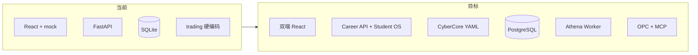

# 技术架构与实现现状

> **文档定位**：**当前权威**的技术栈、系统边界、`webapp` 实现度与对齐摘要；工程详表见 [`08-工程现状与webapp实现详表.md`](./08-工程现状与webapp实现详表.md)。
>
> **历史规划**：[inspire/archive/商业模拟教育平台/02-技术栈与项目结构.md](./inspire/archive/商业模拟教育平台/02-技术栈与项目结构.md)  
> **最后更新**：2026-05-19

---

## 一、目标技术栈

### 1.1 当前（webapp MVP）

| 层 | 技术 |
|----|------|
| 前端 | React 19、TypeScript、Vite 8、Tailwind、Zustand、React Router 7 |
| 后端 | Python 3.13、FastAPI、SQLAlchemy 2、SQLite |
| 认证 | JWT（python-jose）、bcrypt |
| 部署 | Docker Compose、Nginx（前端静态） |

### 1.2 入校试点目标（12 个月内）

| 层 | 技术 |
|----|------|
| 数据库 | **PostgreSQL**（单库多租户 `organization_id`） |
| 缓存/队列 | Redis（会话、任务队列、限流） |
| 迁移 | Alembic |
| 赛制 | **CyberCore** YAML + 结算 Worker |
| AI | 事件驱动 Athena Debrief；OPC LangGraph + MCP |
| 架构形态 | **模块化单体**（一个 FastAPI，按域分包） |

　　数据治理详述见 [inspire/archive/商业模拟教育平台/06-规模化技术栈与数据治理.md](./inspire/archive/商业模拟教育平台/06-规模化技术栈与数据治理.md)。

---

## 二、推荐仓库边界（与 04、09 一致）

```
webapp/
├── backend/
│   ├── app/domains/      # ★ arena · career · cybercore
│   ├── app/games/        # ★ 赛制运行时（trading 等）
│   ├── content/game-configs/   # trading-v1（回合）· trading-v2-rts（即时）
│   └── app/api/          # practice · trading_ws（WebSocket）
├── frontend/             # 学生端 → 未来 apps/web-student
├── organizer-frontend/   # 组织者端（:5174）
packages/                 # ★ 渐进：api-types, cybercore-engine, game-config-schema
contracts/                # OpenAPI、域事件、表归属约定（待建）
```

| 原则 | 说明 |
|------|------|
| **一个库** | 禁止组织者/学生各建 SQLite |
| **一个 API 进程** | 禁止为组织者单独起第二套后端 |
| **竖切交付** | 每 2～3 周：建赛→加入→打完→生涯入账 |

---

## 三、后端域分包（目标 vs 现状）

| 域包 | 代码路径 | 职责 | 现状 |
|------|----------|------|------|
| `identity` | `models/user.py` + `api/auth.py` | 用户、JWT | ✅ |
| `arena` | `domains/arena/` + `api/competitions.py`, `trading.py`, `organizer.py`, `practice.py` | 场次、`match_kind`、房间码、交易对局 | ✅ 域模型已落地；`trading_competition.py` 仅 re-export |
| `cybercore` | `domains/cybercore/` + `content/game-configs/` | 加载赛制 YAML | ✅ `trading-v1`、`trading-v2-rts` |
| `games/trading` | `engine.py` + `rts_*.py` | 回合制结算 + RTS tick/定价/物流/AI | ✅ RTS：调度器单写 tick + WS 广播 |
| `career` | `domains/career/` | `xp_events` 幂等账本、赛后发放 | 🟡 正式赛结束已 `settle_match_rewards`；无独立 `/career/*` |
| `academy` | `api/courses.py` | 课程 | 硬编码列表 |
| `atlas` | `api/wiki.py` | Wiki、图谱 | ✅ |
| `opc` | `api/opc.py` | 一人公司 CRUD | ✅ |

**已挂载路由**（`main.py`）：`/api/v1` → auth, wiki, courses, opc, organizer, competitions, trading, **trading WebSocket**, **practice**。

**浮生记 RTS 实时层**（2026-05-19）：

| 组件 | 路径 | 职责 |
|------|------|------|
| 调度器 | `games/trading/rts_scheduler.py` | 唯一推进 `maybe_advance_rts`；lifespan 恢复进行中场次 |
| WS 枢纽 | `games/trading/rts_ws.py` | 按 `event_id` 房间广播 `tick` / `finished` |
| WS 路由 | `api/trading_ws.py` | `WS /trading/events/{id}/ws?token=`；参赛者或本场组织者可订阅 |
| HTTP | `api/trading.py`、`trading_rts_handlers.py` | `/state`、`/actions` **不推进** tick，只读写 |

**域架构说明**：[`webapp/backend/app/domains/arena/ARCHITECTURE.md`](./webapp/backend/app/domains/arena/ARCHITECTURE.md)

---

## 四、前端结构（学生端）

| 模块 | 路径前缀 | 说明 |
|------|----------|------|
| 生涯 | `/career` | 中枢、开局、复盘 |
| 商赛 | `/games` | 大厅、lobby、play |
| 组织者 | `/organizer/events/create` | 应迁至独立 organizer-app |
| 五域 | `/wiki`, `/courses`, `/quests`, `/achievements` | 部分 mock |
| OPC | `/opc/*` | 公司、员工、任务 UI |

　　完整路由表：[08-](./08-工程现状与webapp实现详表.md) §2.6。

---

## 五、实现度对齐表（规划 vs webapp）

　　对照 [01-平台愿景与产品架构](./01-平台愿景与产品架构.md) 五域 + Career：

| 组件 | 对齐度 | 缺口摘要 |
|------|--------|----------|
| Career Hub | 🟡 45% | 已有 `xp_events` + 正式赛入账；缺 `/career/*` API；前端仍 mock |
| Atlas | 🟡 50% | Wiki/图谱有；掌握度驱动解锁弱 |
| Academy | 🟡 40% | UI 有；进度未回写生涯 |
| Quest | 🟡 35% | 前端页；无 streak 服务 |
| Arena | 🟡 55% | official 可玩；后端 `practice` API + `match_kind` 已区分；学生端练习入口与 AI 对手待接 |
| Credenti | 🔴 20% | mock |
| Athena | 🟡 25% | 模板/mock |
| Demia/Rival | 🔴 15% | 演示 |
| OPC | 🟡 45% | CRUD+UI；无 LangGraph/MCP 生产 |
| Identity | 🟡 40% | 单库 SQLite；无多租户 |

---

## 六、架构演进（当前 → 目标）



| 迁移项 | 参考 |
|--------|------|
| SQLite → PG | `04-` P1、`09-` §5 |
| trading → CyberCore | `商赛界面展示/00-*`、`09-` |
| mock → Career API | `inspire/archive/商业模拟教育平台/03-生涯模式与激励闭环.md` |
| 三套 AI 运行时收敛 | [05-OPC](./05-OPC一人公司-阅读合集.md) §六 Pedagogy OS |

---

## 七、已知工程问题（摘要）

　　完整清单见 [08-](./08-工程现状与webapp实现详表.md) §2.10。

| 优先级 | 问题 |
|--------|------|
| P0 | 学生端未接练习 API；Career 页未读 `xp_events`；`contracts/` 未建 |
| P0（已缓解） | ~~交易赛全硬编码~~ → Arena 域 + `games/trading` + YAML；组织者已有 `organizer-frontend` |
| P1 | courses 硬编码；mock 与 API 混用；无自动化测试 |
| P2 | 死代码页面；README 旧路径 |
| P3 | SQLite、默认 JWT 密钥、无多租户 |

---

## 八、智能架构方向（Pedagogy OS）

　　全平台评审结论（原 OPC `08-`）：对外**一个教练品牌**；对内 **Pedagogy Orchestrator** + 事件驱动 + 临时 Worker + 强制人机检查点。详见 [05-OPC](./05-OPC一人公司-阅读合集.md) §六。

---

> **怎么落地**：近期任务 → [04-](./04-实施路线与里程碑.md) · 分项目协作 → [09-](./09-分项目开发与集成流程.md)
