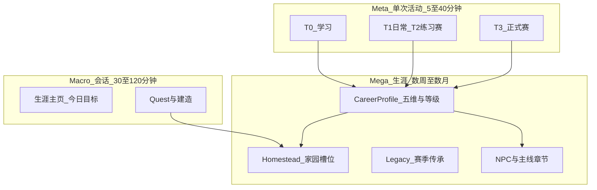
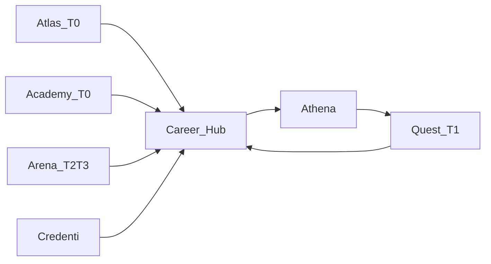

# 生涯模式：大循环、家园与资源经济

> **文档定位**：根目录 **06-** — Career Mode（生涯模式）的**产品权威设计稿**。在 Arena 商赛之外，承载长期成长、拟真小店/家族经营、NPC 与故事线，以及「搜打撤 / Roguelite」式局外积累。
>
> **工程契约**：[webapp/backend/app/domains/career/DESIGN.md](webapp/backend/app/domains/career/DESIGN.md) · **激励数值细则**：[inspire/d/03-生涯模式与激励闭环](inspire/d商业模拟教育平台/03-生涯模式与激励闭环.md)
>
> **关联**：[01-平台愿景](01-平台愿景与产品架构.md) · [02- §5.0](02-赛事体系与双端产品.md) · [07-拟真城市](07-拟真城市与区域模拟-阅读合集.md)（World 终局，与本文 **06-** 不同） · [inspire/81-AI 六支柱](inspire/81-商域AI赋能六支柱全景.md)（支柱①教练 · 支柱②生涯 NPC） · [inspire/64-双循环](inspire/64-双循环与多层级游戏设计理念.md) · [inspire/53-局外成长](inspire/53-游戏化与局外成长设计.md) · [inspire/67-叙事嵌入](inspire/67-叙事在商业模拟中的嵌入方法.md)
>
> **最后更新**：2026-05-24
---

## 一、定位与边界

### 1.1 生涯模式是什么

　　**生涯模式**是学生注册后的**长期成长主线**：把 Atlas（学）、Academy（课）、Quest（日常）、Arena（赛）、Credenti（证）五域产出汇入 **Career Hub**，形成可累积的档案、资源、家园与故事；由 **Athena**（规划）在宏观层串联「本周学什么、练什么、赛什么」。

　　学生心智：从「参加一场比赛」变为「经营自己的商业成长之路」——有小店要升级、有人脉要维护、有赛季要冲刺、有章节要解锁。

### 1.2 与其它子系统的关系

| 系统 | 关系 | 边界 |
|------|------|------|
| **Arena / CyberCore** | 商赛是生涯的 **T2/T3 活动源** | 赛制规则只在 `games/<engine>/` + YAML；Career **只订阅** `match.finished` 等事件，**禁止**写入 `tv_*`、`trading_*` |
| **World（07-）** | 城市母本供 **城市橱窗**槽位、区域足迹、叙事地名 | Phase B 静态引用；Phase C 运行时注入；见 [07-拟真城市](07-拟真城市与区域模拟-阅读合集.md) |
| **OPC（05-）** | **终局出口 A**：真实/半真实首项目 | 不替代生涯主线；OPC 解锁可引用生涯等级，非 Phase B 范围 |
| **拟真城市（07-）** | **终局出口 B**：共享城市 POP | 生涯「城市足迹」与 07 城市 ID 对齐 |

### 1.3 设计硬约束

1. **教育公平**：`match_kind=official` 的局内 **零数值加成**（见 [inspire/53- §4.1](inspire/53-游戏化与局外成长设计.md)）；局外成长以信息、工具、叙事、外观、剧本解锁为主。
2. **搜打撤隐喻**：单次活动结束 = **带回报撤**（XP、物资、图谱、关系度）；失败仍保留部分收益 + 复盘，非 Roguelike 式清零。
3. **一条资源主线**：软货币与 XP 经 Career 账本；禁止各玩法独立通胀货币。
4. **Phase 分工**：完整生涯由 **Phase B + Phase C** 分期落地（见 §九）；Phase A 仅维护商赛闭环与 `xp_events` 入账。

---

## 二、双循环与五层时间尺度

　　理论详述见 [inspire/64-双循环](inspire/64-双循环与多层级游戏设计理念.md)。本平台映射如下：



| 层级 | 名称 | 本平台载体 | 核心问题 |
|------|------|------------|----------|
| Nano/Micro | 小循环 | 测验题、Quest 一步、商赛单轮决策 | 我刚才的操作有反馈吗？ |
| Meta | 对局/单元循环 | 一节课、一局练习、一场正式赛 | 这次活动完整吗？ |
| Macro | 会话循环 | 一次登录：Quest + 1～2 项活动 + 家园升级 | 今天带走了什么？ |
| Mega | 大循环 | 赛季、等级、家园、NPC 章、Legacy | 我 overall 在商业素养上进步了吗？ |

**小循环**负责当下参与感（商赛侧见 64 §2.3 增强策略）；**大循环**负责离局后的意义感（等级、槽位、章节、区域足迹）。

---

## 三、活动分级 T0～T3 与资源经济

### 3.1 活动分级

| 等级 | 类型 | 典型入口 | `match_kind` / 域 | 主要产出 | 主要消耗 | 竞技公平 |
|------|------|----------|-------------------|----------|----------|----------|
| **T0** | 学习 | `/wiki`、`/courses` | — | **信誉**、图谱进度、学识点 | 时间 | 无排名 |
| **T1** | 日常游戏 | `/quests`、打卡、轻量模拟 | Quest | **物资**、XP | — | 个人进度 |
| **T2** | 非正式赛事 | `/games` 日常练习、`POST /practice/*` | `practice` | XP、**建材**、案例卡、NPC 好感 | 每日次数软上限 | 可有信息类局外解锁 |
| **T3** | 正式赛事 | 房间码、组织端控场 | `official` | 高权重 XP、**荣誉**、赛季分、限定叙事 | 教师组织/报名 | 局外仅 cosmetic |

　　与 [02- §5.0](02-赛事体系与双端产品.md) 对照：`game_config_id` 决定**规则包**（如国内/美国赛、练习/正式 YAML）；`match_kind` 决定**办赛流程与 XP 权重**。

### 3.2 资源类型（拟真命名）

| 资源 | 代号 | 主要来源 | 主要用途 | MVP |
|------|------|----------|----------|-----|
| 经验值 | `xp` | 全活动 | 等级、称号 | ✅ 已有 `xp_events` |
| 信誉 | `trust` | T0 | 解锁进阶课程、NPC 初次对话 | Phase B2 |
| 物资 | `supplies` | T1、T2 | **家园槽升级** | Phase B2 |
| 荣誉 | `honor` | T3 | 赛季榜、限定外观、证书条件 | Phase B2 |
| 建材 | `materials` | T2 练习赛结算 | 家园「铺面/仓储」类槽 | Phase B2 |

　　数值与软上限配置规划路径：`content/career/economy.yaml`（**Phase B2** 引入）。MVP 可先 **XP + supplies** 两种。

### 3.3 获取矩阵（摘要，与 03- 对齐）

| 行为 | 等级 | XP | 其它 |
|------|------|-----|------|
| 掌握图谱节点（测验≥70%） | T0 | 30–80 | trust +10 |
| 完成课程单元 | T0 | 50–150 | trust 依成绩 |
| 完成每日 Quest | T1 | 20–40 | supplies +5～15 |
| 完成练习赛对局 | T2 | 100–300（低权重） | materials + 参与即有 |
| 练习赛前三名 | T2 | +100 | materials bonus |
| 正式赛对局 | T3 | 100–300（高权重） | honor + 参与 |
| 正式赛前三名 | T3 | +100 | honor bonus |
| 家园槽升级 | — | — | 消耗 supplies |

### 3.4 消耗与防刷

| 规则 | 说明 |
|------|------|
| 幂等 | 每条奖励 `idempotency_key`（如 `match:{id}:user:{id}:supplies`） |
| 日软上限 | XP 沿用 [d/03- §3.3](inspire/d商业模拟教育平台/03-生涯模式与激励闭环.md)；T2 对局次数可设班级级上限 |
| 失败保底 | T2/T3 末位仍获得 **≥30%** 基础物资与完整复盘卡 |
| 家长/教师 | 可选时长提醒（远期小程序） |

---

## 四、拟真世界观：小店—家族—城市足迹

　　**不用**轻科幻星图为主包装（见 [inspire/53- §5.1](inspire/53-游戏化与局外成长设计.md) 备选）；主叙事为：

- 学生扮演家族中的 **新一代经营者**，从县城/城市小店账本起步；
- 每次商赛 = 一次 **市场开拓任务**（与 [07-](07-拟真城市与区域模拟-阅读合集.md) 城市 ID 一致）；
- 图谱与课程 = **学徒期基本功**；正式赛 = **区域联赛/校际商赛**；
- 失败 = 「本轮亏损但积累了情报与人脉」，而非 Game Over。

　　**区域足迹**：在 Career Profile 记录「曾参与过的 `city_id`」与最佳名次，供主页地图点亮（Phase C 与 **根目录 07-** World 域联动）。

---

## 五、家园 / 家族建造（Homestead）

### 5.1 范围说明

　　**非**完整 SLG/模拟城市；Phase B MVP 为 **3～5 个可升级槽位** 的「家族账本」界面。

| 槽位 ID | 展示名 | 升级效果（仅局外） | 关联 |
|---------|--------|-------------------|------|
| `shopfront` | 铺面 | 解锁更多 Quest 类型 | T1 |
| `ledger` | 账本室 | 复盘报告多 1 项财务解读 | T0/T3 复盘 |
| `network` | 人脉 | NPC 章节解锁门槛降低 | NPC |
| `warehouse` | 仓储 | 练习赛结算 materials +10% | T2 |
| `showcase` | 城市橱窗 | 绑定 1 个 `city_id`，展示 07 城市摘要 | 07- |

### 5.2 升级规则

- 消耗 **supplies**（主）+ 达到等级门槛；
- 每槽 1～5 级；升级仅解锁 **信息 / Quest / 对话 / 外观**，**不改变** Arena 局内数值；
- 升级动画与文案强调「经营改善」而非「战斗力+10」。

### 5.3 Legacy（家族传承）

　　赛季结束时可选保留 **1～2 项 Legacy**（存 `career_profiles.legacy_json`）：

| Legacy 示例 | 效果范围 | 限制 |
|-------------|----------|------|
| 「祖辈人脉」 | 下季 T0 首次 NPC 对话免信誉 | 仅 T0/T1 |
| 「城市旧档」 | 下季在已点亮城市参赛前多看 1 条情报 | 仅信息，T2 练习 |
| 「商赛徽章」 | cosmetic 称号 | 任意 |

　　**禁止** Legacy 增加正式赛（T3）局内数值。

---

## 六、NPC 与故事线

### 6.1 MVP NPC  roster（占位）

| NPC ID | 角色 | 叙事功能 | 关系度来源 |
|--------|------|----------|------------|
| `mentor_chen` | 班主任/商赛导师 | 周计划、开赛提醒 | T0 完成度、T3 参与 |
| `supplier_li` | 供应链前辈 | 解释成本与库存思维 | T2 练习、图谱节点 |
| `peer_wang` | 同班搭档 | 协作 Quest、社交 | T1、班级榜 |
| `bureau_zhao` | 城市工商联络人 | 城市政策/合规小故事 | `showcase` 槽、07 城市 |
| `mirror_self` | 复盘化身 | 赛后对话，引用真实决策数据 | T2/T3 结算 |

### 6.2 故事结构

- **主线**：每学期 6～8 章（`story_progress`），章门槛 = 等级 + 槽位 + 关键 Quest；
- **局内叙事**：对局结束生成「决策生长」摘要（[inspire/67-](inspire/67-叙事在商业模拟中的嵌入方法.md)），不编造与数据矛盾的剧情；
- **MVP**：静态对话树 JSON + 解锁条件；**不做** LLM 自由对话（Phase E 可选增强）。

### 6.3 触发器示例（配置化）

```yaml
# content/career/story/chapter_01.yaml（规划）
unlock:
  all:
    - career_level_gte: 2
    - homestead_slot_gte: { slot: shopfront, level: 1 }
    - event: match.finished
      match_kind: practice
      count_gte: 1
```

---

## 七、搜打撤 / Roguelite 在教育产品中的转译

| 游戏概念 | 生涯模式转译 |
|----------|----------------|
| 进局 | 选课 / 点练习 / 输入房间码 |
| 局内 | 商赛轮次、Quest 抉择 |
| 失败 | 排名靠后、测验未过 → 仍发保底物资 + Athena 复盘 |
| 带回 | `SettlementBundle` → `xp_events` + `resource_ledger` |
| Meta 成长 | 家园槽、图谱、称号、NPC 章 |
| Build 多样性 | Persona 推荐路径 × 不同 `game_config_id` |

**SettlementBundle**（概念对象，Phase B2）：

```yaml
settlement_bundle:
  user_id: int
  source_type: arena | academy | quest | graph
  source_id: string          # 幂等键前缀
  match_kind: practice | official | null
  xp: int
  resources: { supplies: 12, honor: 0, materials: 3 }
  narrative_hooks: []        # 供 67 叙事模板填充
  competency_deltas: {}      # 五维微调
```

---

## 八、与五域对接



| 域 | 事件（规划） | `source_type` |
|----|--------------|---------------|
| Atlas | `graph.node.mastered` | `graph` |
| Academy | `academy.unit.completed` | `academy` |
| Quest | `quest.completed` | `quest` |
| Arena | `match.official.finished` / `match.practice.finished` | `arena` |
| Homestead | `homestead.slot.upgraded` | `homestead` |
| Story | `story.chapter.unlocked` | `story` |

　　现有实现：`settle_match_rewards`（Arena → XP）。Phase B2 扩展为写入 `resource_ledger` 并 emit `career.settlement.applied`。

---

## 九、分期：Phase B 与 Phase C

　　完整生涯模式跨 **Phase B（日常体验 + 家园 MVP）** 与 **Phase C（自我认知 + World 联动）**。

### Phase B（B1～B5）

| 子阶段 | 交付 | 验收 |
|--------|------|------|
| **B1** | `career_profiles` + `GET /career/profile` + 前端读真 XP | 生涯页无 mock XP |
| **B2** | `resource_ledger` + `economy.yaml` + 赛后果账扩展 | 练习赛结束获得 supplies |
| **B3** | 5 家园槽 + upgrade API + UI Tab | 消耗物资升 1 级槽 |
| **B4** | NPC 静态配置 + 关系度 + 2 章主线文案 | 完成 1 章解锁对话 |
| **B5** | Quest 服务 + Athena 周计划（规则层） | 今日推荐可点透 |

### Phase C（在 B 之后）

| 工作项 | 验收 |
|--------|------|
| Persona 测评 + 赛制推荐 | 与 [inspire/f/15-性格分类框架](inspire/f早期调研/15-性格分类框架-理论综述.md) 对齐 |
| 五维雷达真实化 | 来自 xp + 赛制标签 + 练习数据 |
| World 域 MVP | 城市快照注入；区域足迹地图 |
| Legacy 赛季结算 | 可选 1～2 项传承 |
| LangGraph Athena | 复盘/路径升级（03- §八） |

### 明确不做（MVP）

- 完整 SLG 地图、PvP 家园掠夺；
- 正式赛局内数值加成；
- NPC 无约束 LLM 聊天；
- 独立生涯 App / 第二数据库。

---

## 十、数据模型与 API（摘要）

　　完整表结构、路由归属、域事件见 [career/DESIGN.md](webapp/backend/app/domains/career/DESIGN.md)。

| API（规划） | 说明 |
|-------------|------|
| `POST /api/v1/career/start` | 开启生涯 |
| `GET /api/v1/career/profile` | 主页聚合 |
| `GET /api/v1/career/homestead` | 槽位状态 |
| `POST /api/v1/career/homestead/upgrade` | 升级 |
| `GET /api/v1/career/npcs` | NPC 与关系 |

---

## 十一、用户旅程与验收

### 11.1 第 1 天（小白）

1. 注册 → `POST /career/start` → 获得 100 XP、启程者徽章、**铺面 0 级**；
2. Athena 推荐：1 个图谱节点 + 1 局 TechVenture **练习**；
3. 完成练习 → 带回 XP + materials → 升级铺面至 1 级 → 解锁 `supplier_li` 首句对话；
4. 生涯主页展示：「今日带走：物资 +12、商业学徒 Lv.2」。

### 11.2 第 30 天（进阶）

1. 五维雷达初形；`showcase` 绑定南京；参与 1 场 **正式赛**（T3）获 honor；
2. 主线第 2 章解锁；Legacy 预览（季末）；
3. 班级成长榜有名次，但竞技榜仅计 T3。

### 11.3 文档验收清单

- [x] 小循环 / 大循环对应到具体页面与活动
- [x] T0～T3 产出、消耗、公平性清晰
- [x] MVP 含家园槽 + NPC 占位；列出明确不做项
- [x] 与 Arena 域边界、现有 `xp_events` 一致

---

## 十二、维护说明

| 变更类型 | 同步文档 |
|----------|----------|
| 激励数值 | 本文件 §3 + [d/03-](inspire/d商业模拟教育平台/03-生涯模式与激励闭环.md) |
| 表/API | [career/DESIGN.md](webapp/backend/app/domains/career/DESIGN.md) + [08-](08-工程现状与webapp实现详表.md) §2.7 |
| Phase 排期 | [04-](04-实施路线与里程碑.md) Phase B/C |
| 商赛关系 | [02-](02-赛事体系与双端产品.md) §5 |

---

*激励数值细则*：[inspire/d/03-生涯模式与激励闭环](inspire/d商业模拟教育平台/03-生涯模式与激励闭环.md)
