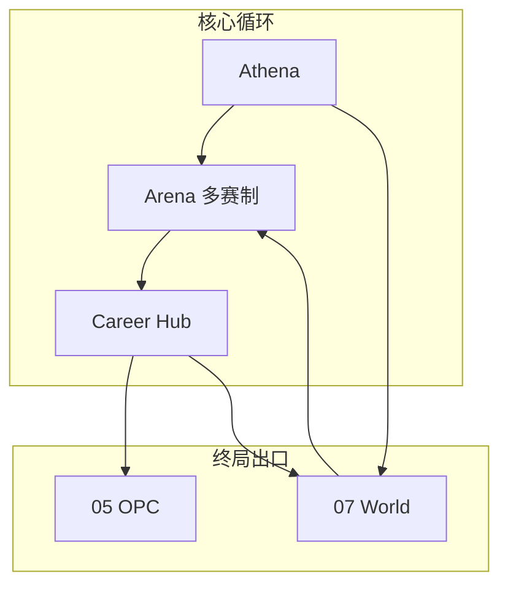
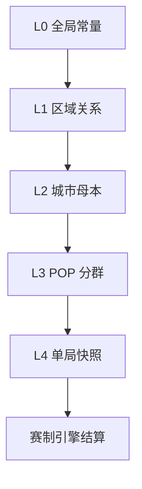
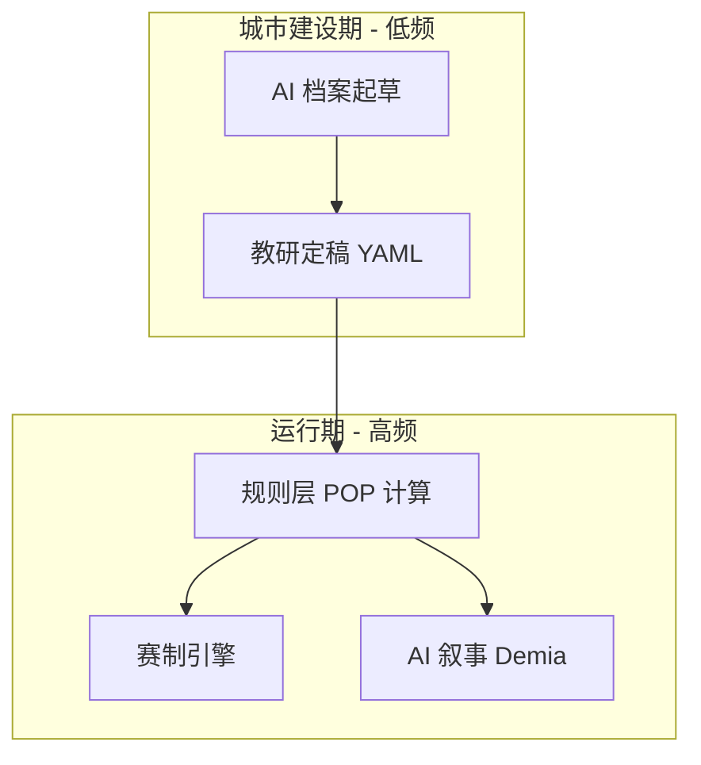

# 拟真城市与区域模拟 · 阅读合集

> **文档定位**：拟真城市（World Simulation）的**根目录权威阅读版**——与 [05-OPC一人公司](./05-OPC一人公司-阅读合集.md) 并列，同为平台**终局出口路径**之一；合并竞品研判、可借鉴对象、整体思路、**数据颗粒度 / POP 设计 / 数据整理 / AI 建设分工**（§六～§九）与 Phase 实施路径。产品域模型摘要见 [inspire/75-](./inspire/75-拟真城市世界观设计.md)。
>
> **蓝图定位**：Phase A 尾声启动规划与占位；**运行时 `domains/world/` 自 Phase B 起渐进落地**。详见 [04-实施路线与蓝图](./04-实施路线与里程碑.md)。
>
> **最后更新**：2026-05-27

---

## 目录

1. [拟真城市是什么](#一拟真城市是什么)
2. [与主平台的关系（双终局出口）](#二与主平台的关系双终局出口)
3. [近似产品与思路对照](#三近似产品与思路对照)
4. [可借鉴对象](#四可借鉴对象)
5. [我们的整体思路](#五我们的整体思路)
6. [数据颗粒度：五层模型](#六数据颗粒度五层模型)
7. [POP 设计思路（教育向）](#七pop-设计思路教育向)
8. [数据收集、校准与整理](#八数据收集校准与整理)
9. [AI 在拟真城市建设中的作用](#九ai-在拟真城市建设中的作用)
10. [实施路径（与 Phase 对齐）](#十实施路径与-phase-对齐)
11. [与 OPC 的协同](#十一与-opc-的协同)
12. [风险、边界与 Phase A 纪律](#十二风险边界与-phase-a-纪律)
13. [延伸阅读索引](#十三延伸阅读索引)

---

## 一、拟真城市是什么

> **让若干真实中国城市成为平台内统一的商业模拟世界；用类 P 社 POP 的人口-消费-产业-政策模型驱动区域变化，使全部赛制共享同一地理-经济本体，并支撑教学、研究与政策情景讨论。**

| 概念 | 说明 |
|------|------|
| **拟真城市** | 非科幻包装，而是**真实城名 + 人文地理 + 产业结构 + 客群（POP）+ 交通区位 + 可选政策包**的可玩化载体 |
| **POP（教育向）** | 人口分群各有需求向量；规则层算份额/满意度/迁移；Demia 可选叙事层**不得改写数值** |
| **共享世界层** | 浮生记运货的成都、TechVenture 做品牌的南京、未来宏观沙盘调节的长三角节点——同一 `city_id` 的不同**商业切面** |
| **平台存在性价值** | 从「多赛制工具箱」升级为「可演化的区域商业模拟器」，具备课题、试点校与研究机构合作的长期空间 |

### 1.1 核心价值（为何值得做）

| 维度 | 价值 |
|------|------|
| **跨赛制学习成本** | 学生理解一座城后，换赛制不必重学参数语义 |
| **真实世界对接** | 城市档案可锚定公开统计与产业报告；讨论「若政策 X」有结构化载体 |
| **教学与研究** | K12～大学：城市商业画像、区域比较；高校：政策情景简报（**教育模拟**，非经济预测） |
| **人文地理素养** | 历史、区位、交通、中国产业文化进入同一学习叙事 |

**边界声明**：对外合作须标明教学/研究用途、参数校准流程与免责声明；不替代专业智库预测。

---

## 二、与主平台的关系（双终局出口）

　　商域 BizSim Edu 在 [01-平台愿景](./01-平台愿景与产品架构.md) 主线上，经历 Arena、智能体教练、生涯、图谱、课程等阶段后，形成**两条并列的终局深化路径**：

```
Career Hub（统一档案 · Athena）
        ├──────────────────────┬──────────────────────┐
        ▼                      ▼                      ▼
   05 OPC 一人公司        07 拟真城市 World      Credenti / 外部合作
   真实/半真实首项目      区域模拟 · 政策推演      认证 · 研究导出
```

| 出口 | 回答的问题 | 典型产出 |
|------|------------|----------|
| **OPC（05-）** | 我能否像创业者一样交付一个项目？ | BMC、MVP、Gateway 验收 |
| **拟真城市（07-）** | 我能否理解区域如何因人、产、策而变？ | 跨赛制城市掌握度、政策情景报告、研究型日志 |

| 原则 | 说明 |
|------|------|
| 数据不孤岛 | World 提供城市快照；Arena 单局结算；Career 记录区域足迹 |
| 赛制不克隆 | 新赛制引用 `content/world/cities/`，禁止再复制内联城市表 |
| Phase 门禁 | Phase A **禁止** `domains/world/` 运行时；见 [blueprint-coding](./.cursor/rules/blueprint-coding.mdc) |



---

## 三、近似产品与思路对照

　　市场上**没有**单一产品完整覆盖「真实中国城市 + POP + 多赛制共享 + K12～大学 + 政策研究导出」。以下为**局部相近**赛道与缺口（详研见 [inspire/f早期调研/14-商赛类型与赛制资料库](./inspire/f早期调研/14-商赛类型与赛制资料库.md)）。

### 3.1 四类对照总表

| 类型 | 代表 | 相近点 | 与我们的缺口 |
|------|------|--------|--------------|
| **企业/战略商赛** | Cesim Global Challenge / SimBrand、iBizSim、商道 PREMKING、Markstrat | 多期决策、多区域市场、消费者模型；国内本土化强 | 中心是**虚拟公司**，非城市一等公民；区域多为市场切片，非 POP+产业+交通统一本体 |
| **城市/规划教学** | eCITY、SmartCity (EcoSim)、UrbanPlan、iPlan | 城市多维管理、土地与可持续、利益相关者 | 偏规划/公民教育，**非**商赛矩阵；不与物流赛、品牌赛共用城市母本 |
| **宏观/系统动力学** | Wharton MacroSim、Vensim/Stella、Forio Simulate | 政策→经济变量；区域 SD 研究 | 弱游戏化、弱多赛制；难承载日常练习与组织者控场 |
| **机制参考（非教育平台）** | Victoria 3 POP、Cities: Skylines | 人群、就业、产销、交通直觉 | 商业游戏，无赛事双端、无中国商赛生态 |

### 3.2 差异化一句话（对外沟通）

> **不是又一个 Cesim，而是「中国城市商业素养的共享模拟世界」——商赛是切口，区域 POP 与政策情景是纵深。**

### 3.3 能力重合度示意

| 能力维度 | Cesim/商道 | 城市教学模拟 | SD/政策工具 | 本平台 World 规划 |
|----------|------------|--------------|-------------|-------------------|
| 多赛制共享同一城市 | 弱 | 中（单一体裁） | 弱 | **强（目标）** |
| 真实中国城市档案 | 中 | 中 | 可定制 | **强（目标）** |
| POP 规则层 | 中 | 弱 | 中 | **强（目标）** |
| K12～日常练习 | 中 | 中 | 弱 | **强（已有 Arena）** |
| 政策/研究导出 | 弱 | 弱 | **强** | 中→强（Phase E～F） |

---

## 四、可借鉴对象

### 4.1 机制与模型

| 借鉴源 | 借鉴什么 | 落点 |
|--------|----------|------|
| **Victoria 3 / Cities** | POP 分群、需求向量、产销与交通直觉 | World POP 规则层；[inspire/d/05-AI深度融合设计](./inspire/d商业模拟教育平台/05-AI深度融合设计.md) §三 Demia |
| **Cesim SimBrand / Global Challenge** | 区域市场差异、消费者响应、汇率与制度 | 多区域赛制投影；十赛制蓝图 |
| **iBizSim / 商道** | 国内大赛运营、企业决策全流程、本土化场景 | 组织者端与赛事节奏；非照搬公司中心架构 |
| **系统动力学 / ABM** | 存量-流量、拥挤调节、涌现 | [inspire/70-系统动力学与复杂系统模拟](./inspire/70-系统动力学与复杂系统模拟.md)；Phase E～F |
| **现有 webapp 三引擎** | RTS `production/consumption`；TV `consumers/scale`；v1 城市类型 | Phase B 收敛为统一 `city_id` 母本 |

### 4.2 内容与真实连接

| 借鉴源 | 借鉴什么 | 落点 |
|--------|----------|------|
| [inspire/60-从课堂到商业](./inspire/60-从课堂到商业-真实世界连接生态.md) | 城市经济数据接口、新闻联动事件、企业挑战赛 | Phase C～F 数据锚点与定制赛 |
| [inspire/52-商业课程内容与经济学模型](./inspire/52-商业课程内容与经济学模型.md) | 城市参数分层 Global/City/Route/Event/Consumer | 母本 Schema 字段设计 |
| [inspire/63-全球化与跨文化](./inspire/63-全球化与跨文化商业素养培育.md) | 多 `citySet`、区域文化包 | 远期国际城扩展 |

### 4.3 工程与协作

| 借鉴源 | 借鉴什么 | 落点 |
|--------|----------|------|
| CyberCore 声明式赛制 | 赛制 YAML 引用而非硬编码 | `game-configs` → `$ref` world/cities |
| [09-分项目开发](./09-分项目开发与集成流程.md) | 契约先行、竖切、会话边界 | World 域 API 契约（Phase B） |
| OPC 域分包纪律 | 单表主人、跨域 API | `domains/world/` 表归属 |

---

## 五、我们的整体思路

### 5.1 三层结构

| 层 | 内容 | 变更频率 |
|----|------|----------|
| **城市母本** | `city_id`、POP、产业、消费、交通、档案、政策情景包 | 学期级校准 |
| **赛制投影** | 各引擎只读母本子集（物流/份额/宏观等） | 随赛制包版本 |
| **单局快照** | Arena 开局注入；默认不跨局写回（保公平） | 每场赛事 |

### 5.2 城市本体（摘要）

　　完整字段见 [inspire/75-](./inspire/75-拟真城市世界观设计.md) §四。核心：**身份 · POP · 产业 · 消费 · 地理交通 · 历史文化档案 · 可选政策环境**。

### 5.3 学生体验原则

- 同一城市，不同赛制 = 不同**商业切面**（物流节点 / 品牌战场 / 政策对象…）
- 城市档案页：人口结构、主导产业、交通、延伸阅读（教师可选）
- **初期不强制**跨赛制状态联动；全服时间线 Phase C+ 可选

### 5.4 当前工程碎片（Phase A 现状）

| 引擎 | 城市表达 | 统一 ID |
|------|----------|---------|
| trading-v1 | 京城/沪市等虚构简称 + type | 待对照 [world/cities/README](./webapp/backend/content/world/cities/README.md) |
| trading-v2-rts | prod/cons/demand_profile（最接近母本） | 同上 |
| techventure-v1 | 南京/合肥/杭州 + consumers | 同上 |

　　三套 YAML **互不引用**；World 域**未实现**。Phase A 只做对照表与占位，不改结算。

---

## 六、数据颗粒度：五层模型

　　拟真城市不是「把统计局表格搬进游戏」，而是把真实世界**压缩成可教、可玩、可复现**的参数体系。颗粒度设计遵循一条硬规则：**越往下越接近对局、越不可被 LLM 随意改写；越往上越稳定、越适合教研校准。**

### 6.1 五层总览

| 层级 | 载体 | 典型颗粒度 | 变更频率 | 写入方 | 读取方 |
|------|------|------------|----------|--------|--------|
| **L0 全局** | `content/world/global.yaml` | 时代基调、随机性 σ、默认货币单位 | 年/大版本 | 平台教研 | 全部引擎投影 |
| **L1 区域** | `content/world/regions/*.yaml` | 城市群、交通走廊、邻接成本矩阵 | 学期 | 教研 + 半自动整理 | 宏观沙盘、跨城赛制 |
| **L2 城市母本** | `content/world/cities/<city_id>.yaml` | 产业/消费/枢纽/POP **基线**、档案文本 | 学期校准 | 人工定稿（AI 可起草） | CyberCore `$ref`、档案页 |
| **L3 POP 分群** | 母本内 `pop_segments[]` | 需求向量、相对规模、波动系数 | 学期（与 L2 同批） | 规则定义 + 教研审核 | TV `consumers`、RTS `demand_profile`、Demia |
| **L4 单局快照** | `world_snapshots`（Phase C+ 表） | 开赛时 POP/政策/事件的 **拷贝** | 每场赛事 | Arena 开局注入 | `games/*` **只读** |



### 6.2 各层「要细到什么程度」

| 层级 | Phase B 目标颗粒度 | 刻意不做（避免过度） |
|------|-------------------|----------------------|
| **L0** | 10 条以内全局旋钮（如默认 σ、教学难度档） | 完整宏观经济联立方程 |
| **L1** | 1～2 个区域包（如长三角）+ 邻城 `{from,to,cost}` | 全国路网实时仿真 |
| **L2** | 每城：3～5 个主导产业标签、10～20 个数值字段、500～1500 字结构化档案 | 逐街道、逐企业复刻 |
| **L3** | 每城 **3～5 个** POP（对齐现有 geek/pragmatic/trendy 或职业向扩展） | Victoria 3 级职业-宗教-文化全矩阵 |
| **L4** | 仅拷贝 L2/L3 + 可选政策包 ID；禁止引擎回写基线 | 跨局持久化改写母本 |

### 6.3 与现有三引擎字段的映射（收敛目标）

| 母本字段（L2/L3） | trading-v1 | trading-v2-rts | techventure-v1 |
|-------------------|------------|----------------|------------------|
| `city_id` | 映射虚构简称 → canonical | 同左 | 南京/合肥/杭州 → canonical |
| `market.scale` | 市场规模直觉 | — | `cities.*.scale` |
| `industry.production[]` | — | `production` 矩阵 | — |
| `industry.consumption[]` | — | `consumption` + `demand_profile` | — |
| `pop_segments[].weights` | 品类偏好 | `demand_profile` 权重 | `consumers` 比例 |
| `geo.logistics_factor` | — | 运价/在途系数 | — |
| `pop_segments[].route_eta` | — | — | `eta_fit` / `eta_show` 等 |

　　**Phase B 验收**：新建赛制 YAML **禁止**再内联完整 `cities:` 块；只保留投影系数与 `$ref: world/cities/nanjing.yaml`。

### 6.4 数据血缘（provenance）字段

　　每个城市母本建议携带可追溯元数据（便于教研审查与对外合作）：

```yaml
meta:
  city_id: nanjing
  display_name: 南京市
  calibrated_at: "2026-09-01"
  calibrated_by: "教研组 + 半自动流水线"
  confidence: teaching_grade   # teaching_grade | research_grade
  data_sources:
    - name: 国家统计局 · 南京统计年鉴（公开摘要）
      url: "https://..."
      fields_used: [常住人口, 第三产业占比]
    - name: 平台教研 · 城市商业档案试点稿
      fields_used: [主导产业叙事, POP 权重区间]
  disclaimer: 教学模拟参数，非经济预测
```

---

## 七、POP 设计思路（教育向）

### 7.1 设计目标

| 目标 | 说明 |
|------|------|
| **可教** | 学生能说出「这座城哪类人群更重、为何影响品牌/物流决策」 |
| **可玩** | 规则层可算份额/满意度，驱动赛制反馈（非纯文案） |
| **可控** | 参数有上下界；正式赛不被隐藏 POP 加成破坏公平 |
| **可扩展** | `pop_id` 全平台唯一；Demia 叙事与 World 数值共用命名空间 |

### 7.2 与 P 社 POP 的关系（借鉴而非复刻）

　　借鉴 [Victoria 3](https://www.paradoxinteractive.com/) / Cities 系列直觉：**市场由多元人群构成，人群有需求向量、会对价格/政策/竞争做出反应**。教育向简化如下：

| Victoria / Cities 完整度 | 本平台 Phase B～E |
|--------------------------|-------------------|
| 职业/文化/宗教多维 POP | **3～5 个教学分群**（如 pragmatic / geek / trendy） |
| 就业与产业链全自动 | **产业标签 + 静态产出/消费矩阵**（RTS 已部分具备） |
| 迁移与激进派冲突 | **满意度 + 可选迁移倾向**（Phase E 存量-流量简化） |
| 实时政治博弈 | **可选政策情景包**（教师开关，默认中性） |

### 7.3 `pop_id` 命名与结构

**命名**：`{city_id}.{segment}`，例如 `nanjing.pragmatic`、`chengdu.trendy`。

**单条 POP 建议字段**（母本 L3）：

| 字段 | 类型 | 用途 |
|------|------|------|
| `pop_id` | string | 全平台唯一键 |
| `display_name` | string | 界面与 Demia 叙事 |
| `segment_tags` | string[] | 教学标签（price_sensitive, eco_aware…） |
| `base_size` | float | 相对规模权重（同城归一） |
| `needs_vector` | object | 规则层：price / quality / brand / sustainability 等 0～1 |
| `volatility` | float | 情绪波动幅度上限（教育向调低） |
| `engine_projection` | object | 投影到 TV `consumers`、RTS `demand_profile` 的映射系数 |

**示例（与 TechVenture 对齐）**：

```yaml
pop_segments:
  - pop_id: nanjing.pragmatic
    display_name: 务实主流客群
    base_size: 0.58
    needs_vector: { tech: 0.35, fit: 0.55, show: 0.10 }
    engine_projection:
      techventure:
        consumer_key: pragmatic
        eta_fit: 1.10
```

### 7.4 双轨计算：规则层 vs 叙事层（硬边界）

| 轨道 | 职责 | 技术 | Phase |
|------|------|------|-------|
| **规则层** | 计算 `demand_share`、`satisfaction_delta`、`migration_tendency` | 矩阵/公式（CyberCore 或 World 服务） | B 起 |
| **叙事层** | 舆情标题、群体反应短文案、档案延伸阅读 | LLM + JSON Schema；**不得改写数值符号** | E 起（Demia 深度） |
| **校准层** | 校验叙事与规则层输出同向；失败则降级模板 | 输出校验器 | E |

　　与 [inspire/d/05-AI深度融合设计](./inspire/d商业模拟教育平台/05-AI深度融合设计.md) §三一致：**Demia 消费 World 的 POP 基线**；叙事服从规则层，不是反过来。

### 7.5 正式赛公平性

| 规则 | 说明 |
|------|------|
| 基线一致 | 同 `game_config_id` + 同 `city_id` 的 POP 基线对所有队伍相同 |
| 快照隔离 | 单局仅读 L4 快照；禁止局内写回 L2/L3 母本 |
| 无学生专属加成 | POP 不对特定 `user_id` 做隐藏 buff（生涯解锁仅信息类，见 [06-生涯模式](./06-生涯模式-大循环家园与资源经济.md)） |
| 种子化 | 规则层随机扰动须 `seed` 可复现（练习/复盘用） |

---

## 八、数据收集、校准与整理

### 8.1 总体流程（教研主导，AI 辅助）


### 8.2 数据来源分层

| 层级 | 来源类型 | 示例 | 用途 |
|------|----------|------|------|
| **A 类（硬锚点）** | 政府/国际机构公开统计 | 国家统计局、地方统计公报、世界银行 | 人口规模、三产结构、社零等 **区间校验** |
| **B 类（软锚点）** | 产业报告、交通枢纽公开信息 | 高新区名录、港口吞吐量新闻稿 | 主导产业、枢纽等级 |
| **C 类（教学创作）** | 教研撰写、案例库 | `inspire/a/` 主题稿、城市商业档案试点 | 档案文本、课堂讨论题 |
| **D 类（平台内生）** | 对局聚合（脱敏） | 练习赛决策分布 | **不调母本**，仅用于报告与下季校准参考 |

　　**原则**：A/B 类定「数量级与方向」；C 类定「叙事与课堂可讲性」；**禁止**把未注明来源的 AI 生成数字直接标为统计事实。

### 8.3 从统计到游戏参数的映射方法

　　对齐 [inspire/52-商业课程内容与经济学模型](./inspire/52-商业课程内容与经济学模型.md) §4.1 参数分层：

| 统计概念 | 映射到母本 | 映射方式（教学级） |
|----------|------------|-------------------|
| 常住人口 | `population.total` | 对数缩放 → `market.scale` 参考 |
| 第三产业占比 | `industry.services_share` | 0～1 归一 |
| 社零 / 人均消费 | `consumption.intensity` | 分档：低/中/高 |
| 交通枢纽（港口/机场/高铁） | `geo.hub_tier` | 枚举 1～5 + `logistics_factor` |
| 年龄结构（若有） | `pop_segments[].base_size` | 粗分为 2～3 段，非逐岁 |

　　**不做**：用单一 GDP 数字直接驱动对局内价格；**要做**：用多指标交叉验证后，由教研给出「这座城市偏制造/偏消费/偏科创」的 **标签 + 权重区间**。

### 8.4 整理交付物（Phase B 清单）

| 交付物 | 路径 | 负责人 |
|--------|------|--------|
| 字段 Schema | `content/world/cities/_schema.yaml` | 工程 |
| 城市母本 | `content/world/cities/<city_id>.yaml` | 教研 + AI 起草 |
| ID 对照表 | `content/world/cities/README.md` | 工程 |
| 校准记录 | 母本 `meta.calibrated_*` + 变更日志 | 教研 |
| 投影回归用例 | `tests/world/` 或脚本快照 | 工程 |
| 城市档案页（可选） | 前端只读 `GET /world/cities` | 产品 |

### 8.5 质量控制检查表

- [ ] 每个 `city_id` 在 README 对照表中有且仅有一条 canonical 记录
- [ ] 每个 POP 的 `base_size` 同城之和为 1（±0.01）
- [ ] `needs_vector` 各维 0～1，无负值
- [ ] `meta.data_sources` 至少 1 条 A/B 类来源或明确标注为 C 类创作
- [ ] 新赛制 YAML 已改为 `$ref` 母本，无重复 `cities:` 大块
- [ ] Demia/Athena 文案引用城市事实时，可追溯到母本字段名

---

## 九、AI 在拟真城市建设中的作用

　　对齐 [77-商域 AI 作用全景](./inspire/77-商域AI草案.md)（规则优先、LLM 渐进）与 [78-实施指南](./inspire/78-智能体技术路线批判与VibeCoding实施指南.md)（B0 数据真身、C- 最小 LLM）：**拟真城市建设阶段，AI 是生产力与起草器，不是数值真相源。**

### 9.1 分阶段：AI 做什么 / 不做什么

| 阶段 | AI **可以做** | AI **禁止做** | 人力必须 retained |
|------|---------------|---------------|-------------------|
| **A 尾声** | 整理 ID 对照草案、竞品摘要、Schema 草稿 | 自动加载母本进引擎改结算 | 架构评审 |
| **B** | 根据公开资料生成**城市商业档案初稿**；建议 POP 权重**区间**；表格→YAML 字段映射辅助 | 未经审核将参数写入 `game-configs`；声称「预测 GDP」 | 教研定稿、数值签字 |
| **B+** | RAG 问答「为何南京 pragmatic 高」（索引母本+知识卡片） | 赛中实时改 POP | 教师课堂把关 |
| **C** | 开局快照说明文案；Career 区域掌握度叙事 | 跨局写回母本 | World API 契约 |
| **E** | Demia **叙事层**：舆情 feed、政策情景说明（规则层输出后） | 改写 `demand_share` / `satisfaction_delta` 符号 | 校准层校验 |
| **F** | 脱敏日志摘要、研究型简报**润色** | 对外发布未审参数包 | 法务/教研免责声明 |

### 9.2 三条 AI 工作流（推荐落地顺序）

**工作流 1 · 城市档案起草（Phase B，低 Token）**

```
公开资料 URL/摘录 → LLM 生成结构化档案（产业/交通/文化要点）
→ 人工删改 → 写入 cities/*.yaml 的 narrative 字段（非数值）
```

**工作流 2 · 参数区间建议（Phase B，人工确认）**

```
统计锚点 JSON → LLM 输出「建议 scale 档：中」「pragmatic 0.5～0.65」
→ 教研选定 → 人工填入 needs_vector（禁止 LLM 直接 commit 数值）
```

**工作流 3 · Demia 叙事（Phase E，规则层之后）**

```
规则层输出 {pop_id, satisfaction_delta, demand_share}
→ LLM 仅生成 title + body（Schema）
→ 校准层：符号一致检查 → 失败则模板
```

### 9.3 AI 与 Demia / Athena / 赛制引擎的分工



| 组件 | 读 World | 写 World | LLM |
|------|----------|----------|-----|
| CyberCore 引擎 | L4 快照只读 | 禁止 | 禁止 |
| Demia | L3 基线 + 规则层输出 | 禁止 | 叙事层 only |
| Athena 复盘 | 城市档案 + 对局事实 | 禁止 | C- 润色 |
| 建设流水线 | A/B 类资料 | L2/L3 定稿 | 起草辅助 |

### 9.4 成本与稳定性策略

| 策略 | 说明 |
|------|------|
| **建设期集中调用** | 城市母本每学期校准 1 次，非每局调用 LLM |
| **运行期零 Token 默认** | Phase B～D：POP 规则层 + 模板舆情；LLM 叙事可关 |
| **降级链** | LLM 失败 → 模板 → 纯数值面板（无舆情 feed） |
| **可观测** | 建设任务保留 `trace_id`；母本 `meta.calibrated_at` 版本化 |

### 9.5 与 80 号「角色 IP」文档的边界

　　[80-角色 IP 与可成长规则 NPC](./inspire/80-角色IP复用与可成长规则NPC-Agent框架.md) 关注 **Career NPC / 规则 bot 的人格与对话**；拟真城市关注 **地理-经济本体与 POP 基线**。全站 **六支柱 AI 框架**见 [81-](./inspire/81-商域AI赋能六支柱全景.md)。交集仅在于：Athena/Demia 引用 `city_id` 与 `pop_id` 时，须读 World 母本，不得编造与母本矛盾的产业或人口结构。

---

## 十、实施路径（与 Phase 对齐）

> 与 [04-](./04-实施路线与里程碑.md)「拟真城市跨 Phase 摘要」一致；此处为阅读版 checklist。

### Phase A 尾声（当前）

| 项 | 状态 |
|----|------|
| 根目录 **07-** 阅读合集 + inspire/75 详设 | 本文档 |
| `content/world/cities/` 占位与 ID 对照 | README |
| 三份 game-config 标注「待引用 world」 | 可选注释 |
| **禁止** 建 `domains/world/`、跨局持久化、改引擎结算 | 强制 |

### Phase B

- `content/world/cities/_schema.yaml` + ≥6 城母本（含 `meta.provenance`、L3 `pop_segments`）
- 新赛制 YAML 从母本 `$ref` 引用（见本文 §六～§八）
- POP `pop_id` 与 TechVenture `consumers` / RTS `demand_profile` 投影对齐
- 城市档案起草流水线（AI 辅助 + 教研定稿，**禁止** AI 直写未审数值）
- 可选 `GET /world/cities` 只读 API

### Phase C～D

- `domains/world/` + L4 开局快照注入
- Career 区域掌握度；Atlas 城市-知识点挂载
- RAG 城市档案问答（B+，索引母本 + 知识卡片）
- 可选赛季城市时间线

### Phase E～F

- POP 动态演化（存量-流量简化，仍规则层优先）
- Demia 叙事层上线（规则层输出 → LLM 舆情，可关）
- 政策情景包；脱敏研究导出
- 与试点校/研究机构合作沙盘

---

## 十一、与 OPC 的协同

| 场景 | World | OPC |
|------|-------|-----|
| 学生路径 | 商赛积累区域认知 → 深度政策/产业课题 | 生涯达标 → 首项目孵化 |
| 数据 | `city_id`、区域 XP、模拟日志 | 公司、员工、任务、Gateway |
| 主题交叉 | OPC IDEATE 可选「基于某城产业」选题 | 不替代 World 规则层 |
| Phase | B～F 渐进 | E 主力 |

　　二者**并列终局**，非互斥：学生可偏「区域研究者」或「创业者」，也可在生涯后期叠加。

---

## 十二、风险、边界与 Phase A 纪律

| 风险 | 缓解 |
|------|------|
| A 阶段抢跑 World 运行时 | blueprint-coding §7；默认 Phase A |
| 跨局联动破坏竞技公平 | 单局快照默认；全服时间线可关 |
| 真实数据校准成本 | 6～10 城教学级参数 + 公开数据锚点 |
| 政策合作敏感 | 教学模拟声明 + 人工审查 |
| 虚构地名与真城混用 | 新内容仅用 canonical `city_id` |
| AI 编造统计数字 | 数值人工定稿；`meta.data_sources` 强制；叙事不得改规则层符号 |
| 颗粒度过细导致无法维护 | Phase B 每城 3～5 POP；L1 区域包可选 |

---

## 十三、延伸阅读索引

| 主题 | 文档 |
|------|------|
| **数据颗粒度 / POP / 数据整理 / AI 作用** | **本文 §六～§九** |
| 产品详设（域模型、体验表、风险） | [inspire/75-拟真城市世界观设计](./inspire/75-拟真城市世界观设计.md) |
| Demia POP 双轨计算 | [inspire/d/05-AI深度融合设计](./inspire/d商业模拟教育平台/05-AI深度融合设计.md) §三 |
| 参数分层（Global/City/Consumer） | [inspire/52-商业课程内容与经济学模型](./inspire/52-商业课程内容与经济学模型.md) §4.1 |
| AI 阶段门控（规则优先） | [inspire/77-](./inspire/77-商域AI草案.md) · [inspire/78-](./inspire/78-智能体技术路线批判与VibeCoding实施指南.md) |
| Phase 排期与成本 | [04-实施路线与里程碑](./04-实施路线与里程碑.md) |
| 赛制与城市切面 | [02-赛事体系与双端产品](./02-赛事体系与双端产品.md) §九 |
| Demia POP | [inspire/d/05-AI深度融合设计](./inspire/d商业模拟教育平台/05-AI深度融合设计.md) §三 |
| 竞品与商赛类型 | [inspire/f/14-商赛类型与赛制资料库](./inspire/f早期调研/14-商赛类型与赛制资料库.md) |
| 真实数据连接 | [inspire/60-从课堂到商业](./inspire/60-从课堂到商业-真实世界连接生态.md) |
| 系统动力学 / ABM | [inspire/70-系统动力学与复杂系统模拟](./inspire/70-系统动力学与复杂系统模拟.md) |
| 城市母本占位 | [webapp/backend/content/world/cities/README.md](./webapp/backend/content/world/cities/README.md) |
| 终局出口（创业） | [05-OPC一人公司-阅读合集](./05-OPC一人公司-阅读合集.md) |

---

> **下一步**：决策者读本文 §一～§三 · 产品/教研读 **§六～§九** + [inspire/75-](./inspire/75-拟真城市世界观设计.md) · 开发读 `04-` + `content/world/cities/` + `08-` §三 · 推送前对齐须更新 `07-`、`04-`、`00-`。
