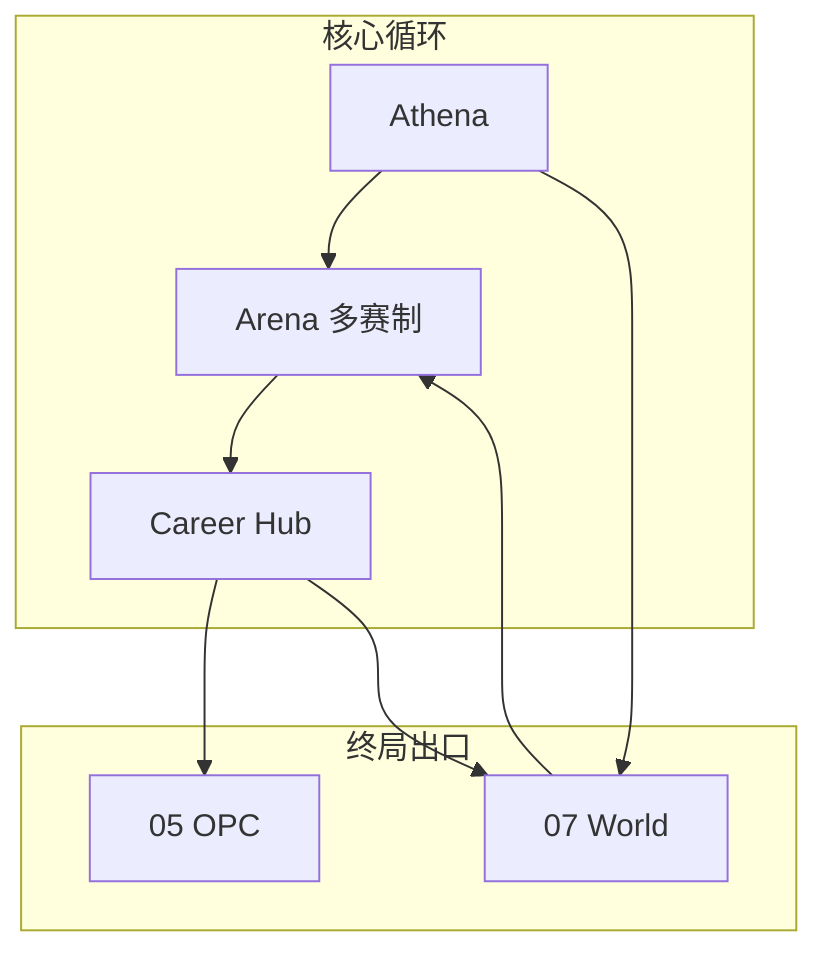

# 拟真城市与区域模拟 · 阅读合集

> **文档定位**：拟真城市（World Simulation）的**根目录权威阅读版**——与 [05-OPC一人公司](./05-OPC一人公司-阅读合集.md) 并列，同为平台**终局出口路径**之一；合并竞品研判、可借鉴对象、整体思路与 Phase 实施路径。产品细节与域模型见 [inspire/75-拟真城市世界观设计](./inspire/75-拟真城市世界观设计.md)。
>
> **蓝图定位**：Phase A 尾声启动规划与占位；**运行时 `domains/world/` 自 Phase B 起渐进落地**。详见 [04-实施路线与蓝图](./04-实施路线与里程碑.md)。
>
> **最后更新**：2026-05-22

---

## 目录

1. [拟真城市是什么](#一拟真城市是什么)
2. [与主平台的关系（双终局出口）](#二与主平台的关系双终局出口)
3. [近似产品与思路对照](#三近似产品与思路对照)
4. [可借鉴对象](#四可借鉴对象)
5. [我们的整体思路](#五我们的整体思路)
6. [实施路径（与 Phase 对齐）](#六实施路径与-phase-对齐)
7. [与 OPC 的协同](#七与-opc-的协同)
8. [风险、边界与 Phase A 纪律](#八风险边界与-phase-a-纪律)
9. [延伸阅读索引](#九延伸阅读索引)

---

## 一、拟真城市是什么

> **让若干真实中国城市成为平台内统一的商业模拟世界；用类 P 社 POP 的人口-消费-产业-政策模型驱动区域变化，使全部赛制共享同一地理-经济本体，并支撑教学、研究与政策情景讨论。**

| 概念 | 说明 |
|------|------|
| **拟真城市** | 非科幻包装，而是**真实城名 + 人文地理 + 产业结构 + 客群（POP）+ 交通区位 + 可选政策包**的可玩化载体 |
| **POP（教育向）** | 人口分群各有需求向量；规则层算份额/满意度/迁移；Demia 可选叙事层**不得改写数值** |
| **共享世界层** | 浮生记运货的成都、TechVenture 做品牌的南京、未来宏观沙盘调节的长三角节点——同一 `city_id` 的不同**商业切面** |
| **平台存在性价值** | 从「多赛制工具箱」升级为「可演化的区域商业模拟器」，具备课题、试点校与研究机构合作的长期空间 |

### 1.1 核心价值（为何值得做）

| 维度 | 价值 |
|------|------|
| **跨赛制学习成本** | 学生理解一座城后，换赛制不必重学参数语义 |
| **真实世界对接** | 城市档案可锚定公开统计与产业报告；讨论「若政策 X」有结构化载体 |
| **教学与研究** | K12～大学：城市商业画像、区域比较；高校：政策情景简报（**教育模拟**，非经济预测） |
| **人文地理素养** | 历史、区位、交通、中国产业文化进入同一学习叙事 |

**边界声明**：对外合作须标明教学/研究用途、参数校准流程与免责声明；不替代专业智库预测。

---

## 二、与主平台的关系（双终局出口）

　　商域 BizSim Edu 在 [01-平台愿景](./01-平台愿景与产品架构.md) 主线上，经历 Arena、智能体教练、生涯、图谱、课程等阶段后，形成**两条并列的终局深化路径**：

```
Career Hub（统一档案 · Athena）
        ├──────────────────────┬──────────────────────┐
        ▼                      ▼                      ▼
   05 OPC 一人公司        07 拟真城市 World      Credenti / 外部合作
   真实/半真实首项目      区域模拟 · 政策推演      认证 · 研究导出
```

| 出口 | 回答的问题 | 典型产出 |
|------|------------|----------|
| **OPC（05-）** | 我能否像创业者一样交付一个项目？ | BMC、MVP、Gateway 验收 |
| **拟真城市（07-）** | 我能否理解区域如何因人、产、策而变？ | 跨赛制城市掌握度、政策情景报告、研究型日志 |

| 原则 | 说明 |
|------|------|
| 数据不孤岛 | World 提供城市快照；Arena 单局结算；Career 记录区域足迹 |
| 赛制不克隆 | 新赛制引用 `content/world/cities/`，禁止再复制内联城市表 |
| Phase 门禁 | Phase A **禁止** `domains/world/` 运行时；见 [blueprint-coding](./.cursor/rules/blueprint-coding.mdc) |



---

## 三、近似产品与思路对照

　　市场上**没有**单一产品完整覆盖「真实中国城市 + POP + 多赛制共享 + K12～大学 + 政策研究导出」。以下为**局部相近**赛道与缺口（详研见 [inspire/f早期调研/14-商赛类型与赛制资料库](./inspire/f早期调研/14-商赛类型与赛制资料库.md)）。

### 3.1 四类对照总表

| 类型 | 代表 | 相近点 | 与我们的缺口 |
|------|------|--------|--------------|
| **企业/战略商赛** | Cesim Global Challenge / SimBrand、iBizSim、商道 PREMKING、Markstrat | 多期决策、多区域市场、消费者模型；国内本土化强 | 中心是**虚拟公司**，非城市一等公民；区域多为市场切片，非 POP+产业+交通统一本体 |
| **城市/规划教学** | eCITY、SmartCity (EcoSim)、UrbanPlan、iPlan | 城市多维管理、土地与可持续、利益相关者 | 偏规划/公民教育，**非**商赛矩阵；不与物流赛、品牌赛共用城市母本 |
| **宏观/系统动力学** | Wharton MacroSim、Vensim/Stella、Forio Simulate | 政策→经济变量；区域 SD 研究 | 弱游戏化、弱多赛制；难承载日常练习与组织者控场 |
| **机制参考（非教育平台）** | Victoria 3 POP、Cities: Skylines | 人群、就业、产销、交通直觉 | 商业游戏，无赛事双端、无中国商赛生态 |

### 3.2 差异化一句话（对外沟通）

> **不是又一个 Cesim，而是「中国城市商业素养的共享模拟世界」——商赛是切口，区域 POP 与政策情景是纵深。**

### 3.3 能力重合度示意

| 能力维度 | Cesim/商道 | 城市教学模拟 | SD/政策工具 | 本平台 World 规划 |
|----------|------------|--------------|-------------|-------------------|
| 多赛制共享同一城市 | 弱 | 中（单一体裁） | 弱 | **强（目标）** |
| 真实中国城市档案 | 中 | 中 | 可定制 | **强（目标）** |
| POP 规则层 | 中 | 弱 | 中 | **强（目标）** |
| K12～日常练习 | 中 | 中 | 弱 | **强（已有 Arena）** |
| 政策/研究导出 | 弱 | 弱 | **强** | 中→强（Phase E～F） |

---

## 四、可借鉴对象

### 4.1 机制与模型

| 借鉴源 | 借鉴什么 | 落点 |
|--------|----------|------|
| **Victoria 3 / Cities** | POP 分群、需求向量、产销与交通直觉 | World POP 规则层；[inspire/d/05-AI深度融合设计](./inspire/d商业模拟教育平台/05-AI深度融合设计.md) §三 Demia |
| **Cesim SimBrand / Global Challenge** | 区域市场差异、消费者响应、汇率与制度 | 多区域赛制投影；十赛制蓝图 |
| **iBizSim / 商道** | 国内大赛运营、企业决策全流程、本土化场景 | 组织者端与赛事节奏；非照搬公司中心架构 |
| **系统动力学 / ABM** | 存量-流量、拥挤调节、涌现 | [inspire/70-系统动力学与复杂系统模拟](./inspire/70-系统动力学与复杂系统模拟.md)；Phase E～F |
| **现有 webapp 三引擎** | RTS `production/consumption`；TV `consumers/scale`；v1 城市类型 | Phase B 收敛为统一 `city_id` 母本 |

### 4.2 内容与真实连接

| 借鉴源 | 借鉴什么 | 落点 |
|--------|----------|------|
| [inspire/60-从课堂到商业](./inspire/60-从课堂到商业-真实世界连接生态.md) | 城市经济数据接口、新闻联动事件、企业挑战赛 | Phase C～F 数据锚点与定制赛 |
| [inspire/52-商业课程与经济学模型](./inspire/52-商业课程内容与经济学模型.md) | 城市参数分层 Global/City/Route/Event/Consumer | 母本 Schema 字段设计 |
| [inspire/63-全球化与跨文化](./inspire/63-全球化与跨文化商业素养培育.md) | 多 `citySet`、区域文化包 | 远期国际城扩展 |

### 4.3 工程与协作

| 借鉴源 | 借鉴什么 | 落点 |
|--------|----------|------|
| CyberCore 声明式赛制 | 赛制 YAML 引用而非硬编码 | `game-configs` → `$ref` world/cities |
| [09-分项目开发](./09-分项目开发与集成流程.md) | 契约先行、竖切、会话边界 | World 域 API 契约（Phase B） |
| OPC 域分包纪律 | 单表主人、跨域 API | `domains/world/` 表归属 |

---

## 五、我们的整体思路

### 5.1 三层结构

| 层 | 内容 | 变更频率 |
|----|------|----------|
| **城市母本** | `city_id`、POP、产业、消费、交通、档案、政策情景包 | 学期级校准 |
| **赛制投影** | 各引擎只读母本子集（物流/份额/宏观等） | 随赛制包版本 |
| **单局快照** | Arena 开局注入；默认不跨局写回（保公平） | 每场赛事 |

### 5.2 城市本体（摘要）

　　完整字段见 [inspire/75-](./inspire/75-拟真城市世界观设计.md) §四。核心：**身份 · POP · 产业 · 消费 · 地理交通 · 历史文化档案 · 可选政策环境**。

### 5.3 学生体验原则

- 同一城市，不同赛制 = 不同**商业切面**（物流节点 / 品牌战场 / 政策对象…）
- 城市档案页：人口结构、主导产业、交通、延伸阅读（教师可选）
- **初期不强制**跨赛制状态联动；全服时间线 Phase C+ 可选

### 5.4 当前工程碎片（Phase A 现状）

| 引擎 | 城市表达 | 统一 ID |
|------|----------|---------|
| trading-v1 | 京城/沪市等虚构简称 + type | 待对照 [world/cities/README](./webapp/backend/content/world/cities/README.md) |
| trading-v2-rts | prod/cons/demand_profile（最接近母本） | 同上 |
| techventure-v1 | 南京/合肥/杭州 + consumers | 同上 |

　　三套 YAML **互不引用**；World 域**未实现**。Phase A 只做对照表与占位，不改结算。

---

## 六、实施路径（与 Phase 对齐）

> 与 [04-](./04-实施路线与里程碑.md)「拟真城市跨 Phase 摘要」一致；此处为阅读版 checklist。

### Phase A 尾声（当前）

| 项 | 状态 |
|----|------|
| 根目录 **07-** 阅读合集 + inspire/75 详设 | 本文档 |
| `content/world/cities/` 占位与 ID 对照 | README |
| 三份 game-config 标注「待引用 world」 | 可选注释 |
| **禁止** 建 `domains/world/`、跨局持久化、改引擎结算 | 强制 |

### Phase B

- `content/world/cities/*.yaml` 静态母本（≥6 城）
- 新赛制 YAML 从母本引用
- Demia POP 与 `pop_id` 对齐
- 可选 `GET /world/cities` 只读 API

### Phase C～D

- `domains/world/` + 开局快照注入
- Career 区域掌握度；Atlas 城市-知识点挂载
- 可选赛季城市时间线

### Phase E～F

- POP 动态演化（存量-流量简化）
- 政策情景包；脱敏研究导出
- 与试点校/研究机构合作沙盘

---

## 七、与 OPC 的协同

| 场景 | World | OPC |
|------|-------|-----|
| 学生路径 | 商赛积累区域认知 → 深度政策/产业课题 | 生涯达标 → 首项目孵化 |
| 数据 | `city_id`、区域 XP、模拟日志 | 公司、员工、任务、Gateway |
| 主题交叉 | OPC IDEATE 可选「基于某城产业」选题 | 不替代 World 规则层 |
| Phase | B～F 渐进 | E 主力 |

　　二者**并列终局**，非互斥：学生可偏「区域研究者」或「创业者」，也可在生涯后期叠加。

---

## 八、风险、边界与 Phase A 纪律

| 风险 | 缓解 |
|------|------|
| A 阶段抢跑 World 运行时 | blueprint-coding §7；默认 Phase A |
| 跨局联动破坏竞技公平 | 单局快照默认；全服时间线可关 |
| 真实数据校准成本 | 6～10 城教学级参数 + 公开数据锚点 |
| 政策合作敏感 | 教学模拟声明 + 人工审查 |
| 虚构地名与真城混用 | 新内容仅用 canonical `city_id` |

---

## 九、延伸阅读索引

| 主题 | 文档 |
|------|------|
| 产品详设（域模型、体验表、风险） | [inspire/75-拟真城市世界观设计](./inspire/75-拟真城市世界观设计.md) |
| Phase 排期与成本 | [04-实施路线与里程碑](./04-实施路线与里程碑.md) |
| 赛制与城市切面 | [02-赛事体系与双端产品](./02-赛事体系与双端产品.md) §九 |
| Demia POP | [inspire/d/05-AI深度融合设计](./inspire/d商业模拟教育平台/05-AI深度融合设计.md) §三 |
| 竞品与商赛类型 | [inspire/f/14-商赛类型与赛制资料库](./inspire/f早期调研/14-商赛类型与赛制资料库.md) |
| 真实数据连接 | [inspire/60-从课堂到商业](./inspire/60-从课堂到商业-真实世界连接生态.md) |
| 系统动力学 / ABM | [inspire/70-系统动力学与复杂系统模拟](./inspire/70-系统动力学与复杂系统模拟.md) |
| 城市母本占位 | [webapp/backend/content/world/cities/README.md](./webapp/backend/content/world/cities/README.md) |
| 终局出口（创业） | [05-OPC一人公司-阅读合集](./05-OPC一人公司-阅读合集.md) |

---

> **下一步**：决策者读本文 + `01-` §1.1 · 产品/架构读 [inspire/75-](./inspire/75-拟真城市世界观设计.md) · 开发读 `04-` + `03-` + `08-` §三 · 推送前对齐须更新 `07-`、`04-`、`00-`。
