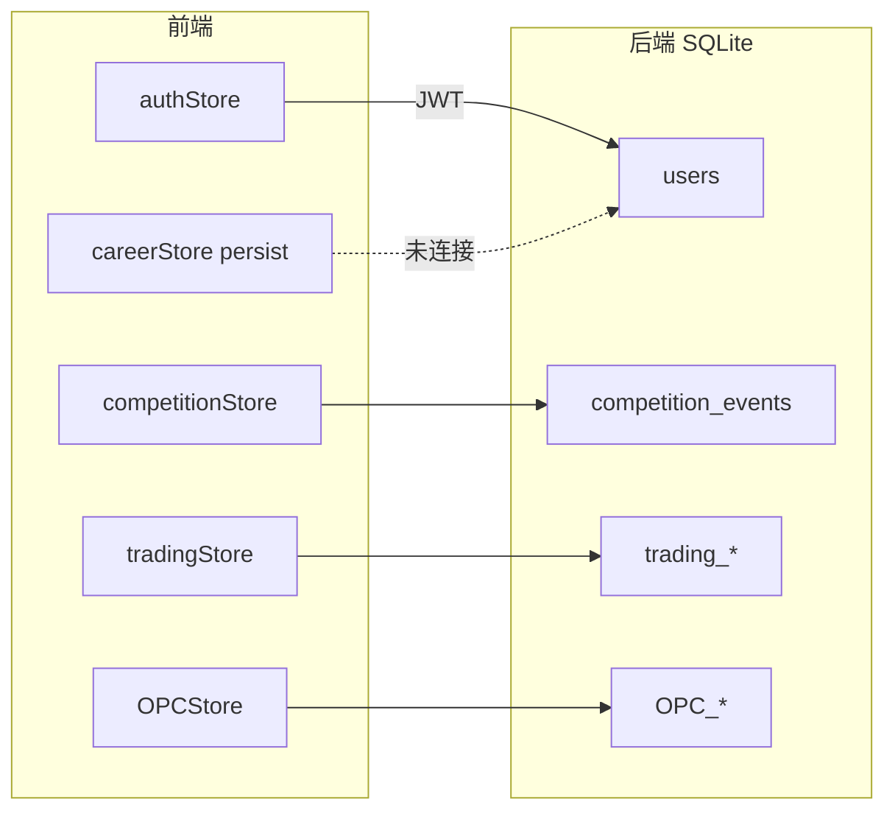

# 工程现状与 webapp 实现详表

> **文档定位**：[`webapp/`](./webapp/) 的**工程权威详表**——功能矩阵、路由/API 全表、Store、Bug 清单、规划对齐度。战略与路线不在此重复。
>
> **读者**：开发、架构、排 Bug  
> **配套阅读**：[`01-平台愿景与产品架构`](./01-平台愿景与产品架构.md) · [`02-赛事体系与双端产品`](./02-赛事体系与双端产品.md)（双端）· [`03-技术架构与实现现状`](./03-技术架构与实现现状.md)（摘要）· [`04-实施路线与里程碑`](./04-实施路线与里程碑.md) · [`09-分项目开发与集成流程`](./09-分项目开发与集成流程.md)  
> **安装启动**：[`webapp/README.md`](./webapp/README.md)  
> **最后更新**：2026-05-20

---

## 目录

1. [webapp 角色摘要](#一webapp-角色摘要)
2. [当前实现现状](#二当前实现现状)
   - [2.6 前端路由全表](#26-前端架构与路由全表)
   - [2.7 后端 API 全表](#27-后端架构与-api-全表)
   - [2.8 状态管理与数据流](#28-状态管理与数据流)
   - [2.9 工程环境与部署](#29-工程环境与部署)
   - [2.10 已知问题清单](#210-已知问题清单工程向)
3. [与规划对齐度](#三与顶层规划的对齐度)
4. [相关文档与代码入口](#四相关文档与代码入口)

---

## 一、webapp 角色摘要

　　**商域 BizSim Edu**（目录 `webapp/`）是本仓库唯一可运行应用：FastAPI + React，承载五域演示、**交易赛正式赛闭环**、OPC CRUD。品牌与五域定义见 [`01-`](./01-平台愿景与产品架构.md)；学生端/组织者端分工见 [`02-`](./02-赛事体系与双端产品.md) §五。

| 项 | 说明 |
|----|------|
| 代码根 | `webapp/backend`、`webapp/frontend` |
| 演示账号 | `student/student123`、`admin/admin123` |
| 最强闭环 | 组织者建赛 → 房间码 → 交易对局 → XP（见 §2.3） |
| 下一步工程 | [`09-分项目开发与集成流程`](./09-分项目开发与集成流程.md) |

---

## 二、当前实现现状

### 2.1 技术栈摘要

| 层 | 选型 | 备注 |
|----|------|------|
| 前端 | React 19 + TS + Vite + Tailwind + Zustand | 暗色主题，客户端路由 |
| 后端 | FastAPI + SQLAlchemy + SQLite | 开发/演示友好；规模化需迁 PostgreSQL |
| 认证 | JWT 双令牌 + 角色 student/teacher/admin | 已实现刷新拦截 |
| 部署 | Docker Compose + Nginx | 见 `docker-compose.yml` |

### 2.2 功能模块交付矩阵

| 模块 | 路由/域 | 后端 API | 前端体验 | 数据持久化 | 成熟度 |
|------|---------|----------|----------|------------|--------|
| 认证 | `/login` | ✅ | ✅ | SQLite 用户表 | **生产雏形** |
| 生涯中枢 | `/career` | 部分（用户 XP 等） | ✅ UI + 雷达 | 生涯状态 **大量 localStorage + mock** | **演示级** |
| 每日任务 | `/quests` | — | ✅ | localStorage | **演示级** |
| 成就 | `/achievements` | — | ✅ | mock | **演示级** |
| 知识图谱 | `/wiki` | ✅ | ✅ Canvas 力导向 | `knowledge_graph.json` | **可用** |
| 课程学院 | `/courses` | ✅ | ✅ | 静态/种子数据 | **可用** |
| 商赛大厅 | `/games` | ✅ 比赛 CRUD | ✅ | SQLite 比赛表 | **可用** |
| 交易模拟商赛（**正式赛链路**） | `/games/:id/play` | ✅ 回合决策 | ✅ 六城十品 | SQLite + 服务端结算 | **核心可玩** |
| 商赛模拟（**vs AI 练习**） | `/games` → `/games/:id/play` | ✅ `practice/*` + 自动推进 | ✅ 浮生记日常练习入口 | SQLite + `match_kind=practice` | **核心可玩** |
| 组织者控场 | `organizer-frontend` (:5174) | ✅ | ✅ | 组织者档案 | **Phase 1 独立端** |
| 国富论游戏 | `/wealth-of-nations` | — | ✅ 纯前端 | 无 | **教学小游戏** |
| Demia / Rival 练习 | `/games/...` 等 | — | ✅ UI | mock 对话 | **演示级** |
| OPC 一人公司 | `/opc/*` | ✅ CRUD | ✅ 仪表盘/任务/BMC | SQLite OPC 模型 | **数据层可用，AI 未接** |
| 展示引导 | `/showcase` | — | ✅ | — | **演示级** |

### 2.3 已打通的核心闭环（对外演示推荐路径）

**路径 A — 正式赛（组织者 + 学生，当前最强）**

```
组织者(admin) 创建比赛 → 获得房间码
    → 学生(student) /games 输入房间码加入 → 大厅等待
    → 组织者开始 → 交易对局（买/卖/移动/持有）→ 组织者推进回合 / 结束
    → 成绩写入用户 XP → 学生 /career 查看成长
```

**路径 B — 浮生记日常练习（1 人 + 3 AI，已打通）**

```
学生 /games →「浮生记 · 日常练习」→ POST /practice/trading/start
    → 1 真人 + 3 AI 交易员 → 供需定价（market）→ 提交后自动推进回合
    → 打满回合自动结算 practice XP
```

**路径 C — 正式多人赛（组织者 + 房间码，约 10 人可试点）**

```
组织者 :5174 创建比赛（max_players=10）→ 学生房间码加入 → 大厅等待
    → 组织者开始 → 各回合买/卖/移动/持有 → 组织者推进回合
    → 最后一回合建议点「结束比赛」结算（勿仅依赖最后一次「推进」）
```

　　详见 [`webapp/README.md`](./webapp/README.md)「对外演示」：学生 `student/student123`；组织者 `admin/admin123`（`:5174` 独立端，学生端已无控制台入口）。

### 2.4 代码结构要点

- **真实业务后端**：`auth`、`wiki`、`courses`、`opc`、`organizer`、`competitions`、`trading`、`practice` 八组路由（见 `backend/app/main.py`）。
- **域分层**（2026-05）：`domains/arena`（场次/参赛者）、`domains/cybercore`（YAML）、`domains/career`（`xp_events`）、`games/trading`（结算引擎）；`models/trading_competition.py` 仅为兼容 re-export。
- **演示数据层**：`frontend/src/data/mockPlatform.ts` 支撑 Athena 文案、部分榜单与成就展示。
- **状态管理**：`careerStore`（持久化本地）、`competitionStore` / `tradingStore`（对局）、`OPCStore`（公司任务）。
- **Phase 10 里程碑**（见 README 路线图）：**交易模拟商赛（组织者 + 房间码 + 回合制）** 已标记完成 ✅。

### 2.5 与仓库其它资产的技术衔接

| 资产 | webapp 中的体现 | 缺口 |
|------|-----------------|------|
| `知识卡片库/*.yaml` | `scripts/parse_knowledge.py` → `knowledge_graph.json` | 未自动化 CI 同步；掌握度 API 未建 |
| `inspire/college/` 课程单元 | 课程 API 为演示数据 | 未按 YAML bundle 导入 |
| `商赛界面展示/` 声明式框架 | `trading-v1.yaml` + `cybercore.registry` 已加载 | 前端局内 UI 仍部分硬编码；第二赛制未建 |
| `OPC/` | OPC 页面 + REST | 无 LangGraph/MCP/Gateway |

### 2.6 前端架构与路由全表

#### 2.6.1 技术组成

| 项 | 路径/说明 |
|----|-----------|
| 入口 | `frontend/src/main.tsx` → `App.tsx` |
| 布局 | `components/Layout.tsx`（侧栏导航 + `<Outlet />`） |
| 鉴权 | `AuthGuard.tsx` + `AppInitializer.tsx`（启动时 `GET /auth/me`） |
| HTTP | `lib/api.ts`（Axios、`VITE_API_URL` 默认 `http://localhost:8000`） |
| 全局演示数据 | `data/mockPlatform.ts` |
| 状态 | Zustand：`authStore`、`careerStore`（persist）、`competitionStore`、`tradingStore`、`OPCStore` |

#### 2.6.2 路由全表（`App.tsx`）

| 路径 | 页面组件 | AuthGuard | 后端依赖 | 说明 |
|------|----------|-----------|----------|------|
| `/` | `HomePage` | 无 | 无 | 落地页 |
| `/showcase` | `ShowcasePage` | 无 | 无 | 演示引导，可 `enableDemoMode()` |
| `/login` | `LoginPage` | guestOnly | `POST /auth/login` | 支持邮箱或用户名 |
| `/register` | `RegisterPage` | guestOnly | `POST /auth/register` | |
| `/dashboard` | — | — | — | **重定向** → `/career` |
| `/career` | `CareerPage` | requireAuth | **无（mock）** | 依赖 `careerActive`，数据来自 `DEMO_CAREER` |
| `/career/start` | `CareerStartPage` | **无** | 无 | 仅写 `careerStore`，未调后端 |
| `/career/debrief/:matchId` | `DebriefPage` | requireAuth | **无（mock）** | 固定 `DEBRIEF_MOCK`，`:matchId` 未使用 |
| `/quests` | `QuestsPage` | requireAuth | 无 | `DAILY_QUESTS` + localStorage 完成态 |
| `/achievements` | `AchievementsPage` | requireAuth | 无 | `ACHIEVEMENTS` mock |
| `/games` | `GamesPage` | requireAuth | `GET/POST competitions` | 房间码加入、列表 |
| `/games/:id/lobby` | `GameLobbyPage` | requireAuth | `my-status`、start | 正式赛大厅 |
| `/games/:id/play` | `TradingGamePage` | requireAuth | `trading/*` | **当前唯一可玩对局页** |
| `/organizer/events/create` | `CreateEventPage` | requireAuth | `POST /competitions` | 仅 `role===admin` 时入口可见 |
| `/wiki` | `WikiPage` | requireAuth | `wiki/*` | Canvas 图谱 |
| `/wiki/:id` | `WikiArticlePage` | requireAuth | `wiki/articles/:id` | |
| `/courses` | `CoursesPage` | requireAuth | `courses/` | |
| `/courses/:id` | `CourseDetailPage` | requireAuth | `courses/:id` | |
| `/wealth-of-nations` | `WealthOfNationsPage` | requireAuth | 无 | 纯前端小游戏 |
| `/opc` | `OPCPage` | requireAuth | `opc/companies` | |
| `/opc/talent` | `TalentMarketPage` | requireAuth | `OPC/employees` | |
| `/opc/missions` | `MissionControlPage` | requireAuth | `OPC/tasks` | |
| `/opc/bmc` | `BMCPage` | requireAuth | `PATCH company` | |
| `/opc/employee/:id` | `EmployeeDetailPage` | requireAuth | `OPC/employees/:id` | |

#### 2.6.3 侧栏导航 vs 路由

| 侧栏项（`Layout.tsx`） | 路径 | 备注 |
|------------------------|------|------|
| 首页 | `/` | |
| 生涯中枢 | `/career` | |
| 每日任务 | `/quests` | |
| 商赛大厅 | `/games` | 无单独「AI 模拟」入口 |
| 课程学院 | `/courses` | |
| 知识图谱 | `/wiki` | |
| 成就中心 | `/achievements` | |
| 一人公司 | `/opc` | |
| — | `/wealth-of-nations` | **未进侧栏**，需直链 |
| — | `/organizer/events/create` | **未进侧栏**，admin 在商赛页按钮进入 |
| — | `/showcase` | 未登录区入口 |

#### 2.6.4 已实现但未注册路由的页面（死代码）

| 文件 | 原设计意图 | 现状 |
|------|------------|------|
| `Games/GamePlayPage.tsx` | Demia POP / 回合策略演示 | **未挂路由**，内含 `PopPanel` |
| `Games/PracticeNegotiationPage.tsx` | Rival 谈判练习 | **未挂路由** |
| `Games/GameRoomPage.tsx` | 旧版房间+聊天 mock | **未挂路由**，被 `GameLobbyPage` 替代 |
| `Dashboard/DashboardPage.tsx` | 旧个人中心 | **未挂路由**，`/dashboard` 已重定向 |

### 2.7 后端架构与 API 全表

#### 2.7.1 应用入口

| 项 | 说明 |
|----|------|
| 入口 | `backend/run.py` → Uvicorn `0.0.0.0:8000`，`reload=True` |
| 应用 | `app/main.py`：CORS、`RequestLoggingMiddleware`、全局异常、`lifespan` 调 `init_all()` |
| 数据库 | `sqlite:///./bizsim.db`（**相对 `backend/` 工作目录**） |
| 默认账号 | `admin/admin123`、`student/student123`（`app/db/init_db.py`） |

#### 2.7.2 数据模型（SQLAlchemy）

| 模块 | 表/实体 | 用途 |
|------|---------|------|
| `models/user.py` | `users` | 认证、角色、`experience`/`level` |
| `domains/arena/models/` | `organizer_profiles`、`competition_events`（`ArenaMatch`）、`competition_participants` | 含 `match_kind`、`design_mode`、`game_config_id`；`migrate_schema.py` 为旧库补列 |
| `games/trading/models.py` | `trading_rounds`、`trading_decisions`、`trading_prices` | 交易赛回合数据 |
| `domains/career/models/xp_event.py` | `xp_events` | 幂等 XP 账本（`idempotency_key`） |
| `models/opc.py` | `one_companies`、`ai_employees`、`ai_tasks` | OPC |
| `models/trading_competition.py` | — | **仅 re-export**，新逻辑勿写入 |
| — | **无** `career_profiles` / `quests` | Career 聚合 API 仍缺 |

#### 2.7.3 API 路由一览（前缀均为 `/api/v1`）

| 模块 | 前缀 | 主要端点 | 权限要点 |
|------|------|----------|----------|
| **auth** | `/auth` | register, login, me, refresh | 公开 / JWT |
| **wiki** | `/wiki` | articles, graph, disciplines | 登录后（前端强制） |
| **courses** | `/courses` | 列表、详情 | 内存/种子数据，非 DB |
| **OPC** | `/opc` | companies, employees, tasks CRUD | 按 `owner_id` 隔离 |
| **organizer** | `/organizer` | apply, profile, stats | 组织者档案 |
| **competitions** | `/competitions` | CRUD、join(房间码)、start、end、standings、my-status | 创建需组织者；start/end 需组织者 |
| **trading** | `/trading` | state、decide、result、next、history | 对局内决策；`next` 组织者 |
| **practice** | `/practice` | `GET /game-configs`、`POST /trading/start`、`GET /my` | 日常练习局创建与列表；跳转后仍走 `/trading/*` |

　　**缺失的后端域**（规划中有、代码中无）：`/career/*`（聚合查询）、`/quests/*`、`/credentials/*`、`/ai/athena|demia|rival/*`、`WebSocket 房间`。

#### 2.7.4 服务层与域包

| 路径 | 职责 |
|------|------|
| `domains/arena/services/match_factory.py` | `create_official_match` / `create_practice_match` |
| `domains/career/services/rewards.py` | `grant_xp`、`settle_match_rewards`（读 YAML 权重） |
| `domains/cybercore/registry.py` | 加载 `backend/content/game-configs/*.yaml` |
| `games/trading/engine.py` | 交易赛状态机与结算 |
| `app/services/` | 仍为空；部分逻辑仍在 `api/trading.py` |

　　规范见 [`domains/arena/ARCHITECTURE.md`](./webapp/backend/app/domains/arena/ARCHITECTURE.md)。

### 2.8 状态管理与数据流



| Store | 持久化 | 与后端关系 |
|-------|--------|------------|
| `authStore` | localStorage tokens | ✅ login/me；用户 `experience` **未在 Career 页展示** |
| `careerStore` | localStorage `bizsim-career-mvp` | ❌ 仅 `careerActive`/`demoMode`/`completedQuests` |
| `competitionStore` | 内存 | ✅ 列表、加入、控场 |
| `tradingStore` | 内存 | ✅ 回合状态与决策 |
| `OPCStore` | 内存 | ✅ 公司/员工/任务 API |

### 2.9 工程环境与部署

| 项 | 说明 |
|----|------|
| 本地前端 | `cd frontend && npm run dev` → `:5173` |
| 本地后端 | `cd backend && venv\Scripts\python run.py` → `:8000` |
| 启动脚本 | `启动.bat` / `启动.ps1` / `启动-前端.bat` / `启动-后端.bat` |
| Docker | `docker-compose.yml`：backend + frontend(Nginx:80)；**未挂载持久化 DB 卷时需知数据在容器内** |
| 环境变量 | 前端无 `.env.example`；`VITE_API_URL` 可选 |
| 安全 | `SECRET_KEY` 默认值；生产必须更换 |

---

### 2.10 已知问题清单（工程向）

　　以下按优先级归纳；产品叙事与路线见 [`04-`](./04-实施路线与里程碑.md)、[`05-`](./05-OPC一人公司-阅读合集.md) §六。

#### P0 — 影响核心演示 / 数据正确性

| # | 问题 | 现象 | 建议修复 |
|---|------|------|----------|
| E1 | **生涯页与登录用户 XP 脱节** | `/career` 仅用 `mockPlatform.DEMO_CAREER`，忽略 `authStore.user.experience` | Career 读 `GET /auth/me` 或新增 `/career/profile` |
| E2 | **生涯域不完整** | 已有 `xp_events` 与赛后发放，但无 `/career/profile`；Quest/成就仍无表 | 增加 Career 聚合 API + 前端对接 |
| E3 | **房间码加入后可能无法跳转大厅** | `GamesPage` 在 `joinEvent` 后用旧 `events` 数组 `find(room_code)`，未 refetch 且 join 响应未带 `event_id` 导航 | join 后用 `myParticipant.event_id` 或 refetch + navigate |
| E4 | **数据库依赖启动初始化** | 若未走 `lifespan`/`init_db` 则 `no such table: users`，前端易报 CORS | 已加 `lifespan`；文档强调先启 backend |
| E5 | **正式赛结束与生涯复盘未打通** | 结束比赛写用户 XP，但 `/career/debrief/demo` 仍为静态 mock | 局末跳转真实 `matchId` + Debrief API |

#### P1 — 产品架构 / 双端设想未落地

| # | 问题 | 说明 |
|---|------|------|
| P1 | ~~**学生端仍保留组织者入口**~~ | ✅ 已移除 `GamesPage` 控制台链接；仅 `:5174` 组织者端 |
| P2 | ~~**商赛模拟前端未接 API**~~ | ✅ 日常练习卡片 + `startPractice` + 局内自动推进 |
| P2b | **正式赛控场规则不完整** | 推进回合不校验全员提交；`decision_time` 未计时；第 10 回合仅「推进」不结算 XP，须点「结束比赛」 |
| P3 | **`teacher` 角色未用** | 模型有 `UserRole.teacher`，前端仅判断 `admin` |
| P4 | **组织者申请流未接前端** | 后端有 `POST /organizer/apply`，页面无入口 |
| P5 | **/wiki 强制登录** | 知识图谱本可作为公开预习，现与规划「Atlas 引流」略冲突 |

#### P2 — 代码质量 / 可维护性

| # | 问题 | 说明 |
|---|------|------|
| Q1 | **死代码页面** | 见 §2.6.4，增加维护困惑 |
| Q2 | **`mockPlatform` 与真实 API 混用** | 演示模式与生产数据边界不清 |
| Q3 | **`courses` 非数据库驱动** | `courses.py` 内硬编码列表，与 `inspire/college/` 资产未打通 |
| Q4 | **第二种赛制未验证** | Arena/CyberCore 分层已建，需按 ARCHITECTURE checklist 增第二 `game_config` |
| Q5 | **无自动化测试** | 结算、join、XP 无 pytest / e2e |
| Q6 | **README 与仓库路径** | 根目录规划仍写 `web应用商业教育`，应以 `webapp` 为准 |
| Q7 | **Docker 前端端口** | Compose 暴露 80，与本地 dev `:5173` 不一致，文档需区分 |

#### P3 — 安全与规模化（预期内缺口）

| # | 问题 | 说明 |
|---|------|------|
| S1 | SQLite 单文件 | 入校前需 PostgreSQL + 迁移 |
| S2 | 无多租户 / 班级 | 无法按校隔离 |
| S3 | JWT 默认密钥 | 部署前必换 |
| S4 | 无速率限制 / 审计日志 | 仅 `RequestLoggingMiddleware` 文本日志 |

#### 已修复 / 已缓解（记录备查）

| 项 | 说明 |
|----|------|
| 登录 CORS 误报 | 根因多为 DB 未初始化导致 500；已 `lifespan` + `init_all()` |
| `init_db` Windows 控制台 emoji | 已改为 ASCII 日志，避免 GBK 中断 |

---

## 三、与顶层规划的对齐度

　　对照 [`01-平台愿景与产品架构.md`](./01-平台愿景与产品架构.md) 中的五域 + Career Hub（摘要亦见 [`03-`](./03-技术架构与实现现状.md) §五）：

| 规划组件 | 规划要求 | webapp 现状 | 对齐度 |
|----------|----------|-------------|--------|
| **Career Hub** | 统一 XP 账本、赛季、班级榜 | `xp_events` + 正式赛 `settle_match_rewards`；前端 Career 仍 mock | 🟡 45% |
| **Atlas** | 掌握度驱动解锁 | Wiki + 图谱浏览 | 🟡 50% |
| **Academy** | 单元进度写回生涯 | 列表/详情 UI | 🟡 40% |
| **Quest** | 每日任务服务 + streak | 前端 Quest 页 | 🟡 35% |
| **Arena** | 练习（AI）+ 正式（组织者房间）双模式 | 练习闭环 + 供需定价 + 正式赛 ~10 人可试点；正式赛控场规则待完善 | 🟡 72% |
| **Credenti** | 徽章/认证链 | 成就页 mock | 🔴 20% |
| **Athena** | RAG 复盘、周计划 | 浮窗 + 模板/mock | 🟡 25% |
| **Demia / Rival** | 规则层 + 可选 LLM | UI 演示 | 🔴 15% |
| **OPC** | 孵化流水线 + AI 员工 | 管理 UI + REST；无真实 Agent | 🟡 45% |
| **Identity** | 多租户/班级 | 单库 SQLite、基础角色 | 🟡 40% |

　　**结论**：`webapp` 已完成「**可演示的一体化壳 + 正式交易赛链路 + Arena/CyberCore 域分层 + OPC 数据模型**」；2026-05 起具备 `xp_events` 与练习场后端 API，尚未达到「五域事件闭环 + Career 前端对接 + 多赛制可配 + AI 练习对手」。

---

## 四、相关文档与代码入口

| 文档 | 用途 |
|------|------|
| [`webapp/README.md`](./webapp/README.md) | 安装、启动、API 列表 |
| [`09-分项目开发与集成流程.md`](./09-分项目开发与集成流程.md) | 组织者端、竖切、八周日历 |
| [`04-实施路线与里程碑.md`](./04-实施路线与里程碑.md) | 路线、Phase 验收 |
| [`01-`](./01-平台愿景与产品架构.md)～[`05-`](./05-OPC一人公司-阅读合集.md) | 战略与 OPC |

| 代码路径（相对 `webapp/`） | 说明 |
|---------------------------|------|
| `backend/app/main.py` | API 注册 |
| `backend/app/domains/arena/` | 场次域模型与工厂 |
| `backend/app/domains/cybercore/registry.py` | 赛制 YAML 加载 |
| `backend/app/domains/career/services/rewards.py` | XP 发放 |
| `backend/app/games/trading/market.py` | 供需定价引擎 |
| `backend/app/games/trading/ai_trader.py` | 练习局 AI 交易员 |
| `backend/app/games/trading/practice_flow.py` | 练习局自动推进 |
| `backend/app/games/trading/inventory.py` | 单品种库存上限 |
| `backend/app/domains/arena/services/match_lifecycle.py` | 开赛生命周期 |
| `backend/app/api/practice.py` | 日常练习 API |
| `backend/content/game-configs/trading-v1.yaml` | 首份可玩赛制包 |
| `backend/app/db/migrate_schema.py` | 旧 SQLite 库列迁移 |
| `backend/app/api/trading.py` | 对局 HTTP 适配层 |
| `backend/app/api/competitions.py` | 房间码与比赛生命周期 |
| `frontend/src/App.tsx` | 路由总表 |
| `frontend/src/data/mockPlatform.ts` | 演示数据（待逐步废弃） |

---

## 五、维护说明

- `webapp/README` 或路由/API 变更时，同步更新 §2.2、§2.6.2、§2.7.3、§2.10。  
- 规划调整时，同步 §三 对齐度表与 [`03-`](./03-技术架构与实现现状.md) §五。

### 5.1 变更记录

| 日期 | 摘要 |
|------|------|
| 2026-05-20 | 浮生记供需定价（`market.py`）；练习局 AI + 自动推进；单品种库存上限 99；学生端移除组织者入口；启动脚本优化；`can_submit_decision` 防重复提交 |
| 2026-05-20 | Arena/Career/Cybercore 域分包；`games/trading` 引擎；`practice` API；`trading-v1.yaml`；`xp_events`；课程文档迁至 `inspire/college/` |
| 2026-05-19 | 组织者独立端、Docker 三端编排（见上一版提交说明） |

---

*商域 BizSim Edu · 工程详表*
