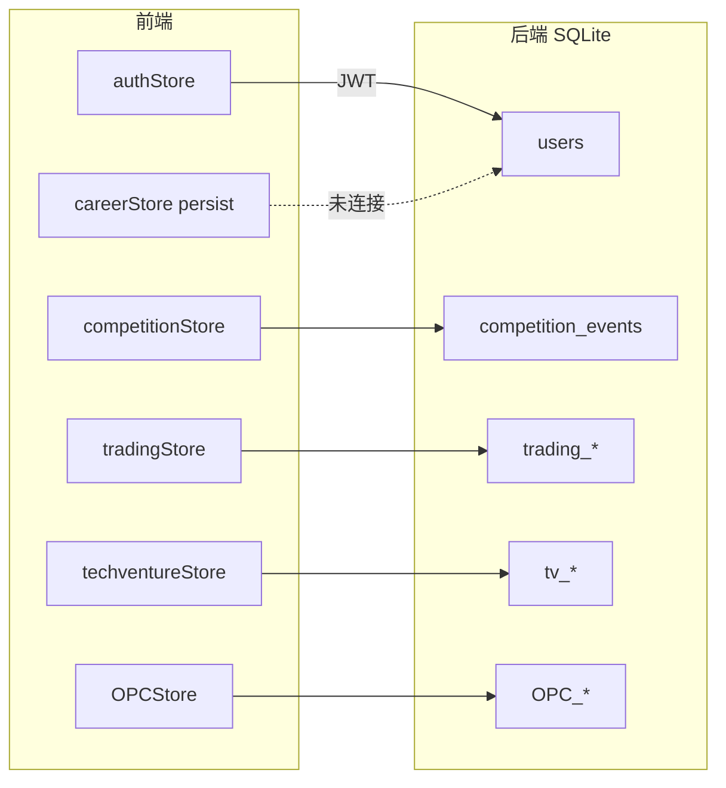

# 工程现状与 webapp 实现详表

> **文档定位**：[`webapp/`](./webapp/) 的**工程权威详表**——功能矩阵、路由/API 全表、Store、Bug 清单、规划对齐度。战略与路线不在此重复。
>
> **读者**：开发、架构、排 Bug  
> **配套阅读**：[`01-平台愿景与产品架构`](./01-平台愿景与产品架构.md) · [`02-赛事体系与双端产品`](./02-赛事体系与双端产品.md)（双端）· [`03-技术架构与实现现状`](./03-技术架构与实现现状.md)（摘要）· [`04-实施路线与里程碑`](./04-实施路线与里程碑.md) · [`09-分项目开发与集成流程`](./09-分项目开发与集成流程.md)  
> **安装启动**：[`webapp/README.md`](./webapp/README.md)  
> **最后更新**：2026-05-28

---

## 目录

1. [webapp 角色摘要](#一webapp-角色摘要)
2. [当前实现现状](#二当前实现现状)
   - [2.6 前端路由全表](#26-前端架构与路由全表)
   - [2.7 后端 API 全表](#27-后端架构与-api-全表)
   - [2.8 状态管理与数据流](#28-状态管理与数据流)
   - [2.9 工程环境与部署](#29-工程环境与部署)
   - [2.10 已知问题清单](#210-已知问题清单工程向)
3. [与规划对齐度](#三与顶层规划的对齐度)
4. [相关文档与代码入口](#四相关文档与代码入口)

---

## 一、webapp 角色摘要

　　**商域 BizSim Edu**（目录 `webapp/`）是本仓库唯一可运行应用：FastAPI + React，承载五域演示、**交易赛正式赛闭环**、OPC CRUD。品牌与五域定义见 [`01-`](./01-平台愿景与产品架构.md)；学生端/组织者端分工见 [`02-`](./02-赛事体系与双端产品.md) §五。

| 项 | 说明 |
|----|------|
| 代码根 | `webapp/backend`、`webapp/frontend` |
| 演示账号 | `student/student123`、`admin/admin123` |
| 最强闭环 | 组织者建赛 → 房间码 → 交易对局 → XP（见 §2.3） |
| 下一步工程 | [`09-分项目开发与集成流程`](./09-分项目开发与集成流程.md) |

---

## 二、当前实现现状

### 2.1 技术栈摘要

| 层 | 选型 | 备注 |
|----|------|------|
| 前端 | React 19 + TS + Vite + Tailwind + Zustand | 暗色主题，客户端路由 |
| 后端 | FastAPI + SQLAlchemy + SQLite | 开发/演示友好；规模化需迁 PostgreSQL |
| 认证 | JWT 双令牌 + 角色 student/teacher/admin | 已实现刷新拦截 |
| 部署 | Docker Compose + Nginx | 见 `docker-compose.yml` |

### 2.2 功能模块交付矩阵

| 模块 | 路由/域 | 后端 API | 前端体验 | 数据持久化 | 成熟度 |
|------|---------|----------|----------|------------|--------|
| 认证 | `/login` | ✅ | ✅ | SQLite 用户表 | **生产雏形** |
| 生涯中枢 | `/career` | 部分（用户 XP 等） | ✅ UI + 雷达 | 生涯状态 **大量 localStorage + mock** | **演示级** |
| 每日任务 | `/quests` | — | ✅ | localStorage | **演示级** |
| 成就 | `/achievements` | — | ✅ | mock | **演示级** |
| 知识图谱 | `/wiki` | ✅ | ✅ Canvas 力导向 | `knowledge_graph.json` | **可用** |
| 课程学院 | `/courses` | ✅ | ✅ | 静态/种子数据 | **可用** |
| 商赛大厅 | `/games` | ✅ 比赛 CRUD | ✅ | SQLite 比赛表 | **可用** |
| 交易模拟商赛（**回合制**） | `/games/:id/play` | ✅ 回合决策 | ✅ 六城 · `trading-v1` | SQLite + 回合结算 | **可玩** |
| **浮生记 RTS v2**（**即时**） | `/games/:id/play` | ✅ `/state` 只读 + `/actions` + **WebSocket** | ✅ `TradingRTSView` | 调度器 tick + `trading-v2-rts` | **核心可玩** |
| 商赛模拟（**vs AI 练习**） | `/games` → `/games/:id/play` | ✅ `practice/trading/start`（默认 v2 RTS） | ✅ 日常练习卡片 | SQLite + 3 AI 档位 | **核心可玩** |
| **TechVenture 创想大赢家** | `/games/:id/techventure` | ✅ 参赛端 + 管理端 + 大屏 + 评委 | ✅ React 全重写（学生+组织者+大屏+评委） | SQLite：`tv_*` 5 表 + `arena_teams` | **核心可玩** |
| 组织者控场 | `organizer-frontend` (:5174) | ✅ | ✅ | 组织者档案 | **Phase 1 独立端** |
| 国富论游戏 | `/wealth-of-nations` | — | ✅ 纯前端 | 无 | **教学小游戏** |
| Demia / Rival 练习 | `/games/...` 等 | — | ✅ UI | mock 对话 | **演示级** |
| OPC 一人公司 | `/opc/*` | ✅ CRUD | ✅ 仪表盘/任务/BMC | SQLite OPC 模型 | **数据层可用，AI 未接** |
| 展示引导 | `/showcase` | — | ✅ | — | **演示级** |

### 2.3 已打通的核心闭环（对外演示推荐路径）

**路径 A — 正式赛（组织者 + 学生，当前最强）**

```
组织者(admin) 创建比赛 → 获得房间码
    → 学生(student) /games 输入房间码加入 → 大厅等待
    → 组织者开始 → 交易对局（买/卖/移动/持有）→ 组织者推进回合 / 结束
    → 成绩写入用户 XP → 学生 /career 查看成长
```

**路径 B — 浮生记 RTS 日常练习（1 人 + 3 AI，默认 v2）**

```
学生 /games →「浮生记 · 日常练习」→ POST /practice/trading/start（game_config_id=trading-v2-rts）
    → commit 后启动 rts_scheduler → 每 5s tick（调度器唯一推进）
    → 学生 WebSocket 收 tick → GET /state 刷新 UI → 买卖/移动/购车指令排队下 tick 结算
    → AI（chaotic + advanced×2）同 tick 决策 → 打满 total_ticks 自动 finish + WS finished
```

**路径 B′ — 浮生记回合制练习（v1，可选）**

```
practice/start 传 game_config_id=trading-v1 → 回合制 market 定价 → 提交后 practice_flow 自动推进
```

**路径 C — TechVenture 正式赛（队伍制，10-20+ 人）**

```
组织者(admin) :5174 创建比赛（techventure-v1）→ 报名等待区展示 4 位房间码
    → 学生房间码加入 → /techventure/lobby 选队
    → 组织者建队/编辑队名·产品名（POST teams / PATCH team）→ 全员选队后 POST .../start
    → 组织者开轮（POST open，须已 playing）→ 学生提交决策（路线+城市+投入+宣言）→ 8 分钟
    → 组织者结算（POST settle）→ BQI + 排名 + 新闻 → 循环 4 轮
    → 成绩写入用户 XP → 学生 /career 查看成长
```

**路径 C′ — TechVenture 日常练习（1 人 + AI 队伍）**

```
学生 /games →「创想大赢家 · 日常练习」→ POST /practice/techventure/start
    → 创建 1 真人队 + 5 AI 队 → 自动开轮
    → 学生提交决策 → 自动生成 AI 决策 + 结算 + 开下一轮
    → 4 轮结束后查看最终榜单
```

**路径 D — 正式多人赛（组织者 + 房间码，约 10 人可试点）**

```
组织者 :5174 创建比赛（max_players=10）→ 学生房间码加入 → 大厅等待
    → 组织者开始 → 各回合买/卖/移动/持有 → 组织者推进回合
    → 最后一回合建议点「结束比赛」结算（勿仅依赖最后一次「推进」）
```

　　详见 [`webapp/README.md`](./webapp/README.md)「对外演示」：学生 `student/student123`；组织者 `admin/admin123`（`:5174` 独立端，学生端已无控制台入口）。

### 2.4 代码结构要点

- **真实业务后端**：`auth`、`wiki`、`courses`、`opc`、`organizer`、`competitions`、`trading`、`trading_ws`、`practice`（见 `main.py`）。
- **RTS 模块**：`games/trading/rts_{config,state,tick,actions,pricing,logistics,scheduler,ai,ai_levels,api_helpers,ws}.py`。
- **域分层**（2026-05）：`domains/arena`（场次/参赛者/队伍）、`domains/cybercore`（YAML）、`domains/career`（`xp_events`）、`games/trading`（浮生记引擎）、`games/techventure`（创想大赢家 v6 引擎）；`models/trading_competition.py` 仅为兼容 re-export。
- **演示数据层**：`frontend/src/data/mockPlatform.ts` 支撑 Athena 文案、部分榜单与成就展示。
- **状态管理**：`careerStore`（持久化本地）、`competitionStore` / `tradingStore`（对局）、`OPCStore`（公司任务）。
- **Phase 10 里程碑**（见 README 路线图）：**交易模拟商赛（组织者 + 房间码 + 回合制）** 已标记完成 ✅。

### 2.5 与仓库其它资产的技术衔接

| 资产 | webapp 中的体现 | 缺口 |
|------|-----------------|------|
| [`inspire/c知识卡片库/`](./inspire/c知识卡片库/) `*.yaml` | `scripts/parse_knowledge.py` → `knowledge_graph.json` | 未自动化 CI 同步；掌握度 API 未建 |
| [`inspire/e课程设计/`](./inspire/e课程设计/) 课程单元 | 课程 API 为演示数据 | 未按 YAML bundle 导入 |
| [`inspire/b商赛界面展示/`](./inspire/b商赛界面展示/) 声明式框架 | `trading-v1.yaml` + `trading-v2-rts.yaml` + `techventure-v1.yaml` + `cybercore.registry` 已加载 | 前端局内 UI 仍部分硬编码；美术管线见 [inspire/76-](./inspire/76-商赛美术资源嵌入与技术选型建议.md)（`game-assets` 待建） |
| `OPC/` | OPC 页面 + REST | 无 LangGraph/MCP/Gateway |

### 2.6 前端架构与路由全表

#### 2.6.1 技术组成

| 项 | 路径/说明 |
|----|-----------|
| 入口 | `frontend/src/main.tsx` → `App.tsx` |
| 布局 | `components/Layout.tsx`（侧栏导航 + `<Outlet />`） |
| 鉴权 | `AuthGuard.tsx` + `AppInitializer.tsx`（启动时 `GET /auth/me`） |
| HTTP | `lib/api.ts`（Axios、`VITE_API_URL` 默认 `http://localhost:8000`） |
| 全局演示数据 | `data/mockPlatform.ts` |
| 状态 | Zustand：`authStore`、`careerStore`（persist）、`competitionStore`、`tradingStore`、`OPCStore` |

#### 2.6.2 路由全表（`App.tsx`）

| 路径 | 页面组件 | AuthGuard | 后端依赖 | 说明 |
|------|----------|-----------|----------|------|
| `/` | `HomePage` | 无 | 无 | 落地页 |
| `/showcase` | `ShowcasePage` | 无 | 无 | 演示引导，可 `enableDemoMode()` |
| `/login` | `LoginPage` | guestOnly | `POST /auth/login` | 支持邮箱或用户名 |
| `/register` | `RegisterPage` | guestOnly | `POST /auth/register` | |
| `/dashboard` | — | — | — | **重定向** → `/career` |
| `/career` | `CareerPage` | requireAuth | **无（mock）** | 依赖 `careerActive`，数据来自 `DEMO_CAREER` |
| `/career/start` | `CareerStartPage` | **无** | 无 | 仅写 `careerStore`，未调后端 |
| `/career/debrief/:matchId` | `DebriefPage` | requireAuth | **无（mock）** | 固定 `DEBRIEF_MOCK`，`:matchId` 未使用 |
| `/quests` | `QuestsPage` | requireAuth | 无 | `DAILY_QUESTS` + localStorage 完成态 |
| `/achievements` | `AchievementsPage` | requireAuth | 无 | `ACHIEVEMENTS` mock |
| `/games` | `GamesPage` | requireAuth | `GET/POST competitions` | 房间码加入、列表 |
| `/games/:id/lobby` | `GameLobbyPage` | requireAuth | `my-status`、start | 正式赛大厅 |
| `/games/:id/play` | `TradingGamePage` | requireAuth | `trading/*` | **当前唯一可玩对局页** |
| `/games/:id/techventure/lobby` | `TechVentureLobbyPage` | requireAuth | `techventure/lobby`、`join-team` | **TechVenture 选队等待大厅** |
| `/games/:id/techventure` | `TechVenturePlayPage` | requireAuth | `techventure/*` | **TechVenture 队伍商赛** |
| `/organizer/events/create` | `CreateEventPage` | requireAuth | `POST /competitions` | 仅 `role===admin` 时入口可见 |
| `/wiki` | `WikiPage` | requireAuth | `wiki/*` | Canvas 图谱 |
| `/wiki/:id` | `WikiArticlePage` | requireAuth | `wiki/articles/:id` | |
| `/courses` | `CoursesPage` | requireAuth | `courses/` | |
| `/courses/:id` | `CourseDetailPage` | requireAuth | `courses/:id` | |
| `/wealth-of-nations` | `WealthOfNationsPage` | requireAuth | 无 | 纯前端小游戏 |
| `/opc` | `OPCPage` | requireAuth | `opc/companies` | |
| `/opc/talent` | `TalentMarketPage` | requireAuth | `OPC/employees` | |
| `/opc/missions` | `MissionControlPage` | requireAuth | `OPC/tasks` | |
| `/opc/bmc` | `BMCPage` | requireAuth | `PATCH company` | |
| `/opc/employee/:id` | `EmployeeDetailPage` | requireAuth | `OPC/employees/:id` | |

#### 2.6.3 侧栏导航 vs 路由

| 侧栏项（`Layout.tsx`） | 路径 | 备注 |
|------------------------|------|------|
| 首页 | `/` | |
| 生涯中枢 | `/career` | |
| 每日任务 | `/quests` | |
| 商赛大厅 | `/games` | 无单独「AI 模拟」入口 |
| 课程学院 | `/courses` | |
| 知识图谱 | `/wiki` | |
| 成就中心 | `/achievements` | |
| 一人公司 | `/opc` | |
| — | `/wealth-of-nations` | **未进侧栏**，需直链 |
| — | `/organizer/events/create` | **未进侧栏**，admin 在商赛页按钮进入 |
| — | `/showcase` | 未登录区入口 |

#### 2.6.4 已实现但未注册路由的页面（死代码）

| 文件 | 原设计意图 | 现状 |
|------|------------|------|
| `Games/GamePlayPage.tsx` | Demia POP / 回合策略演示 | **未挂路由**，内含 `PopPanel` |
| `Games/PracticeNegotiationPage.tsx` | Rival 谈判练习 | **未挂路由** |
| `Games/GameRoomPage.tsx` | 旧版房间+聊天 mock | **未挂路由**，被 `GameLobbyPage` 替代 |
| `Dashboard/DashboardPage.tsx` | 旧个人中心 | **未挂路由**，`/dashboard` 已重定向 |

### 2.7 后端架构与 API 全表

#### 2.7.1 应用入口

| 项 | 说明 |
|----|------|
| 入口 | `backend/run.py` → Uvicorn `0.0.0.0:8000`，`reload=True` |
| 应用 | `app/main.py`：CORS、`RequestLoggingMiddleware`、全局异常、`lifespan` 调 `init_all()` |
| 数据库 | `sqlite:///./bizsim.db`（**相对 `backend/` 工作目录**） |
| 默认账号 | `admin/admin123`、`student/student123`（`app/db/init_db.py`） |

#### 2.7.2 数据模型（SQLAlchemy）

| 模块 | 表/实体 | 用途 |
|------|---------|------|
| `models/user.py` | `users` | 认证、角色、`experience`/`level` |
| `domains/arena/models/` | `organizer_profiles`、`competition_events`（`ArenaMatch`）、`competition_participants`、**`arena_teams`** | 含 `match_kind`、`design_mode`、`game_config_id`；`ArenaTeam` 为通用队伍模型；`migrate_schema.py` 为旧库补列 |
| `games/trading/models.py` | `trading_rounds`、`trading_decisions`、`trading_prices` | 交易赛回合数据 |
| `games/techventure/models.py` | `tv_team_state`、`tv_rounds`、`tv_submissions`、`tv_snapshots`、`tv_news` | TechVenture 队伍运行时、轮次、决策、结算快照、新闻 |
| `domains/career/models/xp_event.py` | `xp_events` | 幂等 XP 账本（`idempotency_key`） |
| `models/opc.py` | `one_companies`、`ai_employees`、`ai_tasks` | OPC |
| `models/trading_competition.py` | — | **仅 re-export**，新逻辑勿写入 |
| — | **无** `career_profiles` / `resource_ledger` / `homestead_slots` / `quests` | 规划见 [career/DESIGN.md](./webapp/backend/app/domains/career/DESIGN.md)；`api/career.py` 待 B1 |

#### 2.7.3 API 路由一览（前缀均为 `/api/v1`）

| 模块 | 前缀 | 主要端点 | 权限要点 |
|------|------|----------|----------|
| **auth** | `/auth` | register, login, me, refresh | 公开 / JWT |
| **wiki** | `/wiki` | articles, graph, disciplines | 登录后（前端强制） |
| **courses** | `/courses` | 列表、详情 | 内存/种子数据，非 DB |
| **OPC** | `/opc` | companies, employees, tasks CRUD | 按 `owner_id` 隔离 |
| **organizer** | `/organizer` | apply, profile, stats | 组织者档案 |
| **competitions** | `/competitions` | CRUD、join(房间码)、start、end、standings、my-status | 创建需组织者；start/end 需组织者 |
| **trading** | `/trading` | `GET /events/{id}/state`、`POST /events/{id}/actions`（RTS）、decide/result/next（回合制） | RTS：`state` **只读**不推进 tick；`next` 对 RTS 返回 400 |
| **trading WS** | `/trading` | `WS /events/{id}/ws?token=` | tick/finished 推送；参赛者或本场组织者 |
| **practice** | `/practice` | `GET /game-configs`、`POST /trading/start`、`POST /techventure/start`、`GET /my` | 默认 `trading-v2-rts`；TechVenture 练习创建 1 真人 + 5 AI 队 |
| **techventure** | `/techventure` | `GET lobby`、`POST join-team`、`GET state`、`GET poll`、`POST submit`、`POST profile`、`GET leaderboard`、`GET news` | 学生参赛端（选队大厅 + 对局） |
| **techventure_admin** | `/techventure` | `GET admin/state`（含 room_code/participants）、`POST admin/start`、`POST admin/teams`、`PATCH admin/teams/{tid}`、`POST rounds/open`、`POST rounds/settle`、`GET screen`、`GET judge/state` | 组织者 + 大屏 + 评委 |

　　**缺失的后端域**（规划中有、代码中无）：`/career/*`（聚合查询）、`/quests/*`、`/credentials/*`、`/ai/athena|demia|rival/*`（通用房间 WS 已有 RTS 专用）。

#### 2.7.4 服务层与域包

| 路径 | 职责 |
|------|------|
| `domains/arena/services/match_factory.py` | `create_official_match` / `create_practice_match` |
| `domains/career/services/rewards.py` | `grant_xp`、`settle_match_rewards`（读 YAML 权重） |
| `domains/cybercore/registry.py` | 加载 `backend/content/game-configs/*.yaml` |
| `games/trading/engine.py` | 回合制交易赛状态机 |
| `games/trading/rts_scheduler.py` | RTS **唯一** tick 推进 + commit 后 WS 广播 |
| `games/trading/rts_tick.py` | `maybe_advance_rts`（仅调度器调用）、`finish_rts_match` |
| `games/techventure/v6_engine.py` | TechVenture v6 结算核心（Step 0-9：路线乘数 → 城市份额 → BQI → 排名 → 资金） |
| `games/techventure/config.py` | 从 `techventure-v1.yaml` 加载 V6 常量 + 辅助函数（clamp/softmax/growth_rate） |
| `games/techventure/settle.py` | 对外接口：`settle_tv_round(db, match)` 包装 v6_engine |
| `games/techventure/ai_team.py` | 练习模式 AI 队伍规则决策（无 LLM） |
| `games/techventure/practice_flow.py` | 练习赛自动流程：AI 决策 + 结算 + 开下一轮 |
| `app/services/` | 仍为空；RTS/回合分支在 `trading_rts_handlers.py` |

　　规范见 [`domains/arena/ARCHITECTURE.md`](./webapp/backend/app/domains/arena/ARCHITECTURE.md)。

### 2.8 状态管理与数据流



| Store | 持久化 | 与后端关系 |
|-------|--------|------------|
| `authStore` | localStorage tokens | ✅ login/me；用户 `experience` **未在 Career 页展示** |
| `careerStore` | localStorage `bizsim-career-mvp` | ❌ 仅 `careerActive`/`demoMode`/`completedQuests` |
| `competitionStore` | 内存 | ✅ 列表、加入、控场 |
| `tradingStore` | 内存 | ✅ 回合 + RTS（`submitRtsAction`）；RTS 靠 `lib/rtsWebSocket.ts` 触发刷新 |
| `techventureStore` | 内存 | ✅ 参赛状态/决策提交/排行榜/新闻（定时 poll 刷新） |
| `OPCStore` | 内存 | ✅ 公司/员工/任务 API |

### 2.9 工程环境与部署

| 项 | 说明 |
|----|------|
| 本地前端 | `cd frontend && npm run dev` → `:5173` |
| 本地后端 | `cd backend && venv\Scripts\python run.py` → `:8000` |
| 启动脚本 | `启动.bat` / `启动.ps1` / `启动-前端.bat` / `启动-后端.bat` |
| Docker | `docker-compose.yml`：backend + frontend(Nginx:80)；**未挂载持久化 DB 卷时需知数据在容器内** |
| 环境变量 | 前端无 `.env.example`；`VITE_API_URL` 可选 |
| 安全 | `SECRET_KEY` 默认值；生产必须更换 |

---

### 2.10 已知问题清单（工程向）

　　以下按优先级归纳；产品叙事与路线见 [`04-`](./04-实施路线与里程碑.md)、[`05-`](./05-OPC一人公司-阅读合集.md) §六。

#### P0 — 影响核心演示 / 数据正确性

| # | 问题 | 现象 | 建议修复 |
|---|------|------|----------|
| E1 | **生涯页与登录用户 XP 脱节** | `/career` 仅用 `mockPlatform.DEMO_CAREER`，忽略 `authStore.user.experience` | Career 读 `GET /auth/me` 或新增 `/career/profile` |
| E2 | **生涯域不完整** | 已有 `xp_events` 与赛后发放，但无 `/career/profile`；Quest/成就仍无表 | 增加 Career 聚合 API + 前端对接 |
| E3 | **房间码加入后可能无法跳转大厅** | `GamesPage` 在 `joinEvent` 后用旧 `events` 数组 `find(room_code)`，未 refetch 且 join 响应未带 `event_id` 导航 | join 后用 `myParticipant.event_id` 或 refetch + navigate |
| E4 | **数据库依赖启动初始化** | 若未走 `lifespan`/`init_db` 则 `no such table: users`，前端易报 CORS | 已加 `lifespan`；文档强调先启 backend |
| E5 | **正式赛结束与生涯复盘未打通** | 结束比赛写用户 XP，但 `/career/debrief/demo` 仍为静态 mock | 局末跳转真实 `matchId` + Debrief API |
| ~~E6~~ | ~~练习局提交后 AI 不推进~~ | ~~AI 未自动决策，卡在等待~~ | ✅ 已修复：`practice_flow.py` 原子事务 |
| ~~E7~~ | ~~每回合可无限行动~~ | ~~回合内提交不锁定~~ | ✅ 已修复：`can_submit_decision` 后端状态控制 |

#### P1 — 产品架构 / 双端设想未落地

| # | 问题 | 说明 |
|---|------|------|
| P1 | ~~**学生端仍保留组织者入口**~~ | ✅ 已移除 `GamesPage` 控制台链接；仅 `:5174` 组织者端 |
| P2 | ~~**商赛模拟前端未接 API**~~ | ✅ 日常练习卡片 + `startPractice` + 局内自动推进 |
| P2b | **正式赛控场规则不完整** | 推进回合不校验全员提交；`decision_time` 未计时；第 10 回合仅「推进」不结算 XP，须点「结束比赛」 |
| P3 | **`teacher` 角色未用** | 模型有 `UserRole.teacher`，前端仅判断 `admin` |
| P4 | **组织者申请流未接前端** | 后端有 `POST /organizer/apply`，页面无入口 |
| P5 | **/wiki 强制登录** | 知识图谱本可作为公开预习，现与规划「Atlas 引流」略冲突 |

#### P2 — 代码质量 / 可维护性

| # | 问题 | 说明 |
|---|------|------|
| Q1 | **死代码页面** | 见 §2.6.4，增加维护困惑 |
| Q2 | **`mockPlatform` 与真实 API 混用** | 演示模式与生产数据边界不清 |
| Q3 | **`courses` 非数据库驱动** | `courses.py` 内硬编码列表，与 [`inspire/e课程设计/`](./inspire/e课程设计/) 资产未打通 |
| ~~Q4~~ | ~~第二种赛制未验证~~ | ✅ TechVenture 作为第二赛制引擎已迁移落地（`techventure-v1.yaml` + `games/techventure/`） |
| Q5 | **自动化测试仍少** | 已有 `test_rts_pricing`、`test_rts_ai_levels`、`test_rts_http_readonly`；缺 DB 级并发 tick 集成测 |
| Q8 | **RTS 依赖调度器进程** | 后端须正常 lifespan；调度器未起则 tick 不推进（HTTP 不再兜底推进） |
| Q9 | **WS 与 API 跨域** | 本地 dev 为 `ws://localhost:8000`；生产需 `VITE_API_URL` 与 WSS 同主机 |
| Q6 | **README 与仓库路径** | 根目录规划仍写 `web应用商业教育`，应以 `webapp` 为准 |
| Q7 | **Docker 前端端口** | Compose 暴露 80，与本地 dev `:5173` 不一致，文档需区分 |

#### P3 — 安全与规模化（预期内缺口）

| # | 问题 | 说明 |
|---|------|------|
| S1 | SQLite 单文件 | 入校前需 PostgreSQL + 迁移 |
| S2 | 无多租户 / 班级 | 无法按校隔离 |
| S3 | JWT 默认密钥 | 部署前必换 |
| S4 | 无速率限制 / 审计日志 | 仅 `RequestLoggingMiddleware` 文本日志 |

#### 已修复 / 已缓解（记录备查）

| 项 | 说明 |
|----|------|
| 登录 CORS 误报 | 根因多为 DB 未初始化导致 500；已 `lifespan` + `init_all()` |
| `init_db` Windows 控制台 emoji | 已改为 ASCII 日志，避免 GBK 中断 |
| RTS `/state` 500、`trading_rounds` 重复 | HTTP+调度器双写 tick；已改调度器单写 + 行锁/幂等 + `persist_match_config` |
| RTS 调度器 commit 前启动占坑 | 已改为 `commit` 后 `start_rts_scheduler` |
| WS `finished` 早于 commit | 已改为 `commit` 后 `broadcast_rts_from_match` |

---

### 2.11 浮生记 RTS v2 工程专节（2026-05-19）

| 项 | 说明 |
|----|------|
| 赛制包 | `backend/content/game-configs/trading-v2-rts.yaml`（`mode: rts`，10 品，6 城） |
| 判定 | `is_rts_mode(config)` → `config.mode == "rts"` |
| tick 写者 | **仅** `rts_scheduler._tick_loop` → `maybe_advance_rts` |
| HTTP 读路径 | `build_rts_game_state`、`organizer.get_event_control` — **不**调用 `maybe_advance_rts` |
| 实时 | `rts_ws.hub` + `api/trading_ws.py`；消息类型 `connected` / `tick` / `finished` / `pong` |
| 前端 | `TradingRTSView`、`TradingGamePage`（WS + 30s 兜底轮询）；组织者 `EventControlPage` 同理 |
| 练习 AI | `rts_ai_levels.py`：`chaotic`、`advanced`；`practice_ai_slots` 可配 |
| 组织者 | 创建赛可选 8/10/12 分钟；控场无「推进回合」；提前结束走 `finish_rts_match` |

**关键文件**：`rts_scheduler.py` · `rts_tick.py` · `rts_ws.py` · `trading_ws.py` · `trading_rts_handlers.py` · `frontend/src/lib/rtsWebSocket.ts`

### 2.12 TechVenture 创想大赢家工程专节（2026-05-21）

| 项 | 说明 |
|----|------|
| 赛制包 | `backend/content/game-configs/techventure-v1.yaml`（4 轮三城四路线 BQI 策略赛） |
| 引擎 | `games/techventure/v6_engine.py`：从 TS `v6Engine.ts` 精确翻译（Step 0-9） |
| 配置 | `games/techventure/config.py`：加载 YAML + 辅助函数（clamp/softmax/growth_rate） |
| 队伍模型 | 通用 `ArenaTeam`（`domains/arena/models/team.py`）；`ArenaParticipant.team_id` 可选关联 |
| 运行时表 | `tv_team_state`（队伍状态）、`tv_rounds`（轮次）、`tv_submissions`（决策）、`tv_snapshots`（结算快照）、`tv_news`（新闻） |
| 学生端 | `TechVenturePlayPage.tsx`（四 Tab：基本信息、资金分配、上轮反馈、新闻）+ `techventureStore.ts` + 定时 poll |
| 组织端 | `TechVentureControl.tsx`（建队 + 开轮 + 结算）、`TechVentureScreen.tsx`（大屏排行+新闻）、`TechVentureJudge.tsx`（评委详情） |
| 练习 | `practice_flow.py`：1 真人 + 5 AI 队；提交后自动 AI 决策 + 结算 + 开下一轮 |
| AI 决策 | `ai_team.py`：纯规则（随机路线 + 预算分配 + 模板宣言），无 LLM |

**关键文件**：`v6_engine.py` · `config.py` · `settle.py` · `models.py` · `ai_team.py` · `practice_flow.py` · `api/techventure.py` · `api/techventure_admin.py`

---

## 三、与顶层规划的对齐度

　　对照 [`01-平台愿景与产品架构.md`](./01-平台愿景与产品架构.md) 中的五域 + Career Hub（摘要亦见 [`03-`](./03-技术架构与实现现状.md) §五）：

| 规划组件 | 规划要求 | webapp 现状 | 对齐度 |
|----------|----------|-------------|--------|
| **Career Hub** | 统一 XP/资源、家园、NPC、赛季 | `xp_events` + `settle_match_rewards`；产品 [06-生涯模式](./06-生涯模式-大循环家园与资源经济.md) · [career/DESIGN.md](./webapp/backend/app/domains/career/DESIGN.md)；表/API 待 Phase B | 🟡 45% |
| **Atlas** | 掌握度驱动解锁 | Wiki + 图谱浏览 | 🟡 50% |
| **Academy** | 单元进度写回生涯 | 列表/详情 UI | 🟡 40% |
| **Quest** | 每日任务服务 + streak | 前端 Quest 页 | 🟡 35% |
| **Arena** | 练习（AI）+ 正式（组织者房间）双模式、多赛制 | 回合制 + **RTS v2** + **TechVenture**（队伍制 4 轮策略）+ WS；练习默认 RTS；TechVenture 含学生+组织者+大屏+评委四端 | 🟢 85% |
| **Credenti** | 徽章/认证链 | 成就页 mock | 🔴 20% |
| **Athena** | RAG 复盘、周计划 | 浮窗 + 模板/mock | 🟡 25% |
| **Demia / Rival** | 规则层 + 可选 LLM | UI 演示 | 🔴 15% |
| **OPC** | 孵化流水线 + AI 员工 | 管理 UI + REST；无真实 Agent | 🟡 45% |
| **Identity** | 多租户/班级 | 单库 SQLite、基础角色 | 🟡 40% |

　　**结论**：`webapp` 已完成「**可演示的一体化壳 + 正式交易赛链路 + TechVenture 队伍策略赛 + Arena/CyberCore 域分层 + 通用队伍模型 + OPC 数据模型 + 练习赛（v1 回合+v2 RTS+TechVenture+AI）全闭环**」；2026-05 具备 `xp_events`、练习场、WebSocket 推送、两赛制（交易+TechVenture）可配，尚未达到「Career 前端对接 + 第三赛制 + Athena 复盘 + Quest 日常挂钩」。

　　**本文为百分比与状态的唯一真相源**——其余文档（`03-` §五、`01-` §3.1 等）引用此处数据，不自行维护副本。

---

## 四、相关文档与代码入口

| 文档 | 用途 |
|------|------|
| [`webapp/README.md`](./webapp/README.md) | 安装、启动、API 列表 |
| [`09-分项目开发与集成流程.md`](./09-分项目开发与集成流程.md) | 组织者端、竖切、八周日历 |
| [`04-实施路线与里程碑.md`](./04-实施路线与里程碑.md) | 路线、Phase 验收 |
| [`01-`](./01-平台愿景与产品架构.md)～[`07-`](./07-拟真城市与区域模拟-阅读合集.md)、[`06-`](./06-生涯模式-大循环家园与资源经济.md) | 战略、生涯、终局 |
| [`inspire/76-商赛美术资源嵌入与技术选型建议.md`](./inspire/76-商赛美术资源嵌入与技术选型建议.md) | 商赛主题包、对局运行时层规划 |
| [`蓝图编程方法论`](./蓝图编程方法论——AI辅助大型工程实践指南.md) | AI 协作 v1.1（上下文工程、Skills/Rules） |

| 代码路径（相对 `webapp/`） | 说明 |
|---------------------------|------|
| `backend/app/main.py` | API 注册 |
| `backend/app/domains/arena/` | 场次域模型与工厂 |
| `backend/app/domains/cybercore/registry.py` | 赛制 YAML 加载 |
| `backend/app/domains/career/services/rewards.py` | XP 发放 |
| `backend/app/games/trading/market.py` | 供需定价引擎 |
| `backend/app/games/trading/ai_trader.py` | 练习局 AI 交易员 |
| `backend/app/games/trading/practice_flow.py` | 练习局自动推进 |
| `backend/app/games/trading/inventory.py` | 单品种库存上限 |
| `backend/app/domains/arena/services/match_lifecycle.py` | 开赛生命周期 |
| `backend/app/api/practice.py` | 日常练习 API |
| `backend/content/game-configs/trading-v1.yaml` | 回合制赛制包 |
| `backend/content/game-configs/trading-v2-rts.yaml` | 浮生记 RTS 赛制包 |
| `backend/content/game-configs/techventure-v1.yaml` | TechVenture 赛制包（4 轮三城策略） |
| `backend/app/games/techventure/v6_engine.py` | TechVenture v6 结算引擎 |
| `backend/app/games/techventure/config.py` | V6 常量加载 + 辅助函数 |
| `backend/app/games/techventure/models.py` | 5 张运行时表 |
| `backend/app/games/techventure/ai_team.py` | 练习 AI 队伍决策 |
| `backend/app/games/techventure/practice_flow.py` | 练习赛自动推进 |
| `backend/app/games/techventure/settle.py` | 结算对外包装 |
| `backend/app/api/techventure.py` | 学生参赛端 API |
| `backend/app/api/techventure_admin.py` | 组织者 + 大屏 + 评委 API |
| `backend/app/domains/arena/models/team.py` | 通用队伍模型 `ArenaTeam` |
| `backend/app/games/trading/rts_scheduler.py` | RTS tick 调度与 WS 广播 |
| `backend/app/api/trading_ws.py` | WebSocket 订阅端点 |
| `frontend/src/lib/rtsWebSocket.ts` | 学生端 WS 客户端 |
| `organizer-frontend/src/lib/rtsWebSocket.ts` | 组织者端 WS 客户端 |
| `backend/app/db/migrate_schema.py` | 旧 SQLite 库列迁移 |
| `backend/app/api/trading.py` | 对局 HTTP 适配层 |
| `backend/app/api/competitions.py` | 房间码与比赛生命周期 |
| `frontend/src/App.tsx` | 路由总表 |
| `frontend/src/pages/Games/TechVenturePlayPage.tsx` | TechVenture 学生端 |
| `frontend/src/stores/techventureStore.ts` | TechVenture Zustand 状态 |
| `organizer-frontend/src/pages/TechVentureControl.tsx` | TechVenture 组织者控场 |
| `organizer-frontend/src/pages/TechVentureScreen.tsx` | TechVenture 大屏投影 |
| `organizer-frontend/src/pages/TechVentureJudge.tsx` | TechVenture 评委视角 |
| `frontend/src/data/mockPlatform.ts` | 演示数据（待逐步废弃） |

---

## 五、维护说明

- `webapp/README` 或路由/API 变更时，同步更新 §2.2、§2.6.2、§2.7.3、§2.10。  
- 规划调整时，同步 §三 对齐度表与 [`03-`](./03-技术架构与实现现状.md) §五。

### 5.1 变更记录

| 日期 | 摘要 |
|------|------|
| 2026-05-28 | **AI 文档与演示推送**：[81-](./inspire/81-商域AI赋能六支柱全景.md) 六支柱产品框架（含 ③ 复盘→对手进化闭环）；[80-](./inspire/80-角色IP复用与可成长规则NPC-Agent框架.md)；[07-](./07-拟真城市与区域模拟-阅读合集.md) §六～§九；[PPT/AI赋能/](./PPT/AI赋能/index.html) HTML 幻灯片；`75-`/`04-`/`00-`/`01-`/`05-`/`06-`/`77-`/`79-`/`50-`/`README`/`world/cities/README` 交叉引用 |
| 2026-05-27 | **拟真城市文档深化**：[07-](./07-拟真城市与区域模拟-阅读合集.md) 新增 §六～§九（五层数据颗粒度、POP 设计、数据收集校准、AI 建设分工）；[75-](./inspire/75-拟真城市世界观设计.md) 交叉引用；`content/world/cities/README` 五层与 provenance；`04-` Phase B 母本条目细化 |
| 2026-05-24 | **文档与规划对齐**：根目录 **`06-生涯模式`** 权威；`06-文档索引` 重定向 stub；**`inspire/76-`** 商赛美术嵌入方案；**蓝图编程方法论 v1.1**（Vibe/Agentic、Token/Skills）；`00`/`01`/`02`/`03`/`09`/`50-`/`d/README` 链接同步 |
| 2026-05-24 | **生涯文档编号（过渡）**：`inspire/d/04-` → `d/07-` stub → 根 `06-` |
| 2026-05-23 | **生涯模式设计启动**：[d/07-大循环家园与资源经济](./inspire/d商业模拟教育平台/07-生涯模式-大循环家园与资源经济.md)（T0～T3、资源、家园、NPC、Phase B1～B5）；[career/DESIGN.md](./webapp/backend/app/domains/career/DESIGN.md)；根目录 `04-` Phase B 拆条、`06-` 索引 |
| 2026-05-21 | **ADR 体系落地**：`docs/decisions/`（README 触发表 + 模板 + ADR-001～008 基线）；`.cursor/rules/adr-writing.mdc`；`00-`/`03-`/`06-`/`09-`/`README` 交叉引用 |
| 2026-05-23 | **赛事四层模型文档化**：`02-` §5.0 引擎/配置 ID/match_kind/流程；`arena/ARCHITECTURE.md` 对齐；`03-`/`00-`/`09-`/`README`/蓝图附录 A；创想大赢家组织端等待区与 `admin/start` 代码（见 2026-05-21 条目） |
| 2026-05-21 | **组织端等待区（创想大赢家）**：`admin/state` 扩展房间码与选手列表；`POST admin/.../start` 与 `open_round` 拆分；组织端报名态 UI；学生房间码加入后路由至 `techventure/lobby`；`02-` §5.1 正式赛标准流程 |
| 2026-05-22 | **根目录 07- 拟真城市阅读合集**：与 05- OPC 并列终局出口；[inspire/75-](./inspire/75-拟真城市世界观设计.md) 降为详设附录；`00～09` 编号补齐；`content/world/cities/` 占位 |
| 2026-05-21 | **TechVenture 选队大厅**：`GET/POST lobby` + `TechVentureLobbyPage`；学生/组织端入口与赛制选择器 |
| 2026-05-21 | **TechVenture 赛制迁移**：Arena 域新增通用 `ArenaTeam` 模型 + `ArenaParticipant` 增 `team_id/team_role`；从 Node.js 原版精确翻译 v6 引擎为 Python（`v6_engine.py` Step 0-9）；新增 `techventure-v1.yaml` 配置包（4 轮三城四路线 BQI）；5 张运行时表（`tv_*`）；学生 + 组织者 + 大屏 + 评委四端 React 重写；练习模式 AI 队伍决策；14 条 API 路由 |
| 2026-05-19 | **浮生记 RTS v2**：`trading-v2-rts`、调度器单写 tick、HTTP 只读、WebSocket 推送、两档练习 AI、10 品；修复双写回合/调度器占坑/估值 bid/提前结束收尾 |
| 2026-05-21 | **根目录文档体系重组**：`07-` 迁至 `inspire/`；`01-` 重写（普惠教育定位+发展主线+可持续运营）；`03-` 新增 §八智能体编排架构 + §九AI 编程方法论；`04-` 全面重写为有序蓝图（无硬性日期）+ 工程规模与成本估算；百分比统一以 `08-` §三为唯一真相源 |
| 2026-05-20 | 浮生记回合制供需定价（`market.py`）；练习局 AI + 自动推进（`practice_flow.py`）；单品种库存上限 99（`inventory.py`）；学生端移除组织者入口；修复 AI 不推进 + 单回合多次提交 bug |
| 2026-05-22 | 根目录文档链接对齐 `inspire/a～f` 新层级（a 商赛主题、b 界面、c 卡片、d 平台规划、e 课程、f 早期调研） |
| 2026-05-20 | Arena/Career/Cybercore 域分包；`games/trading` 引擎；`practice` API；`trading-v1.yaml`；`xp_events`；课程文档迁至 `inspire/e课程设计/` |
| 2026-05-19 | 组织者独立端、Docker 三端编排（见上一版提交说明） |

---

*商域 BizSim Edu · 工程详表*
