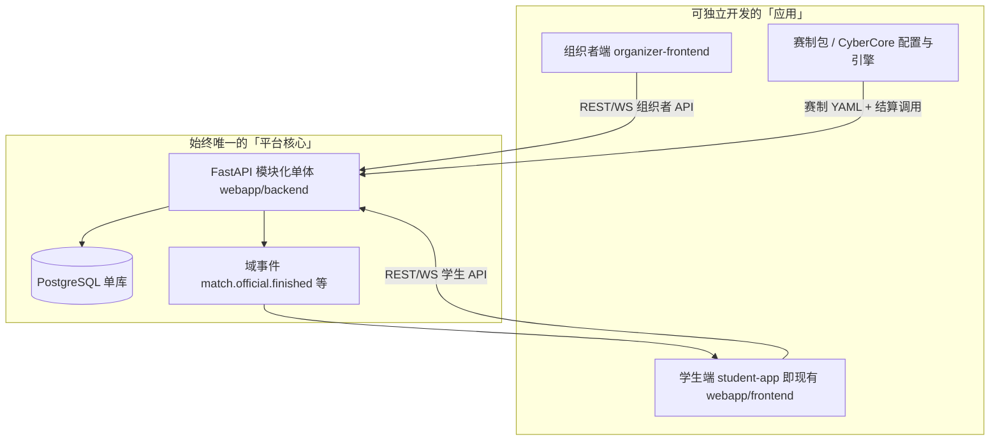
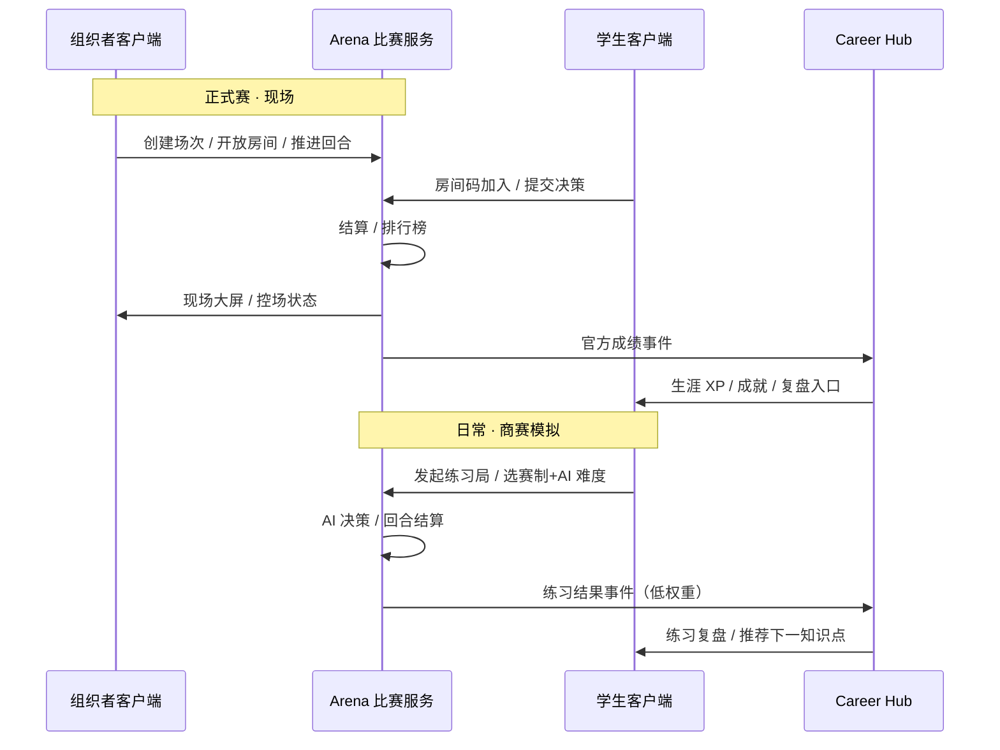
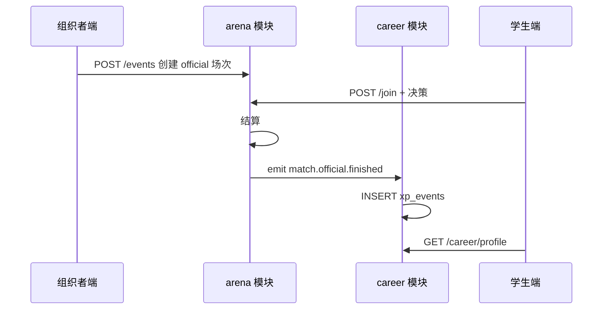

# 分项目开发与集成流程

> **文档定位**：可执行的工程协作手册——组织者端 → 赛制包 → 学生端竖切；单库共享、契约先行、AI 会话边界。
>
> **读者**：产品、架构、分模块开发者  
> **配套**：[`08-工程现状与webapp实现详表.md`](./08-工程现状与webapp实现详表.md) · [`03-技术架构与实现现状.md`](./03-技术架构与实现现状.md) · [`04-实施路线与里程碑.md`](./04-实施路线与里程碑.md) · [`02-赛事体系与双端产品.md`](./02-赛事体系与双端产品.md) §五 · [`webapp/README.md`](./webapp/README.md)  
> **最后更新**：2026-05-19

---

## 目录

1. [核心结论](#一核心结论)
2. [总体架构图](#二总体架构图)
3. [推荐仓库形态](#三推荐仓库形态)
4. [分阶段开发流程](#四分阶段开发流程)
5. [共享数据库与域归属](#五共享数据库与域归属)
6. [AI 协作工作流](#六ai-协作工作流)
7. [八周执行日历](#七八周执行日历)
8. [与三步目标的对应关系](#八与三步目标的对应关系)
9. [文档维护与索引](#九文档维护与索引)

---

## 一、核心结论

| 误区 | 正确做法 |
|------|----------|
| 「多个项目」=「多个数据库」 | **一个 PostgreSQL、一套 Alembic 迁移**；拆的是应用与包，不是库 |
| 组织者端、赛制、学生端各写各的后端 | **一个 FastAPI 模块化单体**；按域分包 `identity` / `arena` / `career` … |
| 三块都做完再「合并代码库」 | 每 2～3 周交付一条**竖切**：建赛 → 加入 → 打完 → 生涯入账 |
| AI 会话无边界地改全仓 | **契约先行**（OpenAPI + 域事件 + Schema）；每次会话声明「边界与完成定义」 |

　　当前 `webapp` 是 **「学生端 + 组织者路由混在同一前端 + 交易赛硬编码在后端」**。后续优先顺序为：

1. **组织者控制端**（独立前端入口，复用现有组织者 / 比赛 API）  
2. **基础商业模拟赛制**（1 种赛制 = 配置包 + Arena 域，而非再克隆一套 `trading.py`）  
3. **与 webapp 学生端结合**（通过 **API + 域事件** 写入 Career，而非第三次合并大前端）

---

## 二、总体架构图



| 层次 | 放什么 | 不要做什么 |
|------|--------|------------|
| **应用层** | 组织者 Vite 工程、学生 Vite 工程、未来大屏 | 各自连接独立的 SQLite / 自建库 |
| **服务层** | 一个 FastAPI，按域分包 | 为组织者单独起一套后端服务 |
| **内容层** | `商赛界面展示/`、`商赛主题与真题库/` → `content/game-configs/*.yaml` | 在多个前端里各写一套规则逻辑 |
| **数据层** | **一个 PG**，表按域归属 | 「组织者项目一个库、学生项目一个库」 |

### 2.1 双端协作（与 00- 文档 §1.4 一致）



---

## 三、推荐仓库形态

　　短期不必一次性迁到 `platform/`，但**命名与边界**建议按此目标渐进（对齐 [`./03-技术架构与实现现状.md`](../03-技术架构与实现现状.md) §二）：

```
商业模拟比赛架构思考/
├── webapp/                          # 过渡期：backend 仍是平台 API 真身
│   ├── backend/                     # → 未来可 rename 为 services/api
│   ├── frontend/                    # → 未来 rename 为 apps/web-student
│   ├── organizer-frontend/          # ★ 新建：组织者端（Phase 1）
│   └── README.md
├── packages/                        # ★ 新建（可后移）
│   ├── api-types/                   # OpenAPI 生成的 TS 类型
│   ├── cybercore-engine/            # 结算内核
│   └── game-config-schema/          # JSON Schema 校验赛制包
├── content/
│   └── game-configs/
│       └── trading-v1.yaml          # 「基础商业模拟」第一份可玩包
├── contracts/                       # ★ 强烈建议新建（仓库根或 webapp 下）
│   ├── README.md                    # 单库规则、事件名、表归属
│   ├── openapi/arena-organizer.yaml
│   ├── openapi/arena-student.yaml
│   └── events/career-events.md
├── 商赛界面展示/                     # 设计蓝本（不直接运行）
└── 根目录 01～09、07               # 权威文档；archive 存历史全文
```

**原则**：任何「分开的项目」都必须能回答——**我改的是哪个契约文件？** 没有契约就先写契约，再写代码。

---

## 四、分阶段开发流程

　　不要做成「组织者端 100% → 赛制 100% → 大爆炸合并」。每 **2～3 周** 交付一条可演示竖切。

### Phase 0 — 地基（约 1～2 周）

| 任务 | 产出 | 为何必须先做 |
|------|------|----------------|
| SQLite → PostgreSQL + Alembic | 迁移脚本、Docker 一键起库 | 多应用共享库的前提 |
| `match_kind`（`practice` \| `official`）、`xp_events` | 迁移 + 契约文档 | 区分练习赛 / 正式赛 |
| 建立 `contracts/` | Arena 组织者 + 学生最小 OpenAPI | 子项目与 AI 的「唯一真相」 |

**验收**：同一学生在 DB 中能查到「1 场 official + 1 场 practice」两条 `xp_events`（权重可不同）。

---

### Phase 1 — 组织者控制端 MVP（约 3～4 周）

**范围**（刻意收窄，复用现有后端）：

- 新建 `webapp/organizer-frontend/`（独立 Vite，建议端口 `5174`）
- 功能：**登录（组织者角色）→ 申请/档案 → 创建场次 → 开局/推进回合/结束 → 现场状态/排行榜**
- 后端：**不新建服务**；整理 `organizer.py`、`competitions.py`、`trading.py` 中组织者路径，必要时增加 BFF 聚合接口

**与现有 webapp 的关系**：

| 现在 | Phase 1 后 |
|------|------------|
| 学生站里也能点「创建比赛」 | 学生端**隐藏**组织者路由，仅保留「输入房间码加入」 |
| `admin` 混在学生导航 | 组织者端独立子域/路径，如 `organizer.localhost` |

**竖切验收**（教师 5 分钟闭环）：

1. 组织者端创建比赛，得到房间码  
2. 学生端（`webapp/frontend`）加入并完成一局交易赛  
3. 组织者端看到结束状态；DB 有 `match_kind=official` 的结算记录  

**此阶段不做**：CyberCore 全量、AI 复盘、大屏、多赛制。

**现有代码入口**（迁移组织者 UI 时优先对照）：

| 路径 | 说明 |
|------|------|
| `frontend/src/pages/Organizer/CreateEventPage.tsx` | 创建比赛页 |
| `backend/app/api/organizer.py` | 组织者 API |
| `backend/app/api/competitions.py` | 房间码与生命周期 |
| `backend/app/api/trading.py` | 交易赛结算与控回合 |

---

### Phase 2 — 基础商业模拟赛制（约 4～6 周）

　　「完整开发」定义为：**1 种赛制从配置 → 结算 → UI 全链路可配置**，而非再写一套 `trading.py` 克隆。

| 线 | 目录 | 交付 |
|----|------|------|
| **A. 赛制包（内容）** | `content/game-configs/trading-v1.yaml` + [`./商赛界面展示/00-框架配置Schema与接口契约.md`](../商赛界面展示/00-框架配置Schema与接口契约.md) | 回合数、商品、手续费、阶段机——教研可改 YAML |
| **B. 引擎（代码）** | `packages/cybercore-engine` 或 `backend/app/domains/arena/` | `load_config()` → `reduce(state, action)` → `settle()` |

**与双端的关系**：

- 组织者端：创建场次时选择 **`game_config_id`**（下拉来自配置目录）  
- 学生端：局内 UI 可对齐现有 `TradingGamePage`，状态字段服从配置 Schema  

**竖切验收**：

- 修改 YAML 中「回合数 / 初始资金」**不改 Python** 即可开新局  
- 组织者端 + 学生端**无需改路由**即可跑新参数  

---

### Phase 3 — 与 webapp 五域结合（约 3～4 周）

　　「结合」= **事件进 Career**，不是把三个前端合并进一个 `App.tsx`。

```
Arena 结算完成
  → 发布 CloudEvent（contracts/events）
  → Career 写 xp_events（official 高权重 / practice 低权重）
  → 学生端 Career / Quest / Athena 入口可见
```

| 模块 | 最小结合 |
|------|----------|
| **Career** | `GET /career/profile` 展示「最近官方赛 / 最近练习」 |
| **Quest** | 每日任务「完成 1 局练习」对接 Practice API |
| **Athena** | 仅 official 局末异步 Debrief（可先模板，后 RAG） |
| **Atlas** | 复盘携带 1 个薄弱知识点 ID（字段先定，数据可 mock） |

**竖切验收**：学生完成正式赛后，生涯页 XP 增加且标签为 `official`；练习赛标签为 `practice`。

---

### Phase 4 及以后（不阻塞前三步）

| 项 | 参考 |
|----|------|
| Practice 模式 + AI 对手 | [`04-`](./04-实施路线与里程碑.md) §五 · archive [`05-AI深度融合设计`](../inspire/archive/商业模拟教育平台/05-AI深度融合设计.md) |
| 第 2 种赛制 | 复制「配置包 + UI 切片」，不复制后端 |
| 教师/机构看板 | 可并入组织者端 Tab（见 [`04-`](./04-实施路线与里程碑.md) §五） |
| 24 个月全路线 | [`04-实施路线与里程碑.md`](./04-实施路线与里程碑.md) |

---

## 五、共享数据库与域归属

　　**一个库**，每张表有**唯一主人（域模块）**：

| 域 | 拥有的表（示例） | 谁可以写 |
|----|------------------|----------|
| **identity** | `users`, `organizations`, `classes` | 仅 identity 模块 |
| **arena** | `competition_events`, `matches`, `match_states`, `organizer_profiles` | arena 模块；组织者/学生 API 均调用它 |
| **career** | `career_profiles`, `xp_events` | **仅**通过事件消费者写入；禁止 `trading` 直接改 `user.xp` |
| **content** | `game_configs` 或配置版本表 | 导入脚本 + 只读 API |

### 5.1 强制规则（写入 `contracts/README.md`）

1. **迁移只在一处**：`webapp/backend/alembic/`（未来 `services/api/alembic/`）  
2. 组织者端、学生端、赛制包工程 **禁止** 对生产库 `create_engine`  
3. 跨域需求使用 **API 或域事件**；禁止在 UI 层直接 JOIN 他域私有表  

### 5.2 跨域数据流



### 5.3 Arena 双模式（对齐 [`02-`](./02-赛事体系与双端产品.md) §五）

| 模式 | 客户端 | 后端标识 | 优先交付 |
|------|--------|----------|----------|
| **Practice** 商赛模拟 | 学生端 | `match_kind=practice`，对手=AI | P0：1 种赛制 + Bot；练习 XP |
| **Official** 正式赛 | 学生加入 + 组织者控场 | `match_kind=official`，`organizer_id` | P0：拆组织者前端；P1：大屏/导出 |

　　两种模式共用 **CyberCore 结算内核**；差异在：是否绑定组织者场次、是否允许 AI 替补、生涯入账权重、是否进入赛季主榜。

---

## 六、AI 协作工作流

　　多项目 + 单库最易混乱于：**会话无边界、直接改共享表、类型定义三份不一致**。建议固定以下节奏。

### 6.1 每次开 AI 任务前：会话简报模板

```markdown
## 本次边界
- 应用：organizer-frontend | student-frontend | arena-backend | cybercore-config
- 契约：contracts/openapi/arena-organizer.yaml §x.x
- 禁止：改 career 表结构、改学生端无关路由、新增第二个数据库

## 完成定义
- [ ] 组织者能……
- [ ] 迁移文件：alembic/versions/xxx.py（若有）
- [ ] 手测步骤：……
```

　　将上述内容贴在对话开头，比长篇自然语言需求更有效。

### 6.2 开发顺序：契约 → 迁移 → 后端 → 前端 → 手测

| 步骤 | AI 适合做什么 | 人工把关 |
|------|----------------|----------|
| 1 | 根据 Schema 文档起草 OpenAPI 片段 | 字段是否与现有 `trading_competition` 模型一致 |
| 2 | 写 Alembic + SQLAlchemy 模型 | 是否破坏现有房间码链路 |
| 3 | 实现 API + 单测（结算、join） | 幂等、并发回合 |
| 4 | 组织者或学生 UI | 是否误用 `mockPlatform` |
| 5 | 更新 `README.md` 手测路径 | 演示模式是否标注 |

### 6.3 何时开新对话

| 场景 | 建议 |
|------|------|
| 只做组织者端页面 | **新对话**；仅 attach `organizer-frontend` + `contracts/openapi/arena-organizer.yaml` |
| 抽离 trading 到 arena 域 | **新对话**；attach `trading.py` + CyberCore 文档 + 契约 |
| 学生 Career 展示 | attach career 相关；**禁止**改 trading 结算逻辑 |
| 赛制 YAML 调参 | 仅 attach `content/game-configs` + Schema |

### 6.4 建议为 AI 建立的仓库锚点

| 文件 | 内容 |
|------|------|
| `contracts/README.md` | 单库规则、事件名、表归属 |
| `webapp/AGENTS.md`（可选） | 启动命令、端口、demo 账号、禁止事项 |
| `content/game-configs/README.md` | YAML 字段说明 + `trading-v1` 示例 |

### 6.5 与规划文档的分工

| 文档 | 在流程中的用法 |
|------|----------------|
| [`08-`](./08-工程现状与webapp实现详表.md) | 路由/API、Bug 清单 |
| [`04-`](./04-实施路线与里程碑.md) | 24 个月节奏；**当前仅做 P1 子集** |
| [`商赛界面展示/00-解耦声明式…`](./商赛界面展示/00-解耦声明式商业模拟框架总览.md) | Phase 2 引擎与配置包蓝本 |
| archive [`05-AI深度融合设计`](./inspire/archive/商业模拟教育平台/05-AI深度融合设计.md) | Phase 3 之后再上 Athena/Demia/Rival |

---

## 七、八周执行日历

| 周 | 焦点 | 可演示结果 |
|----|------|------------|
| W1 | PG 迁移 + `match_kind` + `xp_events` + `contracts/` 起草 | 迁移可跑 |
| W2 | 新建 `organizer-frontend`，迁移 CreateEvent + 控场页 | 组织者独立入口能建赛 |
| W3 | 学生端隐藏组织者路由；官方赛 → `xp_events(official)` | 双端联调通过 [`04-`](./04-实施路线与里程碑.md) 验收 |
| W4 | `trading` 抽到 `domains/arena`；创建赛可选 config | 后端结构清晰 |
| W5～6 | `trading-v1.yaml` + Schema 校验 + 配置加载 | 改 YAML 不改代码 |
| W7 | Practice API 骨架 + 学生端「练习」入口（可先 Bot） | practice 入账 |
| W8 | Career/Quest 读 API；减少 mock 依赖 | 关闭 Demo 仍可演示生涯 |

---

## 八、与三步目标的对应关系

| 你的想法 | 建议落地 | 注意 |
|----------|----------|------|
| 先开发组织者控制端 | `organizer-frontend` + 整理组织者 API | 后端不拆，先拆入口与路由 |
| 完整开发基础商业模拟 | **一个赛制包 + arena 域** | 内容在 `content/`，引擎在 `packages/` 或 `domains/arena` |
| 与 webapp 结合 | 学生端继续用 `webapp/frontend` | 结合点 = API + 事件 + Career |
| 以后很多项目分开开发 | Monorepo：**多 app + 多 package + 单 api + 单库** | 用契约与域归属代替「多库」 |

### 8.1 五域补齐顺序（与 [`04-`](./04-实施路线与里程碑.md) §五 一致）

1. **Career Hub（P0）** — `career_profiles`、`xp_events`（`source: practice \| official`）  
2. **组织者客户端（P0）** — 拆控场 App；学生端隐藏组织者路由  
3. **商赛模拟 vs AI（P0）** — Practice Match API + 学生入口  
4. **Quest + Credenti（P0）** — 每日任务与练习局挂钩  
5. **Atlas 掌握度（P1）** — 测验与练习薄弱点联动  
6. **CyberCore v1（P1）** — 正式赛与练习赛共用 YAML 赛制包  
7. **Athena Debrief（P1）** — 正式/练习复盘分流  
8. **Demia / Rival（P2）** — 练习赛对手人格层  
9. **OPC Phase A（P2）** — IDEATE、Gateway、两员工任务流  
10. **教师/机构看板（P3）** — 可与组织者端合并 Tab  

---

## 九、文档维护与索引

### 9.1 相关文档

| 文档 | 用途 |
|------|------|
| [`webapp/README.md`](./webapp/README.md) | 安装、启动、API |
| [`08-`](./08-工程现状与webapp实现详表.md) | 路由/API 全表、Bug 清单 |
| 本文档 | 分项目开发顺序、单库规则、AI 协作 |
| [`01-`](./01-平台愿景与产品架构.md) · [`04-`](./04-实施路线与里程碑.md) | 五域与路线 |

### 9.2 维护说明

- 新增 `organizer-frontend` 或 `contracts/` 时，更新本文 §三目录树与 §9 索引。  
- Phase 0～3 验收标准变更时，同步更新 §四、§七，并回写 [`08-`](./08-工程现状与webapp实现详表.md) 若存在冲突。  
- 赛制从硬编码迁为 CyberCore 包时，在 §四 Phase 2 注明版本与 `game_config_id`。  

### 9.3 建议的下一步工程动作

| 优先级 | 动作 | 产出 |
|--------|------|------|
| P0 | 创建 `contracts/`（OpenAPI 草案 + 事件列表 + README） | AI 与各子项目契约锚点 |
| P0 | 脚手架 `webapp/organizer-frontend/`，迁移 `CreateEventPage` | 组织者独立入口 |
| P0 | Alembic：`match_kind`、`xp_events` | 双模式生涯入账基础 |

---

*商域 BizSim Edu · 多应用、单平台、契约集成*
