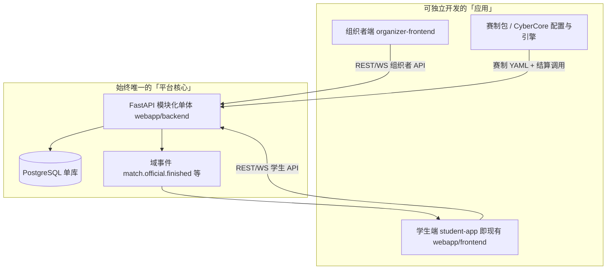
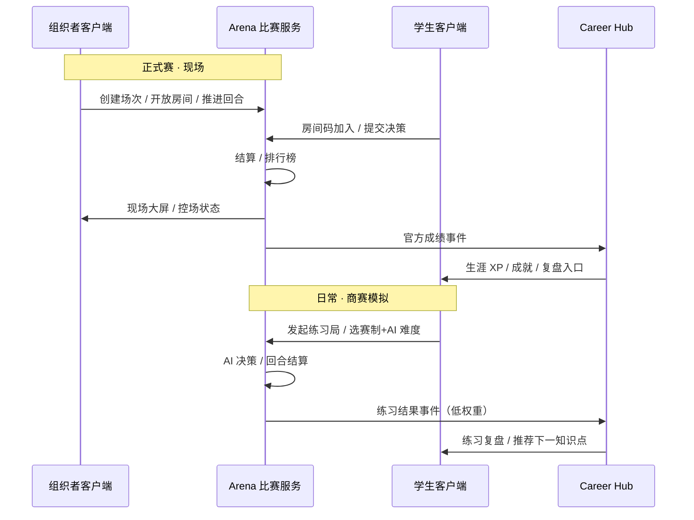
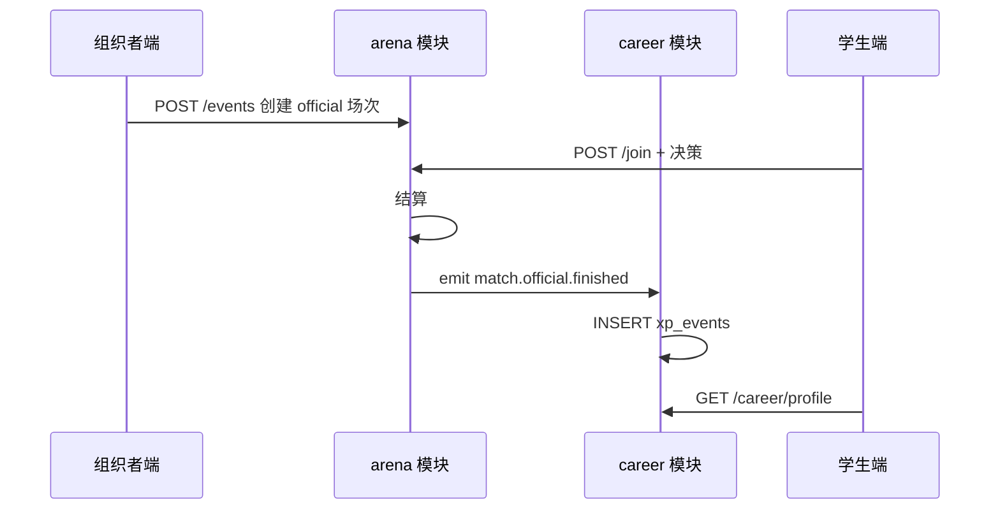

# 分项目开发与集成流程

> **文档定位**：可执行的工程协作手册——组织者端 → 赛制包 → 学生端竖切；单库共享、契约先行、AI 编程上下文注入。
>
> **读者**：产品、架构、分模块开发者  
> **配套**：[`08-工程现状与webapp实现详表.md`](./08-工程现状与webapp实现详表.md) · [`03-技术架构与实现现状.md`](./03-技术架构与实现现状.md) · [`04-实施路线与蓝图.md`](./04-实施路线与里程碑.md) · [`02-赛事体系与双端产品.md`](./02-赛事体系与双端产品.md) §五 · [`webapp/README.md`](./webapp/README.md)  
> **最后更新**：2026-05-21

---

## 目录

1. [核心结论](#一核心结论)
2. [总体架构图](#二总体架构图)
3. [推荐仓库形态](#三推荐仓库形态)
4. [分阶段开发流程](#四分阶段开发流程)
5. [共享数据库与域归属](#五共享数据库与域归属)
6. [AI 编程协作工作流](#六ai-编程协作工作流)
7. [与蓝图的对应关系](#七与蓝图的对应关系)
8. [文档维护与索引](#八文档维护与索引)

---

## 一、核心结论

| 误区 | 正确做法 |
|------|----------|
| 「多个项目」=「多个数据库」 | **一个 PostgreSQL、一套 Alembic 迁移**；拆的是应用与包，不是库 |
| 组织者端、赛制、学生端各写各的后端 | **一个 FastAPI 模块化单体**；按域分包 `identity` / `arena` / `career` … |
| 三块都做完再「合并代码库」 | 每 2～3 周交付一条**竖切**：建赛 → 加入 → 打完 → 生涯入账 |
| AI 会话无边界地改全仓 | **契约先行**（OpenAPI + 域事件 + Schema）；每次会话声明「边界与完成定义」 |

### 当前现状（2026-05-21）

　　以下为截至本日的工程进展：

- ✅ **组织者端已独立**：`organizer-frontend`（:5174），学生端已无控制台入口
- ✅ **Arena / Cybercore / Career 域与 `games/trading`、`games/techventure` 引擎已分层**
- ✅ **三赛制并存**：`trading-v1`（回合制）+ `trading-v2-rts`（浮生记即时 + WS）+ `techventure-v1`（队伍策略赛）
- ✅ **RTS 调度器单写 tick + WebSocket 推送 + HTTP 只读**
- ✅ **练习赛全闭环**：`POST /practice/trading/start`（浮生记）+ `POST /practice/techventure/start`（TechVenture）→ AI 对手 → 自动推进 → 低权重 XP
- ✅ **正式赛全闭环**：组织者建赛 → 房间码 → 交易 → 结束 → XP 入账
- ✅ **TechVenture 迁移**：通用 `ArenaTeam` 队伍模型 + v6 引擎 Python 翻译 + 四端 React（学生+组织者+大屏+评委）

　　仍待完成：

1. **Career 前端读账本**（`/career` 对接 `xp_events` 或聚合 API，替代 mock）
2. **`contracts/`** OpenAPI 与域事件文档（子项目/AI 协作的单一真相）
3. **正式赛控场完善**（全员提交校验、`decision_time` 计时、末轮自动结算）

---

## 二、总体架构图



| 层次 | 放什么 | 不要做什么 |
|------|--------|------------|
| **应用层** | 组织者 Vite 工程、学生 Vite 工程、未来大屏 | 各自连接独立的 SQLite / 自建库 |
| **服务层** | 一个 FastAPI，按域分包 | 为组织者单独起一套后端服务 |
| **内容层** | [`inspire/b商赛界面展示/`](./inspire/b商赛界面展示/)、[`inspire/a商赛主题与真题库/`](./inspire/a商赛主题与真题库/) → `webapp/backend/content/game-configs/*.yaml` | 在多个前端里各写一套规则逻辑 |
| **数据层** | **一个 PG**，表按域归属 | 「组织者项目一个库、学生项目一个库」 |

### 2.1 双端协作



---

## 三、推荐仓库形态

　　短期不必一次性迁到 `platform/`，但**命名与边界**建议按此目标渐进（对齐 [`03-`](./03-技术架构与实现现状.md) §二）：

```
businessmatch-v1/
├── webapp/                          # 过渡期：backend 仍是平台 API 真身
│   ├── backend/                     # → 未来可 rename 为 services/api
│   ├── frontend/                    # → 未来 rename 为 apps/web-student
│   ├── organizer-frontend/          # ★ 组织者端（:5174）✅
│   ├── docker-compose.yml           # ★ 三端编排 backend + student + organizer
│   └── README.md
├── packages/                        # ★ 新建（可后移）
│   ├── api-types/                   # OpenAPI 生成的 TS 类型
│   ├── cybercore-engine/            # 结算内核
│   └── game-config-schema/          # JSON Schema 校验赛制包
├── webapp/backend/content/          # ★ 当前真身（非仓库根 content/）
│   └── game-configs/
│       ├── trading-v1.yaml          # 回合制倒卖 ✅
│       ├── trading-v2-rts.yaml      # 浮生记 RTS（5s tick · WS）✅
│       └── techventure-v1.yaml      # TechVenture 队伍策略赛 ✅
├── contracts/                       # ★ 强烈建议新建（仓库根或 webapp 下）
│   ├── README.md                    # 单库规则、事件名、表归属
│   ├── openapi/arena-organizer.yaml
│   ├── openapi/arena-student.yaml
│   └── events/career-events.md
├── inspire/                          # a～f 内容资产 + 50～72 灵感（见 00- §二）
└── 根目录 00～09（不含07）            # 权威文档；07 在 inspire/
```

**原则**：任何「分开的项目」都必须能回答——**我改的是哪个契约文件？** 没有契约就先写契约，再写代码。

---

## 四、分阶段开发流程

　　不要做成「组织者端 100% → 赛制 100% → 大爆炸合并」。每 **2～3 周** 交付一条可演示竖切。以下 Phase 与 [04- 蓝图](./04-实施路线与里程碑.md) §二对齐。

### Phase A — 商赛引擎闭环（当前阶段）

| 任务 | 产出 | 状态 |
|------|------|------|
| Arena 域 + `trading-v1` + `trading-v2-rts` + `techventure-v1` | 域分包 + 三赛制引擎 + `ArenaTeam` 队伍模型 | ✅ |
| `practice` API + 学生练习入口 + AI 对手 | 一键开练 + 自动推进 | ✅ |
| 组织者独立端 | `organizer-frontend` :5174 | ✅ |
| `match_kind` + `xp_events` | 双模式 + 幂等账本 | ✅ |
| Career 前端读账本 | `/career` 对接真实 XP | 🔴 |
| `contracts/` | OpenAPI + 域事件 + 表归属 | 🔴 |
| 正式赛控场完善 | 全员提交校验 + 计时 + 末轮自动结算 | 🟡 |

**验收**：学生完成一场正式赛 + 一场练习赛后，Career 页展示真实 XP（非 mock）。

---

### Phase B — 智能教练与日常体验

| 任务 | 验收 |
|------|------|
| Athena-Debrief（规则模板） | 正式赛结束自动生成复盘卡片 |
| Quest 服务 + 练习挂钩 | 每日任务可完成 |
| Career Profile API | `GET /career/profile` 返回真实数据 |
| SQLite → PG + Alembic | 迁移通过、Docker 一键起库 |

**验收**：学生正式赛结束后看到复盘卡片；Quest 完成计入 streak。

---

### Phase C — 生涯与自我认知

| 任务 | 验收 |
|------|------|
| LangGraph 编排上线 | Athena-Debrief RAG + 记忆 |
| Persona 测评 | 性格画像 + 赛制推荐 |
| 五维雷达真实化 | 数据来源非 mock |

**验收**：学生在 Career 页看到基于真实数据的五维雷达与 Athena 路径建议。

---

### Phase D～F

　　知识图谱、课程生态、OPC、规模化——详见 [04-](./04-实施路线与里程碑.md) §二。

---

## 五、共享数据库与域归属

　　**一个库**，每张表有**唯一主人（域模块）**：

| 域 | 拥有的表（示例） | 谁可以写 |
|----|------------------|----------|
| **identity** | `users`, `organizations`, `classes` | 仅 identity 模块 |
| **arena** | `competition_events`, `matches`, `match_states`, `organizer_profiles` | arena 模块；组织者/学生 API 均调用它 |
| **career** | `career_profiles`, `xp_events` | **仅**通过事件消费者写入；禁止 `trading` 直接改 `user.xp` |
| **content** | `game_configs` 或配置版本表 | 导入脚本 + 只读 API |

### 5.1 强制规则（写入 `contracts/README.md`）

1. **迁移只在一处**：`webapp/backend/alembic/`（未来 `services/api/alembic/`）  
2. 组织者端、学生端、赛制包工程 **禁止** 对生产库 `create_engine`  
3. 跨域需求使用 **API 或域事件**；禁止在 UI 层直接 JOIN 他域私有表  

### 5.2 跨域数据流



### 5.3 Arena 双模式（对齐 [`02-`](./02-赛事体系与双端产品.md) §五）

| 模式 | 客户端 | 后端标识 | 现状 |
|------|--------|----------|------|
| **Practice** 商赛模拟 | 学生端 | `match_kind=practice`，对手=AI | ✅ v1 + v2 RTS + 三档 AI |
| **Official** 正式赛 | 学生加入 + 组织者控场 | `match_kind=official`，`organizer_id` | ✅ 回合制 + 控场；控场规则待完善 |

　　两种模式共用 **CyberCore 结算内核**；差异在：是否绑定组织者场次、是否允许 AI 替补、生涯入账权重、是否进入赛季主榜。

---

## 六、AI 编程协作工作流

　　多项目 + 单库最易混乱于：**会话无边界、直接改共享表、类型定义三份不一致**。建议固定以下节奏。

### 6.1 AI 编程上下文注入清单

　　每次开新 AI 编程对话时，根据任务范围 attach 对应文档组合：

| 任务类型 | 推荐 attach | 禁止 |
|----------|-------------|------|
| 赛制/Arena 开发 | `03-` + `08-` §2.7 + `ARCHITECTURE.md` + 相关 YAML | 改 Career 表 |
| 前端页面 | `08-` §2.6 + §2.2 功能矩阵 | 新增后端路由 |
| Career/生涯 | `01-` §三 + `03-` §三 career 行 + `08-` §2.7 | 改 `games/trading` 结算 |
| OPC | `05-` + `03-` §八 + `OPC/02-` | 抢 Phase A 优先级 |
| 智能体 | `03-` §八 全节 + `05-` §六 | 跳过规则层直接上 LLM |
| 全局架构 | `00-` + `03-` + `09-` | 单次改多个域 |

### 6.2 每次开 AI 任务前：会话简报模板

```markdown
## 本次边界
- 应用：organizer-frontend | student-frontend | arena-backend | cybercore-config
- 契约：contracts/openapi/arena-organizer.yaml §x.x
- 禁止：改 career 表结构、改学生端无关路由、新增第二个数据库

## 完成定义
- [ ] 组织者能……
- [ ] 迁移文件：alembic/versions/xxx.py（若有）
- [ ] 手测步骤：……
```

　　将上述内容贴在对话开头，比长篇自然语言需求更有效。

### 6.3 开发顺序：契约 → 迁移 → 后端 → 前端 → 手测

| 步骤 | AI 适合做什么 | 人工把关 |
|------|----------------|----------|
| 1 | 根据 Schema 文档起草 OpenAPI 片段 | 字段是否与现有模型一致 |
| 2 | 写 Alembic + SQLAlchemy 模型 | 是否破坏现有房间码链路 |
| 3 | 实现 API + 单测（结算、join） | 幂等、并发回合 |
| 4 | 组织者或学生 UI | 是否误用 `mockPlatform` |
| 5 | 更新 `README.md` 手测路径 | 演示模式是否标注 |

### 6.4 何时开新对话

| 场景 | 建议 |
|------|------|
| 只做组织者端页面 | **新对话**；仅 attach `organizer-frontend` + `contracts/openapi/arena-organizer.yaml` |
| 学生端接 practice / Career | **新对话**；attach `practice.py` + `frontend` Games 页；**禁止**改 `games/trading/engine` 结算 |
| 增第二赛制 | attach `domains/arena/ARCHITECTURE.md` + 新 YAML + 新 `games/<engine>/` |
| 赛制 YAML 调参 | 仅 attach `webapp/backend/content/game-configs` + Schema |

### 6.5 建议为 AI 建立的仓库锚点

| 文件 | 内容 |
|------|------|
| `contracts/README.md` | 单库规则、事件名、表归属 |
| `webapp/AGENTS.md`（可选） | 启动命令、端口、demo 账号、禁止事项 |
| `webapp/backend/content/game-configs/README.md` | YAML 字段说明 + `trading-v1` 示例 |
| `webapp/backend/app/domains/arena/ARCHITECTURE.md` | 域分层与新增赛制 checklist |

---

## 七、与蓝图的对应关系

　　以下对照 [04- 有序阶段蓝图](./04-实施路线与里程碑.md) §二：

| 蓝图阶段 | 本文对应 | 当前状态 |
|----------|----------|----------|
| **Phase A 商赛引擎闭环** | §四 Phase A | 🟡 核心闭环 ✅；Career 前端 / contracts 待完成 |
| **Phase B 智能教练** | §四 Phase B | 🔴 待开发 |
| **Phase C 生涯与自我认知** | §四 Phase C | 🔴 待开发 |
| **Phase D 知识图谱与课程** | — | 🔴 远期 |
| **Phase E OPC** | — | 🔴 远期 |
| **Phase F 规模化** | — | 🔴 远期 |

### 7.1 五域补齐顺序

1. **Career Hub（Phase A）** — `career_profiles`、`xp_events`（`source: practice | official`）  
2. **组织者客户端（Phase A）** — ✅ 已独立  
3. **商赛模拟 vs AI（Phase A）** — ✅ 练习赛全闭环  
4. **Quest + Credenti（Phase B）** — 每日任务与练习局挂钩  
5. **Atlas 掌握度（Phase B～C）** — 测验与练习薄弱点联动  
6. **CyberCore v1+（Phase B）** — 正式赛与练习赛共用 YAML 赛制包  
7. **Athena Debrief（Phase B）** — 正式/练习复盘分流  
8. **Demia / Rival（Phase D）** — 练习赛对手人格层  
9. **OPC Phase A（Phase E）** — IDEATE、Gateway、两员工任务流  
10. **教师/机构看板（Phase F）** — 可与组织者端合并 Tab  

---

## 八、文档维护与索引

### 8.1 相关文档

| 文档 | 用途 |
|------|------|
| [`webapp/README.md`](./webapp/README.md) | 安装、启动、API |
| [`08-`](./08-工程现状与webapp实现详表.md) | 路由/API 全表、Bug 清单、百分比唯一真相源 |
| 本文档 | 分项目开发顺序、单库规则、AI 编程协作 |
| [`01-`](./01-平台愿景与产品架构.md) · [`04-`](./04-实施路线与里程碑.md) | 愿景、蓝图与成本 |

### 8.2 维护说明

- 新增 `contracts/` 时，更新本文 §三目录树与 §八索引。  
- Phase 验收标准变更时，同步更新 §四，并回写 [`08-`](./08-工程现状与webapp实现详表.md) 若存在冲突。  
- 赛制从硬编码迁为 CyberCore 包时，在 §四 注明版本与 `game_config_id`。  
- **推送 GitHub 前**：必须先完成根目录说明文档与代码对齐（见 [`.cursor/rules/docs-align-before-push.mdc`](./.cursor/rules/docs-align-before-push.mdc)）；大型更新不得只推代码、留 `00～09`/`08-` 陈旧。

### 8.3 Cursor 规则（AI 与协作者）

| 规则文件 | 作用 |
|----------|------|
| [`.cursor/rules/docs-align-before-push.mdc`](./.cursor/rules/docs-align-before-push.mdc) | `alwaysApply`：用户要求推送远程前，强制文档对齐 checklist |  

### 8.4 建议的下一步工程动作

| 优先级 | 动作 | 产出 |
|--------|------|------|
| P0 | Career 前端对接 `xp_events` | `/career` 展示真实 XP |
| P0 | 创建 `contracts/`（OpenAPI 草案 + 事件列表 + README） | AI 与各子项目契约锚点 |
| P1 | 正式赛控场完善（全员校验 + 计时 + 末轮结算） | 10 人赛可靠运行 |
| P1 | Alembic + PG 迁移 | 规模化基础 |

---

*商域 BizSim Edu · 多应用、单平台、契约集成*
