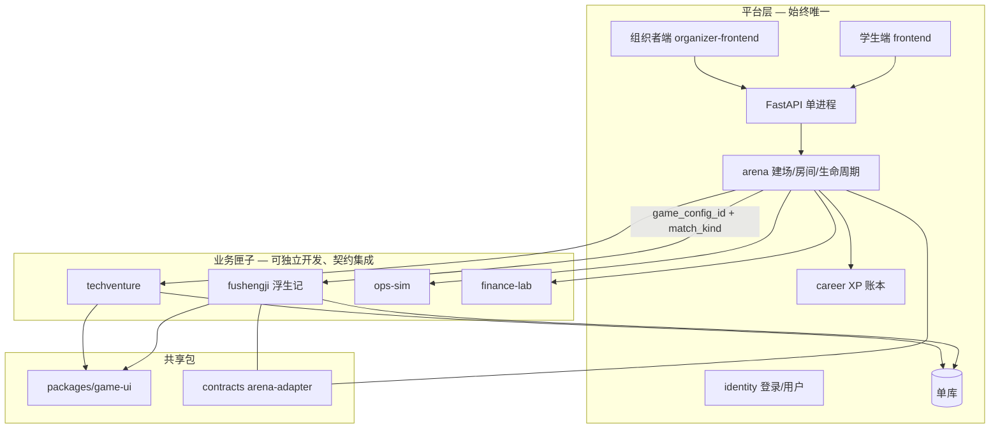

# 四赛制匣子开发与集成指导

> **文档定位**：汇总 2026-06 部署与架构讨论结论，作为**四赛制并行开发**与**平台挂载**的可执行指导；与 [`09-分项目开发与集成流程`](./09-分项目开发与集成流程.md) 互补（09- 偏竖切协作，本文偏赛制边界与 Monorepo 目标形态）。
>
> **读者**：主理人、架构、各赛制负责人、部署运维  
> **权威配套**：[`02-` §5.0](./02-赛事体系与双端产品.md) · [`arena/ARCHITECTURE.md`](./webapp/backend/app/domains/arena/ARCHITECTURE.md) · [`08-` AI_DEFAULT](./08-工程现状与webapp实现详表.md#ai_default) · [blueprint-coding.mdc](./.cursor/rules/blueprint-coding.mdc)  
> **构想参考**（非编程契约）：[inspire/99-商赛前端游戏化 UI 组件库调研与方案](./inspire/99-商赛前端游戏化UI组件库调研与方案.md) · [inspire/97-商赛设计引擎架构 PRD](./inspire/97-商赛设计引擎架构PRD.md)  
> **最后更新**：2026-06-02

---

## 目录

1. [本轮讨论结论](#一本轮讨论结论)
2. [四赛制产品矩阵](#二四赛制产品矩阵)
3. [架构决策：平台 + 四业务匣子](#三架构决策平台--四业务匣子)
4. [职责边界](#四职责边界)
5. [TechVenture 双轨与合并策略](#五techventure-双轨与合并策略)
6. [统一前端 game-ui](#六统一前端-game-ui)
7. [目标仓库结构（路线 B）](#七目标仓库结构路线-b)
8. [Arena 适配契约要点](#八arena-适配契约要点)
9. [推进顺序与 Phase 对齐](#九推进顺序与-phase-对齐)
10. [云部署现状（演示环境）](#十云部署现状演示环境)
11. [待办、禁忌与 AI 会话 attach](#十一待办禁忌与-ai-会话-attach)
12. [关联文档](#十二关联文档)

---

## 一、本轮讨论结论

| 议题 | 结论 |
|------|------|
| **产品形态** | 平台（Arena 壳 + 双前端 + 单 API）通过契约挂载 **四个独立业务匣子**（赛制引擎 + 赛制 UI），而非四个独立 GitHub 仓库或四套数据库 |
| **仓库策略** | 采纳 **路线 B：Monorepo**（`engines/` + `packages/game-ui/` + 现有 `webapp/` 渐进迁移），开发期匣子可独立 dev server / Docker 演示，**集成期仍单库单进程** |
| **UI 策略** | 共用商赛游戏化组件库（对齐 inspire/99-），平台 `Layout` 与比赛全屏壳分离；赛制 Layer2 组件各匣子自有 |
| **TechVenture** | 存在 **两套实现**（见 §五）；路演演示可保留 Node 独立四端 HTML；**平台真相源**为 `webapp` 内 Python v6 + React 四端 |
| **工作区清洁** | 取消对根目录 `/TechVenture/` 的长期 gitignore 或迁入 `engines/techventure/legacy`；禁止再建 `techventure-showcase` 等平行演示项目 |
| **部署** | BizSim `webapp` 三端 Docker 已上云；独立 Node TechVenture 以 systemd + **3780** 演示；旧 `/srv/schedule` 已删除，80/8000 可复用 |

---

## 二、四赛制产品矩阵

| 匣子 ID（规划） | 产品名 | 对标 / 场景 | 引擎现状（2026-06-02） | `game_config_id` |
|-----------------|--------|-------------|------------------------|------------------|
| **fushengji** | 浮生记（贸易） | 回合制 + RTS 即时商战 | ✅ `games/trading/` · `trading-v1` + `trading-v2-rts` | `trading-v1` · `trading-v2-rts` |
| **techventure** | TechVenture（创投） | 队伍策略 · 四端（玩/控/屏/评） | ✅ `games/techventure/` · 双 API | `techventure-v1` |
| **ops-sim** | 产销运营赛 | 阿思丹类产销运营（待建） | 🔴 未落地 | 待新增 YAML |
| **finance-lab** | 金融投研实验室 | 投研/交易模拟（待建） | 🔴 未落地 | 待新增 YAML |

　　新增赛制须走 CyberCore 声明式包（YAML + `games/<engine>/`），**禁止**克隆整份 `trading.py` 或绕过 Arena 建赛。 checklist 见 [`arena/ARCHITECTURE.md`](./webapp/backend/app/domains/arena/ARCHITECTURE.md)。

---

## 三、架构决策：平台 + 四业务匣子



| 方案 | 说明 | 本轮选择 |
|------|------|----------|
| A 四独立仓库 | 四个 GitHub repo + 四套部署 | ❌ 契约与 XP 分裂成本高 |
| **B Monorepo 匣子** | 同仓 `engines/*` + 集成时并入 `games/*` | ✅ **默认** |
| C 纯单体无匣子边界 | 全部堆在 `webapp/backend` | ❌ 四赛制并行时难协作 |

　　与 ADR-002（单库单进程）、ADR-003（域边界）、ADR-004（CyberCore 赛制）一致；若将来「匣子独立进程」须先写 ADR 推翻单进程假设。

---

## 四、职责边界

| 能力 | 平台（Arena / identity / career） | 业务匣子（赛制引擎） |
|------|-----------------------------------|----------------------|
| 用户登录、JWT | ✅ | ❌ 不自建用户表 |
| 创建比赛、`room_code`、`match_kind` | ✅ | ❌ 不直接 CRUD `competition_events`（须经 Arena API） |
| `game_config_id` 解析、YAML 加载 | Cybercore 读配置 ✅ | 提供配置包 + 引擎注册 |
| 回合/tick 推进、决策、结算 | 编排入口在 API | ✅ 引擎内实现；RTS 遵守调度器单写者 |
| 赛制专属表（如 `tv_*`、`trading_*`） | — | ✅ 匣子拥有；禁止他域直写 |
| 练习赛一键开练 | `practice` API 路由 | ✅ `practice_flow` 钩子 |
| 正式赛控场、大屏、评委 | 组织者 API 模块归属见 `08-` §2.7 | ✅ 赛制专属 admin 路由（如 `techventure_admin`） |
| 赛后 XP | `settle_match_rewards` / `grant_xp` | 只产出结算结果事件，**不**直改 `users.experience` |
| 全站导航、生涯 Hub、课程 | 学生端壳 | ❌ |
| 比赛全屏 UI、HUD、决策面板 | 路由挂载点 | ✅ 匣子 React 页面/组件 |

### 4.1 禁止事项（硬）

- 为组织者或某一赛制单独起 **第二套 API 进程或 SQLite**（演示用 Node 服务除外，且须标注非生产真相源）
- 在 `games/` 内直接创建/修改 **Arena 表**（`competition_events` 等）
- TechVenture 正式赛使用通用 `competitions/start` 而非 **`techventure/admin/*` 专用流**
- RTS HTTP `GET /state` 内调用 tick 推进或写入
- 新建 `techventure-showcase`、重复造四端 HTML 演示仓

---

## 五、TechVenture 双轨与合并策略

### 5.1 两套实现对照

| 维度 | **A：根目录 `/TechVenture/`**（Node） | **B：`webapp` 内 TechVenture**（Python + React） |
|------|--------------------------------------|--------------------------------------------------|
| 技术栈 | Express + TS，`public/*.html` 四端 | FastAPI + `v6_engine` + 学生/组织者 React 四路由 |
| 仓库可见性 | **`.gitignore` 第 15 行** `/TechVenture/` → IDE/工具常「灰色」 | ✅ Git 跟踪 |
| 部署示例 | `/srv/techventure`，端口 **3780**，systemd | Docker `bizsim-*`，API **8001**，学生 **8080** |
| 角色定位 | 路演/营内 **快速演示**、历史资产 | **平台集成真相源**、练习+正式闭环 |

### 5.2 合并主路径（建议）

1. **短期**：保留 Node 演示（3780），文档与脚本标明「非 XP/非 Arena 真相源」。
2. **中期**：取消 `/TechVenture/` gitignore，将 Node 代码迁至 `engines/techventure/legacy-node/` 或归档分支。
3. **长期**：仅维护 Python `games/techventure/` + React 四端；Node 版只读归档。
4. **引擎**：以 `v6_engine` 为规则真相源；Node 逻辑不反向成为生产规则源。

### 5.3 webapp 内已知缺口（开发 backlog）

- 无自动化测试；Career XP 未接入 TechVenture 结算
- 轮询与 snapshot/新闻同步待加强
- 控场顶栏 `current_round.status` 边界情况
- 大屏/评委路由 **无鉴权**（演示可接受，正式前须加固）

---

## 六、统一前端 game-ui

| 层级 | 内容 | 归属 |
|------|------|------|
| **L0 设计令牌** | 颜色、字体、间距、动效时长 | `packages/game-ui/tokens` |
| **L1 商赛通用** | 倒计时、资源条、排行榜卡、回合条、Toast/Modal | `packages/game-ui` |
| **L2 赛制专用** | 浮生记地图/RTS HUD、TV 三栏创投、产销沙盘、投研 K 线等 | 各 `engines/*/ui` 或 `webapp/frontend` 赛制目录渐进抽出 |
| **平台壳** | `Layout`、登录、生涯、课程 | `webapp/frontend` · `organizer-frontend` |

　　详细组件清单与选型见 [inspire/99-](./inspire/99-商赛前端游戏化UI组件库调研与方案.md)。**新赛制 UI 必须先复用 L0/L1**，再扩展 L2。

---

## 七、目标仓库结构（路线 B）

　　短期**不必一次性搬迁**；命名与边界按此渐进（与 [`09-` §三](./09-分项目开发与集成流程.md#三推荐仓库形态) 一致并细化）：

```text
businessmatch-v1/
├── packages/
│   ├── game-ui/                 # ★ 待建：商赛共用 UI（见 §六）
│   ├── api-types/               # OpenAPI → TS（已有规划）
│   └── game-config-schema/      # YAML Schema 校验
├── engines/                     # ★ 目标：四匣子源码（开发期可独立 package.json）
│   ├── fushengji/               # 从 games/trading + 前端 RTS/回合页抽出
│   ├── techventure/
│   │   └── legacy-node/         # 可选：自 /TechVenture/ 迁入
│   ├── ops-sim/                 # 待建
│   └── finance-lab/             # 待建
├── webapp/                      # 过渡期平台真身
│   ├── backend/app/games/       # 集成期：engines/* 的 Python 适配层落点
│   ├── frontend/                # 挂载 engines/*/ui 路由
│   ├── organizer-frontend/
│   └── contracts/               # arena-adapter、OpenAPI、bundled.yaml
├── inspire/a～f                 # 真题库、教研（内容母本）
└── 00～10                       # 权威文档（本文 = 10）
```

**集成期落点规则**：匣子逻辑最终在 `webapp/backend/app/games/<engine>/` 注册；`engines/` 是**开发边界**，不是第二个后端部署单元。

---

## 八、Arena 适配契约要点

　　正式契约文件维护于 [`webapp/contracts/`](./webapp/contracts/README.md)。每个匣子实现（或代码生成）适配层须满足：

| 契约面 | 平台调用匣子 | 匣子回调平台 |
|--------|--------------|--------------|
| **生命周期** | `on_match_created` · `on_player_joined` · `on_match_started` · `on_match_finished` | 不自行改 `competition_events.status` 枚举外语义 |
| **推进** | `advance_round` / RTS：`maybe_advance_rts`（仅调度器） | 返回新状态 DTO，不写他域表 |
| **决策** | `submit_decision(team_id, payload)` | 校验赛制 schema |
| **结算** | `finalize_match` → 排名 + XP 事件载荷 | 幂等；不直接 `grant_xp` |
| **配置** | `game_config_id` → YAML | `content/game-configs/<id>.yaml` |
| **练习** | `practice/start` 专用入口 | 同事务：人类决策 + AI + advance |

　　新增 `contracts/engines/arena-adapter.md`（或 OpenAPI extension）时，同步更新 `08-` §2.7 与 `export_openapi.py` 产出。

---

## 九、推进顺序与 Phase 对齐

| 顺序 | 工作包 | 产出 | Phase |
|------|--------|------|-------|
| 1 | **浮生记匣子样板** | 第一个 `engines/fushengji` 目录结构 + `game-ui` 最小集 + arena-adapter 文档 | A |
| 2 | **TechVenture 并轨** | gitignore 处理、Node 归档、XP 接入、大屏鉴权 | A |
| 3 | **contracts 硬化** | `bundled.yaml` diff 进 CI；Career 前端真实 XP | A |
| 4 | **ops-sim** | `ops-sim-v1.yaml` + 引擎骨架 + 组织者控场 MVP | A→B |
| 5 | **finance-lab** | 配置 + 引擎 + 学生练习入口 | B |
| 6 | **CDE / 规则编辑器** | 见 inspire/97-，不抢跑 Phase A 闭环 | C+ |

　　Phase A 门控不变：不建 `domains/world/`、不抢 OPC LangGraph。见 [`04-`](./04-实施路线与里程碑.md) 与 blueprint-coding §7。

---

## 十、云部署现状（演示环境）

> **环境**：`ubuntu@82.156.225.73`（密钥与 SSH 配置见主理人本机，**勿写入仓库**）。

### 10.1 BizSim webapp（`/srv/businessmatch-v1/webapp`）

| 服务 | 容器/进程 | 端口 | 说明 |
|------|-----------|------|------|
| 学生端 | `bizsim-student` | **8080** | 曾为避让 `/srv/schedule` 占用 80；schedule 已删，**可评估改回 80** |
| 组织者端 | `bizsim-organizer` | **5174** | |
| 后端 API | `bizsim-backend` | **8001** | 曾为避让 8000；**可评估改回 8000** |

　　构建注意：若 `package-lock` 与 Dockerfile `npm ci` 不一致，生产 Dockerfile 已改为 `npm install`；修复后宜恢复 `npm ci` 以可复现构建。

### 10.2 独立 Node TechVenture（`/srv/techventure`）

| 项 | 值 |
|----|-----|
| 来源 | 本机 `TechVenture/` tar 上传（排除 `node_modules`） |
| 进程 | `systemd` 单元 `techventure.service` |
| 端口 | **3780**（安全组须放行） |
| 入口 | `http://<host>:3780/` · `play.html` · `admin.html` · `screen.html` · `judge.html` |
| 域名 | 主理人文档提及 `techventures1.online` + Nginx；当前以直连 3780 为主 |

### 10.3 已清理项

- `/srv/schedule`（原占 80/8000）已删除
- 误建的 `techventure-showcase/` 已删除

---

## 十一、待办、禁忌与 AI 会话 attach

### 11.1 工程待办（按优先级）

| P | 项 | 说明 |
|---|-----|------|
| P0 | 撰写/落地 `contracts/engines/arena-adapter.md` | 四匣子统一挂载面 |
| P0 | 启动 `packages/game-ui` | 对齐 inspire/99- 的 P0 组件 |
| P1 | 处理 `/TechVenture/` gitignore + 迁入 `engines/techventure/legacy-node` | 恢复 AI/IDE 可见性 |
| P1 | 将云上演示构建修复 **commit 回 Git** | 组织者 TS 修复、Dockerfile、`docker-compose` 端口文件等 |
| P1 | TechVenture XP + 正式赛鉴权 | `08-` 成熟度对齐 |
| P2 | 学生端端口 80 / API 8000 回收 | schedule 删除后 |
| P2 | Nginx 反代 3780 → 域名 | 运维可选 |
| P3 | ops-sim · finance-lab 引擎骨架 | 见 §二 |

### 11.2 AI 编程会话 attach 建议

| 任务类型 | T1 attach |
|----------|-----------|
| 四赛制架构 / 新匣子脚手架 | 本文 + `arena/ARCHITECTURE.md` + `09-` §三 |
| 浮生记 / RTS | `08-` engine-rts 深读 + ADR-005 |
| TechVenture | 本文 §五 + `08-` TechVenture 行 + `techventure-v1.yaml` |
| game-ui 组件 | inspire/99-（构想）+ 本文 §六 |
| 云部署 | 本文 §十 + `webapp/README.md` |

### 11.3 文档维护

- 匣子落地或端口变更：更新本文 §二、§十，并回写 [`08-`](./08-工程现状与webapp实现详表.md) §5.1
- 新增引擎目录：更新 [`00-`](./00-项目全景与目录结构.md) 仓库树说明
- 若选型推翻单进程：须 **ADR** + 更新本文 §三

---

## 十二、关联文档

| 文档 | 用途 |
|------|------|
| [`09-分项目开发与集成流程`](./09-分项目开发与集成流程.md) | 竖切、单库、AI §6.0 开场 |
| [`02-赛事体系与双端产品`](./02-赛事体系与双端产品.md) | 练习/正式、`game_config_id` |
| [`08-工程现状与webapp实现详表`](./08-工程现状与webapp实现详表.md) | API/实现度真相源 |
| [`04-实施路线与里程碑`](./04-实施路线与里程碑.md) | Phase 排期 |
| [`arena/ARCHITECTURE.md`](./webapp/backend/app/domains/arena/ARCHITECTURE.md) | 新赛制 checklist |
| [inspire/99-商赛前端游戏化 UI](./inspire/99-商赛前端游戏化UI组件库调研与方案.md) | 组件库方案 |
| [docs/decisions/README.md](./docs/decisions/README.md) | ADR 002/003/004/005/006/007/008 |

---

*本文档由 2026-06 云部署与四赛制架构讨论整理；后续迭代以代码与 `08-` 为准，本文记录「应然」与「讨论定格」。*
