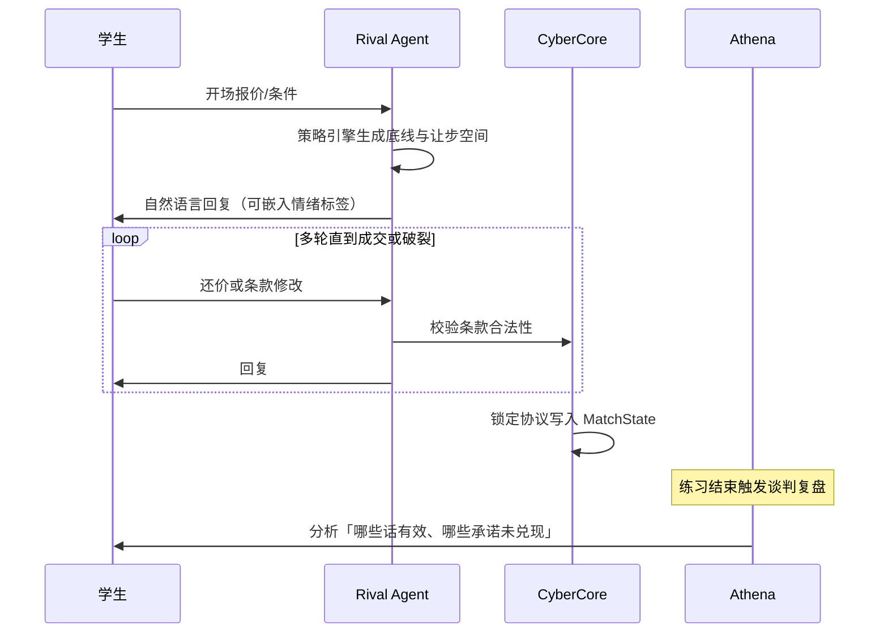

# 商业模拟教育平台 · AI 深度融合设计

> **文档定位**：将人工智能从「课后答疑插件」升级为贯穿**生涯模式、商赛、日常活动、个人练习**的核心能力层，包含三大支柱：**Athena 生涯导师**、**Demia POP 市场人群引擎**、**Rival 可对话博弈对手**。
>
> **参考**：[根目录 01-平台愿景与产品架构](../../01-平台愿景与产品架构.md)（Athena）、[inspire/58-AI赋能的商业教育革命.md](../58-AI赋能的商业教育革命.md)、[根目录 02-赛事体系与双端产品](../../02-赛事体系与双端产品.md)（NPC 评审、性格盲区）
>
> **最后更新**：2026-05-16

---

## 目录

1. [AI 战略定位：三层一体](#一ai-战略定位三层一体)
2. [Athena 生涯导师（AI 教师）](#二athena-生涯导师ai-教师)
3. [Demia：POP 人群与市场模拟](#三demiapop-人群与市场模拟)
4. [Rival：个人练习与谈判对手](#四rival个人练习与谈判对手)
5. [与 CyberCore 的集成架构](#五与-cybercore-的集成架构)
6. [赛制 × AI 能力矩阵](#六赛制--ai-能力矩阵)
7. [伦理、公平与成本](#七伦理公平与成本)
8. [实施阶段与接口清单](#八实施阶段与接口清单)

---

## 一、AI 战略定位：三层一体

```
┌─────────────────────────────────────────────────────────────────────────┐
│                    Athena 生涯导师（跨域 · 持续关系）                      │
│   引导生涯开启 │ 日常 Quest 教练 │ 课程陪学 │ 商赛复盘 │ 成长叙事          │
│   「你的商业教练，记得你每一章故事」                                        │
└───────────────────────────────┬─────────────────────────────────────────┘
                                │ 读取 CareerProfile + LearningRecord
                                ▼
┌──────────────────────────────┐    ┌──────────────────────────────────┐
│  Demia  POP 引擎（局内 · 环境） │    │  Rival  博弈对手（局内 · 角色）     │
│  模拟「人群」的需求、情绪、投票  │    │  策略对手 + 自然语言谈判/路演       │
│  影响市场参数与事件，非玩家席位   │    │  个人练习 / 人机排位（非正式）      │
└──────────────────────────────┘    └──────────────────────────────────┘
                │                                      │
                └──────────────┬───────────────────────┘
                               ▼
                    CyberCore 结算 ← 结构化决策
                    Ethos 审计 ← 对话与决策一致性
```

### 1.1 与 P 社《维多利亚》POP 概念的异同

| 维度 | Victoria 3 POP | 本平台 Demia |
|------|----------------|--------------|
| 本质 | 人口群体有职业、物质需求、政治倾向 | **教育向简化**：消费者/利益相关者/选民/劳工等「需求侧群体」 |
| 状态 | 规则表驱动，确定性高 | **规则骨架 + LLM 解释层**：数值由引擎算，叙事与微波动由 AI 生成 |
| 作用 | 影响生产、消费、政治 | 影响**需求曲线、品牌偏好、ESG 舆论、政策民意**等教学变量 |
| 可控性 | 玩家通过法律、建设干预 | 学生通过**产品、定价、沟通、伦理决策**干预；教师可锁定随机种子 |

　　Demia 不是复刻维多利亚的完整 POP 模拟，而是借用「**市场由多元人群构成**」这一直觉，用 AI 让群体反应**可感知、可对话、可复盘**，而非静态 CSV 参数。

### 1.2 设计原则（教育优先）

1. **AI 加深思考，不替代决策**：导师只追问与框架，不给最优解数值。
2. **局内 AI 可复盘、可解释**：每个 POP 波动、对手行动需有 `rationale` 字段入库。
3. **排位赛公平**：正式联赛 Demia 使用**种子化随机 + 无学生专属加成**；Rival 难度不泄露隐藏信息。
4. **人机练习与真人对局分离**：谈判练习默认不计入竞技 ELO，或单独「练习榜」。

---

## 二、Athena 生涯导师（AI 教师）

### 2.1 角色定义

　　**Athena** 是每位生涯用户的**长期 AI 教师**（非一次性聊天机器人），持有：

- `career_id` 全史 `LearningRecord`
- Persona 测评与五维能力曲线
- 图谱掌握度（Atlas）与单元完成轨迹（Academy）
- 对局 `DecisionLog` 与 Quest 完成质量

　　对真人教师：Athena 是**助教**（批改草案、班级摘要）；对学生：Athena 是**教练**（提问、复盘、计划）。

### 2.2 生涯模式全周期引导

| 阶段 | 触发 | Athena 行为 | 输出物 |
|------|------|-------------|--------|
| **开启生涯** | `career.started` | 短剧情 + 性格解读 + 首周目标（3 个 Quest + 1 图谱节点） | `career_plan_week1` |
| **每日登录** | 首次打开当日 | 今日建议路径（15 分钟 / 45 分钟两档） | 卡片推送 |
| **Quest 前** | 打开每日任务 | 说明任务与素养关联；「为什么要做」 | 无答案提示 |
| **Quest 后** | `quest.completed` | 轻量反思 2 问 + XP 意义 | `reflection_quest` |
| **课程单元中** | 模拟/测验卡住 | RAG 概念提示；苏格拉底式追问 | 不跳关给答案 |
| **单元完成** | `academy.unit.completed` | 串联到推荐练习赛 + 薄弱概念 | Mercury 输入 |
| **赛季中段** | 每 2 周 | 进度回顾、调整目标、鼓励 Legacy | 叙事段落 |
| **赛季末** | `season.ended` | 总结章 + 下季建议 | PDF/分享卡 |

### 2.3 商赛复盘（Debrief）流水线

```
对局结束 → CyberCore 结算结果
         → 聚合 DecisionLog + Demia/Rival 事件日志
         → Athena Debrief Pipeline（异步，<60s）
              ├── 事实层：关键回合、排名变化、维度得分
              ├── 对比层：与班级均值 / 个人历史 / 同路线队伍
              ├── 概念层：映射 1～3 个 knowledge_nodes（RAG）
              ├── 反思层：3 个开放性问题（必答可存库）
              └── 行动层：明日 Quest + 推荐练习（Mercury）
```

**复盘 UI 结构**（学生端）：

1. **战报**（可分享）：AI 根据真实数据生成赛事报道（`58-` 动态新闻）
2. **决策时间线**：点击任一回合同步 Athena 当时可给的提示（事后学习）
3. **与导师对话**：针对某一回合深挖「当时你怎么想的？」
4. **勾选「我学到了」**：写入 `LearningRecord`，影响能力雷达

### 2.4 日常体验活动指导（Quest / 轻量模拟）

| 活动类型 | Athena 介入点 |
|----------|----------------|
| 每日概念卡 | 读后 1 道应用题对话 |
| 迷你经营（5 分钟） | 局末 3 句点评 + 链接图谱节点 |
| 班级协作 Quest | 强调分工与伦理，不评价个人排名 |
|  streak 中断恢复 | 无惩罚语气，建议「10 分钟回归任务」 |

### 2.5 教师端协同（Athena for Teacher）

- **班级摘要**：每周自动生成「共性误区 + 亮点决策」
- **差异化作业推荐**：按队/人推送阅读卡片（教师一键采纳）
- **高风险对话审计**：标记 Athena 曾过度提示的学生（Ethos）

### 2.6 API 与数据（摘要）

| 端点 | 说明 |
|------|------|
| `POST /api/v1/ai/athena/plan` | 生成/更新生涯周计划 |
| `POST /api/v1/ai/athena/debrief` | 传入 `match_id`，返回结构化复盘 |
| `POST /api/v1/ai/athena/chat` | 上下文对话（带 `scope`: career/quest/match/unit） |
| `GET /api/v1/ai/athena/sessions` | 历史会话（可导出给教师） |

```yaml
athena_debrief:
  match_id: string
  facts: { rounds: [], rank_delta: int, dimension_scores: {} }
  knowledge_links: [{ node_id, title, why_relevant }]
  reflection_questions: [string, string, string]
  suggested_next:
    quest_ids: []
    practice_mode_id: string
    rival_difficulty: enum  # easy | normal | hard
  narrative_excerpt: string  # 成长故事的一小段
```

---

## 三、Demia：POP 人群与市场模拟

### 3.1 概念模型

　　**POP（Population-Oriented Participant）** 指对市场中**需求、舆论、政策、劳工**有集体反应力的虚拟群体，由 **Demia 引擎**管理。

```yaml
pop_definition:
  pop_id: urban_gen_z_shanghai
  display_name: 「上海 Z 世代都市青年」
  segment_tags: [price_sensitive, eco_aware, social_media_driven]
  base_size: 10000          # 相对规模权重
  needs_vector:             # 规则层数值
    price: 0.7
    quality: 0.6
    sustainability: 0.8
    brand_story: 0.5
  volatility: 0.15          # 情绪波动幅度
  llm_persona_prompt: |     # 叙事与微事件
    你代表注重性价比与环保的年轻消费者...
```

### 3.2 双轨计算：规则层 + 叙事层

| 轨道 | 职责 | 技术 |
|------|------|------|
| **规则层** | 根据学生决策（价格、广告、ESG 投入）计算各 POP 的 `satisfaction_delta`、`demand_share` | CyberCore 公式 / 矩阵运算 |
| **叙事层** | 生成「群体反应」文案、小事件、舆情标题 | LLM，输入规则层输出 + 约束 JSON Schema |
| **校准层** | 防止 LLM 改写数值；叙事不得与 `satisfaction_delta` 符号相反 | 输出校验器 |

**示例（品牌造物坊 / 回合制策略）**：

- 学生降价 10% → 规则层：`price_sensitive` POP 需求 +8%
- 叙事层：「都市青年在社交平台讨论『终于买得起了』，但部分用户质疑是否牺牲质量」

### 3.3 适用赛制（首批 + 扩展）

| 赛制 | POP 扮演 | 教学价值 |
|------|----------|----------|
| **回合制策略商赛** | 城市/客群细分（Trendy、Family…） | 细分市场的 STP |
| **宏观经济沙盘** | 家庭、企业、政府预期 | 政策与信心传导 |
| **跨国贸易博弈** | 进口国消费者、国内游说群体 | 贸易战的民意面 |
| **ESG 可持续经营** | 投资者、社区、监管舆论 | 利益相关者理论 |
| **品牌造物坊**（扩展赛制） | 评审团 POP + 情感共鸣 | 叙事与数据平衡 |
| **拍卖交易大厅** | 买家类型 POP（激进/保守） | 估值与心理 |

　　**不适用**或弱化 Demia：纯数字推理的「投资人对决」财务模型环节（可用 Rival 投资人 NPC，而非 POP）。

### 3.4 教师与赛事运营配置

```yaml
demia_config:
  match_id: xxx
  enabled_pops: [urban_gen_z, suburban_family]
  llm_narration: true | false    # 可关叙事仅保留数值
  random_seed: 42
  event_injection:               # 可选冲击
    - round: 3
      type: policy_shock
      affected_pops: [all]
      description: 「补贴退坡」
```

### 3.5 学生可见界面

- **人群面板**：各 POP 满意度条、需求占比饼图、情绪图标
- **舆情 feed**：Demia 生成的短新闻（可点击查看「哪项决策影响了谁」）
- **课后对照**：Athena 复盘时高亮「你忽略了 suburban_family 的伦理诉求」

---

## 四、Rival：个人练习与谈判对手

### 4.1 定位

　　**Rival** 是面向**个人练习**（Practice Mode）的可对话 AI 对手，能力高于传统脚本 Bot：

- **策略层**：根据人格模板选择投资/路线（继承 `58-` NPC 人格库）
- **对话层**：自然语言谈判、路演答辩、产业链讨价还价
- **公平层**：对话中声称的让步须与 `CyberCore` 后续决策一致（Ethos 检测「空头承诺」）

### 4.2 人格与难度

| 人格 ID | 风格 | 谈判特点 | 适合练习 |
|---------|------|----------|----------|
| `rival_steady` | 稳健 | 让步慢、要求对价清晰 | 供应链长协 |
| `rival_gambler` | 激进 | 虚张声势、高风险报价 | 拍卖、估值 |
| `rival_mimic` | 模仿 | 复制玩家策略并压价 | 竞争策略 |
| `rival_mentor` | 导师型 | 会指出玩家逻辑漏洞 | 初学复盘 |
| `rival_silent` | 沉默分析 | 文字为主，适合内向学生 | 投资备忘录 |

| 难度 | 策略深度 | 对话复杂度 | 信息透明度 |
|------|----------|------------|------------|
| Easy | 规则化、可预测 | 短句、明示意图 | 高 |
| Normal | 有限博弈 | 多轮还价 | 中 |
| Hard | 联合策略、陷阱条款 | 含糊承诺需追问 | 低 |

### 4.3 谈判流程（产业链 / 拍卖 / 投资场景）



### 4.4 对话能力要求

| 能力 | 说明 |
|------|------|
| **多轮记忆** | 会话内记住报价、底线、已让步项 |
| **结构化成交** | 谈妥后输出 `deal_terms` JSON 供引擎执行 |
| **角色扮演** | 产业链：供应商/渠道商；投资：合伙人/投资人 |
| **伦理边界** | 拒绝欺骗性教学以外的欺诈话术；标记不当请求 |
| **语音（可选 Phase3）** | TTS/ASR 用于路演，默认文字 |

### 4.5 练习模式产品规则

| 模式 | 对手 | 计分 | Athena |
|------|------|------|--------|
| **单人练习** | 1～3 个 Rival + 可选 Demia POP | 仅 XP（低权重），不进 ELO | 局末复盘 + 谈判点评 |
| **人机混排（非排位）** | 真人 + Rival 填位 | 娱乐榜 | 可选 |
| **正式排位/联赛** | 仅真人 | ELO | 仅赛后复盘，局内无 Rival 对话 |

### 4.6 与 Athena 分工

| 场景 | Rival | Athena |
|------|-------|--------|
| 谈判进行中 | 扮演对手，利益对立 | 默认不插话；学生可点「请教导师」暂停 |
| 谈判结束后 | 输出 `rival_postmortem` 摘要 | 整合为教学反思 + 素养标签 |
| 生涯规划 | 不推荐 | 根据谈判薄弱项推荐下次 Rival 人格 |

---

## 五、与 CyberCore 的集成架构

```
┌─────────────────────────────────────────────────────────────┐
│                      Match Orchestrator                        │
├─────────────────────────────────────────────────────────────┤
│  Phase: DECISION  →  学生提交 structured_action               │
│  Phase: NEGOTIATION (可选) →  Rival 对话回合 → deal_terms      │
│  Phase: POP_REACTION →  Demia 规则层 → 叙事层 → 写入 state     │
│  Phase: SETTLE     →  CyberCore 纯函数结算                      │
│  Phase: DEBRIEF    →  Athena 异步任务                          │
└─────────────────────────────────────────────────────────────┘
```

### 5.1 服务拆分建议

| 服务 | 语言 | 职责 |
|------|------|------|
| `ai-orchestrator` | Python | 路由 Athena / Demia / Rival；队列消费 |
| `rival-agent` | Python | LangGraph / 自研状态机 + LLM |
| `demia-engine` | Python + TS | 规则计算 TS，叙事 Python |
| `athena-service` | Python | RAG、Debrief、Career Plan |

**共享**：向量库（知识卡片）、Redis（会话状态）、`decision_logs` / `dialogue_logs` 分表。

### 5.2 `dialogue_logs` 表（谈判与导师）

| 字段 | 说明 |
|------|------|
| `session_id` | 会话 |
| `role` | user \| rival \| athena \| pop_narrator |
| `content` | 文本 |
| `structured` | deal_terms / pop_event 等 |
| `round` | 对局回合 |
| `ethos_flags` | 空头承诺、敏感词 |

---

## 六、赛制 × AI 能力矩阵

| 赛制 | Athena 局内陪跑 | Athena 赛后复盘 | Demia POP | Rival 谈判/对手 |
|------|----------------|----------------|-----------|-----------------|
| 回合制策略 | ✓ 可选 | ✓ | ✓ 客群 POP | △ 弱 |
| 产业链角色扮演 | △ | ✓ | △ | ✓ **核心** |
| 拍卖交易大厅 | △ | ✓ | ✓ 买家 POP | ✓ |
| 投资人对决 | ✓ | ✓ | ✗ | ✓ 投资人对话 |
| 案例推演 | ✓ | ✓ | ✓ 利益方 | △ |
| 宏观经济沙盘 | △ | ✓ | ✓ **核心** | ✗ |
| 跨国贸易 | △ | ✓ | ✓ **核心** | ✓ 贸易谈判 |
| ESG | ✓ | ✓ | ✓ **核心** | △ |
| 品牌造物坊 | ✓ | ✓ | ✓ 评审 POP | ✗ |
| 创业生存战 | ✓ | ✓ | ✓ 用户 POP | ✓ 融资谈判 |

　　图例：✓ 首批重点　△ 次要　✗ 默认不做

---

## 七、伦理、公平与成本

### 7.1 伦理清单

| 风险 | 对策 |
|------|------|
| 过度依赖 AI 决策 | 排位局内关闭 Athena 策略提示；仅 Rival 对话 |
| LLM 幻觉改市场 | Demia 数值仅以规则层为准；叙事校验 |
| 谈判 AI 欺凌学生 | 难度上限；「请求暂停」；情绪支持话术 |
| 隐私 | 对话脱敏进 LLM；学校可本地化部署 |
| 性别/文化偏见 | POP 与 Rival 人格库定期审计；`16-` 伦理维度 |

### 7.2 成本与降级

| 级别 | 策略 |
|------|------|
| L0 免费校 | 模板复盘 + 规则 Demia（无 LLM 叙事） |
| L1 标准 | Athena 复盘 + Demia 叙事每日配额 |
| L2 旗舰 | 全量 Rival 谈判 + 实时陪跑 |

**降级开关**：`llm_narration=false`、`rival_dialogue=false` 时回退脚本 Bot。

---

## 八、实施阶段与接口清单

### 8.1 与总路线图对齐

| 阶段 | AI 交付 |
|------|---------|
| **P1** | Athena：生涯周计划 + 模板化复盘；Demia 仅 1 赛制（回合制）规则层 |
| **P2** | Athena：Quest/单元对话；Demia 叙事层 3 赛制；Rival Easy 谈判（产业链） |
| **P3** | Rival Normal/Hard；Demia 宏观/ESG；Athena 赛季叙事；可选语音 |
| **P4** | 教师班级 AI 摘要；开放 Demia POP 配置市场；本地化模型 |

### 8.2 Phase 1 必做 Issue

| ID | 标题 |
|----|------|
| AI-001 | Athena `debrief` 流水线（模板 + 数据填充） |
| AI-002 | `career_plan_week1` 生成与生涯主页展示 |
| AI-003 | Demia 规则层：回合制 2 个 POP 客群 |
| AI-004 | `dialogue_logs` 表与 Ethos 基础校验 |
| AI-005 | Rival 产业链 3 轮谈判 MVP（文字） |

---

*返回：[README.md](./README.md) · 关联：[03-生涯模式与激励闭环.md](./03-生涯模式与激励闭环.md)*
