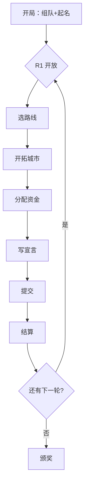
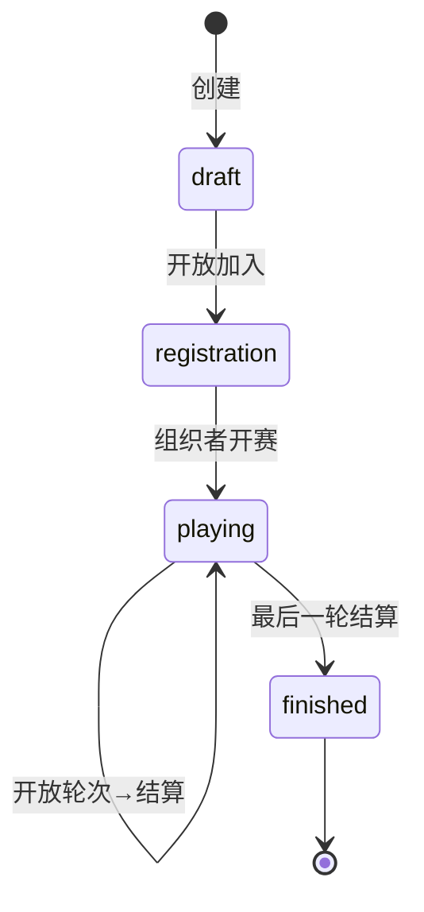
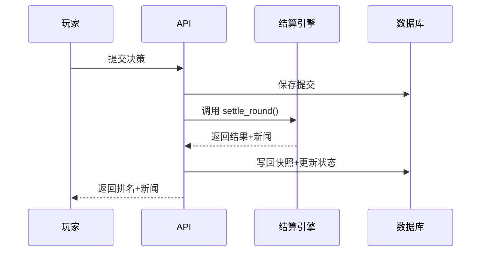
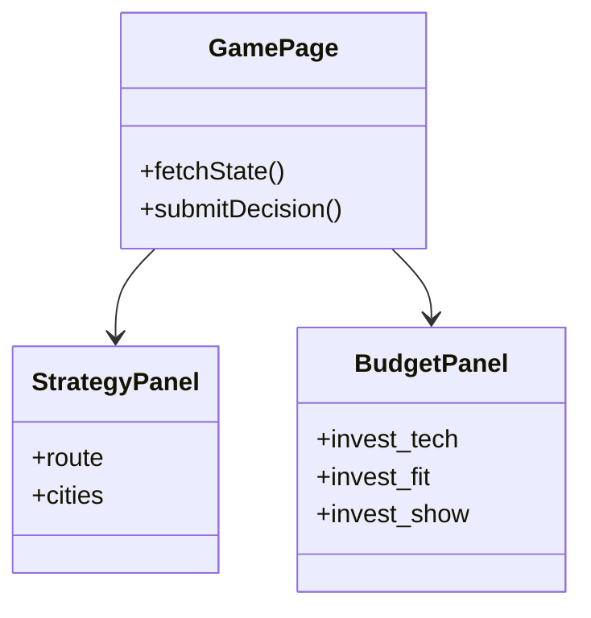

# 引擎设计意图声明模板

> **用途**：你填这个，我从它推导 PRD + 代码。
> **原则**：只写"游戏设计"，不写"技术实现"。越薄越好，留白是允许的。
> **目标**：7 个章节 + 教育目标，30 分钟能写完。
>
> **关联文档**：
> - 推导产物 → `docs/prd/PRD-<引擎>.md`
> - 引擎规范 → `docs/ENGINE.md`
> - 架构约束 → `CLAUDE.md` · `02-ARCHITECTURE.md` · `03-ENGINEERING.md`

---

## ⚠️ 架构约束速查（填写前必读）

以下约束来自项目架构，设计时请勿触碰红线：

| 约束 | 说明 |
|------|------|
| **Arena 与引擎分离** | 区分"比赛生命周期（谁开/关/允许加入）"与"游戏规则（结算逻辑）" |
| **硬域边界** | 结算规则不要跨域写入（如直接修改 `users.experience`），赛后奖励由 `career` 域的 `settle_match_rewards` 统一处理 |
| **YAML 配置优先** | 所有可调整参数（城市数、轮数、衰减系数）应视为配置项。填写时用 `「参数名」` 标注，我将推导为 YAML 字段 |
| **Phase A 可行范围** | 当前阶段支持：新引擎 + YAML 配置 + 前端对局页 + 赛后 XP 奖励。不支持：跨比赛持久状态、LLM Agent、在线匹配、AI 填位（见下方 Phase 门控） |

**Phase 门控对照**：

| 你的需求 | Phase A | 说明 |
|---------|---------|------|
| 新引擎 + 完整对局流程 | ✅ 支持 | 当前主力 |
| 赛后 XP / 奖励分档 | ✅ 支持 | 自动接入 career 域 |
| 练习赛 / 正式赛双模式 | ✅ 支持 | 通过 `match_kind` 区分 |
| 在线匹配、路人 AI 填位 | ❌ 不支持 | Phase B1 |
| 资源账本、家园 MVP | ❌ 不支持 | Phase B2 |
| LLM 裁判 / 自然语言交互 | ❌ 不支持 | Phase C~E |
| 跨比赛持久城市状态 | ❌ 不支持 | Phase B4 |

---

## 使用方式

1. **复制本文档**，在 `inspire/` 或任意位置填写你的 7 章内容 + 教育目标
2. **发给我**，我会阅读并提问澄清（如果有模糊/矛盾）
3. **我输出**：PRD 文档 + 后端引擎代码 + 后端 API + 前端对局页 + YAML 配置
4. **你审阅 PRD**，确认或调整
5. **我修复/调整代码**

> **定位说明**：本文档属于设计过程稿，最终产物（PRD + 代码）进入 `docs/prd/` 和 `webapp/`。`inspire/` 用于愿景和研究，非编程契约。

---

## 1. 一句话定义

**你要回答**：如果向一个从没玩过的人介绍这个引擎，一句话怎么说？

> **示例（FST）**：5 秒一 tick 的即时长三角六城物流商战，低买高卖、投资运力，以总资产排名。
>
> **示例（TECH）**：4 轮策略商赛，三城布局、四线择一、把预算分配到 Tech/Fit/Show 三个维度，以加权累计声量排名。
>
> **示例（OPS）**：多轮商业模拟，经历产品设计、运营决策、融资路演、资源竞价，以净资产排名。

**你的填写**：

```
（写在这里）
```

**我的产出**：从这句话推导引擎中文名、英文名、引擎 ID、配置 ID、一句话定位。

---

## 2. 核心循环

**你要回答**：一局游戏从开始到结束，玩家经历什么？

不需要画状态机，不需要写技术流程。用**玩家视角**按时间线写，同时补充**组织者视角**（何时开轮、何时结算）：

```markdown
示例（TECH）—— 玩家侧：
- 开局：组队、起产品名、初始预算 100 万
- 每轮（共 4 轮）：
  1. 选择战略路线（TECH/USER/BRAND/PATHFINDER）
  2. 开拓城市（南京/合肥/杭州，首次进入付费）
  3. 分配预算到 Tech（研发）、Fit（用户匹配）、Show（品牌展示）
  4. 写一句 ≤60 字的宣言
  5. 提交，等待结算
  6. 看排名、看新闻、资金结转（剩余+利息+津贴+排名奖励）
- 结束：按 4 轮加权总分排名

示例（TECH）—— 组织者侧：
1. 创建房间 → 开放加入
2. 手动开启 R1（或按时间表自动开启）
3. 等待所有队伍提交（或到达截止时间）
4. 手动触发结算（或自动结算）
5. 查看排名 → 发布新闻 / 开启下一轮
```

**你的填写**（玩家侧 + 组织者侧）：

```
（写在这里）
```

**我的产出**：轮次数、阶段划分、状态机、前端页面流程。

---

## 3. 决策设计

**你要回答**：玩家在决策阶段具体做什么？输入长什么样？

不需要写 API Schema，用自然语言描述"玩家面前有什么按钮/滑块/表单"。同时区分：**玩家决策** vs **组织者配置项**：

```markdown
示例（TECH）：
- 【玩家决策】
  - 路线选择：4 选 1 卡片，本轮可切换（切有成本）
  - 城市开拓：3 个城市的开关，首次开需付费
  - 资金分配：
    - Tech：一个滑块（0~预算）
    - 每个已开城市：Fit 滑块 + Show 滑块
  - 宣言：一个文本框，≤60 字

- 【组织者配置项（可选）】
  - 轮次数：默认 4，可调 3~6
  - 初始预算：默认 100 万
  - 结算时间：手动 / 自动（截止后 X 分钟）
  - R3 突发事件：7 种可选，默认随机
```

**你的填写**：

```
（写在这里）
```

**我的产出**：决策表 Schema、校验规则、前端表单组件、YAML 配置字段。

---

## 4. 结算规则（★ 最关键）

**你要回答**：决策提交后，系统怎么算出结果？

这是唯一需要**相对精确**的地方。但不需要写成代码，用自然语言 + 公式草稿即可。

> ⚠️ **可解释性提示**：教育场景下，学生需要理解"为什么我这轮排名变了"。请告诉我：结算后，学生最需理解的是哪几个数字的因果链？（例如"为什么我的市场份额下降" vs "Tech 投入为何没转化为排名"）——这将决定前端展示哪些中间变量。

```markdown
示例（TECH）：
1. 属性增长：
   - Tech：投入越多增长越快，但有过载衰减。路线不同增长率不同。
   - Fit/Show：按城计算，投入排名越高增长越多。有"短板补强"光环。
2. 市场份额：
   - 每个城市有 3 类消费者（geek/pragmatic/trendy），各有偏好权重
   - 用 Softmax 按（Tech×权重 + Fit×权重 + Show×权重）分份额
   - 同路线队伍多会触发「拥挤税系数」
3. Ceiling：市场总需求有上限，受平均属性、队伍数、Show 总投入影响
4. Attention = 份额 × Ceiling × 城市规模 × 100
5. 修正：
   - Momentum：上轮排名高有微弱加成
   - Hot Pulse：BRAND 路线 Show 增长猛时有额外爆发
   - BQI：宣言与投入方向匹配加分，营销过度减分
   - Noise：±5% 随机扰动
6. 最终 EffAttention = Attention × BQI × (1 + Noise)
7. 排名按 EffAttention，加权累计到总分
```

**你的填写**：

```
（写在这里）
```

**我的产出**：`settle_round()` 纯函数、所有中间变量、新闻生成规则、前端结果展示。

---

## 5. 胜负条件

**你要回答**：比赛结束按什么排名？

> **示例（FST）**：最终 tick 按 `total_assets = cash + 库存估值` 排名。
>
> **示例（TECH）**：4 轮后按 `weighted_total = Σ(EffAttention_r × round_weight_r)` 排名。
>
> **示例（OPS）**：`总得分 = 净资产×0.6 + 累计净利润×0.25 + 路演×0.1 + 产品设计×0.05`

**请同时回答**：
- **平局处理**：并列排名？小分比较？
- **淘汰/退出**：是否有淘汰机制？何时触发？
- **边界终止**：资金归零是否出局？还是允许负债继续？

**你的填写**：

```
（写在这里）
```

**我的产出**：`settle_match_rewards()` 奖励分档、特殊奖项、终止判定逻辑。

---

## 6. 特殊机制

**你要回答**：有什么不寻常的、其他引擎没有的东西？

> **示例（TECH）**：
> - 产品宣言：玩家写文字，系统关键词匹配+投入结构校验，影响 BQI
> - 路线拥挤税：同路线队伍越多，各自效用越低
> - PATHFINDER 独占红利：选的人少时大幅加成，人多时衰减
> - R3 突发事件：组织者可选 7 种事件之一偏移市场
>
> **示例（OPS）**：
> - 产品设计阶段：开局分配 100 设计点数到 4 个维度
> - 融资路演：R2 后提交 PPT/海报，评委打分给 bonus 资金
> - 资源竞价：R3 后英式/密封/荷兰拍卖抢稀缺生产线

> ⚠️ **Phase 限制**：以下机制当前不可行——LLM Agent 裁判 / 自然语言交互（Phase C~E）、跨比赛持久状态（Phase B2~B4）、在线匹配 / 路人 AI 填位（Phase B1）。

**你的填写**：

```
（写在这里，没有就写"无"）
```

**我的产出**：特殊阶段的额外模型、额外 API、额外前端组件。

---

## 7. 参考与灵感

**你要回答**：这个引擎从哪来？像什么已有的东西？

> **示例（TECH）**：基于原有 TechVenture v6.0 引擎移植，参考 ASDAN 商赛的策略决策部分。
>
> **示例（OPS）**：参考 ASDAN Business Simulation（阿思丹 ABS），融合 DECA/FBLA 的路演评分维度。
>
> **示例（FST）**：原创引擎，灵感来自经典贸易模拟游戏，地理套利+运力投资。

**你的填写**：

```
（写在这里）
```

**我的产出**：配置参数默认值、AI 策略档位设计、教育目标对照。

---

## 8. 教育目标（新增）

**你要回答**：学生通过这个游戏学习什么知识点/能力？

这是教育平台的核心，直接影响：
- AI 策略档位设计（入门 / 进阶 / 挑战 三档的教学目标不同）
- 赛后复盘文案风格（强调哪些知识点）
- 结算结果的可解释性优先级（让学生理解哪些商业逻辑）

```markdown
示例（FST）：
- 核心知识点：供需关系、库存管理、地理套利、运力投资 ROI
- 能力训练：快速决策、风险权衡、竞争对手观察
- 难度分层：
  - 入门：理解低买高卖基础逻辑
  - 进阶：掌握多城市联动与库存周转
  - 挑战：预测价格波动、运力投资时机

示例（TECH）：
- 核心知识点：战略定位、资源分配、市场竞争、品牌效应
- 能力训练：长期规划、团队分工、数据解读
- 难度分层：
  - 入门：理解路线特性与基础分配
  - 进阶：掌握城市开拓节奏与投入平衡
  - 挑战：利用拥挤税与独占红利进行博弈
```

**你的填写**：

```
（写在这里）
```

**我的产出**：教学维度标注、赛后报告模板、AI 难度档位、教育目标对照表。

---

## 附录 A：你不需要填的东西

以下由我根据上面 8 项推导，你不用写：

| 你不需要写 | 我来推导 |
|-----------|---------|
| 数据库表结构 | 从模型关系推导 |
| API 端点清单 | 从决策+结算+管理需求推导 |
| 前端组件清单 | 从决策表单+展示需求推导 |
| YAML 配置结构 | 从参数和默认值推导 |
| AI 策略详细逻辑 | 从决策空间和目标函数推导 |
| WebSocket 消息类型 | 从实时性需求推导 |
| 性能红线 | 从结算复杂度推导 |
| 实现 Checklist | 从文件依赖推导 |

---

## 附录 B：经常遗漏但对我很重要的信息

填写以下信息可大幅减少后续澄清成本：

| 信息项 | 为什么重要 | 示例 |
|--------|-----------|------|
| **数值范围** | 决定数据类型与前端组件 | 预算量级（万/百万）、属性初始值（0~100？）、增长率区间 |
| **随机性意图** | 教育场景通常倾向降低方差 | 是否需要 Luck 因素？Noise 范围多大？是否可以取消随机？ |
| **单局时长预期** | 影响 tick 间隔、轮次设计 | 15 分钟 / 45 分钟 / 2 小时？ |
| **同局人数/队伍数** | 影响结算复杂度与并发设计 | 2~4 队？8~16 队？是否支持单人练习？ |
| **设备场景** | 影响前端交互密度 | 课堂大屏（组织者主导）/ 学生自带笔记本 / 平板？ |
| **是否需要暂停/保存** | 影响状态机设计 | 课堂中途下课，能否存档下节课继续？ |

---

## 附录 C：可视化绘制工具

设计引擎时，你可能想画**流程图**（玩家怎么玩）、**状态机**（游戏有哪些状态）、或**时序图**（结算步骤顺序）。推荐以下工具，按优先级排列：

### 首选：Mermaid（强烈推荐）

**为什么选它**：
- **纯文本**：直接写在 Markdown 里，不需要安装软件
- **到处渲染**：GitHub、Notion、Obsidian、VS Code、GitLab 全部原生支持
- **我能直接读**：不用导出图片，复制粘贴给我即可
- **项目已有**：`CLAUDE.md`、`PRD-FST.md`、`PRD-OPS.md` 都在用

**快速入门（5 分钟学会）**：

#### ① 流程图（画玩家交互流程）

````markdown

````

#### ② 状态机（画游戏状态）

````markdown

````

#### ③ 时序图（画结算步骤或 API 调用）

````markdown

````

#### ④ 类图/组件图（画前端结构）

````markdown

````

**去哪写**：
- 最简单：**直接在 Markdown 文件里写**，用 VS Code + Mermaid 插件实时预览
- 在线：`https://mermaid.live`（实时渲染，可导出 SVG/PNG）
- Obsidian：原生支持，写 ```mermaid 即可

**怎么给我**：
- 直接复制粘贴 Mermaid 代码块给我，我能读懂
- 不需要导出图片（但如果你画了 Excalidraw，可以截图给我）

---

### 备选：Excalidraw（画 UI 线框图）

**什么时候用它**：
- 你需要画**具体的 UI 布局**（哪个按钮在哪、面板怎么分栏）
- Mermaid 的方框太死板，你需要手绘风格的线框图

**特点**：
- 手绘风格，看起来像草图，反而更适合早期设计沟通
- 免费，在线可用：`https://excalidraw.com`
- 可导出 PNG/SVG，也可保存为 `.excalidraw` 文件（但后者我不能直接读文本）

**怎么给我**：
- 导出 PNG/SVG，插入到 Markdown 中给我
- 或者截图发我

**注意**：Excalidraw 适合表达"外观和布局"，不适合表达"流程和逻辑"。流程和逻辑用 Mermaid。

---

### 快速选择指南

| 你要画什么 | 用什么 | 输出格式 |
|-----------|--------|---------|
| 玩家操作流程 | Mermaid 流程图 | 文本代码块 |
| 游戏状态转换 | Mermaid 状态机 | 文本代码块 |
| 结算/API 步骤 | Mermaid 时序图 | 文本代码块 |
| 前端组件关系 | Mermaid 类图 | 文本代码块 |
| UI 布局草图 | Excalidraw | 图片/截图 |
| 复杂系统架构 | Mermaid 或文字描述 | 文本代码块 |

---

*商识唯智 · 引擎设计意图声明模板 v1.1*
