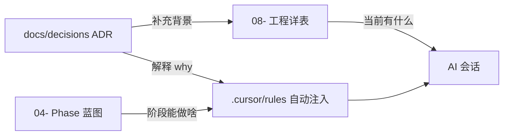

# 架构决策记录（ADR）— 商域 BizSim Edu

> **文档定位**：跨 AI 对话、跨成员的**架构记忆**——记录「为什么这样定」，不重复 `08-` 里的「现在是什么」。  
> **最后更新**：2026-05-29  
> **配套**：[蓝图编程方法论](../蓝图编程方法论——AI辅助大型工程实践指南.md) §3.4.2 · [`.cursor/rules/adr-writing.mdc`](../.cursor/rules/adr-writing.mdc)

---

## 一、ADR 是什么（给初学者）

<!-- 如果你刚接触 FastAPI / React，先不用背术语：ADR 就是仓库里的「决策说明书」。 -->

　　**ADR（Architecture Decision Record）** 是一篇很短的 Markdown，用来回答：**当时遇到了什么问题、选了哪个方案、放弃了什么、以后要注意什么**。

| 对比 | 记什么 | 例子 |
|------|--------|------|
| **Git 提交** | 改了哪些文件 | `fix: 修复 join 房间码` |
| **`08-` 工程详表** | 现在有哪些 API、实现百分之几 | §2.7 路由表 |
| **`.cursor/rules/`** | AI **每次对话都要遵守**的硬规则 | 域边界表 |
| **ADR** | **为什么**采用这套结构（含未采纳方案） | 为何 RTS 只能调度器推进 tick |

　　新开的 Cursor 对话**不会记得**上周聊天内容；ADR 让下次你或 AI 用 **@ 文件** 就能接上「当时的理由」。

---

## 二、何时必须写 ADR（声明式触发表）

<!-- 满足下面「必须写」任一行 → 会话结束前新增或更新 ADR；不确定时问 AI：「这算不算要写 ADR？」 -->

### 2.1 必须写（Mandatory）

| 编号 | 触发条件（满足任一） | 典型例子 |
|------|----------------------|----------|
| **M1** | 在 **≥2 个可行方案** 中做了选型，且换方案会动到多文件/多域 | SQLite 继续 vs 立刻迁 PostgreSQL |
| **M2** | 引入或更换**核心依赖/框架**（ORM、状态管理、编排框架等） | 选用 LangGraph 做 Hermes |
| **M3** | 新增或调整**域边界、表主人、路由模块归属** | 新赛制表挂在 `games/` 还是 `arena/` |
| **M4** | 改变**全局架构模式**（进程数、库数量、实时推进方式） | 为组织者单独起第二个后端 |
| **M5** | 接受明显的 **trade-off**（性能/复杂度/安全换简便） | HTTP GET 里推进游戏 tick（已禁止，见 ADR-005） |
| **M6** | **推翻** 已有 ADR 的结论 | 废弃「单库」改为每赛制一库 → 新 ADR 标「已取代 ADR-002」 |

### 2.2 建议写（Recommended）

| 编号 | 触发条件 | 说明 |
|------|----------|------|
| **R1** | 新赛制 / 新 `game-configs/*.yaml` 的首个引擎落地 | 记录 engine 与 config id 分层理由，可引用 ADR-004 |
| **R2** | 练习流 vs 正式赛流**拆文件**（`practice_flow` / `official_flow`） | 避免以后再在 API 里堆 `if match_kind` |
| **R3** | Phase 边界变化（A→B）导致「以前不能做、现在能做」 | 与 `04-` 蓝图同步，ADR 记原因 |
| **R4** | 连续两次会话因**同一误解**返工 | 把误解写成 ADR「后果」，加固团队记忆 |

### 2.3 不要写 ADR（Skip）

| 编号 | 情况 | 改做什么 |
|------|------|----------|
| **S1** | 修 typo、改文案、调 CSS | 直接提交 |
| **S2** | 纯实现已有 ADR / 已有规则，无新选择 | 在 PR 或 `08-` §5.1 记一行即可 |
| **S3** | 临时调试、本地试验、未合并的草稿 | 不写；采纳后再补 ADR |
| **S4** | 仅调 YAML 数值（价格、回合数）且不改架构 | 改 `game-configs` + `08-` 若需 |

---

## 三、如何编写（步骤 + 模板）

### 3.1 文件命名与编号

```
docs/decisions/
├── README.md                 ← 本文件（规范 + 索引）
├── _template.md              ← 复制即用模板
├── 001-文档约束层与蓝图编程.md
├── 002-…
└── 00N-简短英文或中文关键词.md
```

| 规则 | 说明 |
|------|------|
| **序号** | 三位递增：`001`、`002`… 不跳号、不复用已废弃编号 |
| **文件名** | `序号--kebab-或-中文简述.md`，见名知意 |
| **一篇一决策** | 不要在一篇 ADR 里塞五个无关话题 |

### 3.2 编写步骤（建议 10～15 分钟）

1. **复制** [`_template.md`](./_template.md) 为 `00N-标题.md`  
2. **填「上下文」**：没背景的人能看懂问题（1～3 句）  
3. **填「决策」**：写清**选了什么** + **落在哪里**（目录/文件/表名）  
4. **填「放弃方案」**：至少 1 个未采纳项及原因（防止后人重复争论）  
5. **填「后果」**：正面 + 负面 + **对初学者的操作提示**（见模板）  
6. **更新本 README 索引表**（§五）  
7. **若推翻旧 ADR**：把旧文状态改为 `已取代`，新文写 `取代 ADR-00x`  
8. **大改动**：在 `08-` §5.1 加一行摘要（与推送前文档对齐一致）

### 3.3 与 AI 协作怎么说

<!-- 复制下面整段到 Cursor 开场或收尾即可。 -->

```markdown
【ADR 任务】
- 触发：M? / R?（见 docs/decisions/README.md §二）
- 动作：新建 ADR-00N 或更新 ADR-00x 状态
- 请用 docs/decisions/_template.md，中文叙述，初学者能读懂
- 完成后更新 docs/decisions/README.md §五 索引
```

---

## 四、ADR 与现有文档的分工



| 问题 | 先查哪里 |
|------|----------|
| 能不能改这张表？ | `.cursor/rules/blueprint-coding.mdc` 域表 |
| 当前 Phase 能做 World 吗？ | `04-` + ADR-008 |
| 为什么 XP 不能直接改 `users`？ | **ADR-007** |
| 现在有哪些 API？ | `08-` §2.7 |
| 新赛制怎么加？ | **ADR-004** + `arena/ARCHITECTURE.md` |

---

## 五、决策索引（当前有效）

| ID | 标题 | 状态 | 日期 | 一句话 |
|----|------|------|------|--------|
| [001](./001-文档约束层与蓝图编程.md) | 文档约束层与蓝图编程 | 已采纳 | 2026-05-21 | 00～04 + 11- + 规则文件为权威锚点，代码是文档产物 |
| [002](./002-模块化单体与单库单进程.md) | 模块化单体与单库单进程 | 已采纳 | 2026-05-21 | 一个 FastAPI + 一个 SQLite，按域分包 |
| [003](./003-域边界与表归属.md) | 域边界与表归属 | 已采纳 | 2026-05-21 | arena 拥有赛事元数据，games 拥有对局运行时表 |
| [004](./004-CyberCore声明式赛制扩展.md) | CyberCore 声明式赛制扩展 | 已采纳 | 2026-05-21 | 新赛制 YAML + 引擎包，禁止克隆 trading API |
| [005](./005-浮生记RTS调度器单写者.md) | 浮生记 RTS 调度器单写者 | 已采纳 | 2026-05-21 | 仅调度器推进 tick，HTTP 只读 |
| [006](./006-学生端与组织者端双前端.md) | 学生端与组织者端双前端 | 已采纳 | 2026-05-21 | 两个 Vite 工程，共用同一后端 |
| [007](./007-生涯经验幂等账本.md) | 生涯经验幂等账本 | 已采纳 | 2026-05-21 | XP 走 `xp_events` + `settle_match_rewards` |
| [008](./008-Phase-A范围门控.md) | Phase A 范围门控 | 已采纳 | 2026-05-21 | 先做商赛闭环，World/OPC/LLM 编排延后 |
| [009](./009-赛季模式与教师端双端演进.md) | 赛季模式与教师端双端演进 | **部分采纳** | 2026-05-29 | P1：`teaching_groups` 营团已落地；赛季/AOTU 仍规划；Phase A 仍 `official` |
| [010](./010-拟真城市内容包与CyberCore合并加载.md) | 拟真城市内容包与 CyberCore 合并加载 | 已采纳 | 2026-06-01 | `content/world/yangtze_6`；无 World 域表；浮生记 v2.2 真实六城 |

---

## 六、给项目主理人（初学者）的检查清单

<!-- 不用一次做完；随开发慢慢补 ADR。 -->

- [ ] 重大选型后：是否落在 §二 **M1～M6**？是 → 补 ADR  
- [ ] 会话结束前：问 AI「本次要不要写 ADR？」  
- [ ] 新对话涉及架构：在简报里 `@docs/decisions/00x-….md`  
- [ ] 推翻旧决定：改旧 ADR 状态，勿悄悄改代码 alone  
- [ ] 推 GitHub 前：若新增 ADR，在 `08-` §5.1 写一行「新增 ADR-00N」

---

*商域 BizSim Edu · 架构决策记录*
