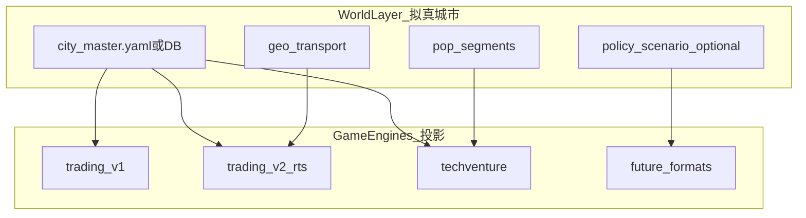

# 拟真城市世界观设计

> **文档定位**：拟真城市**产品详设附录**（域模型、体验表、风险清单）。**权威阅读版**（竞品、借鉴、实施路径、双终局地位）见根目录 [07-拟真城市与区域模拟-阅读合集](../07-拟真城市与区域模拟-阅读合集.md)。
>
> **关联**：[07-](../07-拟真城市与区域模拟-阅读合集.md) · [01-](../01-平台愿景与产品架构.md) · [02-](../02-赛事体系与双端产品.md) · [04-](../04-实施路线与里程碑.md) · [inspire/d/05-AI深度融合设计](./d商业模拟教育平台/05-AI深度融合设计.md) §三 Demia POP
>
> **数据颗粒度 / POP 设计 / 数据整理 / AI 作用**：见根目录 [07- §六～§九](../07-拟真城市与区域模拟-阅读合集.md#六数据颗粒度五层模型)（本文保留域模型与体验表摘要）。
>
> **最后更新**：2026-05-27

---

## 一、愿景陈述

　　**拟真城市世界观**是指：平台内若干**真实中国城市**（及其区域关系）构成统一的商业模拟世界；每座城市由**人口结构（POP）**、**产业结构**、**消费结构**、**地理与交通**、**历史与政策环境**共同定义。所有赛制共享同一套城市本体——学生在浮生记里运货的「蓉城」、在 TechVenture 里做品牌的「南京」、在未来宏观沙盘里调节政策的「长三角节点」，指向**同一地理-经济实体**的不同商业切面。

　　这不是科幻包装，而是**人文地理 + 产业经济 + 商业决策**的可玩化教学载体。城市本身即课程：理解一座城为何「务实」、为何「潮向」、为何「物流枢纽」，比记忆抽象参数更接近真实商业素养。

### 1.1 核心价值主张

| 维度 | 价值 |
|------|------|
| **跨赛制学习成本降低** | 学生学会「南京 pragmatic 客群高」后，换赛制仍适用；不必每开一局重新理解城市参数 |
| **与真实世界对接** | 城市档案可引用公开统计、产业报告、区域政策；模拟结论可讨论「若政策 X，对 Y 产业何影响」 |
| **教学与研究** | 班级可做「城市商业画像」课题；高校可做政策情景推演、产业协同沙盘 |
| **平台存在性价值** | 从「多赛制工具箱」升级为「可演化的区域商业模拟器」——具备与地方政府、研究机构合作的长期空间 |

### 1.2 与平台愿景的关系

　　拟真城市世界观嵌入 [01-](../01-平台愿景与产品架构.md) 产品发展主线，位于「多赛制 Arena」与「智能体教练 / 生涯 / 知识图谱」之间，作为**共享世界层**：

```
商业模拟赛事（多赛制 · 共享城市世界）
    ↓
智能体财商教练（Athena 可引用城市语境复盘）
    ↓
生涯模式（学生在各城市的经营足迹 · 区域掌握度）
    ↓
知识图谱 / 课程（城市产业 · 人文地理 · 经济学概念挂载）
    ↓
政策推演与外部合作（远期 · 研究型场景）
```

---

## 二、为什么需要共享城市

### 2.1 当前痛点

| 问题 | 现状 |
|------|------|
| **城市孤岛** | `trading-v1` 用「京城/沪市」等虚构简称；`trading-v2-rts` 用 prod/cons 矩阵；`techventure-v1` 用南京/合肥/杭州 + 客群比例——**三套字段族、无统一 ID** |
| **重复认知** | 学生每换赛制，重新理解「这座城市代表什么」 |
| **真实连接弱** | 参数可游戏化，但缺少与真实产业、人口、交通的结构化挂钩 |
| **扩展成本高** | 新增赛制需再复制一份城市表，难以维护十赛制 × N 城的一致性 |

### 2.2 教育价值

- **经济学直觉**：供需、细分、比较优势、产业政策——从「公式」变为「在某座具体城市里的决策」
- **人文地理素养**：历史路径依赖、区位、交通走廊如何塑造商业机会（见 [inspire/52-商业课程内容与经济学模型](./52-商业课程内容与经济学模型.md) 城市参数分层）
- **中国产业文化**：制造梯度、消费升级、区域协同、新质生产力等政策语境，可在城市档案中显性化
- **研究型学习**：高年级/大学段可做「假设政策调整 → 模拟 POP 反应 → 撰写简报」，对接真实研究方法

### 2.3 平台与外部合作价值

　　当城市模型具备**可解释、可参数化、可复现**的规则层时，平台可承载：

- 学校课题：区域商业比较、产业链分工、ESG 与地方产业
- 试点校与地方：简化版「政策情景沙盘」（非预测工具，而是**教学与讨论**用的结构化模拟）
- 研究机构：在脱敏、可控参数下做「若…则…」推演，与真实统计口径对照

　　**边界声明**：拟真城市是**教育模拟**，不替代专业经济预测；对外合作须明确「教学/研究用途」与参数校准流程。

---

## 三、学生体验：同一城市，不同赛制切面

　　共享城市不等于「所有赛制玩法相同」。同一座城市在不同赛制中暴露**不同的商业问题**：

| 赛制 | 城市在此赛制中的角色 | 学生获得的实践经验 |
|------|----------------------|-------------------|
| **回合制策略（trading-v1）** | 市场机会与品类偏好 | 选址、品类匹配、有限预算下的市场进入 |
| **浮生记 RTS（trading-v2-rts）** | 物流节点与产销枢纽 | 产出-消费缺口、运价、仓储、跨城套利 |
| **TechVenture** | 品牌战场与客群结构 | 细分 STP、路线-城市匹配、份额竞争 |
| **拍卖交易大厅（蓝图）** | 稀缺资源与广告位 | 价格发现、 sealed bid、媒体采购 |
| **宏观经济沙盘（蓝图）** | 政策作用对象 | 利率、补贴、产业政策的区域传导 |
| **ESG / 案例推演（蓝图）** | 利益相关者与社区 | 长期价值、伦理、地方社会影响 |

**体验原则**：

- 学生在 `/games` 或城市档案页可看到「**我已在哪些赛制中接触过哪些城市**」
- 城市详情页展示：人口结构摘要、主导产业、交通区位、与真实资料的「延伸阅读」链接（教师可选开）
- **不强制**跨赛制状态联动（初期）；单局仍独立结算，避免破坏竞技公平

---

## 四、城市本体模型（产品级）

### 4.1 一座「拟真城市」应包含什么

| 层级 | 属性 | 说明 | 示例 |
|------|------|------|------|
| **身份** | `city_id`、标准名、简称、省份/区域、坐标级区位 | 全平台唯一键 | `nanjing` · 南京市 · 长三角 |
| **POP 人口** | 总量、年龄/收入/偏好分群、流动性 | 类 P 社 POP：群体有需求向量、可随政策/事件变化 | pragmatic / geek / trendy 或更细职业群 |
| **产业** | 主导产业、产出品类及强度、产业链位置 | 对接 RTS `production`、宏观沙盘供给 | 制造、科创、消费、农业 |
| **消费** | 需求品类、消费强度、价格弹性 | 对接 RTS `consumption`、TV 市场规模 | 奢侈品、日用品、能源 |
| **地理交通** | 枢纽等级、到邻城成本/时间、物流系数 | 对接 RTS `logistics`、贸易赛制 | 长江口岸、内陆枢纽 |
| **历史与文化** | 结构化标签 + 档案文本（非虚构叙事） | 教学阅读、Athena 复盘语境 | 务实商业传统、科创集群 |
| **政策环境** | 当前生效的「场景政策包」（可选） | 宏观/ESG/地方补贴；默认中性 | 开城费减免、环保门槛 |

### 4.2 POP 模型（教育向简化）

　　完整 POP 设计思路、颗粒度分层、数据整理与 AI 分工见 [07- §七～§九](../07-拟真城市与区域模拟-阅读合集.md#七pop-设计思路教育向)。此处为工程摘要。

　　借鉴 Paradox **Victoria / Cities** 系列直觉——**市场由多元人群构成**——但 Phase B 每城仅 **3～5 个** `pop_segments`，命名 `pop_id = {city_id}.{segment}`（如 `nanjing.pragmatic`）。

| 轨道 | 职责 |
|------|------|
| **规则层** | 根据价格、产品、政策、竞争计算 `demand_share`、`satisfaction_delta`、迁移倾向 |
| **叙事层（Phase E+）** | Demia 基于规则层输出生成舆情文案，**不得改写数值符号** |
| **数据层（Phase B）** | 公开统计作锚点；数值由教研定稿写入母本 `meta.data_sources` |

**与 Demia 的分工**：World 域拥有**城市与 POP 基线（L2/L3）**；Demia 做赛中叙事；共用 `pop_id` 命名空间（[d/05-](./d商业模拟教育平台/05-AI深度融合设计.md) §三）。

**母本片段示例**（字段全集见 [07- §7.3](../07-拟真城市与区域模拟-阅读合集.md#73-pop_id-命名与结构)）：

```yaml
pop_segments:
  - pop_id: nanjing.pragmatic
    display_name: 务实主流客群
    base_size: 0.58
    needs_vector: { tech: 0.35, fit: 0.55, show: 0.10 }
    volatility: 0.12
```

### 4.3 赛制如何「投影」统一城市

　　各赛制 YAML **不再内联完整城市表**，而引用 `city_id` + 本赛制所需投影字段（Phase B 起逐步迁移）：

| 赛制引擎 | 从 World 读取 | 赛制私有 |
|----------|---------------|----------|
| trading-v1 | 类型、偏好品类 | 回合制定价系数 |
| trading-v2-rts | prod/cons 矩阵、demand_profile、logistics | tick 规则、车辆 |
| techventure-v1 | scale、consumers、eta | 路线乘数、BQI |
| 未来赛制 | 按需子集 | 原子配置（CyberCore） |



---

## 五、渐进演化路径（与 Phase 对齐）

> **原则**：Phase A 以赛制迁移与闭环为先；**不在 A 阶段建设 `domains/world/` 运行时**，仅完成规划、文档与接口预留。

### Phase A 尾声（当前窗口）

| 工作项 | 性质 | 验收 |
|--------|------|------|
| [07-](../07-拟真城市与区域模拟-阅读合集.md) 阅读合集 | 规划 | 与 01-/02-/04- 交叉引用一致 |
| 城市 ID 对照表（规划） | 文档 | 虚构简称 ↔ 真实城市 canonical id 映射草案 |
| 赛制 YAML 注释预留 | 轻量 | 现有三份 game-config 标注「待引用 world/cities」 |
| **禁止** | 硬约束 | 不新建 `domains/world/`、不改结算逻辑、不跨局持久化城市状态 |

### Phase B：城市母本与 Demia 预研

| 工作项 | 验收 |
|--------|------|
| `content/world/cities/` 城市母本 YAML（静态） | 至少 6 城完整档案 + POP 分群定义 |
| 新赛制 YAML 从母本 `$ref` 引用 | 第三赛制包不再复制城市块 |
| Demia 规则层读取 POP 向量（练习/复盘场景） | 与 World 母本 `pop_id` 一致 |
| 城市档案只读 API（可选） | `GET /world/cities` 供前端展示 |

### Phase C～D：World 域与生涯挂钩

| 工作项 | 验收 |
|--------|------|
| `domains/world/` 落地 | 表归属 world 域；赛制只读 API 或快照注入 |
| 赛季级城市时间线（可选） | 全服事件影响 POP/政策参数；单局仍可快照隔离 |
| Career 区域掌握度 | 学生在各城市/赛制的参与记录汇入生涯 |
| Atlas 知识点挂载 | 城市产业、人文地理概念卡与 `city_id` 关联 |

### Phase E～F：动态模拟与外部合作

| 工作项 | 验收 |
|--------|------|
| POP 动态演化（存量-流量简化） | 跨回合人口/满意度/产业份额更新 |
| 政策情景包 | 教师可选「补贴/环保/开放」场景 |
| 研究型导出 | 脱敏模拟日志 + 参数说明，供课题/合作方复现 |
| ABM 增强（可选） | 见 [inspire/70-系统动力学与复杂系统模拟](./70-系统动力学与复杂系统模拟.md) |

---

## 六、与现有体系的关系

| 体系 | 关系 |
|------|------|
| **CyberCore** | 赛制包引用 World 母本；引擎内禁止硬编码城市名与静态参数 |
| **Arena** | 单局仍由 Arena 创建；World 提供开局快照，不替代 `competition_events` |
| **Career** | 城市参与记录、区域 XP 标签；不直接改 World 表 |
| **Demia** | 消费 World 的 POP；叙事层服从规则层校准 |
| **Athena** | 复盘可引用「你在南京 pragmatic 市场的决策」等城市语境 |
| **OPC（远期）** | 高阶项目可选「基于某城市产业」的 IDEATE 主题 |

### 6.1 域边界（规划）

| 域 | 路径（规划） | 拥有的表（规划） | 禁止 |
|----|--------------|------------------|------|
| **world** | `domains/world/` · `api/world.py`（远期） | `cities` · `city_pop_segments` · `world_snapshots` · `policy_scenarios` | 赛制引擎直接写 world 表；Arena 直接改 POP 基线 |

　　Phase A/B 阶段：**world 域尚未实现**；城市数据以 `content/world/` YAML 静态文件存在，由 cybercore 加载器只读引用。

---

## 七、风险、约束与 Phase A 纪律

| 风险 | 缓解 |
|------|------|
| 范围蔓延，A 阶段抢跑 World 运行时 | blueprint-coding §7：World 域 **Phase B 前禁止** 建表与 API |
| 跨赛制状态联动破坏公平 | 默认「单局快照」；全服时间线仅 Phase C+ 且可关 |
| 真实数据校准成本高 | 先 6～10 城「教学级」参数；公开数据作锚点，非逐条复刻 |
| 政策合作敏感 | 对外仅「教学模拟」；参数与结论需人工审查与免责声明 |
| 虚构地名与真实城市混用 | Phase A 尾声产出 ID 对照表；新内容只用 canonical id |

---

## 八、近期行动清单（Phase A 尾声）

- [ ] 维护 [`content/world/cities/README.md`](../webapp/backend/content/world/cities/README.md) 占位与 ID 对照说明
- [ ] 在 [04-](../04-实施路线与里程碑.md) 各 Phase 写入 World 渐进项（非仅 Phase F 一行）
- [ ] TechVenture / RTS 迁移完成后，新赛制一律从城市母本引用（Phase B 起强制执行）
- [ ] 教研：从南京/合肥/杭州三城各写 1 页「城市商业档案」试点（可放 `inspire/a商赛主题与真题库/`）

---

> **下一步阅读**：[07-阅读合集](../07-拟真城市与区域模拟-阅读合集.md) · [04-](../04-实施路线与里程碑.md) · [02-](../02-赛事体系与双端产品.md) · [70-](./70-系统动力学与复杂系统模拟.md)
