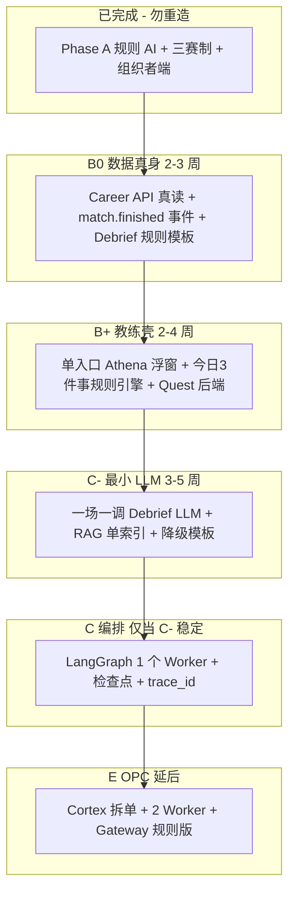

# 78 - 智能体技术路线批判与 Vibe Coding 实施指南

> **文档定位**：在 [77-商识唯智 AI 作用全景（投资人版）](./77-商识唯智AI草案.md) 之后，从**技术实现**视角做批评性审视：哪些路线对「会用 Cursor 写功能、但缺乏大型智能体经验」的主理人**过陡、过早、过重**；各阶段真实难点、应补的学习、以及**可落地的优化路线**。
>
> **读者**：项目主理人、全栈 Vibe Coder、小团队技术负责人（非 Agent 架构师背景）
>
> **权威交叉引用**：[03-技术架构 §八](../03-技术架构与实现现状.md) · [04-实施路线](../04-实施路线与里程碑.md) · [OPC/08-体系诊断与Agentic架构建议](../OPC/08-体系诊断与Agentic架构建议.md) · [蓝图编程方法论](../蓝图编程方法论——AI辅助大型工程实践指南.md) · [docs/decisions/](../docs/decisions/README.md)
>
> **最后更新**：2026-05-24

---

## 一、对 77 号路线的批评性总评

　　77 对投资人**叙事正确**：规则陪练已落地、LLM 教练分阶段、OPC 作终局。但若把 77 §五 原样当作**个人开发顺序**，对 Vibe Coder 存在三类误导：

| 误导 | 表现 | 后果 |
|------|------|------|
| **跳阶幻觉** | 「Phase C = 上 LangGraph」被理解成「该做 Agent 了」 | 在 Career mock 未清、事件未统一时堆编排，**调试地狱** |
| **技术名词堆叠** | LangGraph + RAG + MCP + 沙箱 + World 同屏出现 | 会话里 AI 倾向**过度建设**，偏离 Phase 门控 |
| **低估已难部分** | 77 强调「规则 AI 已完成」 | 易忽视 **RTS 单写者、域边界、练习原子事务** 等已踩过的坑会再在 Agent 层重演 |

　　**核心判断**（与 [OPC/08-](../OPC/08-体系诊断与Agentic架构建议.md) 一致）：

> 当前瓶颈不是「缺更多 Agent」，而是 **缺统一事件与数据真身（Career/复盘）**；智能体应 **晚于** 结构化流水线，而非替代它。

---

## 二、技术难度热力图（诚实版）

　　难度针对：**一人 + AI 辅助 + 本仓库现有栈（FastAPI/SQLite/React）**。

| 工作包 | 77/04 阶段 | 难度 | 为何难 | Vibe Coder 常见翻车点 |
|--------|------------|------|--------|------------------------|
| Career 去 mock、XP 真读 | B1 | ★★☆ | 前后端+幂等，**无 LLM** | 改 `mockPlatform` 漏改 Store；跨域直改 `users` |
| 规则复盘卡片 Debrief | B | ★★☆ | 从对局表**抽结构化事实**填模板 | 一上来 `openai.chat` 生成长文，无法回归测试 |
| `economy.yaml` + 资源账本 | B2 | ★★★ | 新表+结算扩展+幂等 | 与 `xp_events` 键冲突；破坏 T3 局内公平 |
| Quest + 规则周计划 | B5 | ★★☆ |  cron/每日状态 | 只做前端勾选，无后端完成态 |
| SQLite → PostgreSQL | B | ★★★ | Alembic+部署+本地习惯 | 双库、环境变量、迁移断生产 |
| **RAG 最小闭环** | C/D | ★★★★ | 切片、嵌入、检索、引用、评测 | 向量库未版本化；幻觉无 citation |
| **LangGraph 单 Worker** | C | ★★★★★ | 状态图、检查点、失败恢复、可观测 | 全对话堆进图；无 idempotency |
| Demia/Rival LLM 人格 | D | ★★★★ | 赛中延迟、成本、安全 | 同步阻塞 tick；Token 爆 |
| World 域 + 城市快照 | C | ★★★★ | 新域+跨赛制注入 | Phase A 门控被 AI 会话突破 |
| OPC Cortex + 2 Worker | E | ★★★★★ | 拆单、工具、沙箱、伦理 | 13 个聊天页；学生零 brief |
| MCP Server 集群 | E | ★★★★★ | 协议、鉴权、部署 | 本地 demo 无法复现生产 |
| Gateway 评分算法 | E | ★★★★ | 多评审者合成、可解释 | 只有表无规则，产品无法验收 |

　　**结论**：Phase B 多数项是**传统后端+产品**，适合 Vibe Coding；**Phase C 起才是 Agent 分水岭**，不应与 B 并行铺开的「第二战线」。

---

## 三、77 路线 vs 优化路线（对照）

### 3.1 原路线（04/77 摘要）

```
A 商赛闭环 → B 规则教练+Career → C LangGraph+RAG+World
         → D 图谱/课程 LLM → E OPC+MCP+Gateway
```

### 3.2 优化路线（本文推荐）

　　在 **不改动投资人叙事** 的前提下，**工程实施**增加「B0 / B+ / C-」三个子层，把 Agent 拆小：



| 子阶段 | 做什么 | 刻意不做 |
|--------|--------|----------|
| **B0** | `GET /career/profile`；局末 `POST /debrief/generate`（**纯规则**）；统一 `match_id` 贯穿复盘页 | LangGraph、向量库 |
| **B+** | 前端只保留**一个**教练入口；周计划 = 读 Career 表 + 规则分支 | Demia/Rival 独立页扩写 |
| **C-** | 仅 Debrief 一步调 LLM；RAG 只索引 `inspire/c知识卡片库` + 赛制 YAML 摘要 | 多 Worker、MCP |
| **C** | LangGraph 包装 **已有** Debrief 流水线（不是重写聊天） | OPC、World 运行时 |
| **E** | Gateway **规则分**先行；2 个员工 Worker | 13 员工、全量 MCP |

　　与 [OPC/08- §8.2 Phase 0](../OPC/08-体系诊断与Agentic架构建议.md) 精神一致：**Student OS 地基 → 再扩 OPC**。

---

## 四、分阶段：难点、学习准备、验收（可执行）

### 4.0 你已具备的优势（先建立信心）

　　下列模式**已是 Agent 思维的简化版**，值得先读懂再写新代码：

| 现有代码 | 模式 | 对应 Agent 概念 |
|----------|------|-----------------|
| `rts_scheduler.py` | **单写者**推进状态 | Orchestrator 独占写 |
| `practice_flow.py` | 同事务：人→AI→advance | 多步 Tool 链 + 原子提交 |
| `ai_team.py` / `rts_ai_levels.py` | 规则决策、可复现 | Tool 函数，非 LLM |
| `get_game_config()` + YAML | 声明式配置 | Prompt/Policy 外置 |
| `xp_events.idempotency_key` | 幂等 | Agent 重试安全 |
| `docs/decisions` + `.cursor/rules` | 约束层 | 降低 LLM 漂移 |

　　**学习建议**：用 1 个下午通读 `practice_flow.py`、`rts_scheduler.py`、`domains/career/` 结算入口，再碰 LangGraph。

---

### 4.1 Phase B0：数据真身（优先于一切 LLM）

**难点**

- 前端 `DEMO_CAREER`、`DEBRIEF_MOCK` 与 `authStore.user.experience` 三套数据源（[08- §2.10 E1/E5](../08-工程现状与webapp实现详表.md)）
- 复盘需要**从对局表聚合事实**（排名、路线、关键回合），不是让模型「编故事」

**应学（按顺序，约 1～2 周业余）**

| 主题 | 学到什么程度 | 资源类型 |
|------|--------------|----------|
| FastAPI 依赖注入 + Pydantic v2 | 能写 `response_model` 与校验 | 官方文档 FastAPI |
| SQLAlchemy 2 查询与聚合 | 能写「一局赛的统计」查询 | 本仓库 `games/trading/models.py` |
| Jinja2 或 JSON 模板 | 模板填槽，禁止自由生成 | 任意 2 小时教程 |
| 幂等键设计 | 理解 `idempotency_key` | [ADR-007](../docs/decisions/007-生涯经验幂等账本.md) |

**验收清单**

- [ ] `/career` 打开后 XP 与 `GET /auth/me` 或 `/career/profile` 一致
- [ ] 正式赛结束跳转 `/career/debrief/:matchId`，**同一局重进内容不变**
- [ ] Debrief 无 API Key 也能出卡片（纯规则 fallback）
- [ ] 未写 ADR 不新增表主人域外字段

**Vibe Coding 纪律**

- 会话简报写：**「B0 only，禁止 openai/langgraph/chroma」**
- 先写 `08-` §2.7 路由行，再让 AI 写 handler

---

### 4.2 Phase B+：教练壳与 Quest（仍无 Agent）

**难点**

- [OPC/08- §2.2](../OPC/08-体系诊断与Agentic架构建议.md)：AI 面孔过多
- Quest 若只有 localStorage，无法与 Athena 周计划联动

**应学**

| 主题 | 程度 |
|------|------|
| Zustand 与后端同步 | 能去掉 persist 里的生涯假数据 |
| 简单状态机（enum + 转移表） | 每日 Quest 完成态 |
| 事件命名 | `match.finished`、`quest.completed` 字符串规范 |

**验收**

- [ ] 全站**一个**教练浮窗（Rival/Demia 入口降级为「练习子模式」）
- [ ] 「今日 3 件事」来自后端规则接口，非随机 mock
- [ ] Quest 完成写入 DB，刷新不丢

---

### 4.3 Phase C-：最小 LLM（第一个 Token 热路径）

**难点**

- **幻觉**：复盘编造未发生的交易
- **成本**：每场赛调一次 vs 每回合调一次差 10～50 倍
- **延迟**：学生关页后异步生成可接受，赛中同步不可接受

**应学（约 2～3 周）**

| 主题 | 程度 | 说明 |
|------|------|------|
| OpenAI 兼容 API / 国产 SDK | 能发 `chat.completions` + **JSON mode** | 先写脚本，再进 FastAPI |
| Prompt 结构化输出 | 输出 schema 固定字段 | 亮点/失误/追问 各 1～2 条 |
| RAG 基础 | 会 Chroma **或** pgvector 一种；会 chunk | 不要同时学两套 |
| 评测 | 10 条固定对局快照 + 人工看是否胡编 | 无评测不上线 |

**实现顺序（强制）**

1. `scripts/debrief_llm_probe.py` 离线试 prompt（不进主应用）
2. `POST /debrief/generate` 内：`facts = aggregate(match_id)` → `template.fill(facts)` → **可选** `llm.enhance(facts, template)`
3. RAG 只回答「规则/概念」，**不**回答「你这局该怎么买」
4. `LLM_ENABLED=false` 时走 B0 模板

**验收**

- [ ] 每条 Debrief 可展示「依据字段：排名、路线、…」（可追溯）
- [ ] 100 场批量生成成本可估算（见 [04- §4.4](../04-实施路线与里程碑.md)）
- [ ] 失败降级无 500 白屏

---

### 4.4 Phase C：LangGraph（仅包装已有流水线）

**难点**（对无 Agent 经验者最重）

| 难点 | 表现 |
|------|------|
| 状态爆炸 | 图上有 20 个 node，不知道哪步坏了 |
| 重试重复入账 | 与 `xp_events` 幂等冲突 |
| 检查点存储 | SQLite 不适合高并发 checkpoint |
| 可观测性 | 无 `trace_id` 无法对账 |

**应学（约 3～4 周，且 C- 已稳定）**

| 主题 | 程度 |
|------|------|
| LangGraph 官方 Tutorial | 完成 **1 个** 带 checkpoint 的教程图 |
| 状态机思维 | 能画 Debrief 的 4～6 步（非 40 步） |
| 后台任务 | FastAPI `BackgroundTasks` 或 Celery 二选一 |
| PostgreSQL | Phase B 迁移完成后再上 checkpoint 表 |

**优化：第一张大图仅 4 节点**

```
START → load_facts → [rule_card | llm_enhance] → persist_debrief → END
```

　　**禁止**：第一版就 Athena-QA + PathPlanner + Persona 三张图。

**验收**

- [ ] 单图、单 Worker 名称、日志带 `trace_id`
- [ ] 重复触发 Debrief 幂等（同 `match_id` 不重复扣费、不重复写卡）
- [ ] 可在 LangSmith **或** 自建日志看到每步耗时

---

### 4.5 Phase D/E：Demia、OPC、MCP（高阶，易过度建设）

**批评性意见**

- 77 §3.6 将 OPC 与 Athena 并列展示，易诱导 **先做 OPC Agent**——与 [04- Phase 门控](../04-实施路线与里程碑.md) 及 [ADR-008](../docs/decisions/008-Phase-A范围门控.md) 冲突
- MCP 在 OPC 文档中很完整，但对 Vibe Coder 是 **分布式系统课**；未掌握单进程 Tool 调用前学 MCP = 加倍复杂度

**优化**

| 原项 | 建议替换为 |
|------|------------|
| E 阶段全量 MCP | FastAPI 内 **普通 Python 函数** 作 Tool（`call_sandbox_stub`） |
| 13 AI 员工 | **2 个** Worker（市场分析、文档）+ 任务卡片 UI |
| Gateway LLM 评审 | Gateway **规则 rubric** + 教师 override 按钮 |
| Demia 赛中 LLM | 赛后批处理生成「战报」；赛中仍用模板 |

**若一定要学 MCP**

- 时间：C 阶段 LangGraph 稳定 **之后**
- 范围：只实现 **1 个** read-only Server（如 `atlas-search`）
- 参考：`OPC/mcp-server-specs/` 选一篇读透，勿全读

---

## 五、Vibe Coder 反模式清单（请贴到 Cursor 规则旁）

| 反模式 | 为何危险 | 替代 |
|--------|----------|------|
| 「帮我上 LangGraph 实现 Athena」 | 无事实层则图无输入 | 先做 B0 Debrief 聚合 |
| 「给每个 AI 员工一个聊天页」 | 心智爆炸 | 任务时间线 + 单教练入口 |
| 「用 LLM 写结算逻辑」 | 不可回归、破坏公平 | CyberCore 规则 + `engine.py` |
| 「向量库记住一切对话」 | 成本高、难删改 | 结构化写 `career_profiles` + 摘要字段 |
| 「赛中实时 Coach」 | 延迟+泄密+依赖 | 赛后 Debrief + 练习规则提示 |
| 单会话跨 Career+OPC+新赛制 | 上下文溢出 | [蓝图方法论 AP-1](../蓝图编程方法论——AI辅助大型工程实践指南.md) 竖切 |
| 跳过 `08-` 更新自称完成 | 投资人/自己对齐失真 | 推送前文档对齐 |

---

## 六、学习路线图（8～12 周业余，单人）

| 周 | 目标 | 产出物 |
|----|------|--------|
| 1 | 读透域边界 + 练通三条演示路径 | 笔记：arena vs games 各能改什么 |
| 2 | B0：Career profile API + 前端接真 XP | PR 可演示 |
| 3 | B0：规则 Debrief 聚合 + 复盘页 | 无 API Key 可演示 |
| 4 | B+：Quest 后端 + 教练单入口 | 去掉一处 mock |
| 5～6 | C-：离线 prompt + RAG 小索引 | `scripts/` 评测报告 |
| 7 | C-：Debrief LLM 上线 + 开关 + 降级 | `LLM_ENABLED` 环境变量 |
| 8～9 | PG 迁移（若 B 未做则本周必做） | Alembic 一条链 |
| 10～11 | C：LangGraph 四节点 Debrief 图 | 单 trace 可查 |
| 12+ | 评估是否进入 OPC **或** World | 写 ADR 再动手 |

　　**若只能压缩**：做满 **周 1～4**，已显著强于「全站 mock 教练」；LangGraph 可再延后 2 个月。

---

## 七、与仓库文档的同步关系

| 文档 | 关系 |
|------|------|
| [77-投资人版](./77-商识唯智AI草案.md) | 对外说法不变；本文管**对内实施顺序** |
| [04-蓝图](../04-实施路线与里程碑.md) | B/C 验收项仍有效；本文把 B 拆为 B0/B+ |
| [03- §八](../03-技术架构与实现现状.md) | LangGraph 仍是终局；本文规定**接入时机** |
| [OPC/08-](../OPC/08-体系诊断与Agentic架构建议.md) | 产品叙事与「单教练」优先；本文补**工程阶梯** |
| [09-协作流程](../09-分项目开发与集成流程.md) | 会话简报应标明 B0/B+/C-，防 AI 跳阶 |
| [79-AI 名词 Wiki](./79-AI技术名词与概念详解Wiki.md) | 77/78 中出现的术语详解与落地状态 |

---

## 八、建议写入会话简报的一行（复制用）

```markdown
【技术阶段】B0 | B+ | C- | C | E（择一）
【禁止】未达阶段者：LangGraph / MCP / chroma / 新 domains/world / OPC Worker
【必读代码】practice_flow.py · settle_match_rewards · ADR-005（若触 RTS）
【验收】按 inspire/78 §4.x 清单勾选
```

---

## 九、总结：给 Vibe Coder 的一句话

　　**77 描述的是「商识唯智最终会成为什么」；本文描述的是「你若缺乏大型智能体经验，下一步该写什么代码」。** 先把对局事实写进 Career 与规则复盘，再用一次 LLM 润色，最后用 LangGraph 把**已有**四步流水线包起来——而不是先画一张巨大的 Agent 地图再反推业务。

---

*商识唯智 · Inspire 78 · 技术实施批判与学习指南*
