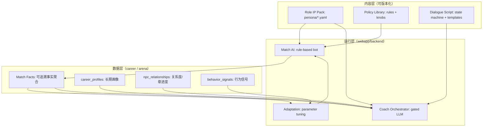

# 80 - 角色 IP 复用与可成长规则 NPC · Agent 驾驭框架

> **文档定位**：在 `webapp` 现有「**规则型 AI 对手（零 Token）**」基础上，引入一套可解释、可控、可渐进演化的 **Agent 机制**，让「NPC（生涯对话）」与「AI 选手（对抗/陪练）」共用同一套**角色 IP**，并在系统控制下实现陪伴感、成长感与成本/稳定性平衡。  
> **对齐**：[81-六支柱全景](./81-商域AI赋能六支柱全景.md)（支柱②③） · [77-投资人版](./77-商域AI作用全景-投资人版.md)（规则优先、LLM 渐进） · [78-实施指南](./78-智能体技术路线批判与VibeCoding实施指南.md)（B0/B+/C- 阶梯） · [79-AI 名词 Wiki](./79-AI技术名词与概念详解Wiki.md)  
> **工程锚点**：[06-生涯模式](../06-生涯模式-大循环家园与资源经济.md) §六（NPC 禁止无约束 LLM） · [`career/DESIGN.md`](../webapp/backend/app/domains/career/DESIGN.md)（B1～B4 数据真身） · ADR-005（RTS 单写者）  
> **最后更新**：2026-05-27

---

## 一、需求澄清（把“想要的体验”拆成工程可控件）

　　你的目标不是做「随便能聊的 LLM NPC」，而是三件事同时成立：

1. **同一套角色 IP**：NPC（生涯对话/导师/供应商）与 AI 选手（陪练对手/竞赛队伍）在名字、语气、价值观、偏好上保持一致，形成陪伴感。
2. **对抗仍以规则策略为主**：对局内的 AI 行为必须可解释、可复现、可回归测试，且单位成本接近 0（延续现有规则 AI 优势）。
3. **成长与适应是“受控的学习”**：AI 能随用户策略变化而调整，但调整发生在系统允许的参数空间内，有预算、有回滚、有验收。

　　因此，我们把“智能”分成两条线：

- **对局线（In-Match）**：规则策略 + 小参数自适应（零 Token、低风险、强一致性）
- **生涯线（Career）**：受控对话 + 叙事包装 + 复盘引导（Token 有预算、可降级、可审计）

---

## 二、核心原则（约束优先，避免把系统交给“自由聊天”）

1. **规则优先，LLM 后置**：对局内不调用 LLM 做决策；LLM 只做“解释、复盘、对话包装”，且必须可降级到模板（对齐 77、78）。
2. **角色卡外置，行为可追溯**：角色 IP 不写死在代码里；用 `content` 配置定义（类似 CyberCore YAML 思想），并在输出中记录 `persona_id`、`policy_id`、`version`。
3. **学习只调参，不改规则**：自适应的默认形式是「在同一套规则策略中调整权重/阈值/偏好」，禁止在线改写核心引擎逻辑。
4. **成本/延迟有硬预算**：按会话/按赛后任务设置预算上限；达到预算自动降级（模板卡片/静态对话树）。
5. **单写者与幂等纪律**：任何“推进状态/入账/写档案”的动作必须遵守既有单写者/幂等模式（ADR-005、ADR-007）。

---

## 三、整体架构：Role IP × Policy Bot × Coach Dialogue（分层组合）

### 3.1 三层组合图（概念）



### 3.2 关键点（为什么这样分）

- **Role IP Pack**：提供“像谁”的一致性（名字/语气/价值观/禁区/称呼方式）。
- **Policy Library**：提供“怎么打”的可解释性（规则策略集合 + 可调参数旋钮）。
- **Dialogue Script**：提供“怎么聊”的有序性（对话状态机 + 可检索事实 + 模板）。
- **Adaptation**：负责“变强/变得更像你”的部分，但只能在旋钮范围内做。
- **Orchestrator**：把 LLM 变成“受控的文案工”，不是自由对话体。

---

## 四、角色 IP 体系（NPC 与 AI 选手共用）

### 4.1 Role IP Pack（建议存放结构）

　　建议新增内容目录（先在 `content/` 规划，不急着立刻落地代码）：  
　　`webapp/backend/content/personas/<persona_id>.yaml`

```yaml
id: mentor_chen
display_name: 陈导师
archetype: mentor
tone:
  formality: medium
  warmth: high
  humor: low
values:
  - 先复盘事实再给建议
  - 不替学生做决策
  - 鼓励长期主义
taboos:
  - 直接告诉“本局怎么买/卖”
  - 诱导作弊或泄露他队信息
signature_phrases:
  - "我们先把事实摆出来。"
  - "你愿意为这个选择承担什么代价？"
policy_preferences:
  trading_rts:
    risk_appetite: low
    logistics_focus: high
dialogue_roles:
  - coach
  - npc
```

　　**同一 `persona_id`** 在两个地方复用：

- **对局内**：决定 AI 选手的“风格参数默认值”（例如更激进/更保守、更偏物流/更偏投机）。
- **生涯内**：决定 NPC 的“语气与价值观”，并约束 LLM 输出（taboos）。

### 4.2 角色与商业活动绑定（让“商业活动塑造角色”可工程化）

　　角色变化不靠“改 prompt”，靠**可审计的事件写入**：

| 事件 | 例子 | 写入位置 |
|------|------|----------|
| `match.finished` | 一局结束的排名/路线/城市 | Facts 聚合 + `career_profiles` |
| `quest.completed` | 完成某类练习 | `career_profiles` 维度增量 |
| `npc.chapter.unlocked` | 解锁章节 | `npc_relationships` |
| `homestead.slot.upgraded` | 家园升级 | `homestead_slots` |

　　NPC 在对话中引用这些事件的**事实字段**（排名、路线、tick、库存峰值等），而不是让 LLM 编造“你做得很好”。

---

## 五、规则型 AI 选手：策略库 + 旋钮（Knobs）+ 适应机制

### 5.1 Policy Library：策略库不是“一个 bot”，而是一组可切换/可混合的策略

　　以每个赛制为单位维护策略库（不跨赛制强行通用），每个策略对应一个 `policy_id`：

- `trading-v2-rts.policy.logistics_conservative`
- `trading-v2-rts.policy.arbitrage_aggressive`
- `techventure-v1.policy.city_expand_fast`
- `techventure-v1.policy.brand_story_first`

　　策略的输出应是**结构化 action**（已有 `/actions` 模式很适配），并能记录“为什么选这个动作”的简短解释字段（可选）。

### 5.2 Knobs：允许学习的参数空间（示例）

| 赛制 | 可调旋钮 | 解释 |
|------|----------|------|
| trading RTS | `risk_appetite`、`inventory_target`、`vehicle_buy_threshold`、`spread_threshold` | 决定更偏保守囤货还是高频套利 |
| TechVenture | `city_expand_bias`、`route_switch_bias`、`invest_split_prior` | 决定扩城/换路线/三维投入的偏好 |

　　旋钮必须满足：

- **边界清晰**（范围、单位、默认值）
- **可回滚**（配置版本化）
- **不影响公平**（对 `match_kind=official`：旋钮只能影响“风格”，不引入额外信息优势）

### 5.3 适应机制（从轻到重，严格分阶段）

#### A. 分段难度与风格选择（Phase B0～B+）

　　最先落地的是：**为用户选一个策略/难度档位**，而不是“在线学习”。

- 输入：用户历史表现、偏好（来自 `career_profiles` / `xp_events` / 完赛统计）
- 输出：`policy_id` + `knob_preset`

#### B. 受控调参（Phase C- 起，仍零 LLM）

　　基于行为信号做小幅调参（每 N 局更新一次，非每 tick）：

| 信号 | 例子 | 用途 |
|------|------|------|
| 风险倾向 | 资金波动、破产次数 | 调整 bot 风险倾向与止损阈值 |
| 策略偏好 | 常走城市/常投维度 | 选择更克制该偏好的对手策略 |
| 学习目标 | 本周 Quest 标签 | 切换对手策略以制造练习场景 |

#### C. Bandit 级“玩法自适应”（仍推荐先做离线/半在线）

　　如果你想让规则机器人真正“学会针对你”，建议用**多臂老虎机（MAB）**做“策略/旋钮组合”的选择器，而不是把学习塞进引擎内部。

- Arms：`(policy_id, knob_preset)` 的组合
- Reward：学习效果指标（例如“用户在 3 局内学会某个概念”的 proxy、或“对局后 Debrief 理解度”）
- 算法：epsilon-greedy / UCB / Thompson sampling（先从最简单开始）

　　关键收益：**可解释、可审计、可回滚**，且不会污染引擎逻辑。参考：玩家建模与 bandit 的综述（见 `arXiv 2102.05264` 与 2025 回顾性文章，适合作为工程启发而非强依赖）。

---

## 六、NPC 对话：受控的“系统行为”，不是自由聊天

### 6.1 对话是状态机（Dialogue Script），LLM 只填槽/润色

　　对齐 [06-生涯模式](../06-生涯模式-大循环家园与资源经济.md) 的硬约束：**MVP 不做无约束 LLM 聊天**。

　　推荐结构：

1. **对话状态机**：`state_id` 驱动下一句可选范围（类似剧情游戏）
2. **事实聚合**：从比赛事实/生涯档案抽取可引用字段（不可编造）
3. **模板输出**（B0）：不调用 LLM 也能生成可读内容
4. **LLM 增强**（C-）：只允许在模板的“措辞与比喻”上增色，输出必须满足 schema

### 6.2 三道护栏（必须）

1. **事实护栏（Grounding）**：任何涉及对局的句子必须引用 Facts 中的字段（或显式标“推测”并禁用在教学场景）。
2. **行为护栏（Taboos）**：遵守角色卡 `taboos`（不直接给答案、不泄露他队、不指导作弊）。
3. **预算护栏（Budget）**：每次对话/每次复盘有硬预算；超预算自动降级到模板或静态树。

　　预算护栏的实现思路可参考开源预算/guardrails 工具（例如 `AgentBudget`、`shekel`、结构化输出校验框架等），但在本仓库 Phase B0/B+ 建议先用**自研轻量计数器**（按调用次数/总 tokens）即可，避免过度引入依赖。

### 6.3 对话入口统一（避免“很多 AI 面孔”）

　　对齐 78：全站建议保持 **一个教练入口**（Athena），NPC 只是 Athena 的“角色面具”：

- UI 上仍是 “Athena”
- 对话内容可显示“当前陪你的是：陈导师 / 供货商李姐 …”
- 但对话框架、预算、降级都由同一 Orchestrator 托管

---

## 七、工程落点（放在现有域边界内，不引入新域越界）

### 7.1 需要新增/扩展的“事实层”与“档案层”

　　按 78 的 B0/C- 路线，先把事实与档案做真：

- `career_profiles`（B1）
- `npc_relationships`、`story_progress`（B4）
- `resource_ledger`（B2，为“商业活动塑造角色”提供可见资源后果）

　　对局事实聚合建议单独定义 `match_facts`（可存表或存 JSON 快照），原则是：

- 事实来自 DB 真实字段（`tv_*` / `trading_*`），不是 LLM 总结
- 同一 `match_id` 幂等生成（重复生成不扣费、不重复写）

### 7.2 事件路由（把“何时成长/何时对话”变成可控触发）

　　推荐以事件名驱动（先在代码里常量化，后续再 CloudEvents 化）：

- `match.practice.finished`
- `match.official.finished`
- `quest.completed`
- `npc.chapter.unlocked`

　　注意：RTS 的 tick 推进仍必须由 scheduler 单写者负责（ADR-005），**对话/复盘必须是赛后异步任务**，不得阻塞 tick。

---

## 八、分阶段落地计划（与 78 的 B0/B+/C- 对齐）

### 8.1 B0：先做“统一事实层 + 规则复盘模板”（不碰 LLM）

- [ ] 建 `match_facts` 聚合函数（每赛制 1 个聚合器）
- [ ] `persona_id` 挂在对局结果与复盘卡上（可先固定）
- [ ] NPC 对话先做静态树（JSON/YAML），引用事实字段

### 8.2 B+：单入口教练壳 + Quest 驱动角色成长

- [ ] Quest 完成 → 关系度/章节解锁（规则）
- [ ] `npc_relationships` 作为“陪伴感”数据真身

### 8.3 C-：最小 LLM（只润色，不做决策）

- [ ] LLM 仅用于 `debrief.enhance` 与 `dialogue.paraphrase` 两类节点
- [ ] 强 schema 输出 + 失败降级模板（`LLM_ENABLED=false` 可跑通）
- [ ] Token 成本报表（每 100 场复盘）

### 8.4 C：LangGraph 仅包装既有流水线（可观测、可重试、幂等）

- [ ] 4 节点图：load_facts → rule_card → llm_enhance? → persist
- [ ] `trace_id` 全链路

---

## 九、风险与反模式（直接抄进规则旁）

| 反模式 | 结果 | 替代 |
|--------|------|------|
| NPC 自由聊天 | 成本失控 + 幻觉 + 不可验收 | 状态机 + 模板 + LLM 仅润色 |
| 赛中实时教练 | 阻塞 tick + 泄露策略 | 赛后 Debrief / 练习提示 |
| 在线改引擎逻辑“让 bot 学习” | 破坏可复现与公平 | 学习只调 knobs / policy 选择 |
| 多入口多个“AI 面孔” | 心智爆炸 | Athena 单入口，角色面具切换 |
| 不做事实聚合直接让 LLM 总结 | 胡编 + 无引用 | Facts → template → enhance |

---

## 十、你下一步最该做的“工程第一刀”

　　如果你希望这套框架尽快落地且不失控，第一刀不是写 LangGraph、也不是写聊天页，而是：

- **为 1 个赛制（建议 TechVenture）做 `match_facts` 聚合器 + 规则 Debrief 卡片模板**  
- 同时定义 1 个 `persona_id`（例如 `mirror_self` 或 `mentor_chen`）贯穿：对局复盘卡片 → NPC 第一段对话  

　　这一步完全不需要 LLM，就能让「同一角色 IP」开始出现，并且为后续的 C- LLM 增强打下可验收的事实底座。

---

*维护说明：当新增 persona/policy 时，请同步更新 [79-Wiki](./79-AI技术名词与概念详解Wiki.md)；当引入任何 LLM 节点时，必须实现降级与预算硬门。*

