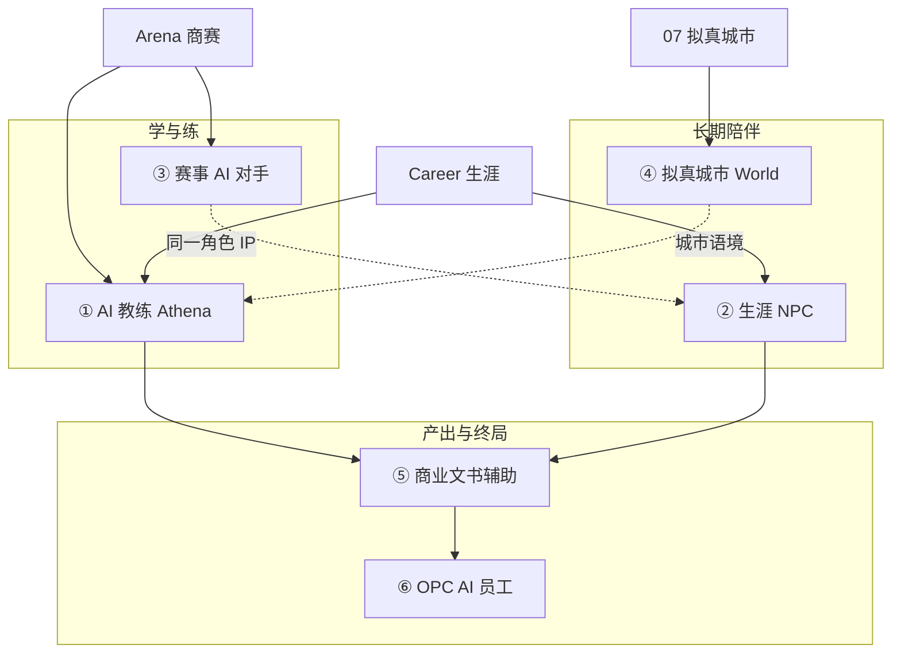
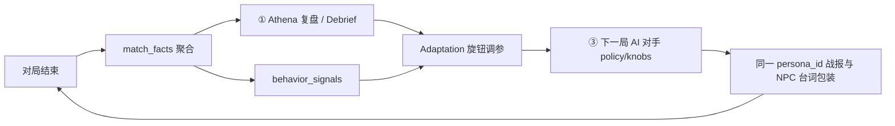
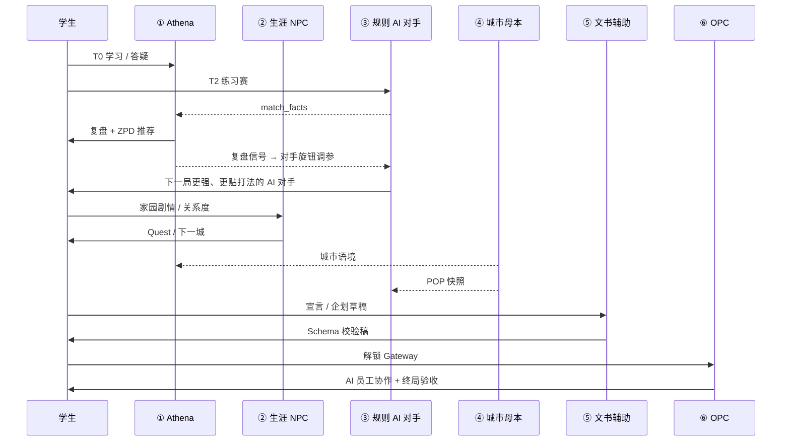

# 81 - 商域 AI 赋能六支柱全景

> **文档定位**：商域 BizSim Edu **AI 赋能产品的权威框架**——按主理人定义的 **六条能力主线** 组织全站 AI 角色、边界、阶段与文档索引。投资人向摘要见 [77-](./77-商域AI作用全景-投资人版.md)；技术实施阶梯见 [78-](./78-智能体技术路线批判与VibeCoding实施指南.md)；名词速查见 [79-](./79-AI技术名词与概念详解Wiki.md)。
>
> **设计总纲**（全支柱共用）：**规则层优先、LLM 渐进、教师不替代、高利害节点可审计**——见 [01-平台愿景](../01-平台愿景与产品架构.md) §二、[03-技术架构](../03-技术架构与实现现状.md) §八。
>
> **最后更新**：2026-05-28

---

## 目录

1. [总览：六支柱与产品主线](#一总览六支柱与产品主线)
2. [支柱一：AI 教练（教学 · 复盘 · 锚点 · 最近发展区）](#二支柱一ai-教练教学--复盘--锚点--最近发展区)
3. [支柱二：生涯伴随成长的 NPC](#三支柱二生涯伴随成长的-npc)
4. [支柱三：赛事与活动中的 AI 对手（角色扮演）](#四支柱三赛事与活动中的-ai-对手角色扮演)
5. [支柱四：拟真城市与区域模拟的 AI 辅助](#五支柱四拟真城市与区域模拟的-ai-辅助)
6. [支柱五：商业文书与实践工作的 AI 辅助](#六支柱五商业文书与实践工作的-ai-辅助)
7. [支柱六：OPC 终局——AI 员工驱动的素养终考](#七支柱六opc-终局ai-员工驱动的素养终考)
8. [六支柱如何串联（学生旅程）](#八六支柱如何串联学生旅程)
9. [技术纪律与成本策略（横切）](#九技术纪律与成本策略横切)
10. [阶段路线与验收](#十阶段路线与验收)
11. [延伸阅读与文档分工](#十一延伸阅读与文档分工)

---

## 一、总览：六支柱与产品主线

　　商域的 AI 不是单点「聊天窗口」，而是沿 **[01-](../01-平台愿景与产品架构.md) 发展主线** 分布的 **六类赋能能力**：从课内/赛中的即时教练，到生涯陪伴，到规模化陪练对手，到区域世界建设，到文书与真实交付，最终在 OPC 完成**商业素养的整合性学习、实践与考核**。



### 1.1 六支柱对照表

| # | 支柱 | 学生感知（一句话） | 主要触点 | 核心机制 | Phase 重心 | **现状（2026-05）** |
|---|------|-------------------|----------|----------|------------|---------------------|
| **①** | **AI 教练** | 有人帮我把规则讲明白、赛后复盘得失，并告诉我下一步该练什么 | Athena 浮窗、赛后 Debrief、Quest、Wiki RAG | 规则复盘 → RAG 答疑 → 周计划 | **B～C** | 🟡 模板/mock；规则复盘待 B |
| **②** | **生涯 NPC** | 家园里有人记得我的成长轨迹，故事与关系随赛季持续推进 | Career 家园、NPC 对话、关系度、章节 | 角色 IP + **受控对话状态机**（非自由聊天） | **B～C** | 🔴 设计定稿；B2～B4 数据真身 |
| **③** | **赛事 AI 对手** | 练习对手随时可战、风格鲜明，并会随对局表现与教练复盘持续进化，越练越有针对性 | 浮生记练习、TechVenture 练习局 | **规则策略 + 旋钮适应**；复盘驱动调参；零 Token | **A✅ → D** | ✅ 三赛制规则 AI；适应/复盘闭环待 B～D |
| **④** | **拟真城市** | 无论换哪项赛制，面对的仍是同一座熟悉的城市与人群 | 城市母本、档案页、Demia 舆情（远期） | 建设期 AI 起草；运行期 **规则 POP** | **B 建设 → E 叙事** | 🟡 07- §六～§九 定稿；引擎未加载母本 |
| **⑤** | **商业文书** | 企划书与 BMC 能写得规范专业，也经得起教师审阅与批改 | BMC 编辑器、赛宣言、报告模板、OPC 交付物 | 结构化共写 + Schema 校验 + 教师/Gateway | **C～E** | 🟡 OPC BMC CRUD ✅；赛宣言 AI 批改未做 |
| **⑥** | **OPC 终局** | 像创业者一样带领 AI 团队完成首个项目，并接受关卡式考核 | OPC 流水线、Cortex 拆单、Gateway 评审 | LangGraph 员工 + MCP + **阶段考核阀门** | **E** | 🔴 CRUD 演示；Agent/MCP Phase E |

### 1.2 与「智能体家族」的映射

| 平台 Agent / 模块 | 主要归属支柱 | 说明 |
|-------------------|-------------|------|
| **Athena** | ①（主）、③（复盘→适应）、⑤（共写润色） | 全站**单一教练入口**；赛后复盘输出驱动对手旋钮调参；NPC 为「角色面具」（[80-](./80-角色IP复用与可成长规则NPC-Agent框架.md)） |
| **生涯 NPC / Role IP** | ②、③（共用） | 同一 `persona_id` 可出现在家园对话与 AI 队伍 |
| **Demia** | ④（叙事层，E+） | 读 World POP 基线；**不改**规则层数值 |
| **Rival** | ③ 扩展（谈判练习，D+） | LLM 人格对话，非对局决策 |
| **Cortex + OPC 岗位 Agent** | ⑥ | 任务拆单与岗位交付 |
| **Gateway** | ⑥（考核阀门） | 阶段评审；高利害，可教师终审 |

---

## 二、支柱一：AI 教练（教学 · 复盘 · 锚点 · 最近发展区）

### 2.1 要解决什么问题

| 痛点 | AI 教练的职责 |
|------|----------------|
| 商赛规则难懂 | **简单教学**：概念微课、赛制要点、错误决策解释（先模板/规则，后 RAG） |
| 打完不知好在哪 | **复盘比赛**：结构化 Debrief（决策链、机会成本、可改进点） |
| 学了不知练啥 | **学习锚点**：把对局/Quest 行为映射到知识卡片、五维能力标签 |
| 太难或太易 | **最近发展区（ZPD）**：在「已掌握」与「跳一跳够到」之间推荐下一活动（练习难度、知识点、赛制） |

　　**边界**：教练**扩展教师、不替代教师**；不替学生提交对局决策；正式赛不提供局内数值加成（[06-生涯模式](../06-生涯模式-大循环家园与资源经济.md) §1.3）。

### 2.2 能力分层（规则 → RAG → Agent）

| 层级 | 能力 | Token | Phase |
|------|------|-------|-------|
| L0 | 浮窗 FAQ、赛制静态说明、模板鼓励语 | 0 | A（部分已有） |
| L1 | **Athena-Debrief 规则模板**：输入 `match_facts` → 固定段落复盘 | 0 | **B** |
| L2 | RAG 答疑：索引 Wiki / 知识卡片 / 对局事实 | 低 | **C** |
| L3 | 周计划 / PathPlanner：综合 Career 画像推荐 T0～T3 | 中 | **C** |
| L4 | 多轮追问式教练（LangGraph + 记忆） | 中高 | **C～D** |

### 2.3 学习锚点与 ZPD 的数据来源

| 数据 | 用途 |
|------|------|
| `xp_events`、五维能力 | 锚定「已有什么基础」 |
| `match.finished` 聚合事实 | 复盘与薄弱点推断 |
| Atlas 掌握度、Quest 完成记录 | 推荐下一知识点 |
| `practice` 难度与胜率 | ZPD：调节 AI 对手档位；复盘后更新 Policy 旋钮（→ 支柱③） |

### 2.4 工程落点（规划）

- 编排：[03-](../03-技术架构与实现现状.md) §八 Pedagogy OS（LangGraph）
- 事件：订阅 `match.finished`、`quest.completed` → 触发 Debrief 任务
- 前端：学生端 Athena 浮窗（已有壳）

---

## 三、支柱二：生涯伴随成长的 NPC

### 3.1 要解决什么问题

　　在 [06-生涯模式](../06-生涯模式-大循环家园与资源经济.md) 大循环中，学生需要**长期关系**而非一次性聊天：导师、供应商、竞争对手、剧情角色——随 **关系度、章节、赛季** 变化台词与解锁内容，并记住关键选择（在受控状态机内）。

### 3.2 AI 做什么 / 不做什么

| ✅ 可以做 | ❌ 禁止 |
|----------|--------|
| 基于 `career_profiles` + `npc_relationships` 的**状态机对话** | 无状态自由 LLM 闲聊改数值 |
| 推送 Quest、家园事件、城市足迹叙事 | 局内给 `official` 赛数值 buff |
| 赛后「陈导师」式复盘**包装**（事实来自支柱①） | 编造与 [07-](../07-拟真城市与区域模拟-阅读合集.md) 母本矛盾的城市数据 |
| 关系度升级解锁剧情与外观 | 跨域直接写 Arena 表 |

### 3.3 与支柱①、③的统一：角色 IP

　　详见 [80-](./80-角色IP复用与可成长规则NPC-Agent框架.md)：

- **生涯线**：`Dialogue Script` + 可选 gated LLM（有 Token 预算与降级）
- **对局线**：同一 `persona_id` 的 AI 队伍使用 **Policy Library**（规则 + 旋钮）
- **UI**：学生仍从 **Athena 单入口** 进入教练；NPC 为面具，避免「满屏 AI 脸」

### 3.4 成长感如何实现（受控）

| 机制 | 说明 |
|------|------|
| 关系度 / 章节 | 对话树分支解锁；非模型「聊着聊着就变了」 |
| 行为信号 | `behavior_signals` 聚合练习偏好 → 调 NPC 台词与推荐 Quest |
| 赛季传承 | Legacy 槽位记录上季关键选择（叙事，非 Pay-to-win） |

---

## 四、支柱三：赛事与活动中的 AI 对手（角色扮演）

### 4.1 要解决什么问题

　　**无人组队也能练**、**正式赛缺队可补位**（可选）、对手有**可识别性格**而非随机数——对应 58 号文档「人格化对手」，但工程上坚持 **规则优先**。

　　更进一步：对手不应是「永远同一套脚本」。学生打完一局、经教练复盘后，**同一 NPC 面孔**背后的 AI 队伍应在系统允许范围内**变强、变贴你的打法**——形成「练 → 复盘 → 对手进化 → 再练」的闭环，而非静态难度表。

### 4.2 现状（Phase A 已交付）

| 赛制 | 实现 | 学生价值 |
|------|------|----------|
| 浮生记 RTS v2 | `rts_ai_levels` | 5s tick 单人开练 |
| 浮生记回合 v1 | `ai_trader` + `practice_flow` | 回合练习自动推进 |
| TechVenture | `ai_team.py` | 1 人 + 5 AI 队满局 |

　　**成本**：练习对局 **≈ 0 LLM Token**（[04-](../04-实施路线与里程碑.md) §4.4）。

### 4.3 「角色扮演」的三层含义

| 层 | 内容 | Phase |
|----|------|-------|
| **行为层** | 不同 `policy_id`（激进/稳健/品牌向）+ `persona_id` 语气在战报/UI 中展示 | A✅ / B 内容包 |
| **解释层** | 赛后 Athena 用自然语言解释「对手为何这样投」 | D（LLM，可选） |
| **进化层** | 复盘与 `behavior_signals` 驱动 **Adaptation**：在 Policy 旋钮空间内调权重/档位，下一局对手更强、更贴学生策略 | B 档位 · C 半在线 · D Bandit 选型 |

　　对局内 **禁止** LLM 实时决策（稳定性、公平、成本）；**进化发生在局间**，与 [ADR-005](../docs/decisions/005-rts-single-writer.md) RTS 单写者一致——复盘/调参为**赛后异步任务**，不阻塞 tick。

### 4.4 复盘驱动的对手优化（① → ③ 闭环）

　　这是支柱 ③ 与支柱 ①、② 的**核心交叉**：教练复盘不只服务「讲懂」，还为 NPC 对手提供**可执行的适应输入**。



| 环节 | 输入 | 输出 | 约束 |
|------|------|------|------|
| **复盘提炼** | 决策链、胜负、薄弱维度 | 结构化改进点（非 LLM 也可用规则模板） | 不泄露对手隐藏信息 |
| **信号聚合** | 多局胜率、路线偏好、失误类型 | `behavior_signals` 写入 Career | 仅练习/个人档案 |
| **旋钮调参** | 信号 + ZPD 目标难度 | 更新 `policy_id` 组合或旋钮值 | **只调参、不改规则**；official 赛风格化 only |
| **NPC 包装** | 同一 `persona_id` | ② 家园台词 / 战报文案体现「他变强了」 | 叙事服从数值，不反向改规则 |

　　详见 [80- §五 适应机制](./80-角色IP复用与可成长规则NPC-Agent框架.md#五规则型-ai-选手策略库--旋钮knobs--适应机制)：**A 固定档位 → B 离线画像调参 → C Bandit 策略选型**，均在对局外完成。

| 学生可感知的变化 | 系统侧实现（摘要） |
|------------------|-------------------|
| 「陈导师队」下次更针对我的品牌路线 | 提高对应 `policy` 权重 / 切换 `policy_id` |
| 练习难度随我进步而抬升 | ZPD + 胜率触发档位上调（① 与 ③ 联动） |
| NPC 在生涯里提到「上次你输在哪」 | ② 读复盘事实做对话包装，非自由编造 |

### 4.5 与支柱②的复用

```
content/personas/mentor_chen.yaml  ─┬─► 生涯 NPC 对话
                                    └─► TechVenture AI 队「陈氏策略」皮肤
```

---

## 五、支柱四：拟真城市与区域模拟的 AI 辅助

### 5.1 要解决什么问题

　　建设**跨赛制共享**的真实中国城市底座（产业、POP、交通、档案），使教练复盘、生涯叙事、赛制投影共用 `city_id` / `pop_id`。

### 5.2 AI 分工（建设期 vs 运行期）

　　权威细则：[07- §六～§九](../07-拟真城市与区域模拟-阅读合集.md)。

| 阶段 | AI **可以做** | AI **禁止** |
|------|---------------|-------------|
| **建设期（B）** | 城市商业档案起草；统计→参数**区间建议**；表格→YAML 映射辅助 | 未经教研签字写入母本数值；宣称经济预测 |
| **运行期 B～D** | RAG「为何南京 pragmatic 占比高」（索引母本） | 赛中改 POP / 跨局写回母本 |
| **运行期 E+** | Demia **叙事层**舆情（规则层输出之后） | 改写 `demand_share` 等符号 |

### 5.3 与支柱①、②、③的接口

| 支柱 | 如何使用 World |
|------|----------------|
| ① 教练 | 复盘引用「你在 `nanjing.pragmatic` 市场的决策」 |
| ② NPC | 城市橱窗、区域章节与 `city_id` 对齐 |
| ③ 引擎 | L4 开局快照只读；`engine_projection` 映射 TV/RTS 字段 |

---

## 六、支柱五：商业文书与实践工作的 AI 辅助

### 6.1 要解决什么问题

　　学生需要完成**像专业从业者一样**的产出物，而不仅是游戏分数：

| 类型 | 场景 | AI 角色 |
|------|------|---------|
| **商业企划书 / 路演稿** | 课程作业、大赛准备、OPC IDEATE | 结构化大纲、段落共写、术语校对 |
| **BMC 九宫格** | OPC `/opc/bmc` | 字段提示、完整性检查、版本对比 |
| **赛务文书** | TechVenture **品牌宣言**、总结报告 | 一致性提示、评语草稿（**教师定分**） |
| **实践工作包** | 市场调研提纲、访谈纪要、竞品表 | 模板生成 + 引用格式；**不伪造数据** |

### 6.2 设计原则

| 原则 | 说明 |
|------|------|
| **Schema 优先** | 输出必须符合 JSON/Markdown 模板，便于 Gateway 与教师批改 |
| **事实锚定** | 引用对局 `match_facts`、知识卡片；无源数据须标注「待验证假设」 |
| **人机分工** | AI 起草 → 学生修改 → 教师/Gateway 批准（高利害） |
| **与 OPC 边界** | 支柱⑤覆盖**全生涯文书能力**；支柱⑥在 OPC 内升级为**可验收交付物 + AI 员工协作** |

### 6.3 阶段

| Phase | 交付 |
|-------|------|
| **C** | 宣言/报告 **辅助批改**（规则+LLM）；BMC 智能提示增强 |
| **D** | 多类型文书模板库；导出 PDF/课堂提交 |
| **E** | OPC 各阶段 SOP 与 Cortex 任务包联动（见 [05-](../05-OPC一人公司-阅读合集.md)） |

---

## 七、支柱六：OPC 终局——AI 员工驱动的素养终考

### 7.1 要解决什么问题

　　在 Career 达标后，学生以**管理者**身份运营一人公司，由 **AI 员工**（市场、产品、财务等岗位）协作完成 **IDEATE → VALIDATE → BUILD → LAUNCH → SCALE** 首项目；通过 **Gateway** 完成商业素养的**最终学习、实践与考核**——从「会模拟」到「能交付」。

### 7.2 与前五支柱的关系

| 前置支柱 | 汇入 OPC 的方式 |
|----------|----------------|
| ① 教练 | Gateway 前 Athena 背书；薄弱点提示 |
| ② NPC | 可转化为 OPC 内「导师岗」角色面具 |
| ③ 对手 | 谈判/竞品思维已在赛中验证 |
| ④ 城市 | 区域商业语境用于市场分析章节 |
| ⑤ 文书 | BMC、企划书在 OPC 流水线中成为**硬交付物** |

### 7.3 AI 在 OPC 中的三重角色

| 角色 | 说明 | 现状 |
|------|------|------|
| **劳动力（AI 员工）** | 岗位 KPI、交付物、岗位记忆 | Phase E：LangGraph + MCP |
| **项目经理（Cortex）** | 拆单、排期、依赖检查 | 设计稿 |
| **考官（Gateway）** | 阶段 rubric、通过/打回；可教师终审 | 表结构有；算法待冻结 |

　　阅读合集：[05-OPC一人公司](../05-OPC一人公司-阅读合集.md) · 规格 [`OPC/`](../OPC/) 子目录。

### 7.4 「终局考核」的含义（教育向）

| 维度 | 标准 |
|------|------|
| 知识 | Atlas/课程掌握度达标（入口门槛） |
| 模拟 | Arena 正式赛或等效练习履历 |
| 实践 | OPC 首项目 MVP + 验证报告 |
| 认证 | Credenti / 教师 Gateway / 外部合作（可选） |

　　**非**单一考试分数，而是**流水线关卡 + 交付物矩阵**。

---

## 八、六支柱如何串联（学生旅程）



| 学段心智 | 支柱组合 |
|----------|----------|
| 入门 | ① 教学 + ③ 练习对手 |
| 常驻 | ① + ② + ④（城市档案阅读） |
| 大赛 | ① 复盘 + ⑤ 宣言/报告 + 教师控场 |
| 高阶 | ①～⑤ 沉淀 → ⑥ OPC 首项目 |

---

## 九、技术纪律与成本策略（横切）

　　六支柱共用 [78-](./78-智能体技术路线批判与VibeCoding实施指南.md) 实施阶梯：

| 纪律 | 适用范围 |
|------|----------|
| **B0 数据真身** | ② Career 表、④ 母本 YAML、⑥ OPC 任务状态先落地 |
| **规则优先** | ③ 对局；④ POP 计算；① L1 复盘 |
| **C- 最小 LLM** | ① 答疑、⑤ 共写、② 对话包装 |
| **单写者 / 幂等** | ③ RTS；⑥ Gateway 入账；Career `xp_events` |
| **可降级** | LLM 失败 → 模板 → 纯数值面板 |

| 成本策略 | 说明 |
|----------|------|
| 规模在③ | 千级 DAU 练习靠 CPU，不靠 Token |
| 高价值在①⑤⑥ | 复盘、文书、OPC 按次计费 + 配额 |
| 建设期集中④ | 城市母本每学期校准一次 |

---

## 十、阶段路线与验收

| Phase | 六支柱重点交付 |
|-------|----------------|
| **A（当前）** | ③ ✅；① 壳；⑥ CRUD 演示 |
| **B** | ① 规则 Debrief；② B2～B4 家园/NPC 数据；④ 母本 ≥6 城 |
| **C** | ① RAG+周计划；② 受控对话 MVP；⑤ 宣言/BMC 辅助；④ World 只读 API |
| **D** | ③ 策略解释；②③ [80-] Role IP 内容包；⑤ 文书模板库 |
| **E** | ④ Demia 叙事；**⑥ OPC Agent + Gateway 考核** |
| **F** | 机构教师看板；多租户配额；脱敏研究导出 |

　　与 [04-实施路线](../04-实施路线与里程碑.md)、[08-工程详表](../08-工程现状与webapp实现详表.md) §三 对齐。

---

## 十一、延伸阅读与文档分工

| 文档 | 与本稿关系 |
|------|------------|
| **本文（81）** | **六支柱产品框架**（主理人思路的权威整理） |
| [PPT/AI赋能/index.html](../PPT/AI赋能/index.html) | **HTML 演示文稿**（17 页 · 浏览器全屏播放） |
| [77-](./77-商域AI作用全景-投资人版.md) | 投资人七方面 + 现状百分比 + 企划书摘录 |
| [78-](./78-智能体技术路线批判与VibeCoding实施指南.md) | Vibe Coder 实施难点与 B0/C-/C 阶梯 |
| [79-](./79-AI技术名词与概念详解Wiki.md) | 名词释义 |
| [80-](./80-角色IP复用与可成长规则NPC-Agent框架.md) | 支柱②③ 角色 IP 与规则/对话分层 |
| [58-](./58-AI赋能的商业教育革命.md) | 场景灵感与伦理原则 |
| [07-](../07-拟真城市与区域模拟-阅读合集.md) §六～§九 | 支柱④ 颗粒度 / POP / 数据 / AI |
| [06-](../06-生涯模式-大循环家园与资源经济.md) | 支柱② 产品权威 |
| [05-](../05-OPC一人公司-阅读合集.md) | 支柱⑥ 阅读合集 |

---

*商域 BizSim Edu · Inspire 81 · AI 赋能六支柱全景*
