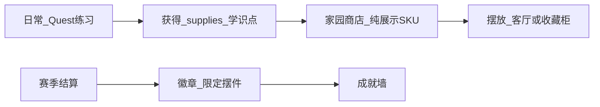

# 85 - 家园展示厅与成就陈设产品设计

> **文档定位**：在 [06-](../06-生涯模式-大循环家园与资源经济.md)「Homestead 家园」基础上，细化 **消耗日常奖励、摆设虚拟奖品、展示成就徽章** 的交互与数据模型，供生涯域 Phase B2～B3 实现前讨论。  
> **对齐**：[career/DESIGN.md](../webapp/backend/app/domains/career/DESIGN.md) · **86-AI 教练与生涯 NPC**（inspire 目录登记于 50- §H） · ADR-007（XP 账本）  
> **状态**：[过程]  
> **最后更新**：2026-05-30

---

## 一、产品愿景（一句话）

　　**家园 = 生涯的「客厅」**：把 Quest、日常练习、赛季汇入的 **非竞技性收获** 变成可看见、可布置、可向同学炫耀的陈列；**不**在正式赛局内提供数值优势。

---

## 二、与 06- 的关系

| 06- 已有概念 | 本稿扩展 |
|--------------|----------|
| Homestead 5 槽位 | 拆为 **功能槽**（3）+ **展示厅**（无限陈列墙，仅视觉） |
| supplies / knowledge_points | 消耗品用于 **解锁摆设** 与 **升级展示框** |
| honor / 赛季结算 | 映射为 **徽章** 与 **限定摆件** |
| NPC 章节解锁 | 家园入口旁 **导师小屋**（见 86-） |

　　资源经济主线仍以 06- 为准；本稿只增加 **展示层 SKU** 与 **UI 流程**，不新增第二种货币。

---

## 三、空间结构（信息架构）

```
/career/home  （家园总览）
├── 客厅（Homestead）     — 3 个「主展示位」：大件虚拟奖品（奖杯、沙盘模型）
├── 成就墙（Badge Wall）  — 网格：徽章、赛季称号、商赛荣誉
├── 收藏柜（Cabinet）     — 小件：卡牌、证书、纪念品（消耗 supplies 购买）
└── 导师角（NPC Corner）  — 静态立绘 + 最近一条 NPC 寄语（86- 对接）
```

### 3.1 与「日常模式」的循环



　　**赛季模式** 高权重 XP 仍走 `SettlementBundle`；家园只接收 **展示类掉落**，避免「刷家园 = 刷战力」。

---

## 四、核心对象（草案）

### 4.1 展示 SKU（`display_items`）

| 字段 | 说明 |
|------|------|
| `item_id` | 稳定 ID，如 `trophy_trading_gold_2026` |
| `category` | `trophy` / `figurine` / `certificate` / `seasonal` |
| `rarity` | common / rare / epic（仅影响框样式，无局内 buff） |
| `cost` | `{ supplies?: number, knowledge_points?: number }` |
| `unlock_rule` | 可选：`quest_id` / `honor_min` / `season_rank` |
| `asset_key` | 前端 2D/3D 资源键 |

### 4.2 用户陈设（`user_placements`）

| 字段 | 说明 |
|------|------|
| `user_id` | 主人 |
| `item_id` | 引用 SKU |
| `zone` | `living_room_slot_1` … `badge_wall` |
| `position` | 墙区格子坐标（徽章墙） |
| `placed_at` | 摆放时间 |

### 4.3 徽章（`badges`）

| 来源 | 示例 |
|------|------|
| Quest 链 | 「完成供应链入门」 |
| 商赛荣誉 | 「班级赛 Top3」（只读展示，数值来自 honor 表） |
| 赛季 | 「2026 暑期营 · 完成者」 |
| 隐藏成就 | 连续 7 日日常任务 |

　　徽章 **不可交易**；重复获得可升星（铜→银→金框）或转为 supplies（讨论项）。

---

## 五、交互流程（MVP）

### 5.1 获得 → 入库

1. 完成 Quest / 日常任务 → `resource_ledger` 入账 supplies。  
2. 达成 honor 条件 → 后端推送 `badge_unlocked` 事件（WebSocket 或下次拉取 `/career/home`）。  
3. 家园商店列出 **已解锁可购** SKU；未解锁灰显 + 提示条件。

### 5.2 摆放

1. 进入 **客厅** → 点空槽 → 从 **我的库存** 选大件。  
2. 进入 **成就墙** → 拖拽徽章到格子（移动端：点选格子）。  
3. **收藏柜** 小件可叠放，不占客厅槽位。

### 5.3 参观（社交轻量）

| 能力 | Phase |
|------|-------|
| 生成 **家园快照链接**（只读） | B3 |
| 班级内 **本周最美客厅** 投票 | C+ |
| 局内数值加成 | **禁止** |

---

## 六、前端现状与演进

| 现状 | 目标 |
|------|------|
| `CareerHomePage` mock 数据 | 接 `GET /career/home` + `POST /career/placements` |
| `careerStore` persist 本地 | 以服务端为准；本地仅缓存布局草稿 |
| 无 supplies 余额 UI | Hub 顶栏显示 supplies / 学识点（读 career API） |

　　视觉可参考手游「宿舍/陈列室」：**低多边形或 2D 插画**，Phase B 不追求 3D 编辑器。

---

## 七、后端落点（Phase B2～B3）

| 组件 | 域 | 说明 |
|------|-----|------|
| `resource_ledger` | career | supplies / knowledge_points 流水 |
| `display_catalog.yaml` | `content/career/` | SKU 母本，与 game-configs 类似 |
| `user_inventory` | career | 已拥有未摆放 |
| `user_placements` | career | 当前布局 |
| `badges` + `user_badges` | career | 成就定义与获得记录 |

　　**禁止**：trading 引擎直接写 `user_placements`；须 `grant_supplies` / 赛后 `settle_match_rewards` 经 career 服务。

---

## 八、与商赛、教师端的关系

| 场景 | 家园表现 |
|------|----------|
| 营内练习赛 | 可掉 supplies，不掉竞技 rank |
| 班级正式赛 | honor → 徽章；**无**局内道具 |
| 教师布置作业 | 可选奖励「限定摆件预览」（赛季结束发放） |

---

## 九、MVP 范围建议（讨论）

| 迭代 | 交付 |
|------|------|
| **B2** | supplies 余额 + 3 客厅槽 + 5 个可购 SKU（YAML） |
| **B3** | 徽章墙 12 格 + 2 条 honor 自动徽章 |
| **B3+** | 参观链接 + 导师角静态文案 |

---

## 十、待决问题

1. 客厅槽 **3 个** 是否足够，还是与 06- 的 5 槽统一？  
2. 重复徽章是否 **转化 supplies**？  
3. 学生端 `/career` 与 `/camp` 入口是否合并为「成长」一级导航？  
4. 虚拟奖品美术由 **统一 asset pack** 还是教师可上传（仅 P4）？
