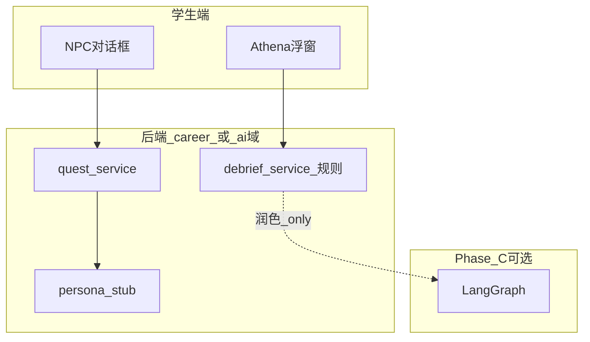

# 86 - AI 教练与生涯 NPC 首期建设蓝图

> **文档定位**：把「AI 教练（Athena）+ 生涯伴随 NPC」从构想推进到 **Phase B 可开工** 的建设序：规则层优先、LLM 渐进、与商赛角色 IP 分工清晰。  
> **对齐**：[03-](../03-技术架构与实现现状.md) §八 · **81-商域 AI 赋能六支柱**（inspire） · **80-角色 IP**（inspire） · [06-](../06-生涯模式-大循环家园与资源经济.md) · **85-家园展示厅**（inspire 目录登记于 50- §H）  
> **状态**：[过程]  
> **最后更新**：2026-05-30

---

## 一、建设目标（首期）

| 角色 | 用户感知 | 首期能力边界 |
|------|----------|--------------|
| **AI 教练 Athena** | 浮窗 / 生涯页「教练」Tab | **赛后** 规则型 Debrief 卡 + 周计划 3 条建议（模板+可选 LLM 润色） |
| **生涯 NPC** | 家园导师角 + Quest 对话 | **2 名固定导师** 静态分支对话 + 条件解锁；无自由闲聊 |
| **商赛规则 NPC** | 局内对手/事件 | 仍走 **80-** 与 `games/` AI 策略；**不**与生涯 NPC 混表 |

---

## 二、架构分层（须遵守 81- 与 ADR-008）



| 层 | Phase B | Phase C+ |
|----|---------|----------|
| **事实层** | 读 `xp_events`、商赛 `standings`、决策摘要 | 同左 |
| **规则层** | Debrief 模板、NPC 对话树、解锁条件 | Athena-Debrief 规则库扩展 |
| **生成层** | 可选：讲评文案润色（带引用片段） | LangGraph 多步、群聊智能体 |

　　**硬规则**：HTTP 不得因 AI 调用而推进 RTS tick；教练接口只读对局已提交数据。

---

## 三、AI 教练 Athena

### 3.1 触点

| 触点 | 时机 | 输出 |
|------|------|------|
| 商赛结束 | `match.status = finished` | Debrief 卡：3 观察点 + 1 改进建议 + 链接复盘作业 |
| 生涯 Hub | 每周一 / 登录第 3 次 | 「本周三件事」：Quest 推荐 + 练习赛建议 |
| 体验营 | 教师发布复盘后 | 学生侧「听教练讲评」只读版（教师已审核的要点） |

### 3.2 Debrief 规则卡（MVP 无 LLM 也可交付）

**输入**（只读）：

- `game_config_id`、回合数、名次、`trading_decisions` 或 TV 提交摘要  
- 预置 **规则模板库**（YAML）：如「库存积压」「定价过激」「研发滞后」

**输出**（JSON）：

```json
{
  "observations": ["...", "...", "..."],
  "suggested_focus": "...",
  "related_quest_ids": ["quest_supply_chain_01"],
  "citations": [{"type": "round", "round": 3, "field": "inventory"}]
}
```

**LLM 润色**（可选开关 `AI_DEBRIEF_LLM=1`）：

- 仅改写 `observations` 文案，**不得**改 `citations` 与排名事实。  
- Prompt 须含「禁止编造未出现在 citations 的数据」。

### 3.3 API 草案（归入 career 或独立 `api/coach.py`，须更新 08- §2.7）

| 方法 | 路径 | 说明 |
|------|------|------|
| GET | `/career/debrief/{match_id}` | 幂等生成/缓存 Debrief |
| GET | `/career/coach/weekly-plan` | 周计划 |
| POST | `/career/coach/feedback` | 学生对 Debrief 有用/无用（埋点） |

---

## 四、生涯 NPC（伴随型）

### 4.1 首期角色（建议）

| ID | 人设 | 职责 | 解锁 |
|----|------|------|------|
| `npc_chen` | 陈掌柜 · 零售/定价 | Quest 链「小店经营」 | 生涯 Lv.1 |
| `npc_li` | 李供应链 · 采购/库存 | Quest 链「供应链入门」 | 完成陈掌柜 Ch.1 |

　　立绘与台词风格对齐 **80-** 角色 IP 卡；**表结构** 与商赛 `ai_opponent` 分离。

### 4.2 对话模型

| 类型 | 实现 |
|------|------|
| 主线 | `content/career/npc/chen/chapters.yaml` 节点树 |
| 分支条件 | `career_level` / `quest_completed` / `supplies >= N` |
| 奖励 | 节点结束 `grant_supplies` / 解锁徽章（85-） |

　　**不做** Phase B 开放域聊天；避免审核与幻觉风险。

### 4.3 与家园（85-）联动

- **导师角** 显示当前主线 NPC 立绘 + 最近一句台词。  
- 完成章节 → 家园掉落 **专属小摆件**（display SKU）。

---

## 五、教师端 AI 辅助（与 84- 协同）

| 能力 | 说明 | Phase |
|------|------|-------|
| 班级讲评草稿 | 聚合全班 Debrief 高频词 | B3 |
| 公告润色 | 教师输入要点 → 生成公告文案 | B3 |
| 自动排课 | AOTU | **不做** B 期 |

　　教师侧 AI **不**接触学生隐私原文以外的聊天；仅聚合统计与教师已选片段。

---

## 六、内容生产工作流（给主理人）

1. **写规则模板**：`content/career/debrief/trading/*.yaml`（触发条件 + 文案槽位）。  
2. **写 NPC 章**：`content/career/npc/{id}/chapters.yaml`。  
3. **本地验证**：`pytest` + 脚本 `dry_run_debrief(match_fixture.json)`。  
4. **可选 LLM**：在 staging 开 `AI_DEBRIEF_LLM` 对比文案质量。

---

## 七、工程任务拆解（建议写入 04-）

| 序号 | 任务 | 依赖 |
|------|------|------|
| 1 | `debrief_service` + 3 条 trading 模板 | 商赛 finished 事件 |
| 2 | `GET /career/debrief/{id}` + 前端 Debrief 页接真 | career 域 |
| 3 | Athena 浮窗读 weekly-plan API | Quest 列表有数据 |
| 4 | NPC 陈掌柜 Ch.1（10 节点） | `resource_ledger` |
| 5 | 教师端班级讲评聚合（只读） | 84- P4 |

---

## 八、风险与纪律

| 风险 | 对策 |
|------|------|
| LLM 编造数据 | citations 强制；无 citation 不展示 |
| 与商赛 AI 对手混淆 | 分表、分 content 目录、分 API |
| 成本 | B 期默认规则层；LLM 按环境变量开关 |
| Phase 越界 | 不在 B 期上 LangGraph 编排（属 Phase C） |

---

## 九、待决问题

1. Debrief 是否 **每场商赛** 都生成，还是仅练习/营内赛？  
2. `api/coach.py` 独立模块还是并入 `api/career.py`？  
3. NPC 语音 / TTS 是否纳入 B3？（建议否）  
4. 与 **87- 沙盒** 的联动：新赛制是否需配套 Debrief 模板包？
