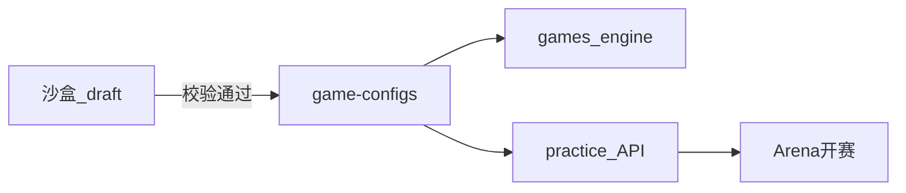

# 87 - 商赛机制设计沙盒蓝图

> **文档定位**：为主理人与教研提供 **「设计 → 试玩 → 迭代 → 上线平台」** 的商赛机制工作台产品方案；成熟配置对接现有 CyberCore（`game-configs` + `games/` 引擎）。  
> **对齐**：[inspire/b/00-解耦声明式商业模拟框架总览](./b商赛界面展示/00-解耦声明式商业模拟框架总览.md) · [03-](../03-技术架构与实现现状.md) · `webapp/backend/content/game-configs/` · ADR-004  
> **状态**：[过程]  
> **最后更新**：2026-05-30

---

## 一、为什么需要沙盒

| 现状痛点 | 沙盒要解决的问题 |
|----------|------------------|
| 改 YAML 需懂仓库目录 + 重启后端 | 可视化编辑 + 校验 + 预览 |
| 新旋钮不知学生端是否可表达 | 绑定 **组件契约**（b/00- §组件）即时预览 |
| 练手只能开完整练习局 | **单回合模拟** / **迷你 2 回合局** 快速验证 |
| 成熟机制散落分支 | **发布流水线**：draft → staging → `game_config_id` 进平台 |

---

## 二、用户与权限

| 角色 | 权限 |
|------|------|
| **主理人 / 教研** | 创建 draft 配置、试玩、提交评审 |
| **工程师** | 合并 YAML、挂新引擎、CI 校验 |
| **教师** | 只选用已发布 `game_config_id` 开营内赛（84-） |
| **学生** | **不可**进沙盒；仅玩已发布赛制 |

　　沙盒入口建议：**组织者端子路由** `/sandbox`（:5174）或独立内部站（:5175），**不对学生端暴露**。

---

## 三、沙盒能力分层

### 3.1 v0 · 配置工作台（Phase B 末～C 初）

| 功能 | 说明 |
|------|------|
| **YAML 编辑器** | 语法高亮 + schema 校验（对 `game-configs` JSON Schema） |
| **元数据表单** | 名称、引擎类型、回合数、人数、标签 |
| **Diff 视图** | 与 `trading-v2-rts` 等基线配置对比 |
| **保存 draft** | 存 `content/game-configs/drafts/{uuid}.yaml`（gitignore 或 DB） |

### 3.2 v1 · 机制试验台

| 功能 | 说明 |
|------|------|
| **旋钮面板** | 映射 YAML `knobs`：滑条改需求弹性、成本系数等 |
| **单回合模拟** | 调用引擎 `simulate_round(state, decisions)` 无持久化 |
| **迷你练习局** | 2 回合、1 人 + AI，走现有 `practice` 流 |
| **学生 UI 预览** | iframe 学生端组件，只读 mock 状态 |

### 3.3 v2 · 发布与对接平台

| 功能 | 说明 |
|------|------|
| **发布检查清单** | schema · 组件覆盖 · Debrief 模板是否存在（86-） · 练习入口注册 |
| **晋升正式 ID** | `draft-xxx` → `my-game-v1` 写入 `content/game-configs/` |
| **教师可选列表** | `GET /practice/configs` 自动含新 ID |
| **体验营一键开赛** | 84- 营内发起商赛下拉含新赛制 |

---

## 四、与 CyberCore 的对接关系



| 环节 | 纪律 |
|------|------|
| 新引擎类型 | 须新建 `games/<engine>/`，**禁止**沙盒生成 Python 代码（仅配置） |
| Arena 表 | 沙盒 **不改** `competition_events` 结构 |
| 结算 | 试玩局 `match_kind= sandbox` 不写 XP（或写标记 `xp_events.source=sandbox`） |

---

## 五、数据模型（draft 元数据，可选）

| 字段 | 说明 |
|------|------|
| `draft_id` | UUID |
| `base_config_id` | fork 自哪条正式配置 |
| `yaml_body` | 全文 |
| `status` | `editing` / `review` / `published` / `archived` |
| `author_id` | 主理人用户 |
| `last_sim_result` | 最近一次单回合模拟 JSON 快照 |

　　MVP 可用 **文件系统 + Git** 代替 DB；规模化后再建 `sandbox_drafts` 表（cybercore 域或独立工具域）。

---

## 六、UI 线框（文字）

```
┌─────────────────────────────────────────────────────────┐
│ 商赛沙盒          [保存 draft] [校验] [迷你局试玩]        │
├──────────────┬──────────────────────────────────────────┤
│ 配置树       │  YAML / 表单双栏                          │
│ ├ meta       │  ┌─────────────┬─────────────────────┐  │
│ ├ rounds     │  │ 旋钮面板     │ 学生组件预览         │  │
│ ├ knobs      │  └─────────────┴─────────────────────┘  │
│ └ scoring    │  模拟输出：回合利润 / 库存 / 排名变化    │
└──────────────┴──────────────────────────────────────────┘
```

---

## 七、与 b/00- 声明式框架的映射

| b/00- 概念 | 沙盒中的操作 |
|------------|--------------|
| 声明式 `game-config` | 左侧树编辑 |
| 组件契约 | 「预览」页勾选可见组件 |
| 引擎适配器 | 只读显示 `engine: trading`；换引擎须工程师 |
| 解耦结算 | 模拟器调用 `engine.settle_round` |

---

## 八、实施路径（建议）

| 阶段 | 交付 | 工程量 |
|------|------|--------|
| **B 末** | 文档 + `drafts/` 目录约定 + 校验脚本 CLI | 小 |
| **C1** | 组织者端 YAML 编辑 + schema 校验 API | 中 |
| **C2** | 旋钮 + 单回合 simulate 端点 | 中 |
| **C3** | 发布流 + practice 注册 + 84- 下拉 | 中 |

　　**CLI 先行**：`python -m app.tools.validate_game_config drafts/foo.yaml` 可在 B 末就给主理人用，不阻塞 UI。

---

## 九、成功标准

| 标准 | 说明 |
|------|------|
| 新机制从 idea 到 **可玩迷你局** | < 1 天（不含新引擎开发） |
| 校验失败 **零** 次带病发布 | CI 拦截非法 YAML |
| 正式环境 **无** sandbox 写 XP 污染排行榜 | `match_kind` 隔离 |

---

## 十、待决问题

1. 沙盒放在 **organizer-frontend** 还是独立 Vite 工程？  
2. draft 存 **Git** 还是 **DB**？  
3. 是否支持 **多人协作编辑**（教研组）？  
4. 新赛制是否强制配套 **86- Debrief 模板** 才能发布？
