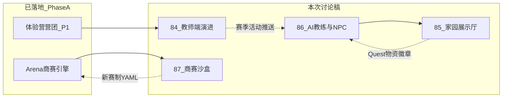

# 88 - 2026 Q2 产品专题讨论索引

> **文档定位**：把当前并行推进的 **四条产品线** 收束为一份讨论入口，便于主理人修改、评审会与工程排期对齐。各专题正文见本目录独立编号文档；**代码与 Phase 门控**以根目录 `00～09` 为准。
>
> **状态**：[过程] · 讨论稿，非 PRD  
> **最后更新**：2026-05-30

---

## 一、四条专题与文档映射

| 专题 | 你的诉求（摘要） | 讨论稿编号 | 工程现状（2026-05） | 建议 Phase |
|------|------------------|------------|---------------------|------------|
| **教师端 / 体验营** | 开营后功能单薄，需可教、可控、可验收 | **84-** | P1 已落地营团 + 营内商赛（分支 `feature/camp-phase1`） | A 续 · B 仪表盘 |
| **AI 教练 + 生涯 NPC** | 开始建设 Athena 与伴随型 NPC | **86-** | 浮窗/mock；规则层 Debrief 待建 | **B**（规则优先） |
| **生涯家园扩展** | 消耗日常奖励、摆设虚拟奖品、展示徽章 | **85-** | `/career` mock；`xp_events` 有；家园表未建 | **B2～B3** |
| **商赛机制沙盒** | 方便设计赛制，成熟后对接平台 | **87-** | CyberCore YAML + 引擎已有；无沙盒 UI | **B 规划 · C 工具化** |

　　更早的教师端「群组·赛季·编排」长稿见 **83-**（inspire 目录）；与 **84-** 关系：83 为全景蓝图，84 聚焦 **体验营 P1 之后** 的可行增量。

---

## 二、依赖关系（建议阅读顺序）

1. **84-** 与 **87-**：教师用什么赛制 → 沙盒产出 `game_config_id` → 营内发起商赛。  
2. **86-** 与 **85-**：NPC 对话与家园槽位共用 **角色 IP**（见 **80-**）；教练复盘引用同一套事实层。  
3. **85-** 与 **06-**：85 是 06 中「Homestead」的 **展示层扩展**，不另起资源经济主线。

---

## 三、与权威文档的分工

| 需求 | 产品权威 | 工程契约 | 本索引包角色 |
|------|----------|----------|--------------|
| 双端 / 赛季 / 体验营 | [02-](../02-赛事体系与双端产品.md) | `teaching_groups` · `competitions` | 84 补 **P1 后** 建议 |
| 生涯 / 家园 / 资源 | [06-](../06-生涯模式-大循环家园与资源经济.md) | [career/DESIGN.md](../webapp/backend/app/domains/career/DESIGN.md) | 85 补 **展示厅** 交互 |
| AI 六支柱 | **81-**（inspire） | [03-](../03-技术架构与实现现状.md) §八 | 86 补 **B 期建设序** |
| 赛制声明式 | [inspire/b/00-](../inspire/b商赛界面展示/00-解耦声明式商业模拟框架总览.md) | `content/game-configs/` · `games/` | 87 补 **沙盒产品** |
| Phase 门控 | [04-](../04-实施路线与里程碑.md) · ADR-008 | — | 各稿文末标 🔴/🟡/🟢 |

---

## 四、讨论会议题清单（可直接贴进议程）

### 4.1 教师端（84-）

- [ ] P2 优先：**营内看板** vs **班级复盘导出** vs **公告/作业**？  
- [ ] 赛季（83-/02-）与体验营 P1 的 **合并节奏**：先强化营团、后开 `seasons` 表？  
- [ ] 教师 AI 副驾驶（规则模板 + 文案润色）是否进入 Phase B 首迭代？

### 4.2 AI 教练与 NPC（86-）

- [ ] Athena **MVP**：仅「赛后 Debrief 规则卡」还是含「周计划三件事」？  
- [ ] NPC 首期：**2 个固定导师**（陈掌柜 / 李供应链）还是可配置表？  
- [ ] 与商赛 **80-** 角色 IP 共用卡池的边界？

### 4.3 家园展示厅（85-）

- [ ] 槽位从 5 个扩到 **展示厅 + 徽章墙** 是否一次做完？  
- [ ] 虚拟奖品来源：仅 Quest，还是含商赛荣誉？  
- [ ] 正式赛是否 **零局内数值加成**（须坚持 06- §1.3）？

### 4.4 商赛沙盒（87-）

- [ ] 沙盒 **第一用户**：主理人本人 vs 教研 vs 工程师？  
- [ ] 产出物：仅 YAML，还是含 **一键开练习局**？  
- [ ] 与现有 `trading-v2-rts` / `techventure-v1` 的关系：fork 配置 vs 新建引擎？

---

## 五、建议排期快照（供 04- 讨论时对照）

| 迭代 | 交付单元 | 依赖 |
|------|----------|------|
| **A+** | 体验营 P2：营内看板 + 教师公告（见 84- §三） | `feature/camp-phase1` 合并 |
| **B1** | Career 读真 XP + `career_profiles` | 06- · DESIGN |
| **B2** | 规则层 Debrief + Athena 浮窗接 API | 86- §三 |
| **B2** | `resource_ledger` + supplies 发放 | 85- · 06- |
| **B3** | 家园 3 槽 + 徽章墙 MVP | 85- |
| **B3** | NPC 静态 2 章对话 | 86- · 80- |
| **B～C** | 沙盒 v0：YAML 编辑 + 练习局试玩（教师/内部） | 87- · b/00- |

---

## 六、维护说明

- 各专题定稿后：将 **可执行结论** 回写 [02-](../02-赛事体系与双端产品.md)、[06-](../06-生涯模式-大循环家园与资源经济.md)、[04-](../04-实施路线与里程碑.md) 与 [08-](../08-工程现状与webapp实现详表.md) AI_DEFAULT；本索引仅保留讨论链接与状态。  
- 新增 inspire 50+ 稳定稿时：在 [50-目录导航](./50-目录导航.md) §E 登记，并在 [00-](../00-项目全景与目录结构.md) §1.4 增一行。
