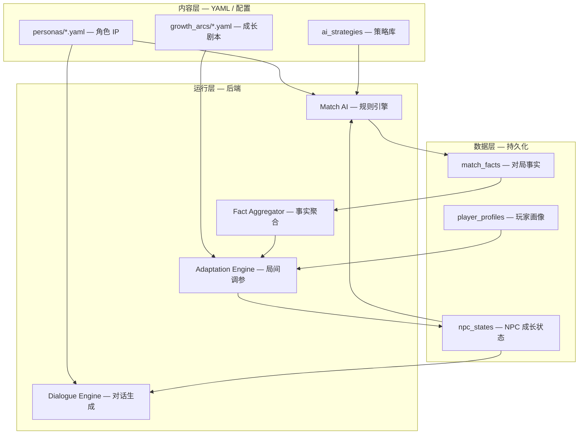

# 90 - AI 对手 NPC 化与成长演化系统 PRD

> **文档定位**：在 [[87-商赛机制设计沙盒蓝图]] 与 [[89-赛事工坊实现说明与使用指南]] 已落地的声明式 AI 策略引擎基础上，定义**「AI 对手 = NPC 角色」**的完整产品方案：每个商赛 AI 对手都是一个有名字、人设、成长轨迹的 NPC，其策略行为随玩家生涯展开而演化。  
> **对齐**：[[80-角色 IP 复用与可成长规则 NPC-Agent 框架]] · [[86-AI 教练与生涯 NPC 首期建设蓝图]] · [06-生涯模式](../06-生涯模式-大循环家园与资源经济.md) §二（双循环）  
> **状态**：[PRD · 待评审]  
> **最后更新**：2026-05-31

---

## 一、背景与目标

### 1.1 现状

- [[89-赛事工坊实现说明与使用指南]] 已实现声明式 AI 策略引擎，支持 5 种策略类型（套利/囤积/趋势/保守/混乱），通过 YAML 配置驱动。
- 当前 AI 对手只有功能名称（"张 traders"）和策略标签（"advanced"），**无角色感、无成长感**。
- [[80-角色 IP 复用与可成长规则 NPC-Agent 框架]] 已提出 Role IP × Policy Bot × Coach Dialogue 的三层组合思想，但尚未与赛事 AI 对手打通。

### 1.2 目标

| 目标 | 说明 |
|------|------|
| **角色化** | 每个 AI 对手都是一个完整的 NPC 角色（名字、人设、立绘、口头禅、背景故事） |
| **策略可设计** | 教研/主理人可在沙盒中自由调配 NPC 的 AI 策略参数（已有） |
| **成长演化** | NPC 的 AI 策略会随玩家生涯进展（对局历史、Quest 完成、关系度）而**受控演化** |
| **体验连续** | 同一角色 IP 既出现在商赛对局中（AI 对手），也出现在生涯对话中（NPC 导师/伙伴） |
| **成本可控** | 对局内零 Token（规则 AI），成长演化发生在局间（非实时），LLM 仅用于对话包装 |

### 1.3 用户价值

- **学生**：对手不再是冰冷的 "AI_0"，而是「老练的蓉城粮商陈叔」——你赢了他 3 次后，他会调整策略针对你的打法。
- **教研**：通过沙盒设计 NPC 的行为风格，发布后即可在练习局中自动适配不同学生。
- **主理人**：NPC 成长轨迹成为平台的长期内容资产，可迭代、可版本化。

---

## 二、核心概念

### 2.1 概念关系图

```
┌─────────────────────────────────────────────────────────────┐
│  角色 IP 层（Persona）— "我是谁"                             │
│  ├─ 名字、立绘、人设、口头禅、背景故事                       │
│  ├─ 价值观（激进/稳健/投机/诚信）                            │
│  └─ 语气风格（正式/亲切/幽默/严肃）                          │
├─────────────────────────────────────────────────────────────┤
│  策略层（Policy Bot）— "我怎么打"                            │
│  ├─ 策略库：arbitrage / hoarder / momentum / conservative   │
│  ├─ 旋钮（Knobs）：风险偏好、库存上限、趋势敏感度...         │
│  └─ 成长轨迹：随对局历史演化的一组参数快照                   │
├─────────────────────────────────────────────────────────────┤
│  对话层（Coach Dialogue）— "我怎么聊"                        │
│  ├─ 赛前挑衅 / 赛中吐槽 / 赛后复盘（Debrief）               │
│  ├─ 生涯对话（Quest 触发、家园互动）                        │
│  └─ 语气由 Persona 定义，内容由事实聚合驱动                  │
└─────────────────────────────────────────────────────────────┘
```

### 2.2 关键术语

| 术语 | 定义 |
|------|------|
| **Persona** | 角色 IP 卡：定义 NPC "像谁"（名字、语气、价值观、禁区） |
| **Policy** | 策略定义：决定 NPC "怎么打"（行为类型 + 参数集合） |
| **Knobs** | 可调参数：在策略允许范围内可动态调整的数值（如 risk_appetite） |
| **Growth Arc** | 成长轨迹：NPC 随玩家生涯展开的参数演化路径 |
| **Adaptation** | 适应机制：根据玩家行为信号，在局间调整 NPC 策略参数的过程 |
| **Fact Base** | 事实层：玩家与 NPC 的对局历史、决策摘要、胜负记录 |

---

## 三、系统架构

### 3.1 三层运行时架构



### 3.2 纪律边界

| 边界 | 规则 |
|------|------|
| **对局内** | Match AI 只读 `npc_states` 中的**当前参数快照**，零 LLM 调用，零外部请求 |
| **局间** | Adaptation Engine 在 `match.finished` 事件后异步运行，可读写 `npc_states` |
| **对话** | Dialogue Engine 只读 `Fact Base` + `Persona`，LLM 仅润色（可选降级） |
| **公平** | `match_kind=official` 的正式赛中，NPC 成长状态**冻结**，使用标准参数 |

---

## 四、角色 IP 体系（Persona）

### 4.1 内容结构

`content/personas/<persona_id>.yaml`：

```yaml
id: npc_chen_shu
archetype: merchant                    # 原型：merchant / mentor / rival / legend
display_name: 陈叔
avatar: avatars/chen_shu.png
background: |
  蓉城土生土长的老粮商，做了三十年粮食生意。
  口头禅是"稳扎稳打，细水长流"。
  年轻时靠跨城倒卖起家，现在更偏保守。

tone:
  formality: medium                    # low / medium / high
  warmth: high                         # cold / medium / warm
  humor: low                           # none / low / medium / high

values:
  - 宁可少赚，不可大亏
  - 对新手宽容，对老手严厉
  - 重视长期关系胜过单次利润

taboos:
  - 绝不教唆学生违规操作
  - 不透露其他对手的策略

signature_phrases:
  - "稳扎稳打，细水长流。"
  - "这笔买卖，你再想想？"
  - "我年轻的时候，也吃过这种亏。"

# 与赛制的默认绑定
default_policies:
  trading-v2-rts: conservative
  trading-v1: arbitrageur
  techventure-v1: city_expand_slow

# 成长倾向（影响 Adaptation 方向）
growth_tendency:
  when_behind: more_conservative       # 落后时更保守
  when_ahead: slightly_aggressive      # 领先时略激进
  against_aggressive_player: defensive # 面对激进玩家时偏防守
```

### 4.2 角色分类（首期建议 6 名）

| ID | 名字 | 原型 | 默认策略 | 人设关键词 |
|----|------|------|----------|-----------|
| `npc_chen_shu` | 陈叔 | 老粮商 | conservative | 蓉城、稳健、 mentorship |
| `npc_li_gongying` | 李供应链 | 物流专家 | arbitrageur | 沪市、效率、数字敏感 |
| `npc_xiao_touji` | 小投机 | 年轻交易员 | momentum | 深市、激进、爱冒险 |
| `npc_hei_shifu` | 黑师傅 | 神秘大鳄 | hoarder | 港城、深不可测、大宗交易 |
| `npc_wang_baike` | 王百科 | 学院派 | conservative | 京城、理论、数据分析 |
| `npc_mirror` | 镜像 | 玩家倒影 | adaptive | 无固定城市、模仿玩家风格 |

### 4.3 复用规则

同一 `persona_id` 在三处复用：
1. **商赛对局**：作为 AI 对手出现（加载 `default_policies` + 当前 `npc_states`）
2. **生涯 Quest**：作为任务发布者/导师出现（加载 `tone` + `taboos`）
3. **赛后 Debrief**：作为复盘点评者出现（加载 `signature_phrases` + 事实引用）

---

## 五、AI 策略与成长演化系统

### 5.1 策略库（Policy Library）

继承自 [[89-赛事工坊实现说明与使用指南]] 的 `ai_strategies`，但增加**角色绑定**和**成长空间**：

```yaml
ai_strategies:
  conservative_chen:
    persona_id: npc_chen_shu           # ← 新增：绑定角色
    inherits: conservative             # ← 新增：继承基础策略
    name: 陈叔的稳健流
    behavior:
      type: conservative
      params:
        max_single_trade_ratio: 0.08   # 比标准保守型更保守
        cash_reserve_ratio: 0.6
        min_profit_margin: 0.25
    # 成长空间：这些参数可在局间被 Adaptation 调整
    growth_space:
      max_single_trade_ratio: { min: 0.05, max: 0.15, step: 0.01 }
      cash_reserve_ratio: { min: 0.4, max: 0.7, step: 0.05 }
      min_profit_margin: { min: 0.15, max: 0.35, step: 0.02 }
```

### 5.2 NPC 成长状态（npc_states）

数据表/JSON 结构：

```json
{
  "npc_id": "npc_chen_shu",
  "player_id": 42,
  "version": "2026-05-31-v3",
  "current_policy": "conservative_chen",
  "knobs": {
    "max_single_trade_ratio": 0.08,
    "cash_reserve_ratio": 0.6,
    "min_profit_margin": 0.25
  },
  "growth_arc": {
    "stage": "mature",                 // novice / developing / mature / legend
    "wins_vs_player": 2,
    "losses_vs_player": 5,
    "last_adapted_at": "2026-05-30T12:00:00Z",
    "adaptation_history": [
      {
        "trigger": "lost_3_in_a_row",
        "before": {"min_profit_margin": 0.20},
        "after": {"min_profit_margin": 0.25},
        "reasoning": "连续输给该玩家3次，提高最小利润率要求，减少无效交易"
      }
    ]
  },
  "relationship": {
    "affinity": 0.65,                  // 关系度 0-1
    "unlocked_chapters": ["chen_ch1", "chen_ch2"],
    "last_dialogue": "2026-05-29"
  }
}
```

### 5.3 适应机制（Adaptation Engine）

**触发时机**：`match.finished` 事件后异步执行（赛后 1-5 秒内完成）。

**输入信号**：

| 信号类型 | 来源 | 用途 |
|----------|------|------|
| 胜负结果 | `match.standings` | 决定成长方向（领先/落后/胶着） |
| 玩家策略标签 | `career_profiles.strategy_preference` | 判断玩家打法风格 |
| 资金波动率 | `match_facts.cash_volatility` | 判断玩家风险偏好 |
| 历史对局统计 | `npc_states.wins_vs_player` | 决定调整幅度 |

**调整规则（示例）**：

```yaml
# content/growth_arcs/adaptation_rules.yaml
rules:
  - name: 连败收紧风控
    condition: losses_vs_player >= 3
    target_npcs: [npc_chen_shu, npc_wang_baike]
    action:
      - knob: cash_reserve_ratio
        delta: +0.05
        max: 0.7
      - knob: max_single_trade_ratio
        delta: -0.02
        min: 0.05
    narration: "陈叔意识到这个学生不好对付，决定更加谨慎。"

  - name: 面对激进玩家转防守
    condition: player_style == "aggressive" AND wins_vs_player < losses_vs_player
    target_npcs: "*"
    action:
      - policy_switch:
          from: [momentum, arbitrageur]
          to: conservative
    narration: "面对激进的对手，转为保守防守策略。"

  - name: 连胜后略放松
    condition: wins_vs_player >= 3
    target_npcs: [npc_xiao_touji]
    action:
      - knob: risk_appetite
        delta: +0.1
        max: 0.9
    narration: "小投机连赢三局，自信心爆棚，变得更加大胆。"
```

**调整约束**：
- 单次调整幅度不超过 `growth_space.step × 3`
- 参数不得超出 `growth_space.min/max`
- 正式赛（`match_kind=official`）期间冻结，不触发适应
- 所有调整记录审计日志（`adaptation_history`）

### 5.4 成长阶段（Growth Arc Stage）

| 阶段 | 解锁条件 | AI 表现 | 对话变化 |
|------|---------|---------|---------|
| **Novice 新手** | 初始 | 标准参数，偶尔犯低级错误 | 客气、指导式 |
| **Developing 成长中** | 与玩家对局 5+ 次 | 开始针对玩家风格微调 | 调侃、竞争式 |
| **Mature 成熟** | 与玩家对局 15+ 次 | 参数达到个性化稳定态 | 老练、亦敌亦友 |
| **Legend 传奇** | 与玩家对局 30+ 次且胜率>60% | 解锁特殊策略组合 | 尊重、承认学生 |

---

## 六、数据模型

### 6.1 新增表/集合

**`npc_personas`**（角色 IP 定义）

| 字段 | 类型 | 说明 |
|------|------|------|
| `id` | string PK | persona_id |
| `display_name` | string | 显示名 |
| `archetype` | enum | merchant/mentor/rival/legend |
| `content_yaml` | text | 完整 YAML 内容 |
| `version` | string | 内容版本 |
| `created_at` | datetime | |

**`npc_states`**（玩家-NPC 关系与成长状态）

| 字段 | 类型 | 说明 |
|------|------|------|
| `id` | int PK | |
| `npc_id` | string FK | → npc_personas |
| `player_id` | int FK | → users |
| `current_policy` | string | 当前策略 ID |
| `knobs_json` | json | 当前参数快照 |
| `growth_stage` | enum | novice/developing/mature/legend |
| `wins_vs_player` | int | 胜场 |
| `losses_vs_player` | int | 负场 |
| `affinity` | float | 关系度 0-1 |
| `adaptation_history_json` | json | 调整历史 |
| `updated_at` | datetime | |

**`match_npc_facts`**（对局中的 NPC 表现事实）

| 字段 | 类型 | 说明 |
|------|------|------|
| `id` | int PK | |
| `match_id` | int FK | → competition_events |
| `npc_id` | string FK | → npc_personas |
| `final_rank` | int | 最终排名 |
| `decisions_summary_json` | json | 决策摘要（行动类型分布） |
| `knobs_snapshot_json` | json | 本局使用的参数快照 |
| `generated_at` | datetime | |

### 6.2 与现有表的关系

```
npc_personas ──1:N── npc_states ──N:1── users
    │                              │
    │                              └── N:1 ── competition_events (via match_npc_facts)
    │
    └── 1:N ── ai_strategies (via persona_id 绑定)
```

---

## 七、交互流程

### 7.1 完整体验闭环

```
学生打开商赛大厅
    ↓
「本周练习对手：陈叔（成熟阶段）—— 他已针对你的激进风格调整了策略」
    ↓
进入对局 → AI 使用 npc_states 中的当前参数
    ↓
对局结束 → match_npc_facts 记录表现
    ↓
赛后 Debrief（Athena）引用事实：「陈叔这局用了更保守的打法...」
    ↓
异步：Adaptation Engine 评估是否需要调整 npc_states
    ↓
生涯 Hub：NPC 陈叔出现，对话内容受关系度和成长阶段影响
    ↓
Quest 解锁：陈叔的「稳健经营课」章节 3
    ↓
下次对局：加载更新后的 npc_states
```

### 7.2 沙盒设计 → 发布 → 对局（工作流）

```
教研在沙盒中设计策略
    ↓
为策略绑定 persona_id（如 npc_chen_shu）
    ↓
发布为 ai_strategies/<id>.yaml
    ↓
系统自动创建/更新 npc_personas 记录
    ↓
学生首次对局：初始化 npc_states（novice 阶段，标准参数）
    ↓
后续对局：加载当前 npc_states，局后触发 Adaptation
```

---

## 八、与现有子系统的联动

### 8.1 与赛事工坊（Sandbox）

| 联动点 | 说明 |
|--------|------|
| 沙盒设计策略时可预览 persona | YAML 编辑器旁显示角色头像和口头禅 |
| 发布时自动创建 npc_personas | 若 `persona_id` 不存在则自动初始化 |
| 沙盒批量测试 | 可模拟某 NPC 与特定玩家风格对局 N 次，观察成长轨迹 |

### 8.2 与生涯模式（Career）

| 联动点 | 说明 |
|--------|------|
| NPC 关系度影响家园 | 高关系度解锁 NPC 专属家园摆件 |
| Quest 解锁依赖成长阶段 | 陈叔的进阶课程需达到 mature 阶段 |
| 生涯等级影响 NPC 初始难度 | 高等级玩家面对的新 NPC 直接从 developing 起步 |

### 8.3 与 AI 教练 Athena

| 联动点 | 说明 |
|--------|------|
| Debrief 引用 NPC 表现 | 「陈叔这局用了保守策略，你如何利用这一点？」 |
| 周计划推荐对局 | 「本周建议与陈叔对战 2 次，检验你的风控能力」 |
| NPC 对话由 Athena Orchestrator 托管 | 统一入口，角色面具切换 |

---

## 九、分期实施计划

### Phase B1：角色化（已有策略引擎 + 角色外壳）

**交付物**：
- [ ] `content/personas/` 目录 + 6 名首期角色 YAML
- [ ] `npc_personas` 表 + CRUD API
- [ ] 商赛对局中显示 NPC 名字、头像、口头禅（替代 "张 traders"）
- [ ] 赛后显示 NPC 的「一句点评」（模板驱动，无 LLM）

**工作量**：中（主要在前端展示层）

### Phase B2：成长轨迹（Fact Base + 静态 Adaptation）

**交付物**：
- [ ] `match_npc_facts` 事实聚合器
- [ ] `npc_states` 表 + 初始化/查询 API
- [ ] 静态 Adaptation 规则（YAML 配置，非算法）
- [ ] 生涯 Hub 显示 NPC 成长阶段和关系度

**工作量**：中（后端数据层 + 规则引擎）

### Phase B3：对话联动（NPC 在生涯中出现）

**交付物**：
- [ ] NPC 对话状态机（chapters.yaml）
- [ ] 关系度/成长阶段解锁条件
- [ ] 家园系统联动（摆件、导师角）
- [ ] Athena Debrief 引用 NPC 表现事实

**工作量**：大（内容生产 + 前端交互）

### Phase C-：LLM 增强（仅润色，不决策）

**交付物**：
- [ ] NPC 赛后点评 LLM 润色（带 citation 护栏）
- [ ] 生涯对话 LLM 增强（状态机 + 模板 + LLM 填槽）
- [ ] 成本统计与降级链

**工作量**：中（LLM 集成 + 护栏工程）

### Phase C：自适应策略选择（Bandit 级）

**交付物**：
- [ ] 局间策略选择器（根据玩家画像选 Policy）
- [ ] 旋钮在线优化（轻量统计学习）
- [ ] A/B 测试框架

**工作量**：大（算法 + 实验框架）

---

## 十、边界与约束

### 10.1 硬约束（不可违反）

| # | 约束 | 理由 |
|---|------|------|
| 1 | **对局内零 LLM** | 保证延迟、成本、可复现性 |
| 2 | **学习只调参，不改规则** | 保证公平、可审计、可回滚 |
| 3 | **正式赛冻结 NPC 状态** | 保证比赛公平 |
| 4 | **所有调整记录审计日志** | 可追溯、可验收 |
| 5 | **事实必须来自 DB，不编造** | 防止幻觉污染教学 |

### 10.2 成本预算（B 期目标）

| 场景 | 预算 | 降级方案 |
|------|------|---------|
| 单场对局 AI 决策 | 0 Token | 纯规则引擎 |
| 赛后 NPC 一句话点评 | 0 Token（B1）/ ≤500 Token（C-） | 模板直接输出 |
| 生涯 NPC 对话节点 | 0 Token（B3）/ ≤1000 Token（C-） | 静态对话树 |
| 每周 Athena 周计划 | ≤2000 Token | 规则模板 |

### 10.3 与既有文档的衔接

| 文档 | 衔接点 |
|------|--------|
| [[80-角色 IP 复用与可成长规则 NPC-Agent 框架]] | 本 PRD 是 80 号框架在「AI 对手 NPC 化」场景的落地细化 |
| [[86-AI 教练与生涯 NPC 首期建设蓝图]] | 本 PRD 的 NPC 角色可复用于 86 号的生涯导师系统 |
| [[89-赛事工坊实现说明与使用指南]] | `ai_strategies` 是沙盒与 NPC 成长系统的共享配置层 |
| [06-生涯模式](../06-生涯模式-大循环家园与资源经济.md) | NPC 成长纳入 Mega 循环（大循环），AI 对局纳入 Meta 循环 |

---

## 十一、待决问题

1. **NPC 镜像（mirror）是否首期实现？** 它需要最复杂的自适应逻辑，建议延后到 C 期。
2. **NPC 死亡/退役机制？** 当玩家远超 NPC 时，是否引入「NPC 进化到新阶段」或「退役让位给新 NPC」？
3. **多玩家共享 NPC 状态？** 同一 NPC 陈叔对不同玩家有不同成长状态，还是统一成长？（建议：按 player_id 隔离）
4. **教师能否重置 NPC 状态？** 体验营场景中，教师可能需要将某 NPC 重置为初始状态供新学生使用。

---

## 附录 A：YAML 完整示例

### A.1 Persona 定义示例

见 §4.1 `npc_chen_shu` 示例。

### A.2 成长剧本示例

`content/growth_arcs/chen_shu_arc.yaml`：

```yaml
npc_id: npc_chen_shu
stages:
  - name: 初次见面
    trigger: first_match
    dialogue: "年轻人，做生意不是赌博。来，让我教你什么叫稳扎稳打。"
    initial_knobs:
      cash_reserve_ratio: 0.6
      min_profit_margin: 0.20

  - name: 刮目相看
    trigger: player_wins_3_times
    dialogue: "好小子，连赢我三局。看来我得认真点了。"
    knob_changes:
      cash_reserve_ratio: -0.05
      min_profit_margin: +0.05

  - name: 亦敌亦友
    trigger: affinity_reaches_0.8
    dialogue: "你是我见过最有潜力的年轻人。不过，最后一局我可不会放水。"
    unlocks:
      - quest: "chen_final_challenge"
      - homestead_item: "chen_tea_set"
```
