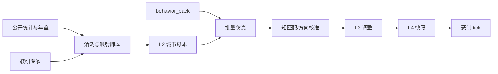

# 07 - 数据生产、校准与可复现性手册

> **状态**：[过程] · **各范式数据如何做出来** 的总操作说明  
> **对齐**：[07-拟真城市与区域模拟-阅读合集](../../07-拟真城市与区域模拟-阅读合集.md) §六～§八 · 本目录 02～06  
> **最后更新**：2026-05-30

---

## 1. 总原则

| 原则 | 说明 |
|------|------|
| **教学级优先** | `confidence: teaching_grade`；方向正确 > 点估计精确 |
| **血缘可追溯** | 每个 L2/L3 字段有 `data_sources[]`（见 §5） |
| **规则层唯一写价** | 数据进入母本 → 仿真 → 价格；LLM 不产数值 |
| **局内不写母本** | L4 snapshot 隔离；防污染学期基线 |

---

## 2. 五层数据分别「怎么做」

| 层级 | 产物 | 谁生产 | 怎么做（摘要） | 变更频率 |
|------|------|--------|----------------|----------|
| **L0** | `global.yaml` | 平台教研 | 全局旋钮、σ、难度档；文献+专家 | 年 |
| **L1** | `regions/*.yaml` | 教研+脚本 | 城市列表、边权：引力初值+运距归一化 | 学期 |
| **L2** | `cities/*.yaml` | 半自动流水线 | 统计年鉴→产业/人口→映射 10 品 prod/cons | 学期 |
| **L3** | `pop_segments[]` | 规则+教研 | 份额来自普查；需求向量来自专家/CHFS 区间/ABM 校准 | 学期 |
| **L4** | `world_snapshot` | 开赛服务 | 拷贝 L2/L3 + 事件包；引擎只读 | 每场 |



---

## 3. 按范式的数据生产路径

### 3.1 ABM 路径（主路径）

| 步骤 | 输入 | 输出 | 工具 |
|------|------|------|------|
| 1 | 文献/专家原语 | `behavior_pack.yaml` | 手写 + review |
| 2 | L2 初值 + 原语 | 仿真面板（无玩家） | `pop_engine` / Mesa 原型 |
| 3 | 目标矩（见 §4） | 调整 `share`、弹性 | Excel / Python |
| 4 | 通过验收 | 定稿 L3、`calibrated_at` | Git tag |

### 3.2 宏观异质（HANK 式）路径

| 步骤 | 输入 | 输出 |
|------|------|------|
| 1 | CHFS/文献：MPC 区间 | `β_w` 上下界 |
| 2 | 工资冲击情景 | 预期「日用品 D↑、奢侈 D↑」方向 |
| 3 | 与 ABM 输出对比 | 不一致则改原语而非加方程 |

### 3.3 空间/贸易路径

| 步骤 | 输入 | 输出 |
|------|------|------|
| 1 | 城市 GDP/人口、距离矩阵 | 引力 `T_ij` 势能 |
| 2 | 运价或 tick 经验 | `routes.*.base_travel_ticks` |
| 3 | 试跑套利 AI | 价差是否可被运平（防无限套利） |

### 3.4 微观结构（池–价）路径

| 步骤 | 输入 | 输出 |
|------|------|------|
| 1 | 目标 spread 量级 | `min_spread` |
| 2 | 库存深度直觉 | `reference_pool`、`Pool_target` 公式 |
| 3 | 大单冲击测试 | `absorption_cap_per_tick` |

### 3.5 系统动力学路径

| 步骤 | 输入 | 输出 |
|------|------|------|
| 1 | CLD 草图 | 延迟参数 `lag_ticks` |
| 2 | 历史 PPI/猪价波动 **幅度**（非拟合） | `gain` 上限 |
| 3 | 与 ABM 并联试跑 | 无双重计数 |

### 3.6 ML / 因子路径（辅助）

| 步骤 | 输入 | 输出 |
|------|------|------|
| 1 | 批量仿真日志 | 面板 CSV |
| 2 | PCA / 聚类 | 2～3 成分 + 簇心 |
| 3 | 教研命名 | 复盘文案；**不写回** tick 公式 |

---

## 4. 校准目标（教学级矩）

　　不要求匹配真实 CPI 逐月序列；建议 **方向 + 数量级** 矩：

| 编号 | 矩 | 验收（示例） |
|------|-----|--------------|
| M1 | 农业城粮品 pool 均值 > 消费城 | 蓉城 vs 京城 |
| M2 | 工资 +10% 后 5 tick 内日用品 D_eff ↑ | 方向 |
| M3 | 无玩家 10 tick 价格波动 <5% | 稳定性 |
| M4 | 玩家大单后 3 tick pressure 回落 | 吸收有效 |
| M5 | 跨城运货后目标城 ask 上升 | 空间传导 |

---

## 5. 血缘元数据（必填模板）

```yaml
meta:
  city_id: shanghai
  calibrated_at: "2026-09-01"
  calibrated_by: "教研组"
  confidence: teaching_grade
  paradigm_notes: "ABM矩匹配 + 引力边权 v0.2"
  data_sources:
    - name: 上海统计年鉴（公开）
      fields_used: [常住人口, 第三产业比重]
      access: public_web
    - name: 平台 behavior_pack v1
      fields_used: [scarcity_panic, income_lag]
  disclaimer: 教学模拟，非预测
changelog:
  - at: "2026-09-01"
    note: "初版；粮品 production 上调 8%"
```

---

## 6. 半自动流水线（建议工程）

| 阶段 | 脚本/任务 | 说明 |
|------|-----------|------|
| **Extract** | `tools/world/ingest_stats.py` | 读 CSV/手工表 → 原始 JSON |
| **Map** | `tools/world/map_products.py` | 行业 → 10 品类权重 |
| **Sim** | `tools/world/batch_sim.py` | N 局无玩家 → 日志 |
| **Cal** | `tools/world/calibrate_moments.py` | 调参建议报告 |
| **Review** | 人工 | 教研签字 → 写入 YAML |
| **Publish** | Git + `world_pack_version` bump | 学期发布 |

　　Phase B 可先做 **Excel + pytest 固定夹具**，不必一次上全流水线。

---

## 7. 公开数据源清单（中国区域 · 起步）

| 来源 | 可提取字段 | 注意 |
|------|------------|------|
| 国家统计局 / 省级统计年鉴 | 人口、产业产值、零售 | 口径统一、滞后一年 |
| 中国城市统计年鉴 | 人均收入、客运货运 | 城市对比 |
| 投入产出表（国家/区域） | 产业关联 | 更新慢，适合 L2 结构 |
| 海关 / 港口统计 | 进出口品类 | 港口城 L2 |
| CHFS / CFPS（需申请） | 消费结构、收入分位 | L3 份额与弹性 |
| 开放平台运距 | 距离矩阵 | ToS、API 限额 |

　　**禁止**：未授权爬取、个人隐私、声称「预测 GDP」。

---

## 8. 可复现性清单

| 项 | 要求 |
|----|------|
| 版本 | `world_pack_version` + `behavior_pack_version` |
| 随机种子 | 仿真批跑 `seed` 写入报告 |
| 代码 | `pop_engine` 版本号与 Git commit |
| 输出 | 校准报告存档 `reports/world/YYYY-MM/`（可选） |

---

## 9. 与现行 `trading-v2-rts.yaml` 的迁移

| 现状 | 目标 |
|------|------|
| 城内嵌 `production/consumption` | 迁入 `content/world/cities/*.yaml` |
| 虚构城名 | 长三角 `city_id` + 显示名 |
| 静态 `demand_profile` | L3 + 行为原语 v1 |

　　迁移期 **双读**：`$ref` 缺失时回退内联块（兼容 flag）。

---

## 10. 待建工件

- [ ] `content/world/schemas/city_trade_slice.json`  
- [ ] `reports/world/_template.md` 校准报告模板  
- [ ] CHFS 变量 ↔ `pop_id` 对照表（本目录附录）  
- [x] 长三角六城母本草案 → 见本目录 **08-长三角六城起步手册**  
