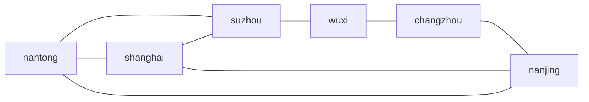

# 08 - 长三角六城起步手册（宁 · 苏 · 沪 · 通 · 锡 · 常）

> **状态**：[过程] · 可直接填数、评审、再迁入 `content/world/`  
> **前置**：**01-** 路线图 · **02-** ABM · **07-** 数据生产 · 主 PRD §1.1  
> **对齐**：[07-拟真城市与区域模拟-阅读合集](../../07-拟真城市与区域模拟-阅读合集.md) §六 L0～L4  
> **最后更新**：2026-05-30

---

## 1. 本手册解决什么

　　把「南京、苏州、上海、南通、无锡、常州 + 交通网络 + POP 市场」从想法落到 **可填写的母本骨架**：路网、产业直觉、POP 数量级、首周检查清单、与商赛/授课的接点。数值为 **教学级初稿（v0.1）**，须经 **07- §4 矩** 与教研签字后才是学期定稿。

| 项 | 约定 |
|----|------|
| 区域包 id | `yangtze_6` |
| 城市 id | `nanjing` `suzhou` `shanghai` `nantong` `wuxi` `changzhou` |
| 商品 id | 与 `trading-v2-rts` 十品一致（见 §4） |
| 仿真人口 | `sim_scale: 0.001`（展示人口与仿真单位分离） |
| POP | 每城 **4** cohort，共 **24** 个逻辑主体 |

---

## 2. 六城产业与授课一句话（填 YAML 前先读）

| city_id | 显示名 | 授课定位 | 供给强项（相对六城） | 需求强项 | hub |
|---------|--------|----------|----------------------|----------|-----|
| `shanghai` | 上海 | 金融与高端消费、进出口枢纽 | 集散、奢侈品、家电进口氛围 | 奢侈、家电、汽车、日消 | ✓ |
| `suzhou` | 苏州 | 先进制造、外向配套 | 纺织、家电零部件、日用品 | 原料、能源 | ✓ |
| `nanjing` | 南京 | 省会综合、科教文化 | 中等工业与日消 | 升级消费、汽车、家电 | — |
| `wuxi` | 无锡 | 精密制造、物联网配套 | 纺织中游、装备零部件 | 原料、能源 | — |
| `changzhou` | 常州 | 装备、电动车产业链 | 汽车、装备、能源相关 | 原料、纺织 | — |
| `nantong` | 南通 | 临港、船舶、近沪农业与转运 | 农产品转运、钢铁上游、能源港口 | 日消（受沪辐射） | 港口 |

　　**套利故事模板**：南通/苏北粮蔬 → 上海高 ask；苏州纺织/日用品 → 常州/南京需求；常州汽车链 → 上海消费。

---

## 3. 交通网络（L1 草案）

### 3.1 拓扑示意



### 3.2 边权表（v0.1 · 待教研微调）

　　`base_travel_ticks`：无车基准在途 tick；`move_cost`：过路费/油耗抽象（元）。车辆 `speed_bonus` 见浮生记 PRD。

| 边（无向） | base_travel_ticks | move_cost | 备注 |
|------------|-------------------|-----------|------|
| shanghai–suzhou | 2 | 600 | 沪苏同城化 |
| suzhou–wuxi | 2 | 500 | |
| wuxi–changzhou | 2 | 500 | |
| changzhou–nanjing | 3 | 700 | |
| shanghai–nantong | 4 | 900 | 跨江 |
| suzhou–nantong | 3 | 750 | |
| nanjing–nantong | 4 | 850 | |
| shanghai–nanjing | 4 | 950 | 沪宁 |
| shanghai–wuxi | 3 | 800 | 经苏州方向 |
| shanghai–changzhou | 4 | 900 | |
| nanjing–suzhou | 4 | 900 | |
| nanjing–wuxi | 4 | 850 | |
| nantong–changzhou | 4 | 800 | |
| nantong–wuxi | 3 | 700 | |

　　未列出的城市对：默认 **不直连**（须绕枢纽），或设 `base_travel_ticks: 6` 惩罚边（二期）。

### 3.3 `regions/yangtze_6.yaml` 骨架（复制到工程）

```yaml
# 目标路径（规划）：webapp/backend/content/world/regions/yangtze_6.yaml
id: yangtze_6
meta:
  name: 长三角六城（教学包）
  world_pack_version: "0.1.0-draft"
  disclaimer: 教学模拟参数，非经济预测
cities:
  - nanjing
  - suzhou
  - shanghai
  - nantong
  - wuxi
  - changzhou
hub_cities: [shanghai, suzhou]
routes:
  shanghai-suzhou: { base_travel_ticks: 2, move_cost: 600 }
  suzhou-wuxi: { base_travel_ticks: 2, move_cost: 500 }
  wuxi-changzhou: { base_travel_ticks: 2, move_cost: 500 }
  changzhou-nanjing: { base_travel_ticks: 3, move_cost: 700 }
  shanghai-nantong: { base_travel_ticks: 4, move_cost: 900 }
  suzhou-nantong: { base_travel_ticks: 3, move_cost: 750 }
  nanjing-nantong: { base_travel_ticks: 4, move_cost: 850 }
  shanghai-nanjing: { base_travel_ticks: 4, move_cost: 950 }
  shanghai-wuxi: { base_travel_ticks: 3, move_cost: 800 }
  shanghai-changzhou: { base_travel_ticks: 4, move_cost: 900 }
  nanjing-suzhou: { base_travel_ticks: 4, move_cost: 900 }
  nanjing-wuxi: { base_travel_ticks: 4, move_cost: 850 }
  nantong-changzhou: { base_travel_ticks: 4, move_cost: 800 }
  nantong-wuxi: { base_travel_ticks: 3, move_cost: 700 }
defaults:
  min_travel_ticks: 2
  logistics_multiplier_by_hub: 0.95   # 枢纽城内部物流效率
```

---

## 4. 商品清单（与引擎对齐）

| product_id | 名称 | 产业链 | 六城叙事锚点 |
|------------|------|--------|--------------|
| `grain` | 粮食 | 上游 | 南通农业、苏北供给 |
| `produce` | 生鲜 | 上游 | 南通转运、沪消费 |
| `raw_materials` | 原材料 | 上游 | 苏州/无锡制造投入 |
| `energy` | 能源 | 上游 | 常州/南通港口 |
| `furniture` | 家具 | 中游 | 苏州、常州 |
| `textile` | 纺织品 | 中游 | 苏州、无锡强项 |
| `daily_goods` | 日用品 | 下游 | 苏州供给、全域消费 |
| `appliances` | 家电 | 下游 | 苏州链、上海需求 |
| `passenger_car` | 家用车 | 下游 | 常州链、沪宁消费 |
| `luxury` | 奢侈品 | 下游 | 上海主导 |

---

## 5. POP 设置（数量级与模板）

### 5.1 数量级

| 概念 | 值 |
|------|-----|
| 每城 cohort 数 | **4** |
| 六城逻辑主体 | **24** |
| 展示人口（例：上海） | 24_870_000（仅 UI/档案） |
| 仿真人口单位 | `display_population * sim_scale` 或固定 `sim_population: 2000` |
| tick 消费尺度 | `α` 待 **07-** §13 定；v0 可先 `α=1` 与现 pool 对齐 |

### 5.2 共用四类 cohort（定义可后置）

| pop_id | 标签 | 行为侧重（v1 原语） |
|--------|------|---------------------|
| `mass_consumer` | 大众消费 | `habit_stock` 日用品、生鲜 |
| `middle_class` | 中产升级 | `reference_price` 家电、汽车 |
| `affluent` | 高端 | 奢侈、`luxury_veblen` 待决 |
| `industrial` | 产业用工 | 间接拉高原料/能源需求 |

### 5.3 六城 `share` 初稿（和为 1.0）

| city_id | mass | middle | affluent | industrial |
|---------|------|--------|----------|------------|
| shanghai | 0.42 | 0.28 | 0.22 | 0.08 |
| suzhou | 0.48 | 0.32 | 0.12 | 0.08 |
| nanjing | 0.50 | 0.30 | 0.12 | 0.08 |
| wuxi | 0.52 | 0.28 | 0.10 | 0.10 |
| changzhou | 0.54 | 0.28 | 0.08 | 0.10 |
| nantong | 0.56 | 0.26 | 0.08 | 0.10 |

### 5.4 单城 YAML 骨架（以 `nanjing` 为例）

```yaml
# 目标路径（规划）：content/world/cities/nanjing.yaml
city_id: nanjing
display_name: 南京市
meta:
  calibrated_at: "2026-05-30"
  confidence: teaching_grade
  paradigm_notes: "yangtze_6 v0.1 draft"
  data_sources:
    - name: 南京统计年鉴（公开摘要，待填 URL）
      fields_used: [常住人口, 产业结构]
sim_scale: 0.001
display_population: 9547000
sim_population: 9547
industry_tags: [provincial_capital, education, mixed_manufacturing]
logistics:
  hub: false
  travel_multiplier: 1.0
pop_segments:
  - pop_id: mass_consumer
    share: 0.50
    income_index: 1.0
    demand_vector: { daily_goods: 1.15, produce: 1.0, grain: 0.9, luxury: 0.15 }
  - pop_id: middle_class
    share: 0.30
    income_index: 1.15
    demand_vector: { appliances: 1.1, passenger_car: 1.05, furniture: 1.0 }
  - pop_id: affluent
    share: 0.12
    income_index: 1.8
    demand_vector: { luxury: 1.2, appliances: 1.05 }
  - pop_id: industrial
    share: 0.08
    income_index: 0.95
    demand_vector: { raw_materials: 1.1, energy: 1.05 }
production_baseline:   # 每 tick 抽象产出，v0 整数，须校准
  grain: 3
  produce: 4
  raw_materials: 4
  energy: 3
  furniture: 4
  textile: 5
  daily_goods: 6
  appliances: 3
  passenger_car: 2
  luxury: 0
consumption_baseline:  # 每 tick 抽象消费
  grain: 10
  produce: 11
  raw_materials: 5
  energy: 5
  furniture: 5
  textile: 6
  daily_goods: 12
  appliances: 6
  passenger_car: 4
  luxury: 3
demand_profile:        # 结构性偏好乘子（过渡字段）
  passenger_car: 1.1
  appliances: 1.05
  luxury: 1.0
```

　　其余五城：复制骨架，按 §2 调整 `production_baseline` / `consumption_baseline` / `share`。**上海** 提高 `consumption` 中奢侈/家电/汽车，降低 `production` 中粮食；**南通** 提高 `grain`/`produce` production；**苏州** 提高 `textile`/`daily_goods` production。

---

## 6. 六城 prod/cons 数量级速查（v0.1 填数起点）

　　数字为 **每 tick 相对单位**，不是吨；校准目标见 §8。

| 商品 | 上海 prod→cons | 苏州 | 南京 | 无锡 | 常州 | 南通 |
|------|----------------|------|------|------|------|------|
| grain | 1→12 | 2→10 | 3→10 | 2→9 | 3→9 | **14→11** |
| produce | 2→14 | 3→12 | 4→11 | 3→10 | 3→10 | **12→12** |
| raw_materials | 2→6 | 6→8 | 4→5 | 5→7 | 6→6 | 4→5 |
| textile | 3→10 | **10→9** | 5→6 | **8→7** | 6→6 | 4→5 |
| daily_goods | 4→18 | **12→14** | 6→12 | 7→10 | 8→10 | 5→9 |
| appliances | 5→14 | **10→8** | 3→6 | 4→5 | 5→5 | 3→5 |
| passenger_car | 4→10 | 5→6 | 2→4 | 3→4 | **8→4** | 2→3 |
| luxury | 2→9 | 1→4 | 0→3 | 0→2 | 0→2 | 0→2 |

　　读法：南通 grain **14→11** 表示产出远大于本地消费，利于「运粮去沪」故事。

---

## 7. 行为原语包（v0 最小）

```yaml
# 目标路径（规划）：content/world/behavior_packs/default_yrd.yaml
id: default_yrd
version: "0.1.0"
primitives:
  - id: budget_hard
    enabled: true
    params: { savings_rate: 0.15 }
  - id: reference_price
    enabled: true
    params: { buy_if_below_pct: -0.08, sell_if_above_pct: 0.10 }
  - id: scarcity_panic
    enabled: true
    params: { empty_ticks_threshold: 2, demand_boost: 0.15 }
  - id: income_lag
    enabled: true
    params: { lag_ticks: 6 }
```

　　v0 仍可用静态 `consumption_baseline`；v1 逐步让订单流由上述原语主导（见主 PRD §1.1）。

---

## 8. 校准验收（六城包专用矩）

| 编号 | 验收句 | 预期（v0.1） |
|------|--------|--------------|
| Y1 | 无玩家 20 tick，南通 grain pool 上升或 bid 偏低 | 相对上海 |
| Y2 | 上海 daily_goods / luxury ask 六城最高或前二 | ✓ |
| Y3 | 苏州 textile 本地供给过剩 | bid 相对低 |
| Y4 | 常州 passenger_car production 突出 | 外运有利 |
| Y5 | 工资 +10% 事件後 6 tick，上海 mass D_eff↑ | 方向 |
| Y6 | 10 tick 价格波动 <5%（无玩家） | 稳定性 |

　　未通过：只调 **production/consumption 整数** 与 `share`，暂不增加 POP 类型。

---

## 9. 商赛 · 授课 · 研究 接点

| 场景 | 配置 | 说明 |
|------|------|------|
| **浮生记练习局** | `region_id: yangtze_6`，`total_ticks: 240` | 学生六城套利 |
| **15 分钟课堂** | 无玩家 + 教师推 `event: min_wage_shanghai` | 讲工资传导 |
| **体验营周 milestone** | 绑定「南通→上海生鲜链」 | 见 inspire/84- |
| **研究导出** | `world_pack_version` + 日志 CSV | 对比两次政策包 |

```yaml
# 赛制 config 片段（规划）
game_config_id: fushengji-v3   # 或 trading-v2-rts 过渡
world:
  region_id: yangtze_6
  snapshot_policy: on_match_start
```

---

## 10. 第一周检查清单（可打印）

- [ ] §2 六城一句话经教研确认（可改口播，不先改公式）  
- [ ] §3.2 边权表填完，在纸上标出 **2 tick 圈**（沪–苏–锡–常）  
- [ ] 六份 `cities/*.yaml` 从 §5.4 复制并填 §6 表  
- [ ] Excel/脚本：**10 tick 无玩家**，记录六城 `grain` ask 排序  
- [ ] 画 1 张 CLD：南通丰收 → 粮价 → 运沪套利（见 **06-**）  
- [ ] `meta.data_sources` 每城至少 1 条（可后补 URL）  
- [ ] 与工程对齐：是否先用 `$ref` 还是整包写入 `trading-v2-rts.yaml`（ADR/08- 讨论）  

---

## 11. 建议工程顺序（Phase B）

| 序 | 任务 | 依赖 |
|----|------|------|
| 1 | 落盘 `regions/yangtze_6.yaml` + 6× `cities/*.yaml` | 本手册 v0.1 签字 |
| 2 | `WorldService.load_region` 只读加载 | content/world |
| 3 | `pop_engine` 用 L2/L3 算 `D_eff` + 现有 pool 定价 | rts_pricing |
| 4 | 练习局 `config.world.region_id` | Arena |
| 5 | 教师事件 2 个（工资、拥堵） | 86- Debrief 模板 |

---

## 12. 待决（批注后改 v0.2）

| # | 问题 |
|---|------|
| 1 | 六城是否 **完全图** 还是仅 §3.2 稀疏边？ |
| 2 | 是否增加 **杭州** 为第七城（现不加）？ |
| 3 | 真名进学生端 vs 继续化名？ |
| 4 | `sim_population` 用 scale 还是固定 2000/城？ |

---

## 13. 相关文档（本目录编号）

| 编号 | 用途 |
|------|------|
| 01- | 范式总览 |
| 02- | ABM 原语与校准 |
| 04- | 池–价与引力 |
| 07- | 数据血缘与流水线 |
| 主 PRD | 行为哲学与 API 边界 |
