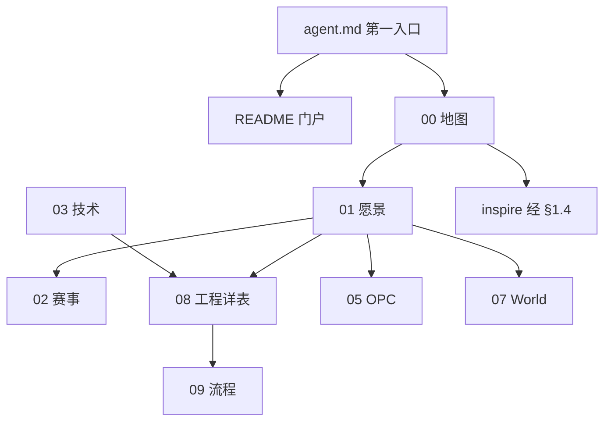

# 商业模拟教育平台 · 项目全景与目录结构

> **第一入口**：[agent.md](./agent.md)（打开项目先读）· **对外门户**：[README.md](./README.md)  
> **编写代码时的权威**：根目录 `00～09`（本文 + `08-` 实现详表）  
> **最后更新**：2026-06-02

---

## 一、根目录文档（00～09）

| 编号 | 文档 | 定位 |
| ---- | ---- | ---- |
| **00** | 本文 | 仓库地图、选读路径、**inspire 权威外链索引** |
| **01** | [平台愿景与产品架构](./01-平台愿景与产品架构.md) | 产品总纲、发展主线、生涯摘要 |
| **02** | [赛事体系与双端产品](./02-赛事体系与双端产品.md) | 教师端/学生端、赛季模式、Arena；§5.0 引擎/配置分层 |
| **03** | [技术架构与实现现状](./03-技术架构与实现现状.md) | 技术栈、智能体编排架构 |
| **04** | [实施路线与里程碑](./04-实施路线与里程碑.md) | 有序阶段蓝图、工程规模与成本估算 |
| **05** | [OPC一人公司-阅读合集](./05-OPC一人公司-阅读合集.md) | **终局出口 A**（Phase E） |
| **06** | [生涯模式-大循环家园与资源经济](./06-生涯模式-大循环家园与资源经济.md) | **Career Hub 产品权威** |
| **07** | [拟真城市与区域模拟-阅读合集](./07-拟真城市与区域模拟-阅读合集.md) | **终局出口 B**；§六～§九 数据颗粒度 / POP / AI 分工 |
| **08** | [工程现状与webapp实现详表](./08-工程现状与webapp实现详表.md) | 路由/API/Bug/百分比**唯一真相源**；编码默认 [AI_DEFAULT](./08-工程现状与webapp实现详表.md#ai_default) |
| **09** | [分项目开发与集成流程](./09-分项目开发与集成流程.md) | 竖切协作、**AI 会话开场 §6.0** |

> **工程契约**：[career/DESIGN.md](./webapp/backend/app/domains/career/DESIGN.md) · **旧索引**：[06-文档索引](./06-文档索引与延伸阅读.md) → 已并入本文 §1.2  

**代码**：[`webapp/`](./webapp/) · **OPC 规格库**：[`inspire/OPC/`](./inspire/OPC/)（读 `05-` 再下钻）

### 1.1 推荐阅读顺序

| 阶段 | 文档链 |
| ---- | ------ |
| 入门 | [agent.md](./agent.md) → `00` → `01` |
| 产品与赛制 | `01` → `02` → `04` |
| 生涯模式 | `01` → `06` → [inspire/d/03-激励闭环](./inspire/d商业模拟教育平台/03-生涯模式与激励闭环.md) |
| 双终局出口 | `05` OPC ∥ `07` 拟真城市（并列） |
| 开发落地 | `agent.md` → `08-` [AI_DEFAULT](./08-工程现状与webapp实现详表.md#ai_default) → `09-` §6.1 |

### 1.1.1 AI 编程选读（上下文瘦身）

| 层 | 读什么 | 勿默认 attach |
|----|--------|----------------|
| T0 | [agent.md](./agent.md) + `.cursor/rules/` | — |
| T1 | `08-` [AI_DEFAULT](./08-工程现状与webapp实现详表.md#ai_default) + [09- §6.1](./09-分项目开发与集成流程.md#61-ai-编程上下文注入清单) 任务包 | 全文 `08-`、`07-`、蓝图方法论 |
| T2 | `08-` §2.6/2.7 · [`webapp/contracts/`](./webapp/contracts/README.md) · `05-`/`07-` 深读块 | inspire 长文 |

　　文内锚点：`<!-- AI_DEFAULT_START -->` / `<!-- AI_DEEP:… -->`（`08-` 含 `matrix-22`、`stores-env-bugs`、`engine-rts` 等；`05-`、`07-` 为 Phase 门控深读）。

### 1.2 按角色选读

#### 5 分钟速读

`01` → `02` → `08-` [AI_DEFAULT](./08-工程现状与webapp实现详表.md#ai_default) · 终局概要：`05` §一～§三、`07` §一～§三

#### 决策者（约 30 分钟）

`01` §一、§六 · `04` §二 · [inspire/62-可持续商业模式](./inspire/62-平台可持续商业模式与社会价值.md)

#### 产品 / 架构（约 2 小时）

`01` → `02` → `03` → `04` · [inspire/b/00-解耦框架](./inspire/b商赛界面展示/00-解耦声明式商业模拟框架总览.md)

#### 生涯模式 / Career Hub（约 1.5 小时）

`06` · [inspire/d/03-激励闭环](./inspire/d商业模拟教育平台/03-生涯模式与激励闭环.md) · [inspire/64-双循环](./inspire/64-双循环与多层级游戏设计理念.md) · [career/DESIGN.md](./webapp/backend/app/domains/career/DESIGN.md)

#### 开发（约 2 小时）

`03` → `08` → `09` · [docs/decisions/](./docs/decisions/README.md) · [webapp/README](./webapp/README.md)

#### 智能体设计（约 1 小时）

`03` §八 → `05` §六 · inspire/OPC/08-

#### 教研（约 3 小时）

[inspire/e/30-课程体系](./inspire/e课程设计/30-课程体系总览.md) · [inspire/13-教学内容生成规范](./inspire/13-教学内容生成规范.md) · [inspire/c/80-知识卡片总览](./inspire/c知识卡片库/索引与映射/80-知识卡片总览.md)

#### 按问题查找

| 问题 | 文档 |
| ---- | ---- |
| 平台是什么？ | `01-` §一 |
| 双端 / 练习·正式？ | `02-` §五 |
| 体验营 / 营团入营？ | `02-` §5.3 · `08-` AI_DEFAULT · `webapp/README.md` 体验营节 |
| 做到哪了？ | `08-` [AI_DEFAULT](./08-工程现状与webapp实现详表.md#ai_default) / §三 |
| 先做什么？ | `04-` + `09-` |
| 生涯 / 家园？ | `06-` · `career/DESIGN.md` |
| 拟真城市？ | `07-` · [inspire/75-](./inspire/75-拟真城市世界观设计.md) |
| OPC？ | `05-` |
| AI 编程 / 怎么开会话？ | [agent.md](./agent.md) · `09-` §6.0 |
| 构想库有哪些专题？ | 本文 §1.4 · [inspire/50-](./inspire/50-目录导航.md) |

### 1.3 按角色（摘要表）

| 角色 | 文档链 |
| ---- | ------ |
| 决策者 | `01` §一、§六 · `04` §二 |
| 产品/架构 | `01` → `02` → `03` → `04` |
| 生涯/Career | `06` · inspire d/03- · career/DESIGN |
| 开发 | `08-` AI_DEFAULT → `09-` §6.1 · docs/decisions |
| 教研 | inspire/e/30- · inspire/13- · inspire/c/80- |
| 终局 OPC | `05` → inspire/OPC/00- |
| 终局 World | `07` → inspire/75- |
| 商赛美术/UI | inspire/76- |

### 1.4 inspire 专题索引（权威外链维护点）

　　**链接纪律**：仅 `agent.md`、`README.md`、`00～09` 可维护指向 `inspire/` 的 Markdown 链接；`inspire/` 文内**禁止互链**（见 [doc-linking.mdc](./.cursor/rules/doc-linking.mdc)）。库内完整目录见 [inspire/50-目录导航](./inspire/50-目录导航.md)。

| 专题 | 文档 | 说明 |
| ---- | ---- | ---- |
| 构想库导航 | [inspire/50-](./inspire/50-目录导航.md) | 50～编号专题与 a～f 子目录 |
| AI 六支柱（产品框架） | [inspire/81-](./inspire/81-商识唯智AI赋能六支柱全景.md) | 教练/NPC/对手/城市/文书/OPC |
| AI 投资人摘要 | [inspire/77-](./inspire/77-商识唯智AI草案.md) | 现状 vs 愿景 |
| 角色 IP / NPC | [inspire/80-](./inspire/80-角色IP复用与可成长规则NPC-Agent框架.md) | 规则优先、可成长对手 |
| 教师端（初稿） | [inspire/83-](./inspire/83-教师端-群组赛季与教学编排蓝图（初稿）.md) | 群组、赛季、活动 |
| Q2 产品讨论包 | [inspire/88-](./inspire/88-2026Q2产品专题讨论索引.md) | 体验营/家园/AI·NPC/商赛沙盒；分稿 84～87 |
| 体验营教师端演进 | [inspire/84-](./inspire/84-体验营教师端-P1缺口与功能演进建议.md) | P1 后 P2～P4 建议 |
| 家园展示厅 | [inspire/85-](./inspire/85-家园展示厅与成就陈设产品设计.md) | 虚拟奖品、徽章墙 |
| AI 教练与生涯 NPC | [inspire/86-](./inspire/86-AI教练与生涯NPC首期建设蓝图.md) | Phase B 建设序 |
| 商赛机制沙盒 | [inspire/87-](./inspire/87-商赛机制设计沙盒蓝图.md) | 赛制设计 → 平台对接 |
| 赛事工坊实现说明 | [inspire/89-](./inspire/89-赛事工坊实现说明与使用指南.md) | Sandbox MVP 架构与 API |
| AI 对手 NPC 化 PRD | [inspire/90-](./inspire/90-AI对手NPC化与成长演化系统PRD.md) | 规则对手 + 局间成长 |
| AI 对手角色图鉴 | [inspire/91-](./inspire/91-AI对手NPC角色图鉴.md) | 浮生记/TV 角色 IP |
| 赛事设计（浮生记 PRD） | [inspire/赛事设计/](./inspire/赛事设计/README.md) | 引擎重设计样本赛制 |
| POP 行为涌现与区域市场 | [inspire/POP行为涌现与区域市场/](./inspire/POP行为涌现与区域市场/README.md) | POP 深研：PRD + 调研 01～07（范式/实现/数据） |
| 拟真城市详设 | [inspire/75-](./inspire/75-拟真城市世界观设计.md) | 07- 附录 |
| 商赛美术 | [inspire/76-](./inspire/76-商赛美术资源嵌入与技术选型建议.md) | 素材管线规划 |
| 教学内容生产 | [inspire/13-](./inspire/13-教学内容生成规范.md) | 内容规范（非根 07- 拟真城市） |
| 桌游机制参考 | [inspire/14-](./inspire/14-桌游参考库-商业贸易金融类.md) | 玩法与经济模型参考库 |
| 生涯激励细则 | [inspire/d/03-](./inspire/d商业模拟教育平台/03-生涯模式与激励闭环.md) | 非根 06- 正文 |
| 解耦框架 | [inspire/b/00-](./inspire/b商赛界面展示/00-解耦声明式商业模拟框架总览.md) | 声明式商赛 UI |

　　新增稳定 **50+ 编号**专题时：在 [inspire/50-](./inspire/50-目录导航.md) 登记，并在上表增加一行（**勿**在 README/agent 重复长列表）。

---

## 二、顶层目录树

```text
businessmatch-v1/
├── agent.md                        ★ 项目第一入口（导航 + AI 立场）
├── README.md                       ★ 对外门户
├── 00～09                          ★ 编写代码时的权威文档
├── .cursor/rules/                  ★ Cursor 规则（蓝图、文档对齐、文风、链接纪律）
├── docs/decisions/                 ★ ADR
├── webapp/                         ★ 可运行应用
│   ├── backend/
│   │   ├── app/api/
│   │   ├── app/domains/            arena · career · cybercore
│   │   ├── app/games/              trading · techventure
│   │   └── content/                game-configs · game-assets · world/（yangtze_6）
│   ├── frontend/                   学生端 :5173
│   └── organizer-frontend/         组织者端 :5174
├── inspire/                        构想库（含 inspire/OPC/ 规格；外链仅由 §1.4 与 50- 维护）
├── art-assets/                     免费可商用美术归档（浮生记等，见 art-assets/README）
└── PPT/
```

---

## 三、文档搭配关系



| 任务 | 文档链 |
| ---- | ------ |
| 懂产品 | 01 → 02 |
| 懂生涯 | 01 → 06 → career/DESIGN |
| 懂实现 | 03 → 08 → webapp/README |
| 开干开发 | 04 → 09 |
| 智能体设计 | 03 §八 · 00- §1.4 → inspire/81- |
| OPC 终局 | 05 |
| 拟真城市 | 07 → inspire/75- |
| 成本核算 | 04 §四 |

---

## 四、文档与推送纪律

　　**编写代码时的事实依据**：`00～09`（尤其 `08-`），不以 `inspire/` 为准。打开项目后的**导航入口**为 [agent.md](./agent.md)。

　　大型更新推送 GitHub 前，须对齐说明文档与代码（见 [docs-align-before-push.mdc](./.cursor/rules/docs-align-before-push.mdc)）；流程见 [`09-`](./09-分项目开发与集成流程.md)。

---

## 五、webapp 代码（摘要）

　　规模与百分比以 [**08-** §三](./08-工程现状与webapp实现详表.md) 为准。摘要：

- **API**：`/api/v1` — auth, wiki, courses, opc, organizer, competitions, trading, trading_ws, practice, techventure, techventure_admin
- **域包**：`domains/{arena,career,cybercore}` · `games/trading` · `games/techventure`
- **赛制 YAML**：`trading-v1` · `trading-v2-rts` · `techventure-v1`

---

> 内容资产：`inspire/a～f/`；过程长文见 `d商业模拟教育平台/`、`f早期调研/`；商赛图鉴见 `inspire/整理games_guide.agent.final.converted.md`。
