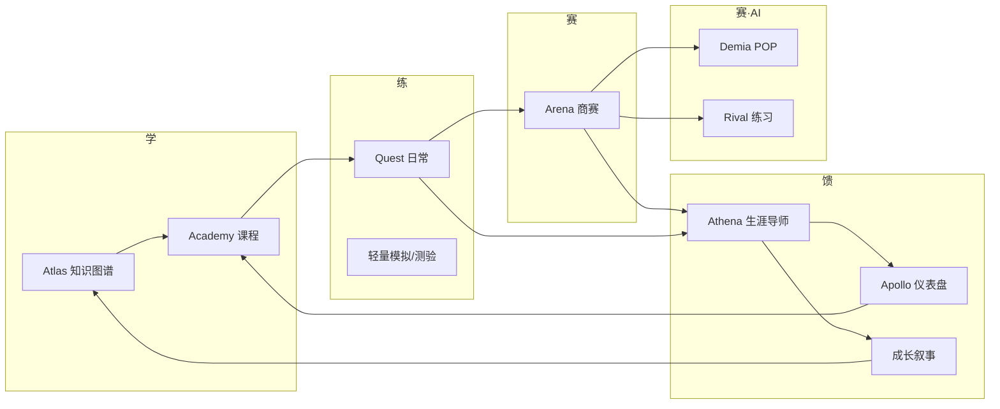

# 商业模拟教育平台 · 一体化总体规划

> **文档定位**：定义以**知识图谱为底座**、以**生涯模式为统一账户成长主线**的综合教育平台，将商业模拟比赛、日常游戏化教学、商业课程、日常活动五类能力域编织为有机的「学习—体验—竞赛—反馈」机制。
>
> **上位文档**：`../11-平台整体设计方案v2.0.md`、`../12-赛事体系架构与性格适配.md`
>
> **最后更新**：2026-05-16

---

## 目录

1. [愿景与核心命题](#一愿景与核心命题)
2. [五域一体架构](#二五域一体架构)
3. [生涯模式：统一主线](#三生涯模式统一主线)
4. [子系统代号与职责](#四子系统代号与职责)
5. [跨域数据流与事件总线](#五跨域数据流与事件总线)
6. [内容资产映射](#六内容资产映射)
7. [角色与端矩阵](#七角色与端矩阵)
8. [设计原则与边界](#八设计原则与边界)

---

## 一、愿景与核心命题

### 1.1 愿景（继承 v2.0）

　　成为中国最具影响力的**商业素养教育基础设施**：让每位学习者（无论性格、起点、学段）在模拟与游戏中发现自己的商业语言，在数据与叙事中看见自己的成长。

### 1.2 本规划的核心命题

| 传统碎片化做法 | 本平台一体化做法 |
|----------------|------------------|
| 商赛、课程、题库、打卡各自独立 | 五域共享同一 `UserId` + `CareerProfile`，活动皆产生**可累积事件** |
| 排名即全部反馈 | **多维激励**：XP、赛季排名、成就、认证、AI 叙事并存 |
| 知识 Wiki 与对局脱节 | **知识图谱**驱动课前预习、课中提示、赛后 RAG 复盘 |
| 性格/伦理与玩法无关 | **Persona** 推荐赛制与角色；**Ethos** 约束决策与评分维度 |
| AI 仅课后答疑 | **Athena** 引导生涯；**Demia** 模拟市场人群；**Rival** 练习谈判 |

### 1.3 设计哲学（六大原则，摘自 v2.0）

- **包容性**：16 种赛制 × 难度 × 模式，覆盖竞争型/合作型/内向型等
- **渐进性**：赛季制、能力迁移、遗产（Legacy）跨局保留叙事
- **叙事性**：成长叙事引擎将数据转为「商业探索故事第 N 章」
- **社会性**：班级公会、师徒、协作任务
- **智能性**：Athena 扩展教师，不替代教师判断
- **开放性**：对接真实案例（`商赛主题与真题库`）、企业导师

---

## 二、五域一体架构

```
┌────────────────────────────────────────────────────────────────────────────┐
│                         用户接触层（Touch Layer）                            │
│   学生 Web/App  │  教师 Web  │  家长小程序  │  企业/赛事运营  │  平台管理端      │
└───────────────────────────────────┬────────────────────────────────────────┘
                                    ▼
┌────────────────────────────────────────────────────────────────────────────┐
│                    ★ 生涯中枢 Career Hub（统一成长主线）★                    │
│  CareerProfile │ Season │ XP Ledger │ Rank │ Achievement │ Reward Wallet   │
└───────────────────────────────────┬────────────────────────────────────────┘
          │              │              │              │              │
          ▼              ▼              ▼              ▼              ▼
┌─────────────┐ ┌─────────────┐ ┌─────────────┐ ┌─────────────┐ ┌─────────────┐
│ Graph       │ │ Academy     │ │ Quest       │ │ Arena       │ │ Credenti    │
│ 知识图谱域   │ │ 课程域       │ │ 日常活动域   │ │ 商赛域       │ │ 认证成就域   │
│ Atlas       │ │             │ │             │ │ CyberCore   │ │ + Legacy    │
└──────┬──────┘ └──────┬──────┘ └──────┬──────┘ └──────┬──────┘ └──────┬──────┘
       │               │               │               │               │
       └───────────────┴───────────────┴───────┬───────┴───────────────┘
                                               ▼
┌────────────────────────────────────────────────────────────────────────────┐
│  智能域：Persona │ Athena（生涯导师·复盘）│ Demia（POP 市场）│ Rival（谈判对手）│
│          Mercury（推荐）│ Apollo（洞察）                                        │
│  治理域：Ethos（诚信/伦理，对齐 16-）│ Identity │ Content CMS                      │
└────────────────────────────────────────────────────────────────────────────┘
                                               ▼
┌────────────────────────────────────────────────────────────────────────────┐
│  数据层：PostgreSQL │ Redis │ ClickHouse │ MinIO/OSS │ Vector DB（RAG）      │
└────────────────────────────────────────────────────────────────────────────┘
```

### 2.1 五域定义

| 域 | 代号 | 用户感知 | 核心产出 | 与生涯模式关系 |
|----|------|----------|----------|----------------|
| **知识图谱** | Atlas | Wiki、概念卡、学习路径、课前诊断 | 掌握度 `mastery`、前置依赖解锁 | 点亮节点 → XP + 成就；解锁课程/赛制 |
| **商业课程** | Academy | 微课、案例、练习、单元测验 | 单元完成度、素养维度得分 | 每单元完成写入 XP；触发 Arena 练习赛 |
| **日常活动** | Quest | 每日任务、 streak、班级挑战、轻量小游戏 | 习惯分、社交贡献 | 稳定日活与 XP 软上限防刷 |
| **商业模拟比赛** | Arena | 10+ 内置赛制、房间、赛季、联赛 | 决策日志、对局排名、复盘 | 高权重 XP；排名榜；性格适配入口 |
| **认证成就** | Credenti | 徽章、微证书、能力认证、赛季通行证奖励 | 可验证凭证、展示墙 | 里程碑奖励；Legacy 跨赛季继承 |

### 2.2 有机闭环（学习—体验—竞赛—反馈）



　　**学**：图谱诊断薄弱概念 → 推荐 Academy 单元；Athena 制定周计划。**练**：Quest 与 **Rival 个人练习**（可谈判）；课程内嵌轻量模拟。**赛**：Arena 中部分赛制启用 **Demia POP** 模拟市场人群；Persona 推荐赛制。**馈**：Athena 统一复盘商赛、Quest 与单元体验；Apollo 更新能力雷达；叙事生成下一章 → 回到**学**。详见 [05-AI深度融合设计.md](./05-AI深度融合设计.md)。

---

## 三、生涯模式：统一主线

### 3.1 什么是「开启生涯模式」

　　用户注册后默认拥有平台账号；**开启生涯**是一次显式仪式（可选剧情引导），创建 `CareerProfile`：

| 字段组 | 说明 |
|--------|------|
| `career_id` | 全局唯一，关联 `user_id` |
| `persona_snapshot` | 性格测评结果（对齐 `15-` 框架，初期可用简化 MBTI + 决策风格） |
| `education_stage` | 学段：小学高段 / 初中 / 高中 / 大学 |
| `season_id` | 当前赛季（如 2026-S1） |
| `legacy` | 跨赛季继承：称号、叙事章节、部分 cosmetic |
| `stats` | 累计 XP、等级、五维能力、图谱覆盖率 |

### 3.2 生涯模式 vs 普通访客

| 能力 | 访客 | 生涯模式 |
|------|------|----------|
| 浏览 Wiki / 课程目录 | ✓ | ✓ |
| 参与排位/联赛商赛 | ✗ | ✓ |
| 累积 XP / 成就 / 赛季排名 | ✗ | ✓ |
| 个性化推荐（Mercury） | 弱 | 全量 |
| AI 成长叙事 | ✗ | ✓ |
| Athena 生涯周计划与跨域复盘 | ✗ | ✓ |
| Rival 个人练习（谈判/人机） | 试玩 | ✓ |
| 认证与学分银行 | ✗ | ✓ |

### 3.3 积分（XP）统一账本

　　所有五域活动归一为 **`XPEvent`**（见 `03-生涯模式与激励闭环.md`），由 Career Hub 记账，保证：

- 同一行为不重复计分（幂等 `source_id`）
- 日软上限防沉迷（继承 `inspire/53`）
- 教学对局 vs 排位赛权重可配置

---

## 四、子系统代号与职责

| 子系统 | 代号 | 职责 | 主要依赖内容资产 |
|--------|------|------|------------------|
| 赛事引擎 | **CyberCore** | 规则即代码、状态机、结算 | `商赛主题与真题库/02-`、`商赛界面展示/` |
| 用户与班级 | **Identity** | 注册登录、RBAC、班级/机构 | `web应用商业教育` 已有模块 |
| 课程系统 | **Academy** | 学习路径、单元、作业 | `college/30-37`、`13-` YAML |
| 知识图谱 | **Atlas** | 概念节点、边、掌握度 | `知识卡片库/`、`82-知识图谱框架` |
| 日常任务 | **Quest** | 每日/每周任务、 streak、公会 | `inspire/53` |
| 认证成就 | **Credenti** | 徽章、证书、通行证 | `11-` 第五章、`13-` L5 |
| 生涯中枢 | **Career** | XP、等级、排名、奖励发放 | 本目录 `03-` |
| 性格引擎 | **Persona** | 测评、赛制匹配 | `12-`、`15-` |
| AI 生涯导师 | **Athena** | 生涯引导、商赛/Quest/课程复盘、叙事 | `05-`、`58-` |
| POP 市场引擎 | **Demia** | 人群需求/舆论/政策民意（规则+叙事） | `12-` NPC 评审、`72-` |
| 博弈对手 | **Rival** | 个人练习、多轮谈判、策略 Bot | `58-` NPC 人格库 |
| 推荐系统 | **Mercury** | 路径/赛制/队友/Rival 难度推荐 | `81-素养-赛制-知识映射表` |
| 数据洞察 | **Apollo** | 学生/教师/运营仪表盘 | `11-` 第七章 |
| 伦理诚信 | **Ethos** | 反作弊、决策诚信、伦理维度 | `16-` |

---

## 五、跨域数据流与事件总线

### 5.1 核心领域事件（建议 CloudEvents 格式）

| 事件类型 | 发布域 | 订阅方 | 生涯影响 |
|----------|--------|--------|----------|
| `graph.node.mastered` | Atlas | Career, Mercury, Academy | +XP，解锁成就 |
| `academy.unit.completed` | Academy | Career, Arena, Athena | +XP，推荐练习赛 |
| `quest.daily.completed` | Quest | Career | +XP，streak |
| `arena.match.finished` | Arena | Career, Athena, Apollo | +XP，排名更新，复盘任务 |
| `arena.negotiation.completed` | Arena/Rival | Athena, Ethos | 谈判复盘、诚信校验 |
| `demia.pop_shift` | Arena/Demia | Athena, Apollo | 舆情事件、教学分析 |
| `athena.plan.updated` | Athena | Career, Mercury | 周计划刷新 |
| `credenti.badge.earned` | Credenti | Career, Social | 展示墙、奖励包 |
| `persona.assessment.updated` | Persona | Mercury, Arena | 刷新赛制推荐 |

### 5.2 统一学习记录（Learning Record）

　　每条记录关联：`user_id`, `career_id`, `domain`, `resource_id`, `duration`, `score`, `knowledge_nodes[]`, `competency_tags[]` —— 供 Apollo 与认证使用，对齐 `13-` 内容元数据中的 `learning_objectives`。

---

## 六、内容资产映射

### 6.1 知识图谱（Atlas）

| 资产 | 路径 | 平台用法 |
|------|------|----------|
| 48 张概念卡 YAML | `知识卡片库/*/` | 节点属性、测验题源 |
| 图谱框架 | `知识卡片库/索引与映射/82-` | L1/L2/L3 层级、枢纽概念 |
| 交叉映射 | `81-素养-赛制-知识映射表` | 赛制结束推送薄弱概念 |

### 6.2 课程（Academy）

| 资产 | 路径 | 平台用法 |
|------|------|----------|
| 课程体系 | `college/30-37` | 单元 Bundle、`game_mode_id` 嵌入 |
| 生成规范 | `13-` | `content_bundle` YAML 导入 CMS |
| 功能映射 | `college/37-` | 教师端功能开关 |

### 6.3 商赛（Arena）

| 资产 | 路径 | 平台用法 |
|------|------|----------|
| 10 种内置主题 | `商赛主题与真题库/02-` | CyberCore `GameConfig` |
| 青少年真题 | `商赛主题与真题库/01-` | 案例库、训练模式 |
| 学段推荐 | `商赛主题与真题库/03-` | Mercury 默认推荐池 |
| UI 规格 | `商赛界面展示/` | 前端页面与组件 |
| 赛制百科 | `14-`、`12-` | 运营配置、性格矩阵 |

### 6.4 伦理与性格

| 资产 | 路径 | 平台用法 |
|------|------|----------|
| 性格理论 | `15-` | Persona 量表设计 |
| 诚信伦理 | `16-` | Ethos 规则、评分维度、举报流程 |

---

## 七、角色与端矩阵

| 角色 | 核心端 | 关键能力 |
|------|--------|----------|
| 学生 | Web / PWA / 小程序 | 生涯主页、五域入口、赛季榜、成就墙 |
| 教师 | Web | 班级看板、开课/开赛、Quest 布置、Apollo 班级洞察 |
| 家长 | 小程序 | 成长报告（只读）、防沉迷设置 |
| 赛事运营 | Web | 联赛模板、报名、大屏 |
| 平台管理员 | Web | 内容 CMS、规则发布、Ethos 审计 |

---

## 八、设计原则与边界

### 8.1 必须遵守

1. **竞技公平**：排位/联赛禁用局外数值加成（仅 cosmetic），见 `03-` 公平性分级。
2. **AI 边界**：Athena 不直接给最优决策数值；排位局内关闭策略陪跑（见 `05-`）。
3. **Demia 数值权威**：市场参数以规则层为准，LLM 仅叙事不可改分。
4. **Rival 与排位隔离**：谈判练习默认不计 ELO，或独立练习榜。
5. **内容即配置**：POP 定义、Rival 人格用 YAML 配置，减少硬编码。
6. **教育优先**：Quest 与 XP 设计服务学习目标，非纯留存 hack。

### 8.2 与现有 MVP 的关系

　　`web应用商业教育/` 已实现：Identity、Atlas（Wiki）、Academy（课程）、Arena（大厅展示）、部分游戏。**本规划要求**：新增 **Career Hub + Quest**，将 Arena 从「展示」推进到 **CyberCore 可运行对局**，并把 Wiki 升级为**掌握度驱动的图谱**。

---

## 附录：名词对照

| 中文 | 英文代号 |
|------|----------|
| 生涯模式 | Career Mode |
| 知识图谱域 | Atlas |
| 商赛域 | Arena / CyberCore |
| 日常活动域 | Quest |
| 课程域 | Academy |
| 认证域 | Credenti |

---

*下一篇：[02-技术栈与项目结构.md](./02-技术栈与项目结构.md)*
