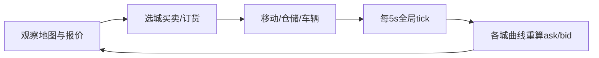

# 浮生记 · 引擎重设计 PRD（讨论框架）

> **状态**：[过程] · 非完整 PRD，供讨论后定稿  
> **样本定位**：后续商赛（CyberCore + `games/*`）的**参考实现**与验收样板  
> **对齐**：[07-拟真城市与区域模拟-阅读合集](../../07-拟真城市与区域模拟-阅读合集.md) · ADR-005 · `trading-v2-rts`（现行 v2.1）  
> **配套专稿**：**POP行为涌现与区域市场** 目录下 POP 与市场机制 PRD；**真实地图与商队精灵-BDD**（地理层 + Gherkin 验收）  
> **最后更新**：2026-05-30

---

## 1. 产品目标（须锁定）

| 项 | 定义 |
|----|------|
| **核心体验** | 玩家在**长三角城市群**地图上跨城**倒买倒卖**，在墙钟时限内积累**现金**，终局**现金最高者胜** |
| **时间模型** | **即时制**：全局每 **5 秒** 推进 **1 个进度（tick）**；普通局 **240 tick ≈ 20 分钟**（可配置短/长局） |
| **呈现** | **具象地图** + 游戏化 UI；价格/库存/运力可感知，**非**纯表格比价 |
| **经济深度** | 各城各商品的 **ask/bid** 由 **拟真供需曲线** 驱动（POP + 产业 + 物流 + 玩家交易冲击） |
| **平台关系** | 引擎读 **拟真城市基础框架** 的贸易切片；POP 机制见专稿，本 PRD 只定义**接口与节奏** |

---

## 2. 与现行 `trading-v2-rts` 的差异（讨论基线）

| 维度 | 现行 v2.1 | 本 PRD 目标 |
|------|-----------|-------------|
| 局时长 | 8/10/12 分钟（96～144 tick） | **默认 20 分钟 / 240 tick**（保留组织者多档） |
| 城市数据 | 写在 `trading-v2-rts.yaml` 内 6 虚构城 | **引用** `content/world/cities/*` 母本（长三角真名/别名） |
| 定价 | `pool_ask_bid` + 固定 prod/cons 矩阵 | **POP 聚合曲线** + 玩家冲击（专稿） |
| 前端 | 列表/卡片为主 | **地图主视图** + 本地/缓存美术资源 |
| 配置 ID | `trading-v2-rts` | 建议新 ID：`fushengji-v3`（与 v2 并存至迁移完成） |

---

## 3. 核心玩法循环



### 3.1 玩家动作（单写者排队，tick 结算）

| 动作 | 说明 | 结算时机 |
|------|------|----------|
| **同城买入** | 按当期 **ask** 成交，占仓储体积 | 下一 tick 或同 tick 末（二选一，实现时定） |
| **同城卖出** | 按当期 **bid**，受**吸收上限**约束 | 同上 |
| **跨城移动** | 沿路网边，耗时 = `f(距离, 车辆速度加成)` tick | 到达 tick 解锁该城交易 |
| **购车/扩储** | 消耗现金，改容量与速度 | 即时扣款，下一 tick 生效 |
| **观望** | 合法 | — |

### 3.2 胜负与公平

| 规则 | 说明 |
|------|------|
| **胜利** | `tick >= total_ticks` 时，**现金 + 持仓按终局 bid 估值** 最高者胜（估值公式待决） |
| **热身** | 建议 `warmup_ticks: 6～12`（30～60s），仅浏览或限价交易（待决） |
| **竞技** | 正式赛：**无**家园/外部 buff；练习局可保留 AI 档位 |

---

## 4. 时间与赛程配置

```yaml
# 建议写入 game-config defaults（讨论稿）
tick_interval_sec: 5
duration_presets:
  standard:
    label: 普通局
    minutes: 20
    total_ticks: 240
  short:
    label: 快速局
    minutes: 12
    total_ticks: 144
  long:
    label: 教学局
    minutes: 30
    total_ticks: 360
```

| 参数 | 值 | 备注 |
|------|-----|------|
| 推进权 | **仅** `rts_scheduler` | ADR-005，HTTP/WS 只读 |
| 广播 | commit 后 `broadcast_rts_tick` | 含 `tick`、`prices`、`phase`、`seconds_until_next` |

---

## 5. 地图、可视化与美术资源

### 5.1 信息架构（学生端）

| 区域 | 内容 |
|------|------|
| **主画布** | 长三角示意地图：城节点、边（路网）、玩家车队动画、热点脉冲（价差大） |
| **侧栏** | 当前城：商品 ask/bid、池量、压力指示；仓储/车辆 |
| **底栏** | 全局 tick 倒计时、现金、事件条（丰收/拥堵等） |
| **组织者** | 控场：暂停/提前结束、事件注入、全班价差热力（P2） |

### 5.2 美术资源策略（含本地预加载建议）

| 方案 | 做法 | 优点 | 缺点 | 建议 |
|------|------|------|------|------|
| **A. 构建进前端包** | Vite `import` + 按赛制 code-split | 实现简单；首访后浏览器缓存 | 包体增大 | **MVP 首选**（图标/地图底图/商品小图） |
| **B. 静态 CDN + HTTP 缓存** | `public/assets/fushengji/v1/*` + `Cache-Control` | 更新无需发版；多赛共享 | 需部署路径 | **正式环境推荐** |
| **C. 客户端预加载清单** | 开赛前 `POST /matches/{id}/preload-manifest` → 并行 fetch 到 Cache API / IndexedDB | 大赛前可校验完整性；弱网可重试 | 实现成本高；需版本对齐 | **大规模赛事可选** |
| **D. 纯本地手工目录** | 参与者自备资源路径 | — | 难统一、难更新、运维不可控 | **不建议** |

**推荐组合**：MVP 用 **A**；公测起 **B + 开赛 manifest（C 轻量版）**——manifest 只列 URL 与 hash，仍从 CDN/同源拉取，**非**「每人拷贝一份私有目录」。

| 资源类 | 规格草案 | 预加载优先级 |
|--------|----------|--------------|
| 地图底图 | 1 张 16:9 WebP/SVG；**真实地理包**见 BDD | P0 |
| 城界 / 锚点 | 6 城 GeoJSON 轮廓 + 锚点（非矩形热区） | P0（M1） |
| 城徽/节点 | 8～12 城 × 2 态 | P0 |
| 商队精灵 | 在途沿边插值；Pixi 或 SVG | P1（M1/M2） |
| 商品图标 | 10 品 × 1 | P0 |
| 车辆/仓库 | 2～3 车型 | P1 |
| 事件插画 | 8 类 | P1 |
| 音效 | 可选 | P2 |

---

## 6. 拟真城市对接（浮生记所需「基础框架」）

### 6.1 框架边界（Phase B 最小集）

```
content/world/
├── regions/yangtze_delta.yaml      # 区域：城列表、边、默认政策包 id
├── cities/{city_id}.yaml           # L2 母本：产业、POP 引用、物流、档案摘要
└── schemas/city_trade_slice.json   # 浮生记可读字段契约
```

| 层 | 浮生记读取 | 不读（专稿/远期） |
|----|------------|-------------------|
| L2 城市母本 | `city_id`、display_name、坐标、产业标签、POP 引用 id | 完整政策推演 |
| L3 POP | 聚合后的 **有效需求向量**（每 tick 或每 N tick 刷新） | 单 POP 迁移动画 |
| L4 局快照 | 开赛时 `world_snapshot_id` 冻结基线 | 跨局持久化（Phase C+） |

### 6.2 引擎接口（契约草案）

| 函数/服务 | 输入 | 输出 |
|-----------|------|------|
| `load_trade_slice(region_id, snapshot?)` | 区域、可选快照 | 城列表、路网、商品清单 |
| `price_tick(state, player_flows)` | 当前池、POP 状态、玩家净流 | 各城各品 `{ask,bid,pool,pressure}` |
| `apply_logistics(edge, vehicles)` | 母本边权 + 加成 | `travel_ticks` |

　　**纪律**：`games/trading` **不**直接写 world 表；母本变更走 `content/world/` 版本号。

### 6.3 长三角 v0 城市集（待你确认名单）

| 草案 city_id | 角色标签 | 浮生记策略直觉 |
|--------------|----------|----------------|
| `shanghai` | 金融消费枢纽 | 高端消费 ask 高 |
| `suzhou` | 制造+日消 | 工业品供给外运 |
| `hangzhou` | 数字+轻工 | 家电/日用品 |
| `nanjing` | 省会综合 | 中转 |
| `hefei` | 内陆制造 | 原材料需求 |
| `hangzhou` | 数字经济 | 电商与消费升级 |
| `ningbo` | 港口物流 | 进出口价差 |
| `chengdu` | 西部供给（是否纳入长三角图待决） | 农品产出 |

> 可与现行虚构六城 **映射过渡**（如 `hushi` → `shanghai`），避免一次改光前端。

---

## 7. 市场定价（本 PRD 只写接口；公式在 POP 专稿）

| 概念 | 浮生记侧表现 |
|------|--------------|
| **结构性中枢价** | 由 POP 需求、本地产业、基线物流成本合成 `mid` |
| **即时池** | 每 tick：`自然产出 − POP消费 − 玩家净买入 + 玩家净卖出` → 池量 |
| **价差** | `ask/bid` 由池压力 + `min_spread` 生成；玩家大单加速曲线移动 |
| **教学点** | 学生可见「池偏低 → ask 上涨」与「某城 POP 结构 → 长期贵/贱」 |

---

## 8. 系统模块划分（实现样本）

| 模块 | 路径/归属 | 职责 |
|------|-----------|------|
| 赛制配置 | `content/game-configs/fushengji-v3.yaml` | tick、商品、区域引用、奖励 |
| 引擎 | `app/games/trading/`（或 `fushengji/` 子包） | tick、定价、物流、结算 |
| 调度 | `rts_scheduler.py` | 单写者 |
| 世界服务 | `domains/world/`（Phase B 起） | 母本加载、快照、POP 聚合 |
| 前端 | `frontend/src/pages/trading/` + 地图组件 | WS + manifest 预加载 |
| Arena | 不变 | 开赛、房间码、排名 |

---

## 9. 分阶段交付（建议）

| 阶段 | 交付 | 验收 |
|------|------|------|
| **D0 讨论** | 本 PRD + POP 专稿定稿 | 城名单、240tick、美术方案签字 |
| **D1 契约** | `city_trade_slice` schema + 2 城母本 YAML | 单测加载 |
| **D2 定价 v0** | POP 聚合 → ask/bid（无玩家反馈 POP） | 与旧池模型价差对比脚本 |
| **D3 引擎** | `fushengji-v3` + scheduler + 240tick | 练习局端到端 |
| **D4 地图 UI** | 地图主视图 + P0 美术 | 弱网 3G 首屏 <3s（目标） |
| **D5 玩家→POP** | 贸易冲击写回 POP 状态 | 复盘卡能解释「需求被推高」 |
| **D6 样本化** | 文档回写 `02-`/`08-`、沙盒可 fork 配置 | 87- 沙盒能一键试玩 |

---

## 10. 非目标（本期不做）

- 全图真实 GIS、卫星底图  
- 开放世界持久 MMO 式城市  
- LLM 实时改价  
- Phase A 新建 `domains/world` 对外 API（可与 D1 母本文件并行）

---

## 11. 待决问题（请直接批注）

| # | 问题 |
|---|------|
| 1 | 普通局是否 **强制 240 tick**，还是保留 120 tick「联赛版」？ |
| 2 | 终局估值：**仅现金** vs **现金+持仓市值**？ |
| 3 | 城市用 **真名** 还是继续 **化名** 过渡？ |
| 4 | 新配置 ID：`fushengji-v3` vs 升级 `trading-v2-rts` 原地演进？ |
| 5 | 地图 **2D 示意** vs **伪 3D**？ |
| 6 | 热身 tick 是否允许交易？ |
| 7 | AI 对手是否沿用 `chaotic/advanced` 还是 POP 驱动 bot？ |

---

## 12. 成功指标（定稿后写入 08-）

| 指标 | 目标 |
|------|------|
| 单局完成率 | 开赛后 ≥85% 对局打满时长或正常结束 |
| 首屏可玩 | 资源就绪后 ≤3s 进入可下单 |
| 教学可解释 | 赛后 3 条以内说清「为何 A 城该品涨价」 |
| 样本复用 | 下一赛制至少复用 **scheduler + world slice 加载** 两处 |
