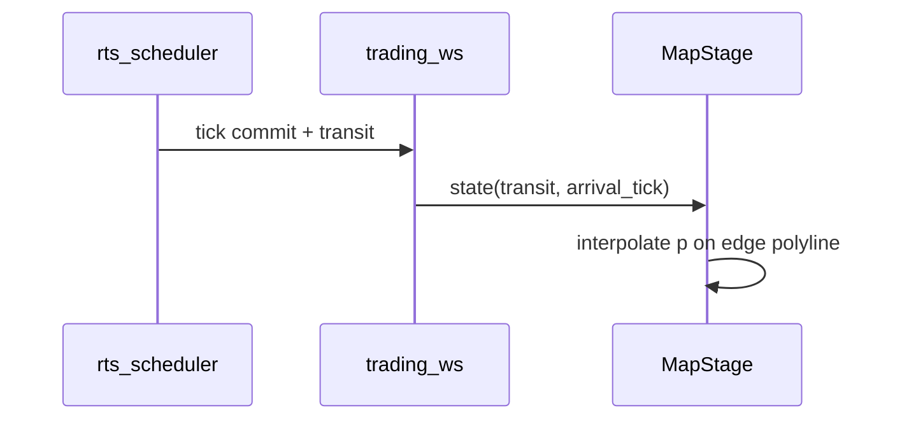

# 浮生记 · 真实地图与商队精灵 BDD 设计

> **文档类型**：行为驱动设计（BDD）规格 — 与 TDD 配套，先定可验收行为，再写测试与实现  
> **对齐**：浮生记-引擎重设计-PRD §5 · ADR-005 · inspire/POP…/08-长三角六城 · inspire/76- 美术 · `art-assets/fushengji/`  
> **状态**：[过程]  
> **最后更新**：2026-05-30

---

## 1. 目标与范围

### 1.1 用户目标（产品语言）

　　玩家商队（精灵/车队）在 **一张真实长三角地理底图** 上移动；六城 **落点在真实经纬度投影位置**；**城市轮廓**贴合行政范围（简化多边形，非矩形）；城间 **连线与在途时长** 能让人直观感受 **拓扑与远近**，而非棋盘格。

### 1.2 系统边界

| 在范围内 | 不在范围内（本期） |
|----------|-------------------|
| 学生端对局主画布地图层 + 商队精灵插值动画 | 3D 地球、卫星实景付费 API 默认开启 |
| 与后端 `current_city`、`transit`、路网边权 **一致** | 客户端自行结算到货 tick |
| `yangtze_6` 区域包地理数据版本化 | 全国 300+ 地市 |
| 无障碍：键盘选城、读屏城市名 | 驾驶式自由移动（非节点游戏） |

### 1.3 与 PRD / 架构的硬约束

| 约束 | 来源 |
|------|------|
| 到货时刻以服务端为准 | `transit.arrival_tick`，ADR-005 |
| HTTP 不推进 tick | 动画仅消费 WS/state |
| 城市 id 与 `content/world` 一致 | 08- 手册 `nanjing` 等 |
| 教学级地理 | 轮廓为 **简化矢量**，非测绘级 |

---

## 2. 实现策略（推荐：分两层）

### 2.1 两层坐标模型

```
┌─────────────────────────────────────────────────────────┐
│ 地理层（Geo）     WGS84 经纬度 · GeoJSON 边界 · 底图      │
│       ↓ 投影      world_pack.geo.projection + bbox      │
│ 对局平面（Stage）  逻辑坐标 x,y ∈ [0,1] 或 像素 px      │
│       ↓ 绑定      城市锚点、路网折线、精灵路径           │
│ 仿真层（Sim）     city_id、边 tick，与现有 rts 一致      │
└─────────────────────────────────────────────────────────┘
```

| 层 | 职责 | 技术候选 |
|----|------|----------|
| **Geo** | 真实位置感、轮廓、距离直觉 | GeoJSON/TopoJSON + 静态底图 WebP |
| **Stage** | 精灵、高亮、缩放平移、点击命中 | **Phase M1** React SVG；**Phase M2** Pixi 精灵层 |
| **Sim** | 规则、价格、胜负 | 现有 `games/trading` + `world` 区域 YAML |

　　**关键原则**：玩家在地图上点到的是 **多边形热区** → 解析为 `city_id`；移动显示是 **边 `from→to` 上的插值**，时长由 `arrival_tick - now_tick` 与 `tick_interval_sec` 决定，**不是**物理引擎驾车。

### 2.2 真实地图底图选项

| 方案 | 做法 | 优点 | 缺点 | BDD 默认 |
|------|------|------|------|----------|
| **G1  stylized 栅格** | 自绘/开放地形图裁剪长三角 bbox | 无第三方 ToS 风险、包体可控 | 非「卫星实景」 | **M1 默认** |
| **G2  OSM 静态图** | 导出 bbox 瓦片拼图 + ODbL 署名 | 真实道路水系 | 维护、署名、离线包体 | M2 可选 |
| **G3  MapLibre + 矢量** | 在线样式或自建 tile | 最「真」 | 依赖网络/密钥 | 研究型 |

### 2.3 城市轮廓（非矩形）

| 步骤 | 产出 |
|------|------|
| 1 | 自 **公开行政边界**（DataV/自然资源部简化版/OSM relation）取得 6 城 MultiPolygon |
| 2 | 拓扑简化（Douglas–Peucker，容差调视觉）→ `geo/cities/{id}.geojson` |
| 3 | 投影到 Stage 平面，缓存 `path d` 供 SVG/Pixi |
| 4 | 命中测试：点在多边形内 → `city_id`（ray casting） |

### 2.4 商队精灵移动

| 要素 | 规则 |
|------|------|
| 锚点 | 每城 `centroid` 或视觉重心（可偏离几何中心以避重叠） |
| 在途 | 仅沿 **区域包已声明的边** `routes` 折线移动（可 2～3 段贝塞尔） |
| 进度 | `p = clamp((now_tick - depart_tick) / (arrival_tick - depart_tick), 0, 1)` |
| 朝向 | 切线方向旋转精灵 |
| 到达 | `p=1` 时吸附终点；状态切 `canAct` 与后端一致 |



### 2.5 拓扑与距离直觉

| 视觉编码 | 数据依据 |
|----------|----------|
| 边长度 | 投影后折线 **像素长** ∝ `base_travel_ticks`（校准，非真实公里） |
| 边粗细/颜色 | 可选：物流拥堵事件 |
| 标签 | 在途 tick 倒计时、`move_cost` |
| 禁止 | 地图上「直线飞到未邻接城」若规则不允许 |

---

## 3. 数据契约（扩展 `world` 包）

### 3.1 文件布局（规划）

```
content/world/regions/yangtze_6.yaml      # 已有逻辑路网
content/world/geo/yangtze_6/
  manifest.yaml                           # 版本、bbox、投影
  basemap.webp                            # 底图
  cities/nanjing.geojson                  # 简化边界
  ...
  anchors.yaml                            # city_id → [lng,lat] + label_offset
  edges.geojson                           # 可视化折线（可自动生成自 routes）
art-assets/fushengji/maps/geo/            # 设计期镜像（可选）
```

### 3.2 `manifest.yaml`（片段）

```yaml
geo_pack_version: "0.1.0"
bbox: [118.0, 30.5, 122.5, 33.5]   # 长三角西东南北（教学包）
projection: equirectangular        # 或 custom_affine 矩阵 6×2
stage_aspect: "16:9"
cities: [shanghai, suzhou, nanjing, nantong, hangzhou, changzhou]
attribution:
  - "底图：项目自绘 / OSM ODbL（若启用 G2）"
  - "边界：简化行政界，教学用途"
```

### 3.3 API / 状态扩展（前端消费）

| 字段 | 类型 | 说明 |
|------|------|------|
| `participant.current_city` | string | 已有 |
| `rts.transit` | `{ from_city, to_city, depart_tick?, arrival_tick }` | 已有，需保证 `from_city` |
| `rts.fleet_visual?` | optional | Phase M2：载具 id、多车 |
| `world_geo_pack_id` | string | 开赛时写入 config，加载对应 geo |

---

## 4. BDD 特性与场景（Gherkin）

　　以下为实现验收规格；自动化可用 **Cucumber/Playwright** 或 **pytest-bdd**（E2E 少量）+ **Vitest**（组件/几何）。

---

### Feature: 地理地图包加载

```gherkin
# language: zh-CN
功能: 地理地图包加载
  作为 学生端对局客户端
  我想要 在进入浮生记 RTS 前加载完整地理包
  以便 主画布显示真实长三角底图与城界

  背景:
    假定 赛制为 "fushengji-v3" 或 "trading-v2-rts"
    并且 区域为 "yangtze_6"
    并且 geo 包版本 "0.1.0" 存在于资源清单

  场景: 成功加载地理包
    当 对局页面请求地理包 "yangtze_6" "0.1.0"
    那么 应在 3 秒内 得到 basemap 与 6 个城市 GeoJSON
    并且 投影矩阵应 将 bbox 映射到 16:9 舞台
    并且 manifest 中的 city_id 应与 逻辑区域包 一致

  场景: 地理包缺失时降级
    假定 geo 包下载失败
    当 对局页面初始化地图
    那么 应显示 示意 SVG 底图 "yangtze_6-schematic"
    并且 应提示 "地理图加载失败，已使用示意模式"
    并且 六城应仍 以圆点锚点 可点击（逻辑坐标表兜底）
```

---

### Feature: 城市轮廓与命中

```gherkin
功能: 城市轮廓渲染与点击
  作为 进行贸易决策的学生
  我想要 看到贴合城界的区域而非矩形
  以便 建立真实城市空间感

  场景: 轮廓渲染
    假定 地理包已加载
    当 地图舞台渲染城市 "nanjing"
    那么 "nanjing" 的可见形状应为 多边形路径
    并且 不应 使用 axis-aligned 矩形 作为唯一热区

  场景: 轮廓内点击选城
    假定 玩家当前在 "shanghai" 且 无在途
    当 玩家在 "suzhou" 多边形内部 点击
    那么 侧栏应切换为 "suzhou" 的市场报价
    并且 尚未 向服务端发送 move（仅选中，或按产品定义）

  场景: 轮廓外点击无效
    当 玩家在 海洋/野外区域 点击
    那么 不应 切换当前询价城市
```

---

### Feature: 商队精灵在途移动

```gherkin
功能: 商队精灵在途移动
  作为 学生
  我想要 看到我的商队沿路网向目标城移动
  以便 感知运输时间成本

  背景:
    假定 玩家已在 "shanghai"
    并且 路网存在边 "shanghai-suzhou"

  场景: 发起移动后进入在途
    当 玩家提交 move 至 "suzhou"
    并且 服务端返回 transit 至 "suzhou" arrival_tick 为 当前 tick + 2
    那么 地图应显示 精灵 从 "shanghai" 锚点 出发
    并且 交易侧栏应 禁用买卖（canAct=false）
    并且 应显示 倒计时 "2 tick"

  场景: tick 推进时插值移动
    假定 已在途 从 "shanghai" 到 "suzhou" 共 2 tick
    当 WebSocket 推送 tick 从 T0 到 T1
    那么 精灵位置应在 边折线上 完成约 50% 插值
    当 WebSocket 推送 tick 到达 T2
    那么 精灵应 吸附在 "suzhou" 锚点
    并且 canAct 应为 true

  场景: 禁止斜飞未连接城市
    假定 路网 无 "shanghai-nanjing" 直连边
    当 玩家尝试 move 至 "nanjing"
    那么 服务端应拒绝 或 要求 多段路径（若产品支持中转则另定场景）
```

---

### Feature: 拓扑边与距离直觉

```gherkin
功能: 城间拓扑可视化
  作为 授课中的学生
  我想要 边长短与在途 tick 大体一致
  以便 理解机会成本

  场景: 短边短 tick
    假定 "shanghai-suzhou" base_travel_ticks 为 2
    并且 "shanghai-nanjing" base_travel_ticks 为 4
    当 地图渲染路网
    那么 "shanghai-suzhou" 的 舞台折线长度 应 短于 "shanghai-nanjing"
    并且 标签应 显示各自 tick 数

  场景: 价差热点不扭曲拓扑
    当 某商品在 "nantong" ask 显著高于均值
    那么 地图可在 "nantong" 显示 脉冲热点
    并且 不应 移动城市锚点 破坏几何关系
```

---

### Feature: 与调度器单写者一致

```gherkin
功能: 地图状态与 RTS 单写者一致
  作为 平台架构
  我想要 地图动画仅反映已提交状态
  以便 避免客户端预测导致作弊感

  场景: 不在 GET state 时推进 tick
    当 客户端轮询 GET /trading/state
    那么 不得 因轮询 改变 arrival_tick 或 本地 tick 计数

  场景: WS 先于动画
    当 收到 tick 广播
    那么 应先 更新本地 sim tick 再 更新精灵插值基准
```

---

### Feature: 性能与预加载

```gherkin
功能: 地图资源预加载
  作为 弱网环境学生
  我想要 开赛前缓存地理包
  以便 开赛后主画布流畅

  场景: manifest 预加载
    给定 预加载清单 含 geo 包 6 个 json 与 1 张 webp
    当 学生进入对局大厅
    那么 Cache 应 在 开赛前 完成或 显示进度条
    并且 单局内 地图层 不应 重复下载全量 geo
```

---

## 5. 测试分层（BDD + TDD）

| 层级 | 测什么 | 工具 | 示例 |
|------|--------|------|------|
| **L0 几何单元** | 点-in-多边形、投影、插值 p | Vitest | `nanjing.geojson` 采样点 |
| **L1 组件** | MapStage 渲染、点击 emit city_id | RTL + Vitest | mock geo 包 |
| **L2 契约** | `transit` JSON schema、边列表 | pytest + OpenAPI 已有 | 与后端对齐 |
| **L3 E2E** | 加载→move→见精灵动→到货可买卖 | Playwright 1 条 smoke | staging |

### 5.1 示例单元测试描述（TDD 落地时）

```text
describe("edgeInterpolation")
  it("p=0 at depart_tick")
  it("p=1 at arrival_tick")
  it("uses polyline not straight chord when waypoints exist")

describe("hitTestCity")
  it("returns suzhou when click inside suzhou polygon")
  it("returns null when click outside all cities")
```

---

## 6. 分阶段交付（与 76- / PRD 对齐）

| 里程碑 | 交付 | BDD 场景覆盖 |
|--------|------|--------------|
| **M0** | `anchors.yaml` + 示意底图 + 圆点（现有 schematic） | 降级场景 |
| **M1** | GeoJSON 轮廓 + SVG 层 + 折线边 + 精灵 CSS/SVG 插值 | 轮廓、在途、拓扑 |
| **M2** | Pixi 精灵 + 缩放平移相机 + 预加载 manifest | 性能场景 |
| **M3** | 六城 bbox 校准报告 + 可选 OSM 底图 | 加载场景 |

---

## 7. 待决（产品批注后写入 ADR）

| # | 问题 | 建议默认 |
|---|------|----------|
| 1 | 点击轮廓 = 仅选中城，还是直接发起 move？ | **先选中**，move 仍用侧栏按钮 |
| 2 | 是否显示真实公里数？ | **否**，只显示 tick |
| 3 | 多段中转（沪→锡→宁）一期是否支持？ | **否**，仅直连边 |
| 4 | Geo 包放 CDN 还是跟 repo？ | 小于 2MB 可 repo；大图 CDN |

---

## 8. 相关文档

| 文档 | 关系 |
|------|------|
| 浮生记-引擎重设计-PRD | §5 可视化、§4 时间模型 |
| 08-长三角六城起步手册 | 逻辑路网与 city_id |
| inspire/76- | Pixi 分期、Tiled |
| ADR-005 | tick 与 WS |
| art-assets/fushengji/maps/ | 示意资源；geo 子目录待建 |
