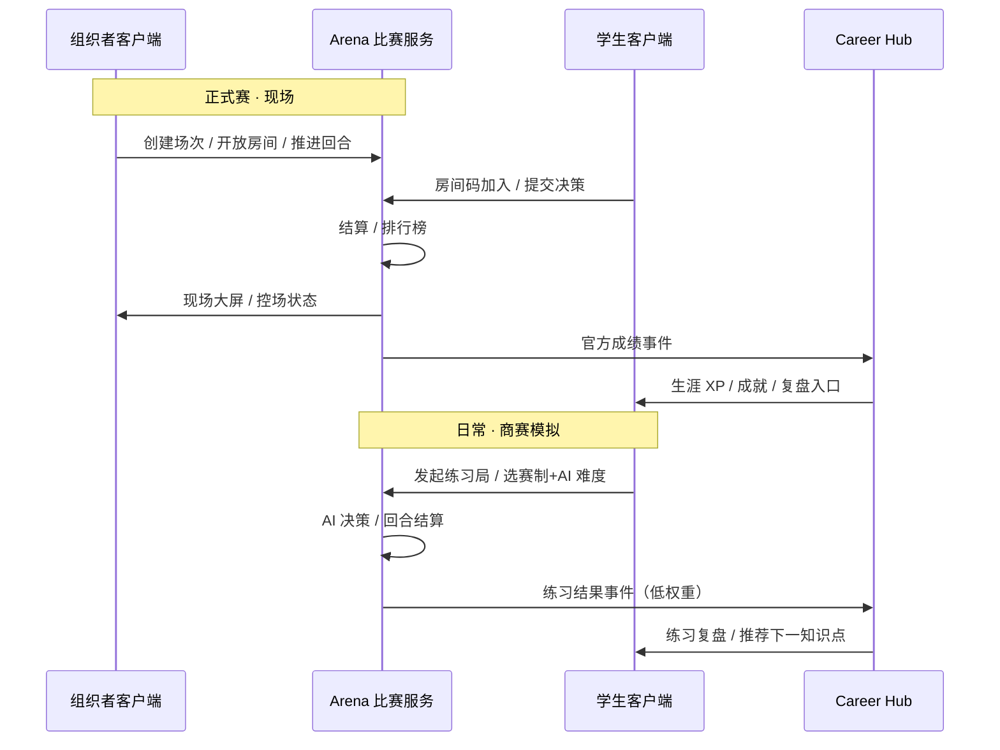
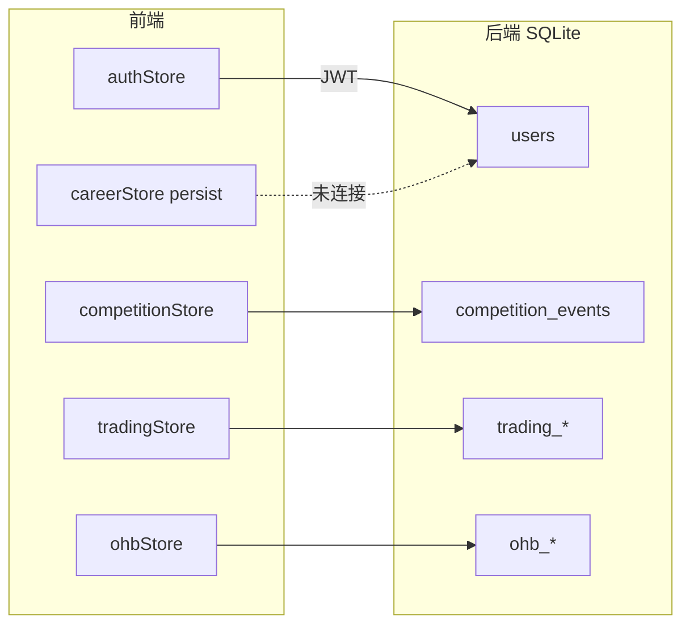
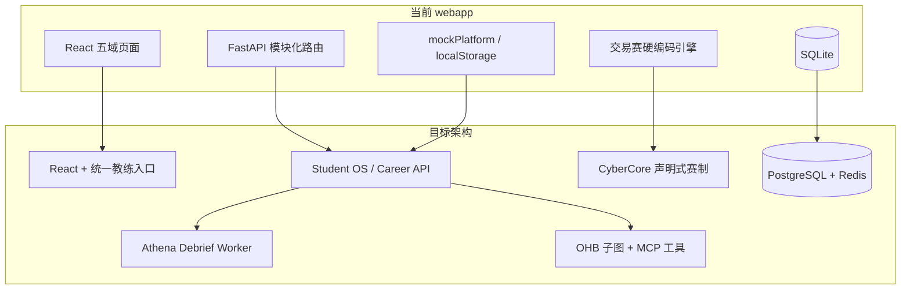

# 商域 BizSim Edu · 项目现状与发展设计

> **文档定位**：在 [`README.md`](./README.md)（工程使用说明）之外，从**全仓库战略视角**说明 `webapp/` 的使命、当前交付水平、与顶层规划及内容资产的关系，并给出**可执行的未来演进路线**。
>
> **读者**：产品、教研、架构、新加入开发者  
> **关联仓库文档**：[`../商业模拟教育平台/`](../商业模拟教育平台/README.md)、[`../Onehumanbussiness/`](../Onehumanbussiness/README.md)、[`../README-项目阅读导航.md`](../README-项目阅读导航.md)  
> **最后更新**：2026-05-20（增补 §3.6～3.10 工程详表与问题清单）

---

## 目录

1. [战略定位：webapp 在整体中的角色](#一战略定位webapp-在整体中的角色)
   - [1.4 双端架构：学生客户端 × 组织者客户端](#14-双端架构学生客户端--组织者客户端)
2. [仓库知识资产地图](#二仓库知识资产地图)
3. [当前实现现状（webapp）](#三当前实现现状webapp)
   - [3.6 前端架构与路由全表](#36-前端架构与路由全表)
   - [3.7 后端架构与 API 全表](#37-后端架构与-api-全表)
   - [3.8 状态管理与数据流](#38-状态管理与数据流)
   - [3.9 工程环境与部署](#39-工程环境与部署)
   - [3.10 已知问题清单（工程向）](#310-已知问题清单工程向)
4. [与顶层规划的对齐度](#四与顶层规划的对齐度)
5. [已知问题与体系诊断摘要](#五已知问题与体系诊断摘要)
6. [未来发展设计](#六未来发展设计)
7. [阶段里程碑与验收建议](#七阶段里程碑与验收建议)
8. [文档与代码索引](#八文档与代码索引)

---

## 一、战略定位：webapp 在整体中的角色

### 1.1 项目要解决的问题

　　本仓库（GitHub：`lamasaga/businessmatch-v1`）承载的是一套**商业素养教育基础设施**的长期设计：让青少年与大学生在**模拟、游戏、课程、商赛**中形成可追踪的商业思维成长路径，并可在高阶阶段进入**一人公司（OHB）**孵化真实可验证的「首项目」。

　　**`webapp/`（商域 BizSim Edu）** 是该愿景的**可运行工程载体**——前后端分离 Web 应用，用于：

- 对内/对外**演示**「五域 + 生涯 + AI + 商赛 + OHB」的产品形态；
- 在试点学校验证**教学闭环**（学 → 练 → 赛 → 证 → 馈）；
- 作为后续 **PostgreSQL 多租户、CyberCore 声明式赛制、Pedagogy OS** 的迭代基座。

### 1.2 核心产品命题（30 秒）

　　学生注册并**开启生涯**后，在**知识图谱（Atlas）**、**课程（Academy）**、**每日任务（Quest）**、**商赛（Arena）**、**成就（Credenti）**五域中积累经验与决策记录；**Athena** 提供生涯引导与复盘，**Demia / Rival** 在特定场景提供市场人群与谈判练习；高阶用户进入 **OHB** 以「管理者 + AI 员工」完成 IDEATE→BUILD 的首项目。`webapp` 已实现上述愿景的**可点击 MVP 与首条可玩商赛链路**。

### 1.3 与历史路径的关系

| 名称 | 状态 | 说明 |
|------|------|------|
| `web应用商业教育/` | 已演进为 `webapp/` | 规划文档中仍偶见旧路径引用，**以 `webapp/` 为准** |
| `webapp/` | **当前代码根** | 品牌名：商域 (BizSim Edu) |
| `商业模拟教育平台/` | 工程规划（01～06） | 定义五域、技术栈、24 个月路线，不直接含运行代码 |
| `Onehumanbussiness/` | OHB 子系统设计 | 员工、MCP、LangGraph、孵化 SOP |

### 1.4 双端架构：学生客户端 × 组织者客户端

　　产品形态上应明确区分为**两个面向不同角色的客户端**，共享同一套 **Arena 比赛服务（后端）**，但入口、工作流与权限完全不同。当前 `webapp` 为「单仓单前端 + 角色路由」的合并实现，中长期应拆为**学生端**与**组织者端**（可为两个独立前端工程，或同一 Monorepo 下的两个 Vite 入口）。

#### 1.4.1 学生客户端（Learner Client）

　　面向注册学生，承载五域日常与成长主线，其中 **Arena 域内的一类活动是「商赛模拟」**：

| 维度 | 说明 |
|------|------|
| **目的** | 复习已学内容（Atlas/Academy）；以**低压力、可重复**的对局为**正式商赛**做决策与节奏演练 |
| **对手** | **AI 选手**（规则 Bot / Demia 人群层 / Rival 谈判位等，按赛制配置） |
| **赛制** | 多种商业模拟类型（交易、策略、谈判…），与仓库 `商赛界面展示/`、CyberCore 赛制包对齐 |
| **结果去向** | 写入**学生生涯**：XP（较低权重或独立「练习分」）、决策日志、Athena **练习复盘**、图谱薄弱点提示 |
| **典型入口** | `/games` 中的「模拟练习」「与 AI 对战」；Quest 每日任务「完成 1 局模拟」 |

　　商赛模拟与正式赛的关键区别：**不替代现场裁判与组织流程**，排名可不进入赛季主榜，或进入独立的「练习榜」。

#### 1.4.2 组织者客户端（Organizer Client）

　　面向学校教师、商赛组委会、培训机构运营者，用于**现场或同步的正式比赛**：

| 维度 | 说明 |
|------|------|
| **目的** | 创建场次、管控流程、处理异常、导出成绩，支撑**一场开放的比赛服务器** |
| **能力** | 创建比赛 → 生成**房间码/赛事 ID** → 开启报名 → 开始/推进回合 → 暂停/重赛 → 结束并**发布官方成绩** |
| **参与者** | 学生**不通过组织者端操作**，仅用**学生客户端**输入房间码**加入**该场次 |
| **对手** | 以**真人学生**为主（同场多人）；必要时组织者配置 NPC/AI 补位 |
| **结果去向** | 官方成绩、名次、可选认证；通过事件 **`match.official.finished`** 回写学生客户端的生涯与成就（高权重 XP、赛季积分、Credenti） |

#### 1.4.3 双端协作与数据流



　　**统一原则**：比赛逻辑与状态在 **Arena 服务**；两个客户端只是不同「遥控器」。学生端永远承载**长期成长档案**；组织者端**不替代**学生的学习与复盘，只负责**场次生命周期与现场权威**。

#### 1.4.4 与当前 `webapp` 的对应关系

| 你的设想 | 当前实现 | 差距 |
|----------|----------|------|
| 学生客户端 | 主站路由（Career/Games/Wiki…） | ✅ 主体已有 |
| 日常「商赛模拟 vs AI」 | `PracticeNegotiationPage`、`GamePlayPage` 等偏演示；交易赛主要为**真人同房** | 🔴 需独立 **Practice Match** 模式与 AI 对手引擎 |
| 组织者客户端 | `admin` 用户 + `/organizer/events/create` + 局内 `isOrganizer` 控回合 | 🟡 **能力已有，但未独立成端** |
| 学生房间码加入正式赛 | `competitions/join` + 交易赛全链路 | ✅ 已打通 |
| 成绩回写学生生涯 | 比赛结束写用户 XP | 🟡 无区分「练习 / 官方」事件类型 |

　　**工程建议（与第六节路线图一致）**：

1. **短期**：在现有前端用 **构建入口或子域名** 区分 `student.` / `organizer.`，组织者端仅暴露控场相关路由。  
2. **中期**：`webapp/organizer-app/` 与 `webapp/student-app/` 两个 Vite 工程，共享 `packages/api-types`、`packages/cybercore-client`。  
3. **后端**：比赛表增加 `match_kind: practice | official`；结算时发布不同 CloudEvents，Career 按权重入账。

---

## 二、仓库知识资产地图

```
商业模拟比赛架构思考/（本仓库）
│
├── webapp/                          ★ 可运行应用（本目录）
│
├── 商业模拟教育平台/                 一体化规划 01～06
├── Onehumanbussiness/                OHB 愿景、API、MCP、08 体系诊断
│
├── 11～16-*.md                      顶层设计（CyberCore、赛制、内容规范、伦理）
├── college/                         K12～高职课程单元
├── 知识卡片库/                       经济学/商学/管理学 YAML → Wiki 数据源
├── 商赛主题与真题库/                 主题、真题、学段推荐
├── 商赛界面展示/                     十种赛制 UI + 声明式框架（CyberCore 蓝图）
├── inspire/                         游戏化、AI、架构等专题（50～72）
└── PDF/                             商赛调研等参考资料
```

　　**内容 → 产品** 的主链路：`知识卡片库` + `college` → Atlas/Academy；`商赛主题与真题库` + `商赛界面展示/00-解耦声明式…` → Arena/CyberCore；`Onehumanbussiness` → `/ohb` 模块与远期 Agent 编排。

---

## 三、当前实现现状（webapp）

### 3.1 技术栈摘要

| 层 | 选型 | 备注 |
|----|------|------|
| 前端 | React 19 + TS + Vite + Tailwind + Zustand | 暗色主题，客户端路由 |
| 后端 | FastAPI + SQLAlchemy + SQLite | 开发/演示友好；规模化需迁 PostgreSQL |
| 认证 | JWT 双令牌 + 角色 student/teacher/admin | 已实现刷新拦截 |
| 部署 | Docker Compose + Nginx | 见 `docker-compose.yml` |

### 3.2 功能模块交付矩阵

| 模块 | 路由/域 | 后端 API | 前端体验 | 数据持久化 | 成熟度 |
|------|---------|----------|----------|------------|--------|
| 认证 | `/login` | ✅ | ✅ | SQLite 用户表 | **生产雏形** |
| 生涯中枢 | `/career` | 部分（用户 XP 等） | ✅ UI + 雷达 | 生涯状态 **大量 localStorage + mock** | **演示级** |
| 每日任务 | `/quests` | — | ✅ | localStorage | **演示级** |
| 成就 | `/achievements` | — | ✅ | mock | **演示级** |
| 知识图谱 | `/wiki` | ✅ | ✅ Canvas 力导向 | `knowledge_graph.json` | **可用** |
| 课程学院 | `/courses` | ✅ | ✅ | 静态/种子数据 | **可用** |
| 商赛大厅 | `/games` | ✅ 比赛 CRUD | ✅ | SQLite 比赛表 | **可用** |
| 交易模拟商赛（**正式赛链路**） | `/games/:id/play` | ✅ 回合决策 | ✅ 六城十品 | SQLite + 服务端结算 | **核心可玩** |
| 商赛模拟（**vs AI 练习**） | 部分演示页 | — | 🟡 UI | mock | **待建设** |
| 组织者控场（**未独立成端**） | `/organizer/*` + 局内主持 | ✅ | ✅ | 组织者档案 | **可用，宜拆端** |
| 国富论游戏 | `/wealth-of-nations` | — | ✅ 纯前端 | 无 | **教学小游戏** |
| Demia / Rival 练习 | `/games/...` 等 | — | ✅ UI | mock 对话 | **演示级** |
| OHB 一人公司 | `/ohb/*` | ✅ CRUD | ✅ 仪表盘/任务/BMC | SQLite OHB 模型 | **数据层可用，AI 未接** |
| 展示引导 | `/showcase` | — | ✅ | — | **演示级** |

### 3.3 已打通的核心闭环（对外演示推荐路径）

**路径 A — 正式赛（组织者 + 学生，当前最强）**

```
组织者(admin) 创建比赛 → 获得房间码
    → 学生(student) /games 输入房间码加入 → 大厅等待
    → 组织者开始 → 交易对局（买/卖/移动/持有）→ 组织者推进回合 / 结束
    → 成绩写入用户 XP → 学生 /career 查看成长
```

**路径 B — 商赛模拟（vs AI，产品目标，尚未形成闭环）**

```
学生 /games 选择「模拟练习」→ 选赛制与 AI 难度
    → 单人或 1vAI 对局（低 stakes）→ Athena 练习复盘
    → 掌握度/Quest 更新（练习 XP，与正式赛分流）
```

　　详见 [`README.md`](./README.md)「对外演示」章节：测试账号 `student` / `admin`（admin 暂兼组织者角色）。

### 3.4 代码结构要点

- **真实业务后端**：`auth`、`wiki`、`courses`、`ohb`、`organizer`、`competitions`、`trading` 七组路由（见 `backend/app/main.py`）。
- **演示数据层**：`frontend/src/data/mockPlatform.ts` 支撑 Athena 文案、部分榜单与成就展示。
- **状态管理**：`careerStore`（持久化本地）、`competitionStore` / `tradingStore`（对局）、`ohbStore`（公司任务）。
- **Phase 10 里程碑**（见 README 路线图）：**交易模拟商赛（组织者 + 房间码 + 回合制）** 已标记完成 ✅。

### 3.5 与仓库其它资产的技术衔接

| 资产 | webapp 中的体现 | 缺口 |
|------|-----------------|------|
| `知识卡片库/*.yaml` | `scripts/parse_knowledge.py` → `knowledge_graph.json` | 未自动化 CI 同步；掌握度 API 未建 |
| `college/` 课程单元 | 课程 API 为演示数据 | 未按 YAML bundle 导入 |
| `商赛界面展示/` 声明式框架 | 交易赛为**独立硬编码引擎** | 未接入 CyberCore 配置层 |
| `Onehumanbussiness/` | OHB 页面 + REST | 无 LangGraph/MCP/Gateway |

### 3.6 前端架构与路由全表

#### 3.6.1 技术组成

| 项 | 路径/说明 |
|----|-----------|
| 入口 | `frontend/src/main.tsx` → `App.tsx` |
| 布局 | `components/Layout.tsx`（侧栏导航 + `<Outlet />`） |
| 鉴权 | `AuthGuard.tsx` + `AppInitializer.tsx`（启动时 `GET /auth/me`） |
| HTTP | `lib/api.ts`（Axios、`VITE_API_URL` 默认 `http://localhost:8000`） |
| 全局演示数据 | `data/mockPlatform.ts` |
| 状态 | Zustand：`authStore`、`careerStore`（persist）、`competitionStore`、`tradingStore`、`ohbStore` |

#### 3.6.2 路由全表（`App.tsx`）

| 路径 | 页面组件 | AuthGuard | 后端依赖 | 说明 |
|------|----------|-----------|----------|------|
| `/` | `HomePage` | 无 | 无 | 落地页 |
| `/showcase` | `ShowcasePage` | 无 | 无 | 演示引导，可 `enableDemoMode()` |
| `/login` | `LoginPage` | guestOnly | `POST /auth/login` | 支持邮箱或用户名 |
| `/register` | `RegisterPage` | guestOnly | `POST /auth/register` | |
| `/dashboard` | — | — | — | **重定向** → `/career` |
| `/career` | `CareerPage` | requireAuth | **无（mock）** | 依赖 `careerActive`，数据来自 `DEMO_CAREER` |
| `/career/start` | `CareerStartPage` | **无** | 无 | 仅写 `careerStore`，未调后端 |
| `/career/debrief/:matchId` | `DebriefPage` | requireAuth | **无（mock）** | 固定 `DEBRIEF_MOCK`，`:matchId` 未使用 |
| `/quests` | `QuestsPage` | requireAuth | 无 | `DAILY_QUESTS` + localStorage 完成态 |
| `/achievements` | `AchievementsPage` | requireAuth | 无 | `ACHIEVEMENTS` mock |
| `/games` | `GamesPage` | requireAuth | `GET/POST competitions` | 房间码加入、列表 |
| `/games/:id/lobby` | `GameLobbyPage` | requireAuth | `my-status`、start | 正式赛大厅 |
| `/games/:id/play` | `TradingGamePage` | requireAuth | `trading/*` | **当前唯一可玩对局页** |
| `/organizer/events/create` | `CreateEventPage` | requireAuth | `POST /competitions` | 仅 `role===admin` 时入口可见 |
| `/wiki` | `WikiPage` | requireAuth | `wiki/*` | Canvas 图谱 |
| `/wiki/:id` | `WikiArticlePage` | requireAuth | `wiki/articles/:id` | |
| `/courses` | `CoursesPage` | requireAuth | `courses/` | |
| `/courses/:id` | `CourseDetailPage` | requireAuth | `courses/:id` | |
| `/wealth-of-nations` | `WealthOfNationsPage` | requireAuth | 无 | 纯前端小游戏 |
| `/ohb` | `OHBPage` | requireAuth | `ohb/companies` | |
| `/ohb/talent` | `TalentMarketPage` | requireAuth | `ohb/employees` | |
| `/ohb/missions` | `MissionControlPage` | requireAuth | `ohb/tasks` | |
| `/ohb/bmc` | `BMCPage` | requireAuth | `PATCH company` | |
| `/ohb/employee/:id` | `EmployeeDetailPage` | requireAuth | `ohb/employees/:id` | |

#### 3.6.3 侧栏导航 vs 路由

| 侧栏项（`Layout.tsx`） | 路径 | 备注 |
|------------------------|------|------|
| 首页 | `/` | |
| 生涯中枢 | `/career` | |
| 每日任务 | `/quests` | |
| 商赛大厅 | `/games` | 无单独「AI 模拟」入口 |
| 课程学院 | `/courses` | |
| 知识图谱 | `/wiki` | |
| 成就中心 | `/achievements` | |
| 一人公司 | `/ohb` | |
| — | `/wealth-of-nations` | **未进侧栏**，需直链 |
| — | `/organizer/events/create` | **未进侧栏**，admin 在商赛页按钮进入 |
| — | `/showcase` | 未登录区入口 |

#### 3.6.4 已实现但未注册路由的页面（死代码）

| 文件 | 原设计意图 | 现状 |
|------|------------|------|
| `Games/GamePlayPage.tsx` | Demia POP / 回合策略演示 | **未挂路由**，内含 `PopPanel` |
| `Games/PracticeNegotiationPage.tsx` | Rival 谈判练习 | **未挂路由** |
| `Games/GameRoomPage.tsx` | 旧版房间+聊天 mock | **未挂路由**，被 `GameLobbyPage` 替代 |
| `Dashboard/DashboardPage.tsx` | 旧个人中心 | **未挂路由**，`/dashboard` 已重定向 |

### 3.7 后端架构与 API 全表

#### 3.7.1 应用入口

| 项 | 说明 |
|----|------|
| 入口 | `backend/run.py` → Uvicorn `0.0.0.0:8000`，`reload=True` |
| 应用 | `app/main.py`：CORS、`RequestLoggingMiddleware`、全局异常、`lifespan` 调 `init_all()` |
| 数据库 | `sqlite:///./bizsim.db`（**相对 `backend/` 工作目录**） |
| 默认账号 | `admin/admin123`、`student/student123`（`app/db/init_db.py`） |

#### 3.7.2 数据模型（SQLAlchemy）

| 模块 | 表/实体 | 用途 |
|------|---------|------|
| `models/user.py` | `users` | 认证、角色、`experience`/`level` |
| `models/trading_competition.py` | `organizer_profiles`、`competition_events`、`competition_participants`、`trading_rounds`、`trading_decisions`、`trading_prices` | 正式交易赛全流程 |
| `models/ohb.py` | `one_companies`、`ai_employees`、`ai_tasks` | OHB（`init_db` 会建表，但未在 `models/__init__.py` 导出） |
| — | **无** `career_profiles` / `xp_events` / `quests` | 与规划文档差距 |

#### 3.7.3 API 路由一览（前缀均为 `/api/v1`）

| 模块 | 前缀 | 主要端点 | 权限要点 |
|------|------|----------|----------|
| **auth** | `/auth` | register, login, me, refresh | 公开 / JWT |
| **wiki** | `/wiki` | articles, graph, disciplines | 登录后（前端强制） |
| **courses** | `/courses` | 列表、详情 | 内存/种子数据，非 DB |
| **ohb** | `/ohb` | companies, employees, tasks CRUD | 按 `owner_id` 隔离 |
| **organizer** | `/organizer` | apply, profile, stats | 组织者档案 |
| **competitions** | `/competitions` | CRUD、join(房间码)、start、end、standings、my-status | 创建需组织者；start/end 需组织者 |
| **trading** | `/trading` | state、decide、result、next、history | 对局内决策；`next` 组织者 |

　　**缺失的后端域**（规划中有、代码中无）：`/career/*`、`/quests/*`、`/credentials/*`、`/ai/athena|demia|rival/*`、`WebSocket 房间`。

#### 3.7.4 服务层

| 项 | 现状 |
|----|------|
| `app/services/` | **空包**，业务逻辑写在 `api/*.py` 内 |
| 事务与规则 | `trading.py`、`competitions.py` 单文件较长，尚未抽离 CyberCore |

### 3.8 状态管理与数据流



| Store | 持久化 | 与后端关系 |
|-------|--------|------------|
| `authStore` | localStorage tokens | ✅ login/me；用户 `experience` **未在 Career 页展示** |
| `careerStore` | localStorage `bizsim-career-mvp` | ❌ 仅 `careerActive`/`demoMode`/`completedQuests` |
| `competitionStore` | 内存 | ✅ 列表、加入、控场 |
| `tradingStore` | 内存 | ✅ 回合状态与决策 |
| `ohbStore` | 内存 | ✅ 公司/员工/任务 API |

### 3.9 工程环境与部署

| 项 | 说明 |
|----|------|
| 本地前端 | `cd frontend && npm run dev` → `:5173` |
| 本地后端 | `cd backend && venv\Scripts\python run.py` → `:8000` |
| 启动脚本 | `启动.bat` / `启动.ps1` / `启动-前端.bat` / `启动-后端.bat` |
| Docker | `docker-compose.yml`：backend + frontend(Nginx:80)；**未挂载持久化 DB 卷时需知数据在容器内** |
| 环境变量 | 前端无 `.env.example`；`VITE_API_URL` 可选 |
| 安全 | `SECRET_KEY` 默认值；生产必须更换 |

---

### 3.10 已知问题清单（工程向）

　　以下按优先级归纳，供迭代排期；战略层产品问题另见 [第五节](#五已知问题与体系诊断摘要)。

#### P0 — 影响核心演示 / 数据正确性

| # | 问题 | 现象 | 建议修复 |
|---|------|------|----------|
| E1 | **生涯页与登录用户 XP 脱节** | `/career` 仅用 `mockPlatform.DEMO_CAREER`，忽略 `authStore.user.experience` | Career 读 `GET /auth/me` 或新增 `/career/profile` |
| E2 | **无后端生涯域** | 开启生涯、Quest、成就均无服务端记录 | 按规划增加 `career_profiles`、`xp_events` |
| E3 | **房间码加入后可能无法跳转大厅** | `GamesPage` 在 `joinEvent` 后用旧 `events` 数组 `find(room_code)`，未 refetch 且 join 响应未带 `event_id` 导航 | join 后用 `myParticipant.event_id` 或 refetch + navigate |
| E4 | **数据库依赖启动初始化** | 若未走 `lifespan`/`init_db` 则 `no such table: users`，前端易报 CORS | 已加 `lifespan`；文档强调先启 backend |
| E5 | **正式赛结束与生涯复盘未打通** | 结束比赛写用户 XP，但 `/career/debrief/demo` 仍为静态 mock | 局末跳转真实 `matchId` + Debrief API |

#### P1 — 产品架构 / 双端设想未落地

| # | 问题 | 说明 |
|---|------|------|
| P1 | **组织者未独立客户端** | 与学生共用 SPA，`admin` 见「创建比赛」 |
| P2 | **商赛模拟（vs AI）无路由无 API** | `GamePlayPage`/`PracticeNegotiationPage` 未注册；无 `match_kind=practice` |
| P3 | **`teacher` 角色未用** | 模型有 `UserRole.teacher`，前端仅判断 `admin` |
| P4 | **组织者申请流未接前端** | 后端有 `POST /organizer/apply`，页面无入口 |
| P5 | **/wiki 强制登录** | 知识图谱本可作为公开预习，现与规划「Atlas 引流」略冲突 |

#### P2 — 代码质量 / 可维护性

| # | 问题 | 说明 |
|---|------|------|
| Q1 | **死代码页面** | 见 §3.6.4，增加维护困惑 |
| Q2 | **`mockPlatform` 与真实 API 混用** | 演示模式与生产数据边界不清 |
| Q3 | **`courses` 非数据库驱动** | `courses.py` 内硬编码列表，与 `college/` 资产未打通 |
| Q4 | **`trading.py` / `competitions.py` 体量大** | 难以复用到第二种赛制 |
| Q5 | **无自动化测试** | 结算、join、XP 无 pytest / e2e |
| Q6 | **README 与仓库路径** | 根目录规划仍写 `web应用商业教育`，应以 `webapp` 为准 |
| Q7 | **Docker 前端端口** | Compose 暴露 80，与本地 dev `:5173` 不一致，文档需区分 |

#### P3 — 安全与规模化（预期内缺口）

| # | 问题 | 说明 |
|---|------|------|
| S1 | SQLite 单文件 | 入校前需 PostgreSQL + 迁移 |
| S2 | 无多租户 / 班级 | 无法按校隔离 |
| S3 | JWT 默认密钥 | 部署前必换 |
| S4 | 无速率限制 / 审计日志 | 仅 `RequestLoggingMiddleware` 文本日志 |

#### 已修复 / 已缓解（记录备查）

| 项 | 说明 |
|----|------|
| 登录 CORS 误报 | 根因多为 DB 未初始化导致 500；已 `lifespan` + `init_all()` |
| `init_db` Windows 控制台 emoji | 已改为 ASCII 日志，避免 GBK 中断 |

---

## 四、与顶层规划的对齐度

　　对照 [`商业模拟教育平台/01-一体化平台总体规划.md`](../商业模拟教育平台/01-一体化平台总体规划.md) 中的五域 + Career Hub：

| 规划组件 | 规划要求 | webapp 现状 | 对齐度 |
|----------|----------|-------------|--------|
| **Career Hub** | 统一 XP 账本、赛季、班级榜 | 本地演示 + 用户表 XP 字段；无 `xp_events` 幂等账本 | 🟡 30% |
| **Atlas** | 掌握度驱动解锁 | Wiki + 图谱浏览 | 🟡 50% |
| **Academy** | 单元进度写回生涯 | 列表/详情 UI | 🟡 40% |
| **Quest** | 每日任务服务 + streak | 前端 Quest 页 | 🟡 35% |
| **Arena** | 练习（AI）+ 正式（组织者房间）双模式 | **正式赛** 1 种交易赛可玩；**AI 模拟** 未独立 | 🟡 45% |
| **Credenti** | 徽章/认证链 | 成就页 mock | 🔴 20% |
| **Athena** | RAG 复盘、周计划 | 浮窗 + 模板/mock | 🟡 25% |
| **Demia / Rival** | 规则层 + 可选 LLM | UI 演示 | 🔴 15% |
| **OHB** | 孵化流水线 + AI 员工 | 管理 UI + REST；无真实 Agent | 🟡 45% |
| **Identity** | 多租户/班级 | 单库 SQLite、基础角色 | 🟡 40% |

　　**结论**：`webapp` 已完成「**可演示的一体化壳 + 一条深玩的商赛链路 + OHB 数据模型**」，尚未达到规划中的「五域事件闭环 + 后端生涯账本 + 声明式多赛制」。

---

## 五、已知问题与体系诊断摘要

　　**工程向具体问题（路由、API、Store、Bug）** 见 [§3.10](#310-已知问题清单工程向)。本节为**产品与架构层**评审摘要。

　　仓库 [`Onehumanbussiness/08-体系诊断与Agentic架构建议.md`](../Onehumanbussiness/08-体系诊断与Agentic架构建议.md) 对**全平台**（含 webapp 展示层）做了系统评审，与 `webapp` 直接相关的要点如下：

| 问题 | 对 webapp 的影响 | 建议方向 |
|------|------------------|----------|
| 竞技 vs 成长叙事冲突 | 排行榜与「比昨天更好」未同屏 | 生涯页固定展示五维变化；OHB 解锁不唯排名 |
| AI 面孔过多 | Athena / Demia / Rival / OHB 员工分散 | 对外统一「商业教练」；OHB 为项目模式 |
| 三套运行时未收敛 | 交易赛引擎 / mock AI / 未来 LangGraph | 引入 **Student OS（Pedagogy Orchestrator）** 统一编排 |
| 思考链断裂 | OHB 可像「代写」 | 任务流强制 Human Artifact + 验收节点 |
| MVP 与生产落差 | DemoBanner、mock 数据 | 演示模式显式标注；逐步 API 化 |

---

## 六、未来发展设计

### 6.1 北极星（12～24 个月）

　　将 `webapp` 从 **「功能齐全的演示应用」** 演进为 **「可入校试点的模块化单体」**：单一生涯账本、至少 3 种可配置赛制、Athena 赛后复盘可用、OHB Phase A（IDEATE + 2 员工）可课堂演示。

### 6.2 架构演进方向



| 层级 | 当前 | 目标 | 参考文档 |
|------|------|------|----------|
| 数据 | SQLite 单文件 | PostgreSQL + `organization_id` + `xp_events` 只增账本 | `商业模拟教育平台/06-` |
| 赛制 | `trading` 模块 | CyberCore YAML + 结算 Worker | `商赛界面展示/00-解耦声明式…` |
| 生涯 | 前端 persist | `/api/v1/career/*` 权威状态 | `商业模拟教育平台/03-` |
| AI | 前端 mock | 事件驱动 Debrief；局内规则优先 | `商业模拟教育平台/05-`、`Onehumanbussiness/08-` |
| OHB | REST CRUD | Cortex 拆单 + Gateway + 2 Worker MVP | `Onehumanbussiness/07-` |
| 部署 | Docker 单机 | 模块化单体 → 按需拆 Worker | `商业模拟教育平台/02-`、`04-` |

### 6.3 Arena 双模式演进（对齐双端架构）

| 模式 | 客户端 | 后端标识 | 优先交付 |
|------|--------|----------|----------|
| **Practice** 商赛模拟 | 学生端 | `match_kind=practice`，对手=AI | P0：1 种赛制 + Bot；练习 XP；练习复盘 |
| **Official** 正式赛 | 学生加入 + **组织者端**控场 | `match_kind=official`，`organizer_id` | P0：拆组织者前端；P1：大屏/导出成绩 |

　　两种模式共用 **CyberCore 结算内核**，差异在：是否绑定组织者场次、是否允许 AI 替补、生涯入账权重、是否进入赛季主榜。

### 6.4 产品演进：五域补齐顺序

　　建议严格按依赖排序，避免「页面先行、账本缺席」：

1. **Career Hub（P0）** — `career_profiles`、`xp_events`（区分 `source: practice | official`）；前端去掉 mock 榜单的权威依赖。  
2. **组织者客户端（P0）** — 从 `webapp` 拆出控场 App（创建/开始/推进/结束/导出）；学生端隐藏组织者路由。  
3. **商赛模拟 vs AI（P0）** — Practice Match API + 学生端入口；对接 Athena 练习复盘。  
4. **Quest + Credenti（P0）** — 「每日 1 局模拟」等任务与练习局挂钩。  
5. **Atlas 掌握度（P1）** — 测验与练习局薄弱点联动。  
6. **CyberCore v1（P1）** — 正式赛与练习赛共用 YAML 赛制包。  
7. **Athena Debrief（P1）** — 正式赛赛后复盘（高优先级）与练习赛轻复盘分流。  
8. **Demia / Rival（P2）** — 嵌入练习赛对手人格层。  
9. **OHB Phase A（P2）** — IDEATE、Gateway、两员工任务流。  
10. **教师/机构看板（P3）** — 班级、多场次统计（可与组织者端合并 Tab）。

### 6.5 与仓库规划的阶段对齐

| 规划阶段（`商业模拟教育平台/04-`） | webapp 对应工作 |
|-----------------------------------|-----------------|
| **P1 地基与生涯 MVP（0～6 月）** | PG 迁移、Career/Quest API、交易赛与生涯打通、10 校试点 |
| **P2 五域贯通 + AI v1（6～12 月）** | 5 赛制配置化、Athena 复盘、Academy 进度回写 |
| **P3 赛季生态（12～18 月）** | 赛季通行证、认证展示、家长端只读 |
| **P4 规模开放（18～24 月）** | 多租户计费、规则市场、企业 API |

### 6.6 OHB 与 webapp 的边界（避免 scope 膨胀）

| 放在 webapp 内 | 放在 Onehumanbussiness / Worker |
|----------------|--------------------------------|
| 公司/员工/任务 CRUD、BMC 编辑器 | LangGraph 工作流、MCP Server |
| 学生验收 UI、任务时间线 | Gateway 评审、伦理 ohb-ethos |
| Career 事件订阅（`ohb.task.completed`） | 真实沙箱部署、支付 LAUNCH |

### 6.7 工程治理建议

- **Monorepo 命名**：对外统一 **BizSim Edu / 商域**；代码目录固定 `webapp/`。  
- **演示模式**：保留 `DemoBanner` + `enableDemoMode()`，但所有 mock 字段在 API 响应中标注 `source: demo`。  
- **内容流水线**：`知识卡片库` 变更 → CI 运行 `parse_knowledge.py` → 更新 `knowledge_graph.json`。  
- **测试**：交易赛结算、XP 发放、房间码加入作为 **P0 集成测试**（规划见 `04-` 验收标准）。

---

## 七、阶段里程碑与验收建议

### Phase A — 双端 + 生涯权威化（约 4～6 周）

| 交付 | 验收 |
|------|------|
| PostgreSQL + Alembic | 本地与 Docker 一键迁移 |
| **组织者客户端** MVP（独立入口或子应用） | 教师无需进入学生导航即可建赛、控回合、结束 |
| `match_kind` + `xp_events` 分流 | 同一学生完成 1 场练习 + 1 场正式赛，生涯账本两条记录、权重不同 |
| `POST /career/start`、`GET /career/profile` | 新用户 5 分钟内：注册→开生涯→房间码加入正式赛 **或** 完成 1 局 AI 模拟 |
| 前端 Career 页读 API | 关闭演示模式仍可看到真实等级与「最近官方赛 / 最近练习」 |

### Phase B — 声明式赛制 + 复盘（约 8～12 周）

| 交付 | 验收 |
|------|------|
| CyberCore 内核 + 1 个 YAML 赛制包 | 教研改 YAML 不改 Python 即可调参 |
| 交易赛迁移为「赛制包」或并行共存 | 旧房间码仍可用 |
| 局末 Athena Debrief（异步） | 3 条可操作建议 + 图谱薄弱点引用 |

### Phase C — OHB 课堂演示（约 12～16 周）

| 交付 | 验收 |
|------|------|
| IDEATE 任务模板 + Human Artifact | 学生先交假设再派员工 |
| Gateway 1（BMC 完整性） | 不通过有证据说明 |
| `ohb.company.created` → Career +XP | 生涯页可见事件 |

---

## 八、文档与代码索引

### 8.1 使用与开发

| 文档 | 用途 |
|------|------|
| [`README.md`](./README.md) | 安装、启动、API 列表、目录结构 |
| 本文档 | 战略现状 + 未来设计 |
| [`01-分项目开发与集成流程.md`](./01-分项目开发与集成流程.md) | 组织者端/赛制/学生端分步开发、单库归属、AI 协作、八周日历 |

### 8.2 仓库规划与设计

| 路径 | 用途 |
|------|------|
| [`../商业模拟教育平台/`](../商业模拟教育平台/README.md) | 五域、生涯、24 个月路线 |
| [`../11-平台整体设计方案v2.0.md`](../11-平台整体设计方案v2.0.md) | CyberCore、Athena、商业模式 |
| [`../商赛界面展示/00-解耦声明式商业模拟框架总览.md`](../商赛界面展示/00-解耦声明式商业模拟框架总览.md) | 赛制引擎蓝图 |
| [`../Onehumanbussiness/07-从平台学习到首项目-AI实施路径.md`](../Onehumanbussiness/07-从平台学习到首项目-AI实施路径.md) | 学习→商赛→OHB 漏斗 |
| [`../Onehumanbussiness/08-体系诊断与Agentic架构建议.md`](../Onehumanbussiness/08-体系诊断与Agentic架构建议.md) | Pedagogy OS、改版建议 |

### 8.3 关键代码入口

| 路径 | 说明 |
|------|------|
| `backend/app/main.py` | API 注册 |
| `backend/app/api/trading.py` | 交易赛结算 |
| `backend/app/api/competitions.py` | 房间码与比赛生命周期 |
| `backend/app/models/trading_competition.py` | 商赛数据模型 |
| `frontend/src/App.tsx` | 路由总表 |
| `frontend/src/data/mockPlatform.ts` | MVP 演示数据（待逐步废弃） |

---

## 九、维护说明

- **README 变更**（技术栈、路由、 API）时，同步更新 §3.2 矩阵与 §3.6～3.7 全表。  
- **新增/删除路由或 API** 时，必须更新 §3.6.2、§3.7.3 与 §3.10（若引入新缺陷则登记）。  
- **规划文档**（`商业模拟教育平台/01` 或 `04`）重大调整时，同步更新第四节对齐度与第六节阶段表。  
- **新赛制上线**时，在第六节注明是「硬编码」还是「CyberCore 包」，避免与声明式框架叙事冲突。

---

*商域 BizSim Edu · 让商业教育可演示、可试点、可演进*
