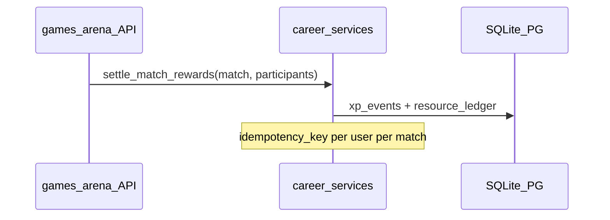

# Career 域 · 工程设计契约

> **产品权威**：[06-生涯模式-大循环家园与资源经济.md](../../../../06-生涯模式-大循环家园与资源经济.md)（根目录 **06-**；激励细则见 inspire/d/03-）  
> **激励细则**：[inspire/d/03-生涯模式与激励闭环.md](../../../../inspire/d商业模拟教育平台/03-生涯模式与激励闭环.md)  
> **最后更新**：2026-05-23

---

## 1. 域职责

| 负责 | 不负责 |
|------|--------|
| `career_profiles`、XP/资源账本、家园槽、NPC 关系、故事进度 | 商赛规则、回合结算、`tv_*` / `trading_*` 表 |
| `settle_match_rewards` 及扩展物资入账 | 组织者控场、房间码、开轮 |
| 订阅 Arena 结束事件并幂等记账 | 直接修改 `users` 表除只读展示外的业务字段 |

**禁止**：`games/*` 直接 INSERT `xp_events`；应调用 `career.services`。

---

## 2. 与 Arena 的接口



| 输入 | 字段 | 用途 |
|------|------|------|
| `ArenaMatch` | `match_kind`, `game_config_id`, `id` | T2/T3 权重、叙事分支 |
| 参与者 | `user_id`, 排名/得分 | XP、honor、materials 计算 |

　　扩展点（Phase B2）：`SettlementBundle` 结构见产品文档 §七；在 [`services/rewards.py`](services/rewards.py) 旁新增 `apply_settlement_bundle`。

---

## 3. 数据表（规划 · Phase B/C）

　　当前**已落地**：[`models/xp_event.py`](models/xp_event.py) → `xp_events`。

| 表 | 阶段 | 说明 |
|----|------|------|
| `xp_events` | ✅ 已有 | `match_kind`, `idempotency_key`, `amount`, `source_type`, `metadata` |
| `career_profiles` | B1 | `user_id` UNIQUE；`level`, `total_xp`, `season_id`, `competency_json`, `legacy_json`, `persona_snapshot` |
| `resource_ledger` | B2 | `career_id`, `resource_type` enum, `delta`, `balance_after`, `idempotency_key`, `source_type`, `source_id` |
| `homestead_slots` | B3 | `career_id`, `slot_id`, `level`, `city_id` nullable（showcase） |
| `npc_relationships` | B4 | `career_id`, `npc_id`, `affinity`, `last_chapter_read` |
| `story_progress` | B4 | `career_id`, `chapter_id`, `status`, `flags_json` |

### 3.1 `resource_type` 枚举（规划）

```
xp | trust | supplies | honor | materials
```

　　MVP B2：`supplies` + 沿用 `xp_events` 记 XP；`trust`/`honor` 可后续加入。

### 3.2 `xp_events.source_type` 扩展

现有 + 规划：

```
graph | academy | quest | arena | credenti | admin | social | homestead | story
```

---

## 4. API 路由（规划）

　　新路由模块：**`api/career.py`**（实施前须更新 [08-](../../../../08-工程现状与webapp实现详表.md) §2.7 与 `main.py`）。

| 方法 | 路径 | 阶段 | 说明 |
|------|------|------|------|
| POST | `/api/v1/career/start` | B1 | 创建 profile + 新手包 |
| GET | `/api/v1/career/profile` | B1 | 等级、XP、五维、资源余额、今日 Quest 占位 |
| GET | `/api/v1/career/homestead` | B3 | 槽位 + 下一级成本 |
| POST | `/api/v1/career/homestead/upgrade` | B3 | body: `{ slot_id }` |
| GET | `/api/v1/career/npcs` | B4 | 静态配置 + 用户关系度 |
| GET | `/api/v1/career/story` | B4 | 主线章节进度 |

　　**不**在 `competitions` / `techventure` 路由内暴露生涯逻辑。

---

## 5. 配置资产（规划路径）

| 路径 | 内容 |
|------|------|
| `content/career/economy.yaml` | 资源单价、软上限、T2/T3 权重倍率 |
| `content/career/homestead_slots.yaml` | 槽位名、每级消耗、解锁效果 ID |
| `content/career/npcs.yaml` | NPC 元数据 |
| `content/career/story/*.yaml` | 章节解锁条件 |

　　加载器建议：`domains/career/config.py`（Phase B3），与 CyberCore .registry 模式类似但独立。

---

## 6. 域事件（契约草案）

| 事件名 | 发布方 | 订阅方（远期） |
|--------|--------|----------------|
| `career.started` | career | Hermes, analytics |
| `career.settlement.applied` | career | Hermes debrief, narrative |
| `homestead.slot.upgraded` | career | Quest unlock |
| `story.chapter.unlocked` | career | push / 前端 |

　　Phase B 可先函数调用；`contracts/` 文档化后改为显式事件总线。

---

## 7. 前端（学生端）

| 路由 | 组件 | 阶段 |
|------|------|------|
| `/career` | 生涯主页 | B1 读真数据 |
| `/career/homestead` | 家园 Tab（或主页内 Tab） | B3 |

　　路径：`webapp/frontend/src/pages/Career/` — 逐步移除 [`mockPlatform`](../../../frontend/src/data/mockPlatform.ts) 生涯数据源。

---

## 8. 实施顺序

```
B1 career_profiles + GET profile
  → B2 resource_ledger + rewards 扩展
  → B3 homestead_slots + API + UI
  → B4 npc + story 静态
  → B5 Quest API（quest 域，回调 career）
```

　　Phase C：Persona、World 足迹、Legacy 季末、`domains/world/` 只读 API。

---

## 9. 代码现状（2026-05-23）

| 项 | 状态 |
|----|------|
| `xp_events` + `settle_match_rewards` | ✅ |
| `career_profiles` | 🔴 未建表 |
| `api/career.py` | 🔴 未挂载 |
| 前端 `/career` | 🟡 mock 为主 |

---

*表结构变更须 Alembic 迁移 + 同步 [08-](../../../../08-工程现状与webapp实现详表.md) §5.1。*
